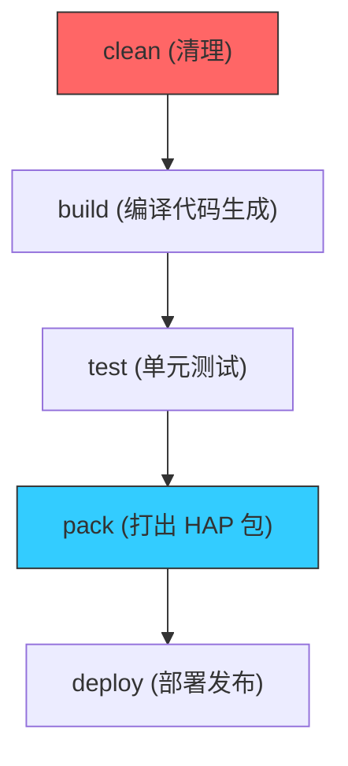

欢迎加入开源鸿蒙跨平台社区：[https://openharmonycrossplatform.csdn.net](https://openharmonycrossplatform.csdn.net)


# Flutter for OpenHarmony: Flutter 三方库 grinder 用纯 Dart 语言构建鸿蒙工程的自动化流水线（任务调度专家）

## 前言

在进行 OpenHarmony 的项目维护时，我们经常需要处理一堆琐碎的重复任务：
1. **构建与打包**：先运行 `build_runner`，再运行 `flutter build hap`。
2. **测试与覆盖率**：运行单测并自动生成 HTML 报告。
3. **版本发布**：修改 `pubspec.yaml` 版本号，打 Git Tag，然后推送到服务器。

通常我们会写 Makefile 或 Shell 脚本，但它们跨平台兼容性差且难以调试。**`grinder`** 允许你用“纯正的 Dart 语言”来编写这些任务脚本。它提供了依赖管理（Task Dependency）和丰富的工具类，是鸿蒙应用工程化自驱动的核心引擎。

---

## 一、自动化任务流模型

`grinder` 通过声明式的方式组织任务之间的顺序关系。



---

## 二、核心 API 实战

### 2.1 定义一个简单的 Task 类

创建一个 `tool/grind.dart` 文件。

```dart
import 'package:grinder/grinder.dart';

void main(List<String> args) => grind(args);

@Task('执行鸿蒙 HAP 清理')
void clean() {
  print('🧹 正在清理鸿蒙编译缓存...');
  delete(Directory('build'));
}

@DefaultTask('全量构建鸿蒙生产包')
@Depends(clean) // 💡 声明依赖：构建前必须先清理
void build() {
  print('🚀 正在启动鸿蒙构建引擎...');
  Pub.run('build_runner', arguments: ['build', '--delete-conflicting-outputs']);
}
```

### 2.2 运行任务

在终端执行：

```bash
# 💡 运行默认任务 (build)
dart tool/grind.dart

# 💡 指定运行清理任务
dart tool/grind.dart clean
```

---

## 三、常见应用场景

### 3.1 鸿蒙应用全链路 CI/CD 自动化
在鸿蒙的自动化持续集成（如 AtomGit Actions）中，不再需要维护复杂的 YAML 脚本。只需调用 `dart tool/grind.dart deploy`。Grinder 会自动按顺序执行：代码校验 -> 生成代码 -> 运行测试 -> 编译 Hap -> 上传产物。这种“脚本即代码”的模式极大地降低了流水线的维护难度。

### 3.2 鸿蒙-ArkTS 协议同步巡检
当你的项目涉及 Dart 与 ArkTS 的频繁通讯时，可以通过 Grinder 编写一个 `sync` 任务。它负责扫描特定的注解文件，并自动在两端工程目录间拷贝最新的接口契约，确保鸿蒙原生侧与 Flutter 侧的数据结构永远保持强一致性。

---

## 四、OpenHarmony 平台适配

### 4.1 适配鸿蒙多版本 HDC 指令
💡 **技巧**：鸿蒙设备的调试依赖 `hdc` 指令。利用 `grinder` 的 `runProcess` 工具类，可以将复杂的 `hdc shell aa start ...` 等一系列指令封装为单一的 Dart 函数。你可以编写一个 `grind install` 任务，实现一键扫描本地连接的鸿蒙真机并完成安装挂载，这对于需要频繁真机调试的鸿蒙开发者来说是极佳的提效手段。

### 4.2 处理大规模工程的异步构建负载
在大型鸿蒙 monorepo 项目中，有的子模块需要全量构建，有的只需增量更新。`grinder` 支持异步任务（Async Tasks）。通过合理分配任务的并发等级，可以充分压榨开发机多核 CPU 的性能，在进行鸿蒙应用大型静态分析（Linter）的同时并发运行无关联的资源处理任务，从而将整体构建时长压缩至极致。

---

## 五、完整实战示例：鸿蒙工程“发布日”自驱动脚本

本示例演示如何通过代码逻辑控制版本发布的完整流程。

```dart
import 'package:grinder/grinder.dart';

@Task('鸿蒙版本预检查')
void preCheck() {
  final file = File('pubspec.yaml');
  if (!file.readAsStringSync().contains('version')) {
    fail('❌ 致命错误：版本号信息缺失！');
  }
}

@Task('生成鸿蒙部署报告')
void report() {
  log('📝 正在根据 Git Commit 生成 ChangeLog...');
  // 利用内置工具执行 shell 指令获取 log
  var gitLog = run('git', arguments: ['log', '-n', '5', '--oneline']);
  File('DEPLOY_REPORT.txt').writeAsStringSync(gitLog);
}

@Task('终极发布')
@Depends(preCheck, report)
void release() {
  log('🔥 正在推送鸿蒙生产镜像至云端...');
}

void main(List<String> args) => grind(args);
```

<!-- IMAGE_PLACEHOLDER: 终端展示通过 Grinder 运行后的彩色日志：由缩进和任务名称组成的任务依赖树，以及显示最终“SUCCESS”状态的审计报告截图 -->

---

## 六、总结

`grinder` 软件包是 OpenHarmony 开发者打理“工程琐事”的自动化管家。它将碎片化、易出错的脚本操作提升到了具备类型检查和逻辑分支的编程级别。在构建追求极致研发效能、追求极致流程标准化的鸿蒙原生应用生态中，引入这样一套“Dart 自宿主”的任务调度方案，能让您的开发流程像鸿蒙系统架构一样严丝合缝、高效运转。
