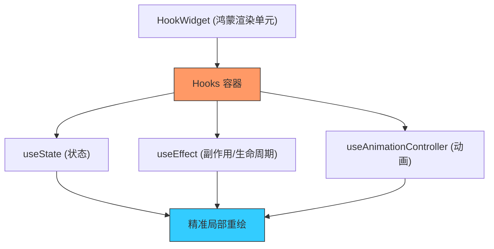

欢迎加入开源鸿蒙跨平台社区：[https://openharmonycrossplatform.csdn.net](https://openharmonycrossplatform.csdn.net)


# Flutter for OpenHarmony: Flutter 三方库 flutter_hooks 彻底革新鸿蒙应用中的状态复用与 Widget 开发模式（UI 逻辑解耦专家）

## 前言

在进行 OpenHarmony 的精细化 Widget 开发时，我们经常会被 `StatefulWidget` 搞得头晕脑胀：
1. **冗长的样板代码**：为了一个 `AnimationController`，你必须手动处理 `initState`, `dispose`, `didUpdateWidget`。
2. **难以复用的逻辑**：如何在两个不相关的 Widget 间复用同一个渐显动画或同一个定时器逻辑？
3. **嵌套地狱**：随着业务逻辑增加，`State` 类变得臃肿得不可维护。

**`flutter_hooks`** 借鉴了 React Hooks 的思想，为 Flutter 带来了一套全新的钩子驱动开发模式。它能让你在 `StatelessWidget`（准确说是 `HookWidget`）内极简地管理生命周期和状态，是鸿蒙应用追求高性能、高质量代码的“必杀技”。

---

## 一、Hooks 响应式驱动模型

Hooks 将声明周期的管理从显式的“重写方法”转变为隐式的“逻辑勾取”。



---

## 二、核心 API 实战

### 2.1 极简状态管理 (useState)

```dart
import 'package:flutter_hooks/flutter_hooks.dart';

class OhosCounter extends HookWidget {
  @override
  Widget build(BuildContext context) {
    // 💡 声明一个状态，无需创建 StatefulWidget
    final counter = useState(0);

    return Scaffold(
      floatingActionButton: FloatingActionButton(
        onPressed: () => counter.value++,
        child: Icon(Icons.add),
      ),
      body: Center(child: Text('鸿蒙互动量: ${counter.value}')),
    );
  }
}
```

### 2.2 优雅处理副作用 (useEffect)

```dart
// 💡 相当于 initState + dispose 的结合
useEffect(() {
  final timer = Timer.periodic(Duration(seconds: 1), (t) => print('鸿蒙脉冲保持中...'));
  
  // 💡 返回一个解构函数，Widget 卸载时自动停止定时器
  return () => timer.cancel();
}, []); // [] 表示仅在组件初次挂载时执行
```

---

## 三、常见应用场景

### 3.1 鸿蒙应用全量“丝滑”动画管理
使用 `useAnimationController` 在一行内定义动画。它会自动帮你处理 `vsync` 注入和资源释放。在需要大量微动画的鸿蒙系统应用中，Hooks 能减少 60% 以上的动画代码，让你的 UI 代码保持极致的呼吸感。

### 3.2 鸿蒙分布式数据实时同步
利用 `useStream` 监听来自鸿蒙分布式总线的数据流。Hooks 会根据 Stream 的状态变化自动驱动 Widget 更新，并确保在 Widget 销毁时自动断开订阅，从根本上杜绝了鸿蒙应用中的 Stream 内存泄露。

---

## 四、OpenHarmony 平台适配

### 4.1 适配鸿蒙的性能级局部重绘
💡 **技巧**：`flutter_hooks` 的内部实现极其精练，它只是在 Widget 树的特定位置挂载了一组轻量级对象。在鸿蒙真机 AOT 模式下，这种“组合式”逻辑比沉重的 `StatefulWidget` 更加轻巧。通过将复杂的业务逻辑封装为自定义 Hook（例如 `useOhosLocation`），你可以实现业务代码在多个鸿蒙组件间的“无损复用”，极大地提升了鸿蒙原生应用的架构整洁度。

### 4.2 避免生命周期的“陷阱”
鸿蒙系统在“分屏”或“流转”时，Widget 可能会面临快速的销毁与重建。Hooks 的 `useEffect` 机制能确保所有的资源释放指令都被正确入队。在适配鸿蒙的多端流转时，利用 Hooks 缓存当前的关键业务 ID，能极大降低逻辑丢失的概率，确保鸿蒙应用在复杂的运行态切换中依然表现稳健。

---

## 五、完整实战示例：鸿蒙工程“自释放”资源扫描器

本示例展示如何利用 Hooks 封装一个自动释放硬件资源的逻辑。

```dart
import 'package:flutter_hooks/flutter_hooks.dart';

class OhosSensorBoard extends HookWidget {
  @override
  Widget build(BuildContext context) {
    print('🎨 正在通过 Hooks 初始化鸿蒙感知层...');
    
    // 💡 自定义 Hook 演示
    final sensorData = useOhosSensor();

    return Center(
      child: Text('当前感应参数: ${sensorData ?? "正在校准..."}'),
    );
  }
}

/// 💡 封装复用：鸿蒙传感器 Hook
String? useOhosSensor() {
  final data = useState<String?>(null);
  
  useEffect(() {
    print('✅ 已挂载鸿蒙底层感知探针');
    // 模拟传感器监听
    final interval = Timer(Duration(seconds: 2), () => data.value = '24.5°C');
    
    return () {
      print('🗑️ 已自动回收鸿蒙底层硬件句柄');
      interval.cancel();
    };
  }, const []);
  
  return data.value;
}
```

<!-- IMAGE_PLACEHOLDER: 鸿蒙 DevEco Studio 编辑器中，展示同一功能在 StatefulWidget（左）与 HookWidget（右）下的代码行数对比截图，视觉差距极其显著。 -->

---

## 六、总结

`flutter_hooks` 软件包是 OpenHarmony 开发者打理“Widget 逻辑”的艺术画笔。它打破了类（Class）的束缚，让逻辑回归于纯粹的函数组合。在构建追求极致代码复用率、追求极致生命周期安全性的鸿蒙原生应用生态中，拥抱 Hooks 化的开发范式，不仅能显著提升您的研发速率，更是您对 Flutter 现代开发潮流深度掌控制权的代名词。
