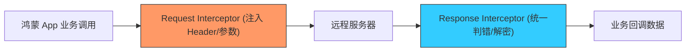

欢迎加入开源鸿蒙跨平台社区：[https://openharmonycrossplatform.csdn.net](https://openharmonycrossplatform.csdn.net)


# Flutter for OpenHarmony: Flutter 三方库 http_interceptor 让官方 http 请求具备全链路拦截能力（网络层架构增强）

## 前言

在进行 OpenHarmony 应用开发时，很多开发者喜欢直接使用官方提供的 `http` 软件包，因其小巧且兼容性极佳。然而，官方库的一个痛点是：它缺乏原生的拦截器（Interceptor）机制。当我们需要为所有请求统一添加 `Authorization` Header，或者需要全局捕获 401 错误码时，不得不对每个请求函数进行手动封装。

**`http_interceptor`** 的出现完美解决了这个问题。它通过 AOP（切面）的思想，在不破坏官方库原有接口的前提下，为你的鸿蒙网络请求链路增加了强大的“前哨”和“后哨”，是构建标准化鸿蒙网络层的关键插件。

---

## 一、请求/响应拦截器链模型

`http_interceptor` 在请求发出前和响应返回后建立了两道关卡。



---

## 二、核心 API 实战

### 2.1 创建并注册拦截器

```dart
import 'package:http_interceptor/http_interceptor.dart';

class OhosHeaderInterceptor implements InterceptorContract {
  @override
  Future<RequestData> interceptRequest({required RequestData data}) async {
    // 💡 统一注入鸿蒙应用标识与鉴权 Token
    data.headers["X-Ohos-App"] = "SmartOffice";
    data.headers["Authorization"] = "Bearer your_token";
    return data;
  }

  @override
  Future<ResponseData> interceptResponse({required ResponseData data}) async {
    // 💡 统一打印响应日志
    print('🍎 [Ohos-Network] 收到反馈: ${data.statusCode}');
    return data;
  }
}
```

### 2.2 使用拦截过的 Client 发起请求

```dart
final client = InterceptedClient.build(interceptors: [
    OhosHeaderInterceptor(),
]);

void fetchData() async {
  // 💡 用法与普通 http 包一模一样，但已具备拦截能力
  final response = await client.get('https://api.harmony.com/v1/data'.toUri());
}
```

---

## 三、常见应用场景

### 3.1 鸿蒙应用全量 Token 自动刷新
当拦截器捕捉到 `401 Unauthorized` 响应时，可以在 `interceptResponse` 中暂停业务流，发起同步刷新 Token 的请求，成功后再重新发送原请求。这实现了鸿蒙端侧“无感续期”的闭环效果。

### 3.2 鸿蒙设备指纹动态注入
在每一笔 API 请求中，动态扫描鸿蒙设备的 `DeviceID` 或网络类型（5G/Wi-Fi），并将其注入自定义 Header。通过拦截器，开发者无需在每个 API 函数中重复编写这些探测代码。

---

## 四、OpenHarmony 平台适配

### 4.1 适配鸿蒙的连接池限制
💡 **技巧**：鸿蒙系统对单一应用的并发网络连接数有一定配额。通过 `http_interceptor`，你可以自定义 `RetryPolicy`（重试策略）。当在鸿蒙设备上出现偶发性的网络抖动或由于并发限制导致的连接超时时，拦截器可以自动进行指数退避式（Exponential Backoff）重试，提升鸿蒙应用的交互成功率。

### 4.2 网络性能审计
在鸿蒙应用的性能分析阶段，利用拦截器记录每个请求的 `startTime` 和 `endTime`，并将这些全链路耗时数据异步上报给华为云或自建监控。由于拦截器与业务逻辑解耦，你可以随时在鸿蒙的 `release` 版本中一键关闭监控，而不涉及核心代码的改动。

---

## 五、完整实战示例：鸿蒙工程级“黑匣子”拦截系统

本示例演示如何通过拦截器实现一个具备多重安全预审功能的网络层。

```dart
import 'package:http_interceptor/http_interceptor.dart';

/// 💡 具体的安全审计拦截器
class OhosSecurityGuard implements InterceptorContract {
  @override
  Future<RequestData> interceptRequest({required RequestData data}) async {
    print('📦 正在对鸿蒙外发数据包进行安全审计...');
    if (data.url.contains('http://')) {
      print('⚠️ 告警：禁止在鸿蒙生产环境发送明文 HTTP 请求！');
      // 可以在这里改变 URL 为 HTTPS
    }
    return data;
  }

  @override
  Future<ResponseData> interceptResponse({required ResponseData data}) async {
    if (data.statusCode == 500) {
      print('❌ 后端熔断：已自动记录系统异常 ID');
    }
    return data;
  }
}

void main() async {
  final client = InterceptedClient.build(interceptors: [OhosSecurityGuard()]);
  
  print('🚀 启动鸿蒙网络链路...');
  try {
    await client.get('https://api.openharmony.dev/health'.toUri());
  } catch (e) {
    print('异常拦截完成');
  }
}
```

<!-- IMAGE_PLACEHOLDER: 鸿蒙 DevEco Studio 底部控制台展示通过拦截器自动注入 Headers 及打印响应码的精美日志流截图 -->

---

## 六、总结

`http_interceptor` 软件包是 OpenHarmony 开发者打磨“健壮网络层”的催化剂。它弥补了 Dart 官方库的架构短板，赋予了基础网络库面向切面编程的能力。在构建追求极致标准化、模块化协作的鸿蒙原生应用时，引入这样一套灵活的拦截机制，不仅能让你的网络代码更加“干爽（DRY）”，更为后续的项目扩展预留了广阔的一致性操作空间。
