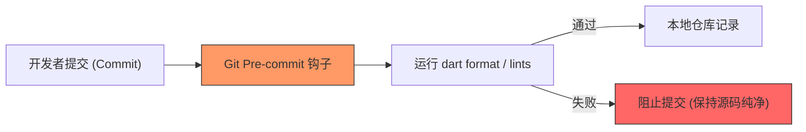

欢迎加入开源鸿蒙跨平台社区：[https://openharmonycrossplatform.csdn.net](https://openharmonycrossplatform.csdn.net)


# Flutter for OpenHarmony: Flutter 三方库 husky 守卫鸿蒙项目的 Git 提交规范（前端工程化必备）

## 前言

在 OpenHarmony 项目的团队协作中，我们最怕遇到“带病提交”的代码。比如：某位开发者提交的代码没经过 `dart format` 美化、或是包含明显的 `lint` 警告，甚至导致整个鸿蒙工程编译失败。如果在 CI（持续集成）阶段才发现，修复成本就太高了。

**`husky`** 是从前端生态圈引进的 Git Hooks 管理神器。它能让你极简地配置 Git 的各个钩子（如 `pre-commit`），在代码真正提交到远端（AtomGit）之前，强制执行格式化或单元测试，确保入库的代码永远是高质量的。

---

## 一、Git Hook 工作流模型

`husky` 在本地提交阶段建立了一道自动化的“安检门”。



---

## 二、核心配置实战

### 2.1 初始化 husky

在鸿蒙项目的根目录下，首先安装并启用。

```bash
# 💡 假设已通过 pub 引入 husky 依赖
dart run husky install
```

### 2.2 添加 pre-commit 钩子

我们希望在提交前自动格式化所有鸿蒙 Dart 代码。

```bash
# 💡 添加钩子：在提交前执行代码美化
dart run husky add .husky/pre-commit "dart format lib/"
```

### 2.3 在提交前运行鸿蒙单元测试

```bash
# 💡 确保提交的代码不破坏现有的功能逻辑
dart run husky add .husky/pre-commit "flutter test"
```

---

## 三、常见应用场景

### 3.1 强制鸿蒙代码风格统一
在多人协作开发鸿蒙应用时，利用 `husky` 结合 `lint_staged`，只对本次修改的文件执行 `dart format`。这避免了因“格式差异”导致的 Git 合并冲突，让鸿蒙代码评审（CR）聚焦在逻辑本身。

### 3.2 鸿蒙敏感信息审计
在提交代码前，通过脚本扫描源码中是否包含硬编码的鸿蒙测试 Token 或私钥，保护鸿蒙项目的信息安全。

---

## 四、OpenHarmony 平台适配

### 4.1 适配 AtomGit 协作环境
💡 **技巧**：鸿蒙生态推荐使用 **AtomGit** 进行代码托管。在配置 `husky` 时，建议将钩子脚本同步提交到仓库。这样，团队中每个克隆项目的鸿蒙开发者只要运行一次 `dart pub get`，本地的 Git 钩子就会自动激活，实现了团队内“强制化”的代码质量管控。

### 4.2 零性能开销
`husky` 只在 Git 执行特定动作（如 commit, push）时触发一次。对于开发环境的鸿蒙 IDE 几乎没有任何性能负担。它带来的是工程确定性的极大提升，杜绝了“低级代码”流入鸿蒙仓库的可能性。

---

## 五、完整实战示例：鸿蒙工程“零配置”安检脚本

本示例演示如何通过 `husky` 串联起一整套提交前的检测逻辑。

```bash
#!/bin/sh
# 💡 文件位置: /ohos_project/.husky/pre-commit

echo "🚀 正在启动鸿蒙工程 pre-commit 哨兵..."

# 1. 代码格式化校验
echo "🎨 正在美化代码..."
dart format --set-exit-if-changed lib/ 
if [ $? -ne 0 ]; then
  echo "❌ 错误：代码格式不标准，已为您自动拦截。请运行 'dart format' 后重试。"
  exit 1
fi

# 2. 静态分析校验
echo "🔍 正在进行静态审计 (Linter)..."
flutter analyze lib/
if [ $? -ne 0 ]; then
  echo "❌ 警告：代码中存在 lint 问题，请修复后再提交。"
  exit 1
fi

echo "✅ 安检通过！准予提交到鸿蒙源码库。"
```

<!-- IMAGE_PLACEHOLDER: 终端展示开发者尝试提交不规范代码时，被 husky 成功拦截并给出醒目提醒的截图 -->

---

## 六、总结

`husky` 软件包是 OpenHarmony 开发者打磨“工业级”项目的必选项。它将原本靠“口头约定”的代码规范转化为了“代码层面”的硬性限制。在一个成熟、稳定的鸿蒙应用研发体系中，通过引入这种前置校验机制，不仅能极大减轻 CI 阶段的压力，更是每一位专业鸿蒙工程师对代码质量负责的体现。
