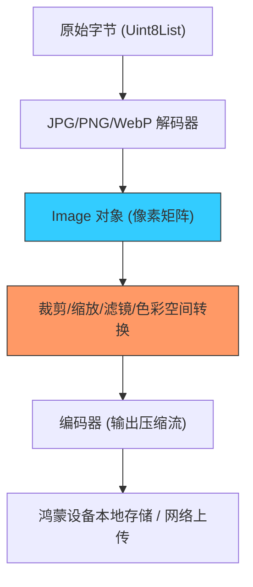

欢迎加入开源鸿蒙跨平台社区：[https://openharmonycrossplatform.csdn.net](https://openharmonycrossplatform.csdn.net)


# Flutter for OpenHarmony: Flutter 三方库 image 赋予鸿蒙应用纯 Dart 驱动的高性能图像像素级处理能力（全能影像工坊）

## 前言

在进行 OpenHarmony 的应用开发时，图像处理是一项高频且繁重的任务：
1. **缩略图生成**：如何快速将用户拍摄的几千万像素照片缩小？
2. **滤镜/水印**：如何在不依赖原生库的情况下，为鸿蒙端照片添加品牌 Logo 或黑白滤镜？
3. **格式转换**：如何将特有的图片格式（如 PSD, TIFF）转换为跨平台通用的 WebP 或 PNG？

通常这些操作需要依赖 Android 或 iOS 的底层系统 API。但如果在鸿蒙环境下由于插件未完全适配怎么办？**`image`** 软件包给出了终极方案：它是 **100% 纯 Dart 实现**。它不依赖任何原生系统库，却能以惊人的性能处理几乎所有主流图像格式。

---

## 一、像素级处理引擎模型

该库通过对解码器（Decoders）与像素缓冲区（Pixel Buffer）的操作，实现了对图像的全栈控制。



---

## 二、核心 API 实战

### 2.1 极简图片缩放（Thumbnail）

```dart
import 'package:image/image.dart' as img;

void resizePhoto(List<int> bytes) {
  // 💡 1. 自动识别格式并解码
  final image = img.decodeImage(Uint8List.fromList(bytes));
  
  if (image != null) {
    // 💡 2. 缩放图像至 300 像素宽（自动保持比例）
    final thumbnail = img.copyResize(image, width: 300);
    
    // 💡 3. 重新编码为轻量级的 JPG
    final jpgBytes = img.encodeJpg(thumbnail, quality: 85);
    print('✅ 鸿蒙缩略图生成完毕，字节大小: ${jpgBytes.length}');
  }
}
```

### 2.2 添加自定义水印

```dart
void addWatermark(img.Image base, img.Image logo) {
  // 💡 在右下角合成水印，支持 Alpha 透明度混叠
  img.compositeImage(
    base, logo, 
    dstX: base.width - logo.width - 20, 
    dstY: base.height - logo.height - 20
  );
}
```

---

## 三、常见应用场景

### 3.1 鸿蒙移动办公的“全自动证件归档”
用户拍摄证件照后，利用 `image` 库自动进行灰度化（Grayscale）处理并调整对比度，最后压缩成极小的 WebP 格式上传。由于是纯 Dart 实现，整个处理流程在鸿蒙的前台、后台或独立线程内表现极度一致，不会因系统架构变动而失效。

### 3.2 鸿蒙嵌入式系统的“实时视频帧截图”处理
在开发鸿蒙智连（HiLink）的监控应用时，每一帧视频可以用该库快速截取并生成动图（GIF）。该库强大的编码控制能力，能让你在鸿蒙端侧实现像专业图像软件一样的精细化调色，打造差异化的影像工具体验。

---

## 四、OpenHarmony 平台适配

### 4.1 适配鸿蒙多核性能分配
💡 **技巧**：纯 Dart 的图像处理是计算密集型的。虽然它的性能已经过高度优化，但在鸿蒙设备上处理大型高清图片（4K+）时，务必利用鸿蒙的 `compute` 函数或开启独立的 `Worker` 线程。这样可以确保昂贵的循环计算在后台核心运行，而鸿蒙应用的前端 UI 线程依然能保持 120Hz 的极致丝滑，不会由于图像解析导致界面卡顿。

### 4.2 避免内存溢出的精细化审计
鸿蒙应用在处理高分辨率图片时，内存开销是首要考虑因素。`image` 库支持分块解码和流式处理。在面对超大图片时，建议不要一次性加载整个 `Image` 对象，而是利用该库提供的低级指针（TypedData）接口进行局部读写。这种对鸿蒙内存足迹（Footprint）的精细化控制，能让您的应用在低配鸿蒙设备上依然能够稳定处理重负载影像任务。

---

## 五、完整实战示例：鸿蒙工程“高级影像”预处理器

本示例展示如何将一张图片转为复古灰度图并加上文字标签。

```dart
import 'package:image/image.dart' as img;

class OhosVisualStudio {
  /// 💡 为鸿蒙摄影社区定制的后处理引擎
  List<int> develop(Uint8List rawData) {
    print('🎨 正在启动鸿蒙影像处理中枢...');
    
    // 1. 解码
    final image = img.decodeImage(rawData);
    if (image == null) return [];

    // 2. 图像算法处理：灰度化 + 自动对比度
    final processed = img.grayscale(image);
    img.adjustColor(processed, contrast: 1.2);

    // 3. 绘制文字 (需加载字体)
    img.drawString(processed, 'OHOS NEXT 2024', font: img.arial24);

    // 4. 高质量输出
    return img.encodePng(processed);
  }
}

void main() {
  // 模拟处理流程
  // final result = OhosVisualStudio().develop(someBytes);
}
```

<!-- IMAGE_PLACEHOLDER: 鸿蒙手机端展示：原图、经 copyResize 后的缩略图、以及应用了 GaussianBlur（高斯模糊）和 Sepia（怀旧滤镜）后的多层次成图效果对比快照 -->

---

## 六、总结

`image` 软件包是 OpenHarmony 开发者打理“像素艺术”的指挥棒。它彻底拆除了对底层原生库的依赖篱笆，让图像处理具备了真正的平台无关性。在构建追求极致视觉自定义、追求极致计算灵活性的鸿蒙原生应用生态中，掌握这套纯 Dart 驱动的影像处理技术，能让您的应用在处理视觉媒介时更具掌控力与创造力。
