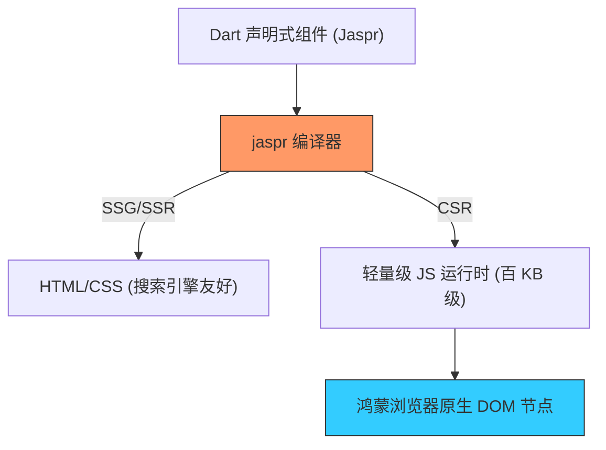

欢迎加入开源鸿蒙跨平台社区：[https://openharmonycrossplatform.csdn.net](https://openharmonycrossplatform.csdn.net)


# Flutter for OpenHarmony: Flutter 三方库 jaspr 为鸿蒙端开启极速渲染的现代 Web 开发新范式（Dart Web 框架首选）

## 前言

在进行 OpenHarmony 开发时，我们偶尔需要跳出原生的 HAP 容器，寻找更轻量、更适合在移动端 Web 加载的方案。虽然 Flutter Web 极其强大，但其生成的 Canvas/Wasm 产物体积巨大，在鸿蒙系统加载较慢。是否存在一种方案，既能使用 Dart 的声明式开发体验，又能产出纯正、轻量的 HTML/CSS/JS 节点？

**`jaspr`** 就是这个问题的终极答案。它是一个模仿 Flutter 语法、但专注于渲染原生 Web DOM 的现代框架。通过 Jaspr，鸿蒙开发者可以利用熟悉的 Widget、Component 和生命周期，构建出秒开的 Web 微应用。

---

## 一、Jaspr 渲染模式模型

Jaspr 实现了这种“类 Flutter 语法，原生 DOM 渲染”的混合架构。



---

## 二、核心 API 实战

### 2.1 创建一个基础组件

```dart
import 'package:jaspr/jaspr.dart';

class OhosHeader extends StatelessComponent {
  final String title;
  OhosHeader({required this.title});

  @override
  Iterable<Component> build(BuildContext context) sync* {
    // 💡 看起来像 Flutter，但实际生成 <h1> 和 <header>
    yield header([
      h1([text(title)]),
      p([text('来自开源鸿蒙的问候')])
    ]);
  }
}
```

### 2.2 定义响应式状态

```dart
class Counter extends StatefulComponent {
  @override
  State<Counter> createState() => _CounterState();
}

class _CounterState extends State<Counter> {
  int _count = 0;

  @override
  Iterable<Component> build(BuildContext context) sync* {
    yield button(
      onClick: () => setState(() => _count++),
      [text('鸿蒙互动次数: $_count')]
    );
  }
}
```

---

## 三、常见应用场景

### 3.1 鸿蒙应用内嵌的“秒开”促销页
对于需要极快加载速度的电商详情、营销活动页，使用 Jaspr 编写。由于产物是纯 HTML，在鸿蒙 Webview 中几百毫秒即可呈现，远超 Flutter Web 的启动速度。

### 3.2 鸿蒙开发者个人博客与文档系统
利用 Jaspr 的静态站点生成（SSG）能力，直接将 Dart 代码编译为静态文件托管在 AtomGit Pages 上，实现全栈 Dart 的开发体验，同时保持搜索引擎（SEO）的高度友好性。

---

## 四、OpenHarmony 平台适配

### 4.1 适配鸿蒙多端的响应式 CSS
💡 **技巧**：Jaspr 允许直接在 Dart 中编写类型安全的 CSS。在适配鸿蒙折叠屏与平板时，可以利用 Jaspr 提供的 MediaQuery 模拟接口，生成针对不同屏幕尺寸的 `clamp` 或 `flex` 布局代码，确保鸿蒙网页在不同形态设备上均有完美观感。

### 4.2 适配鸿蒙系统的深色模式适配
鸿蒙系统提供了全局深色模式（Dark Mode）。通过 Jaspr 的组件状态管理，可以实时监听鸿蒙 Web 环境的 `prefers-color-scheme`，自动切换网页的 CSS 变量，让你的 Web 微应用与鸿蒙原生的深色视觉风格融为一体。

---

## 五、完整实战示例：鸿蒙精美 Web 工具箱

本示例展示如何用 Jaspr 构建一个具备现代审美且极速运行的鸿蒙工具导航栏。

```dart
import 'package:jaspr/jaspr.dart';

void main() {
  runApp(App());
}

class App extends StatelessComponent {
  @override
  Iterable<Component> build(BuildContext context) sync* {
    yield div(classes: 'ohos-container', [
      h2([text('🚀 鸿蒙跨平台极速 Web 演示')]),
      OhosNavCard(title: '分布式任务', icon: '⚡'),
      OhosNavCard(title: '全场景协作', icon: '🔗'),
    ]);
  }
}

class OhosNavCard extends StatelessComponent {
  final String title;
  final String icon;
  OhosNavCard({required this.title, required this.icon});

  @override
  Iterable<Component> build(BuildContext context) sync* {
    yield div(classes: 'card', [
      span([text(icon)]),
      b([text(title)]),
    ]);
  }
}
```

<!-- IMAGE_PLACEHOLDER: 鸿蒙手机浏览器展示利用 Jaspr 渲染的纯正 DOM 列表，在保持 60 帧流畅度的同时实现极速首屏加载的截图 -->

---

## 六、总结

`jaspr` 软件包是 OpenHarmony 开发者探索“轻量化跨端”的秘密武器。它成功拆除了“Flutter 语法”与“传统 Web 原生性能”之间的围墙。在追求极致性能平衡的鸿蒙应用生态中，引入这样一套高效、类型安全且开发者友好的 Web 框架，能让你的鸿蒙业务在 Web 环境下焕发出前所未有的生机。
