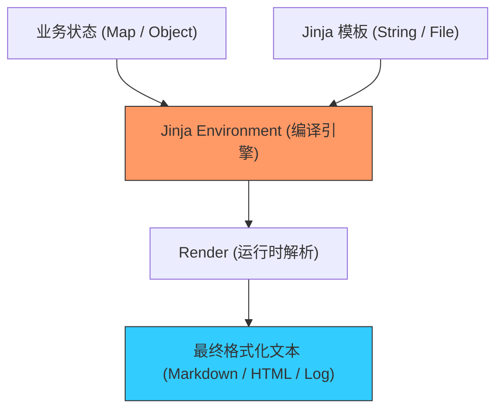

欢迎加入开源鸿蒙跨平台社区：[https://openharmonycrossplatform.csdn.net](https://openharmonycrossplatform.csdn.net)


# Flutter for OpenHarmony: Flutter 三方库 jinja 为鸿蒙应用提供强大的动态文本渲染与工业级模板引擎（逻辑表现分离利器）

## 前言

在进行 OpenHarmony 的复杂业务开发时，我们经常需要处理“动态内容生成”：
1. **自动回复**：如何根据用户的姓名、订单状态，生成一句极具亲和力的欢迎词？
2. **代码/文档生成**：如何通过一组配置，自动产出符合鸿蒙规范的配置文件（如 `.json5` 或 `.ts`）？
3. **复杂打印/邮件**：如何管理包含大量逻辑判断和循环的 HTML 格式文本？

**`jinja`** 是 Python 计算界最著名的 Jinja2 模板引擎在 Dart 语言中的完美移植。它不仅支持简单的变量替换，还支持完整的控制流（if/for）、宏定义（Macros）和模板继承（Inheritance），是鸿蒙应用进行“内容自动化”生成的核心底座。

---

## 一、模板渲染管线模型

`jinja` 实现了将“结构化数据”与“动态视图逻辑”的高维融合。



---

## 二、核心 API 实战

### 2.1 基础变量渲染

```dart
import 'package:jinja/jinja.dart';

void simpleRender() {
  final env = Environment();
  // 💡 定义一个带逻辑的模板
  final template = env.fromString('你好 {{ name }}，欢迎加入 {{ project }}！');

  final output = template.render({'name': '鸿蒙开发者', 'project': 'OpenHarmony'});
  print(output);
}
```

### 2.2 使用控制流与循环

```dart
const source = '''
🔔 鸿蒙任务清单：

  - {{ loop.index }}. {{ item.title }} (优先级: {{ item.prio }})

''';

void complexRender() {
  final template = Environment().fromString(source);
  final data = {
    'tasks': [
      {'title': '适配 API 12', 'prio': '高'},
      {'title': '性能调优', 'prio': '中'},
    ]
  };
  print(template.render(data));
}
```

---

## 三、常见应用场景

### 3.1 鸿蒙应用全自动日志审计报告
在鸿蒙设备运行一段时间后，利用 `jinja` 模板自动整合本地分散的运行指标（如 CPU 平均负载、异常堆栈、网络耗时），生成一份排版精美、逻辑清晰的 Markdown 审计周报，方便开发者远程一键导出分析。

### 3.2 动态鸿蒙 ArkTS 组件生成工具
对于自研的鸿蒙低代码（Low-Code）平台，利用 `jinja` 强大的宏定义（Macros）功能，将用户的 UI 配置实时转化为符合鸿蒙 NEXT 标准的高质量 ArkTS 源代码，实现“所见即所得”的原子化代码产出。

---

## 四、OpenHarmony 平台适配

### 4.1 适配鸿蒙的文件加载性能
💡 **技巧**：在鸿蒙真机上，频繁读取模板文件会带来 I/O 开销。建议开启 `jinja` 的缓存机制。通过 `Environment` 的自定义加载器（Loader），将常用的鸿蒙 UI 模板预先加载并编译为内存中的“字节码（Bytecode）”。这样在进行高频内容刷新时（如：实时预览动态卡片），渲染延迟将达到肉眼无感的水平。

### 4.2 避免模板注入的安全审计
鸿蒙生态对动态执行代码有严密监控。虽然 `jinja` 只是文本渲染，但不当的输入可能导致敏感信息泄露。在使用 `jinja` 处理用户生成的模板时，务必利用其提供的 `autoescape` 功能，确保所有输出经过安全的转义处理。特别是在生成需要在鸿蒙 `Webview` 中显示的 HTML 内容时，这一层防护能有效抵御跨站脚本（XSS）风险，保证鸿蒙应用的底层安全。

---

## 五、完整实战示例：鸿蒙工程“消息推送”动态构造器

本示例展示如何利用模板继承功能构建标准化的推送文案。

```dart
import 'package:jinja/jinja.dart';

class OhosMsgEngine {
  final _env = Environment();

  /// 💡 为鸿蒙分布式通知系统渲染动态载荷
  String compilePush(String user, String eventType) {
    print('🎨 正在通过 Jinja 引擎精修鸿蒙推送报文...');
    
    const raw = '''
    【鸿蒙物联预警】
    尊敬的 {{ user }}:
    您的设备检测到 [{{ event }}] 动作。
    
    ⚠️ 请确认是否为本人操作！
    
    ✅ 状态已同步至分布式节点。
    
    ''';
    
    final tmpl = _env.fromString(raw);
    return tmpl.render({'user': user, 'event': eventType});
  }
}

void main() {
  final engine = OhosMsgEngine();
  print(engine.compilePush('张建国', '登录'));
}
```

<!-- IMAGE_PLACEHOLDER: 鸿蒙手机展示由 Jinja 动态渲染出的精美全屏贺卡、以及自动生成的系统运行报告 Markdown 源码对比截图 -->

---

## 六、总结

`jinja` 软件包是 OpenHarmony 开发者打理“内容逻辑”的超级中枢。它将死板的拼写逻辑提升到了动态模板的艺术层面。在构建追求极致内容表达能力、追求极致代码生成敏捷性的鸿蒙原生应用生态中，引入这样一套成熟、经受过工业界数十年考验的模板方案，能让您的业务逻辑表现力得到质的飞跃。
