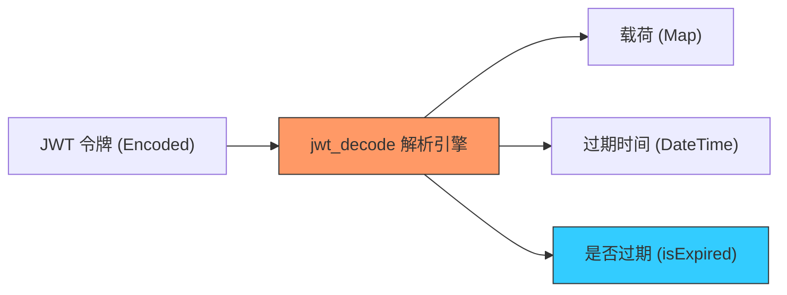

欢迎加入开源鸿蒙跨平台社区：[https://openharmonycrossplatform.csdn.net](https://openharmonycrossplatform.csdn.net)


# Flutter for OpenHarmony: Flutter 三方库 jwt_decode 鸿蒙端侧极速解析身份验证令牌（鉴权中间件必备）

## 前言

在 OpenHarmony 应用对接企业级后端服务时，身份验证通常基于 **JWT (JSON Web Token)**。前端开发者面临的一个共同挑战是：当拿到服务器下发的那串长长的 Base64 字符串时，如何在客户端立即获取其中包含的用户信息、权限（Scopes）或过期时间（Exp），而无需每次都通过网络请求询问服务器？

**`jwt_decode`** 正是解决这一痛点的精悍工具。它不涉及复杂的加密解密（验证签名通常在后端完成），而是专注于在鸿蒙端侧以极速方式解析 JWT 的 Payload（载荷）部分，让你对用户状态拥有即时的“掌控感”。

---

## 一、JWT 解析生命周期模型

`jwt_decode` 负责将模糊的令牌转化为结构化的数据。



---

## 二、核心 API 实战

### 2.1 基础解析

```dart
import 'package:jwt_decode/jwt_decode.dart';

void parseToken(String token) {
  // 💡 无需密钥，直接解码 Body 载荷
  Map<String, dynamic> payload = Jwt.parseJwt(token);

  print('解析到的鸿蒙账号 ID: ${payload['user_id']}');
  print('用户权限集: ${payload['roles']}');
}
```

### 2.2 自动过期判定

```dart
void checkTokenStatus(String token) {
  // 💡 一行代码判断是否过期，非常适合在鸿蒙路由拦截器中使用
  bool isExpired = Jwt.isExpired(token);

  if (isExpired) {
    print('⚠️ 告警：鸿蒙鉴权令牌已失效，需发起重新登录流程');
  } else {
    DateTime expiryDate = Jwt.getExpiryDate(token)!;
    print('有效期至: $expiryDate');
  }
}
```

---

## 三、常见应用场景

### 3.1 鸿蒙 App 启动自动登录拦截
在鸿蒙应用启动时，从持久化存储（如 `Storage`）中读出 `access_token`。利用 `jwt_decode` 快速检查其是否已过期。若未过期，直接解析出用户信息展示在侧边栏，实现无感的“闪电登录”体验。

### 3.2 UI 权限分发（RBAC）
根据 JWT Payload 中的 `admin: true` 标识，动态决定鸿蒙页面的某些“危险操作”按钮（如：删除数据、导出报表）是否可见，实现基于令牌的轻量级前端权限管控。

---

## 四、OpenHarmony 平台适配

### 4.1 适配鸿蒙的安全性审计
💡 **技巧**：虽然 `jwt_decode` 可以轻松解析内容，但请注意 Payload 部分是 **不加密** 的（只是编码）。在鸿蒙应用中，切勿在 JWT 的 Payload 中存储诸如鸿蒙支付密码、手机号明文等敏感个人隐私数据。利用该库解析出的过期时间，可以精确对齐鸿蒙系统的系统时钟，提醒用户适时刷新令牌（Refresh Token）。

### 4.2 路由守卫的最佳搭档
在鸿蒙的导航架构中，可以在全局路由中间件配置 `Jwt.isExpired`。相比于调用异步的存储接口或等待后端 401 错误，这种基于纯 Dart 计算的同步判断方法能有效消除鸿蒙页面跳转时的“白屏等待”或“闪烁”，大幅提升应用运行的顺滑感。

---

## 五、完整实战示例：鸿蒙鉴权中枢控制器

本示例演示如何构建一个具备自检能力的 Token 管理器。

```dart
import 'package:jwt_decode/jwt_decode.dart';

class OhosAuthGate {
  String? _currentToken;

  /// 💡 存储并审计新令牌
  void injectToken(String token) {
    _currentToken = token;
    
    print('🧐 正在审计鸿蒙新颁发的安全令牌...');
    final payload = Jwt.parseJwt(token);
    final subject = payload['sub'] ?? '匿名用户';
    
    print('令牌持有者: $subject');
    print('是否过期: ${Jwt.isExpired(token) ? "🔴 已过期" : "🟢 有效"}');
  }

  /// 💡 为请求提供经过预检的令牌
  String? getSafeToken() {
    if (_currentToken == null || Jwt.isExpired(_currentToken!)) {
      return null; // 鸿蒙安全策略：令牌无效不予返回
    }
    return _currentToken;
  }
}

void main() {
  final gate = OhosAuthGate();
  // 模拟一个带 Payload 的 JWT
  const mockToken = "eyJhbGciOiJIUzI1NiIsInR5cCI6IkpXVCJ9.eyJzdWIiOiIxMjM0NTY3ODkwIiwibmFtZSI6Ikhhcm1vbnlEZXYiLCJpYXQiOjE1MTYyMzkwMjIsImV4cCI6MjUxNjIzOTAyMn0.xxx";
  
  gate.injectToken(mockToken);
  print('可发放令牌：${gate.getSafeToken() != null ? "有" : "无"}');
}
```

<!-- IMAGE_PLACEHOLDER: 鸿蒙设备展示从复杂的 Token 字符串到解析出的结构化用户面板信息的对比截图 -->

---

## 六、总结

`jwt_decode` 软件包是 OpenHarmony 开发者处理安全认证的“显微镜”。它将原本晦涩的二进制风暴具象化为清爽的业务对象。在构建追求极致安全、同时又兼顾极致响应速度的鸿蒙原生应用时，引入这样一套原子化的解析工具，是提升鉴权链路确定性和代码健壮性的关键决策。
