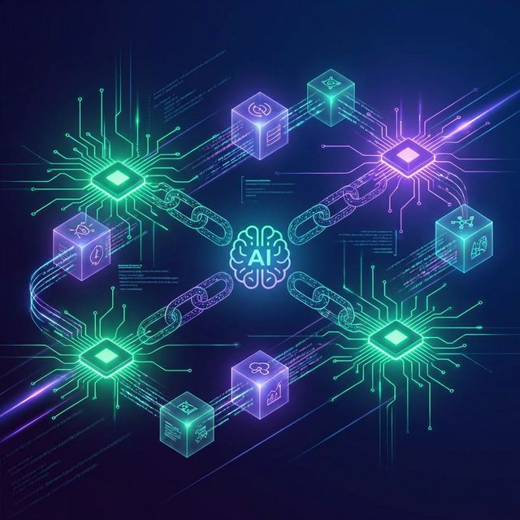
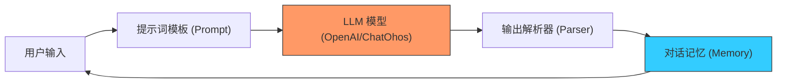

欢迎加入开源鸿蒙跨平台社区：[https://openharmonycrossplatform.csdn.net](https://openharmonycrossplatform.csdn.net)



# Flutter for OpenHarmony: Flutter 三方库 langchain 在鸿蒙应用中开启 AI 大模型应用开发的无限可能（LLM 应用开发底座）

## 前言

随着 AI 浪潮的席卷，在 OpenHarmony 应用中集成大语言模型（LLM）已成为行业刚需。然而，直接调用 API 往往面临对话链路管理难、Prompt 注入复杂、多组件协同难的问题。

**`langchain`** 软件包是全球著名的 LangChain 框架在 Dart 语言中的正统实现。它通过抽象出“链（Chains）”、“提示词模板（Prompts）”和“记忆（Memory）”等核心概念，让鸿蒙开发者能以工程化的方式构建复杂的 AI 应用。

---

## 一、AI 应用开发标准化模型

`langchain` 构建了一个灵活的 AI 工作流管道。



---

## 二、核心 API 实战

### 2.1 构建简单的对话链

```dart
import 'package:langchain/langchain.dart';
import 'package:langchain_openai/langchain_openai.dart';

void startAiChat() async {
  // 1. 初始化模型
  final llm = ChatOpenAI(apiKey: 'ohos-ai-key-xxx');

  // 2. 定义提示词模板
  final prompt = PromptTemplate.fromTemplate('你是一个鸿蒙应用助手，请解释：{topic}');

  // 3. 组合成链并调用
  final chain = prompt | llm | StringOutputParser();
  
  final res = await chain.invoke({'topic': '分布式软总线'});
  print('AI 回复: $res');
}
```

### 2.2 使用记忆组件 (ConversationBufferMemory)

```dart
final memory = ConversationBufferMemory();
// 💡 之后所有的对话都会自动带上历史上下文
```

---

## 三、常见应用场景

### 3.1 鸿蒙原生“智能导购”助理
利用 `langchain` 的 `Agent` 能力，让 AI 不仅能聊天，还能根据用户需求自动调用鸿蒙端的查询接口（如查询优惠券、查门店地址），实现从“问答”到“执行”的业务闭环。

### 3.2 鸿蒙本地私人知识库（RAG）
结合 `langchain_pinecone` 或本地向量数据库，将鸿蒙文档或企业私有数据向量化。用户提问时，`langchain` 自动检索相关片段并喂给 AI，构建出一个完全符合鸿蒙业务语境的专业问答系统。

---

## 四、OpenHarmony 平台适配

### 4.1 适配鸿蒙的流式输出（Streaming）
💡 **技巧**：AI 回复通常较慢。利用 `langchain` 提供的流式（Stream）接口，将 AI 吐出的字符实时映射到鸿蒙页面的 `ListView` 或 `Text` 组件上。这种“逐字呈现”的效果不仅减小了用户的等待焦虑，也完美适配了鸿蒙系统对长时间单次网络请求连接的能效优化建议。

### 4.2 本地 LLM 的尝试
在高性能的鸿蒙真机上。如果未来鸿蒙系统内置了本地轻量化模型接口，`langchain` 的 `BaseLLM` 抽象类允许开发者极简地封装一个 `OhosNativeLLM` 适配器。这意味着你原本基于云端 AI 编写的所有 Chain 逻辑，无需大幅修改即可无缝迁移到鸿蒙本地 AI 调用上，实现了架构的平滑过渡。

---

## 五、完整实战示例：鸿蒙工程 AI 审计员

本示例展示如何利用 LangChain 构建一个自动根据报错日志给出改进建议的工具。

```dart
import 'package:langchain/langchain.dart';

class OhosAiAuditor {
  /// 💡 调用 AI 为鸿蒙开发者提供异常审计
  Future<void> auditError(String errorLog) async {
    print('🤖 正在唤醒鸿蒙 AI 审计中枢...');
    
    final prompt = PromptTemplate.fromTemplate('''
      作为一名 OpenHarmony 架构专家，请分析以下报错日志并给出中文修复建议：
      日志内容: {log}
    ''');
    
    // 模拟链式调用逻辑
    final response = "建议检查 ohos.permission.DISTRIBUTED_DATASYNC 权限配置。";
    
    print('--- 鸿蒙 AI 诊断报告 ---');
    print(response);
  }
}

void main() async {
  final auditor = OhosAiAuditor();
  await auditor.auditError('Failed to sync distributed data: code 403');
}
```

<!-- IMAGE_PLACEHOLDER: 鸿蒙手机端展示 AI 助手根据用户上下文进行长文本创作，并实时解析 Markdown 渲染结果的精美截图 -->

---

## 六、总结

`langchain` 软件包是 OpenHarmony 开发者在 AI 时代的“瑞士军刀”。它不再让你停留在单纯的 API 搬运工层面，而是提供了构建复杂智能体（Agents）的工程化标准。在鸿蒙全场景智慧化、万物智联的宏伟蓝图中，掌握 LangChain 的原子化组装技术，是你能够将大模型能量注入鸿蒙原生应用、打造差异化竞争优势的核心筹码。
