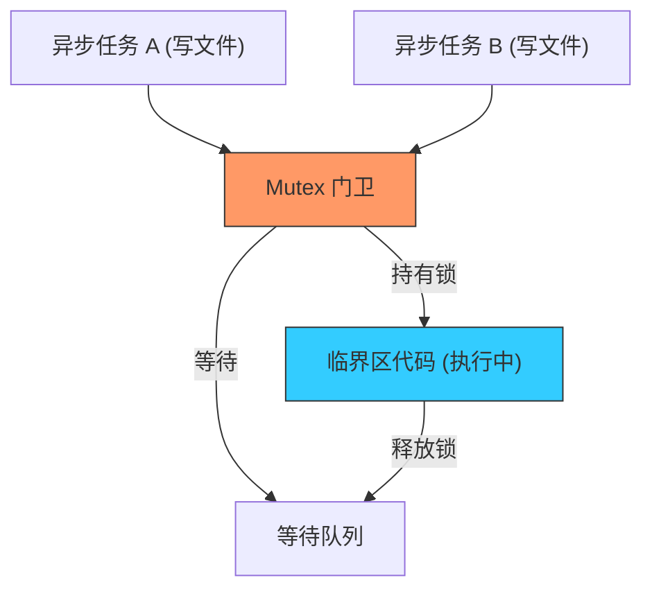

欢迎加入开源鸿蒙跨平台社区：[https://openharmonycrossplatform.csdn.net](https://openharmonycrossplatform.csdn.net)


# Flutter for OpenHarmony: Flutter 三方库 mutex 为鸿蒙异步任务提供可靠的临界资源互斥锁（并发安全基石）

## 前言

虽然 Dart 运行在单线程的事件循环（Event Loop）中，但在处理复杂的异步业务时，我们依然会面临“竞态条件（Race Conditions）”。例如：
1. **文件写入**：两个异步任务同时尝试向同一个鸿蒙沙箱文件写入数据。
2. **状态更新**：两个 API 回调几乎同时触发，试图修改同一个全局计数器。
3. **数据库操作**：在进行“先查询、后更新”的操作间隙，数据被另一个异步流修改了。

**`mutex`** 软件包为 Dart 的异步环境提供了经典的“互斥锁”机制。它能确保在任何特定时刻，只有一个异步 `Future` 能进入被保护的代码块，是保障鸿蒙应用逻辑原子性的核心工具。

---

## 一、异步任务排队模型

`mutex` 强制让交织在一起的异步请求进行“排队”执行。



---

## 二、核心 API 实战

### 2.1 基础互斥执行

```dart
import 'package:mutex/mutex.dart';

final m = Mutex();

Future<void> safeWrite() async {
  // 💡 只有拿到锁的任务才能进入下一步
  await m.acquire();
  
  try {
    print('🚀 只有我能操作这个鸿蒙敏感资源');
    // 执行耗时异步操作
    await _doAtomicWork();
  } finally {
    // 💡 务必释放锁
    m.release();
  }
}
```

### 2.2 自动释放推荐写法 (protect)

```dart
void betterWrite() async {
  // 💡 自动处理 acquire 回调并确保 release
  await m.protect(() async {
    await _updateOhosDatabase();
  });
}
```

---

## 三、常见应用场景

### 3.1 鸿蒙单例模式下的资源初始化
当鸿蒙应用启动时，多个组件可能同时触发同一个单例插件的 `init()`。利用 `mutex` 锁定初始化逻辑，确保硬件驱动或数据库连接只被创建一次，彻底消灭由于重复初始化造成的系统句柄泄露。

### 3.2 分布式数据同步的顺序保障
在鸿蒙分布式全场景中，多台设备可能几乎同时向本设备同步状态。通过对同步处理函数加锁，可以保证数据入库的顺序与时间轴一致，避免产生逻辑冲突，保证鸿蒙分布式帐本的最终一致性。

---

## 四、OpenHarmony 平台适配

### 4.1 适配鸿蒙多协程并发安全
💡 **技巧**：虽然 Dart 是单线程，但如果不加锁，复杂的 `await` 链条会交织执行，导致逻辑状态不可预测。`mutex` 的开销极低，它本质上是一个基于 `Completer` 的队列。在鸿蒙设备上频繁开关锁几乎不消耗性能。这对于需要进行高频磁盘 I/O 的鸿蒙日志工具或离线缓存模组尤为重要，通过加锁能避免由于并发冲突导致的鸿蒙沙箱文件系统损坏。

### 4.2 死锁预防建议
在鸿蒙应用架构设计中，务必注意嵌套加锁。由于 `mutex` 是非重入（Non-reentrant）的，如果同一个 Future 两次尝试获取同一把锁，会导致鸿蒙应用永久挂起（死锁）。建议在鸿蒙架构层统一管理锁的颗粒度，优先使用 `m.protect` 语法，并为复杂的同步链路设置超时机制，确保鸿蒙应用的极致健壮。

---

## 五、完整实战示例：鸿蒙工程“流水号”生成保护

本示例展示如何防止在高并发下生成重复的业务 ID。

```dart
import 'package:mutex/mutex.dart';

class OhosIdGenerator {
  final _mutex = Mutex();
  int _lastId = 0;

  /// 💡 确保生成的 ID 在整个进程内绝对唯一
  Future<int> generateId() async {
    return await _mutex.protect(() async {
      print('🔒 正在锁定鸿蒙 ID 分发中枢...');
      
      // 模拟一个异步读取持久化数值的过程
      await Future.delayed(Duration(milliseconds: 10));
      
      _lastId++;
      print('✅ 成功签发 ID: $_lastId');
      return _lastId;
    });
  }
}

void main() async {
  final generator = OhosIdGenerator();
  
  // 同时发起 5 个请求
  Future.wait([
    generator.generateId(),
    generator.generateId(),
    generator.generateId(),
    generator.generateId(),
    generator.generateId(),
  ]);
}
```

<!-- IMAGE_PLACEHOLDER: 通过示意图展示：未加锁时多任务交错导致的逻辑紊乱，与加锁后各任务井然有序地依次通过临界区的对比图。 -->

---

## 六、总结

`mutex` 软件包是 OpenHarmony 开发者编写“原子化”业务逻辑的定海神针。它为本就高效的异步模型补齐了最后一块安全性短板。在构建追求极致逻辑严密性、追求极致数据准确性的鸿蒙原生应用生态中，引入这套标准化的锁机制，能让您的异步代码在复杂的并发洪流中依然稳如泰山。
