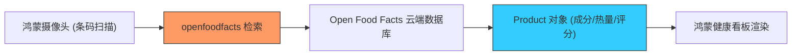

欢迎加入开源鸿蒙跨平台社区：[https://openharmonycrossplatform.csdn.net](https://openharmonycrossplatform.csdn.net)


# Flutter for OpenHarmony: Flutter 三方库 openfoodfacts 在鸿蒙应用中开启全球食品营养数据的大门（智慧饮食管理专家）

## 前言

在进行 OpenHarmony 的智慧健康、运动饮食管理或母婴助手类应用开发时，核心痛点之一就是获取准确的“食品数据”：
1. 这个饼干的热量是多少？
2. 面前这罐牛奶是否包含过敏原（如麸质）？
3. 该产品的营养评分（Nutri-Score）在同类中处于什么水平？

**`openfoodfacts`** 基于全球最大的开源食品数据库 API，为鸿蒙开发者提供了一套完整的、类型安全的食品数据检索工具。配合鸿蒙端的二维码/条形码扫描功能，你可以打造出一站式的健康监测闭环体验。

---

## 一、食品数据审计架构模型

该库通过条形码匹配，从全球云端索引提取全方位的营养维度。



---

## 二、核心 API 实战

### 2.1 通过条形码精准查找

```dart
import 'package:openfoodfacts/openfoodfacts.dart';

void fetchProductInfo(String barcode) async {
  // 💡 配置查询参数，指定返回的语言
  ProductQueryConfiguration config = ProductQueryConfiguration(
    barcode,
    language: OpenFoodFactsLanguage.CHINESE,
    fields: [ProductField.NAME, ProductField.NUTRIMENTS, ProductField.LABELS],
  );

  // 💡 执行获取
  ProductResult result = await OpenFoodFactsApiService.getProduct(config);

  if (result.status == ProductResult.success) {
    print('食品名称: ${result.product?.productName}');
    print('热量 (每 100g): ${result.product?.nutriments?.energyKcal} kCal');
  }
}
```

### 2.2 搜索特定类别的食品

```dart
void searchHealthySnacks() async {
  // 💡 搜索打分为 A 级的健康零食
  final searchConfig = ProductSearchQueryConfiguration(
    parametersList: [
      const CategoryLabelQueryConfiguration('Snacks'),
      const NutriScoreQueryConfiguration(NutriScore.A),
    ],
  );
  
  final res = await OpenFoodFactsApiService.searchProducts(null, searchConfig);
}
```

---

## 三、常见应用场景

### 3.1 鸿蒙运动 App 的“饮食打卡”助手
用户只需用华为手机扫一扫包装袋，利用 `openfoodfacts` 立即同步食品的蛋白质、脂肪和碳水数据到鸿蒙的健康记录中。系统自动计算当日剩余热量缺口，并给出个性化的饮食建议，实现科学减脂。

### 3.2 鸿蒙版“过敏原识别”护卫
针对特定人群（如糖尿病患者或过敏体质），建立一个鸿蒙端的预警系统。通过该库获取食品的成分清单，若发现含有受限成分，鸿蒙应用立即通过振动和高亮提示发出警报，为用户的生命健康筑起最后一道数字防线。

---

## 四、OpenHarmony 平台适配

### 4.1 适配鸿蒙的图片加载性能优化
💡 **技巧**：`openfoodfacts` 返回的产品数据中包含大量的高清包装图。在鸿蒙应用中展示这些图片时，务必配合具有内存缓存机制的加载库（如 `cached_network_image`）。同时，利用该库提供的 `images` 字段选择合适分辨率的缩略图 URL，避免在鸿蒙设备的列表页中由于加载超大图片导致的滑动掉帧，确保 UI 体验的丝滑。

### 4.2 处理网络延迟与本地离线缓存
由于 API 服务器可能在海外，在鸿蒙端调用时可能会面临网络波动。建议在鸿蒙应用层建立一套基于 `SQLite` 或 `Hive` 的二级缓存机制。对于用户经常扫码的食品，将其缓存为本地的离线 JSON 对象。这种“云端检索+本地记忆”的模式，能保证鸿蒙应用即便在网络信号较差的超市地下仓库，依然能够秒级响应各种查询请求。

---

## 五、完整实战示例：鸿蒙工程“营养审计”逻辑中枢

本示例展示如何综合评估一个食品的健康等级。

```dart
import 'package:openfoodfacts/openfoodfacts.dart';

class OhosFoodAuditor {
  /// 💡 为鸿蒙用户提供一键营养审计
  Future<void> audit(String barcode) async {
    print('🔍 正在启动鸿蒙全球食品数据探针...');
    
    final config = ProductQueryConfiguration(
      barcode,
      fields: [ProductField.NUTRI_SCORE, ProductField.INGREDIENTS_TEXT],
    );

    try {
      final result = await OpenFoodFactsApiService.getProduct(config);
      final product = result.product;

      print('--- 审计报告 ---');
      print('营养等级: ${product?.nutriscore?.toUpperCase() ?? "未知"}');
      print('成分描述: ${product?.ingredientsText ?? "暂无数据"}');
      
      if (product?.nutriscore == 'a' || product?.nutriscore == 'b') {
        print('✅ 结论：该食品属于鸿蒙建议采购的绿色健康品类');
      }
    } catch (e) {
      print('网络超时：请检查鸿蒙设备的网络连通性');
    }
  }
}

void main() async {
  final auditor = OhosFoodAuditor();
  await auditor.audit('5449000131805'); // 示例条码
}
```

<!-- IMAGE_PLACEHOLDER: 鸿蒙手机展示扫描界面后立即弹出的食品详情卡片，包含热量环形图、营养评分标签以及过敏原风险提示的精美截图 -->

---

## 六、总结

`openfoodfacts` 软件包是 OpenHarmony 开发者打理“健康数据”的全球直通车。它将零散的食品信息转化为了可编程、可量化的数据结构。在构建追求全场景智慧化、追求极致健康赋能能力的鸿蒙原生应用生态中，引入这样一套权威且开放的数据集成方案，将让您的应用在该领域具备极其硬核的竞争优势。
