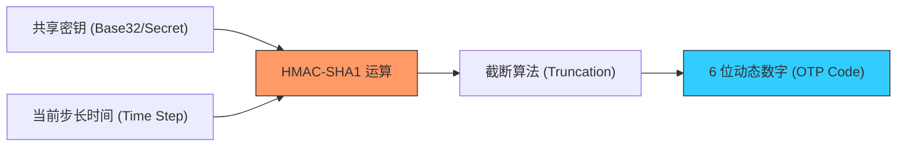

欢迎加入开源鸿蒙跨平台社区：[https://openharmonycrossplatform.csdn.net](https://openharmonycrossplatform.csdn.net)


# Flutter for OpenHarmony: Flutter 三方库 otp 为鸿蒙应用构建军工级动态验证码安全防护体系（2FA 二步验证利器）

## 前言

在进行 OpenHarmony 的办公系统（OA）、支付应用或任何涉及用户资产安全的应用开发时，仅靠“用户名+密码”的传统验证方式已经捉襟见肘。如何为鸿蒙应用快速集成像 Google Authenticator 一样的 **TOTP (基于时间的一次性密码)** 或 **HOTP (基于计数器的一次性密码)**？

**`otp`** 软件包是一个极其精纯、无外部依赖的算法库。它实现了 RFC 4226 和 RFC 6238 标准，让你能在几行代码内为鸿蒙项目增加“双因素认证（2FA）”能力。

---

## 一、动态验证码生成模型

OTP 算法通过“共享密钥 + 变动因子（时间/计数）”推算出当前的 6 位或 8 位数字。



---

## 二、核心 API 实战

### 2.1 生成 TOTP (基于时间的动态码)

这是最常见的场景，验证码通常每 30 秒变更一次。

```dart
import 'package:otp/otp.dart';

void generateTotp() {
  // 💡 此密钥应安全存储在鸿蒙系统的安全沙箱中
  const secret = 'JBSWY3DPEHPK3PXP'; 

  // 💡 生成当前的 6 位验证码
  final code = OTP.generateTOTPCodeString(
    secret,
    DateTime.now().millisecondsSinceEpoch,
    isGoogle: true, // 兼容 Google 身份验证器标准
  );

  print('🔒 鸿蒙安全审计：当前的动态令牌为 [$code]');
}
```

### 2.2 二步验证匹配逻辑

```dart
bool verify(String inputCode, String secret) {
  final correctCode = OTP.generateTOTPCodeString(
     secret, DateTime.now().millisecondsSinceEpoch);
  
  return inputCode == correctCode;
}
```

---

## 三、常见应用场景

### 3.1 鸿蒙企业级账号登录保护
用户在鸿蒙 App 登录后，要求输入手机上身份验证器显示的 6 位数字，极大降低了由于密码泄露导致的冒名登录风险。

### 3.2 鸿蒙智能支付二次确认
在进行大额转账或修改敏感信息（如鸿蒙支付密码）前，系统自动生成一个基于时间或次数的临时令牌。该验证码不通过短信发送（防止拦截），而是在应用内本地计算通过安全通道核验，安全性极高。

---

## 四、OpenHarmony 平台适配

### 4.1 适配鸿蒙的系统时标同步
💡 **技巧**：TOTP 算法对时间极其敏感。如果鸿蒙设备的本地时间偏差超过 30 秒，生成的验证码将无法通过服务端核验。在使用 `otp` 库时，建议配合 **`ntp`** 软件包，在应用启动时获取网络准时，并将其作为时间戳参数传递给 `generateTOTPCodeString`。这样可以无视用户手动修改系统时间导致的失效问题，保证鸿蒙应用的健壮性。

### 4.2 密钥的安全存储策略
在鸿蒙 NEXT 平台上，敏感的 OTP 种子（Secret）绝不应以明文形式存储在 `Preferences` 中。推荐利用鸿蒙原生的 **HUKS (HarmonyOS Universal KeyStore)** 服务加密存储，仅在计算验证码的瞬间才解密。通过 `otp` 强大的算法提取能力，配合鸿蒙系统的底层安全硬件，可以打造出具备硬件隔离级别的高安全认证模块。

---

## 五、完整实战示例：鸿蒙精美“动态口令”计算器

本示例展示如何模拟一个倒计时的动态码刷新器。

```dart
import 'package:otp/otp.dart';

class OhosSafeTokenManager {
  static const _secret = 'OHOS_APP_SECURE_KEY';

  /// 💡 获取当前的动态令牌，并告知剩余有效描述
  Map<String, dynamic> fetchNewToken() {
    final now = DateTime.now().millisecondsSinceEpoch;
    
    // 计算当前的 6 位码
    final code = OTP.generateTOTPCodeString(_secret, now);
    
    // 计算当前 30 秒步长的剩余秒数 (默认 step = 30)
    final remainingSeconds = 30 - ((now ~/ 1000) % 30);
    
    return {
      'code': code,
      'validFor': remainingSeconds,
    };
  }
}

void main() {
  final manager = OhosSafeTokenManager();
  final data = manager.fetchNewToken();
  print('--- 鸿蒙安全中枢监控 ---');
  print('动态验证码: ${data['code']} (有效剩余 ${data['validFor']} 秒)');
}
```

<!-- IMAGE_PLACEHOLDER: 鸿蒙手机展示带环形倒计时进度的动态 6 位大数字验证码页面的精美截图 -->

---

## 六、总结

`otp` 软件包是 OpenHarmony 开发者打理“零信任”安全架构的基石。它将复杂的密码学哈希过程抽象为简单的数学调用。在构建追求极致安全、同时要求低功耗运行的鸿蒙原生应用生态中，引入这套标准化的 OTP 技术方案，能让你的应用在安全等级上瞬间对标一线的金融级软件，为用户的隐私和资产筑起一道坚不可摧的数字长城。
