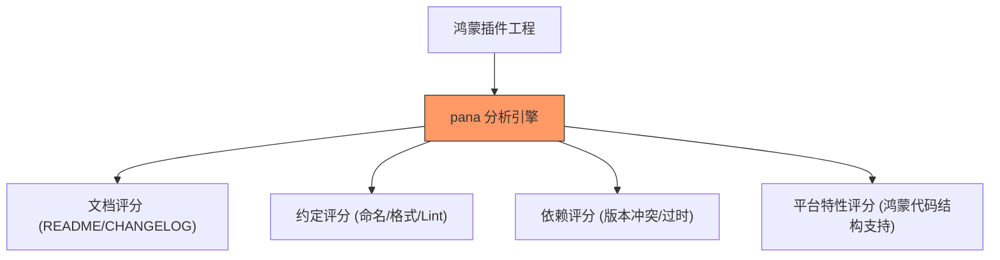

欢迎加入开源鸿蒙跨平台社区：[https://openharmonycrossplatform.csdn.net](https://openharmonycrossplatform.csdn.net)


# Flutter for OpenHarmony: Flutter 三方库 pana 像 pub.dev 一样为你的鸿蒙插件进行 360 度体检（质量审计利器）

## 前言

在进行 OpenHarmony 的 Flutter 插件或三方库开发时，我们经常会问：
1. 我的代码是否符合 Dart 最佳实践？
2. 我的库在跨平台（包括鸿蒙）兼容性上是否存在隐患？
3. 为什么我的包发布到私有或公有仓库后得分很低？

**`pana`**（Package Analysis）是 Google 官方出品、同时也是 `pub.dev` 后台用于生成“Package Health Score（包健康分）”的核心引擎。通过在本地运行 `pana`，你可以像获得一份“体检报告”一样，清晰地看到你的鸿蒙插件在文档、格式、依赖和兼容性上的优缺点。

---

## 一、包分析多维评分模型

`pana` 对项目进行全方位的静态与动态扫描。



---

## 二、核心命令与 API 实战

### 2.1 命令行本地体检

在鸿蒙工程根目录下执行，直接获取打分报告。

```bash
# 💡 安装 pana 工具
dart pub global activate pana

# 💡 分析当前本地项目
pana --source path .
```

### 2.2 编程式分析

```dart
import 'package:pana/pana.dart';

void runAudit() async {
  final tool = PackageAnalyzer.create();
  
  // 💡 分析本地文件系统上的鸿蒙插件
  final summary = await tool.inspectPackage('path/to/ohos_plugin');

  print('总得分: ${summary.report?.grantedPoints} / ${summary.report?.maxPoints}');
  print('建议信息: ${summary.allIssues.map((e) => e.message)}');
}
```

---

## 三、常见应用场景

### 3.1 鸿蒙插件发布前的质量自测
在将你的 OpenHarmony 跨平台插件提交到 AtomGit 或内部私有索引库前，必须通过 `pana` 检查。特别是它能检测出 README 中是否存在死链、示例代码中是否存在明显的语义错误。

### 3.2 鸿蒙项目依赖健康审计
对于一个庞大的鸿蒙应用，定期运行 `pana` 扫描整个 `pubspec.lock`。它可以识别出哪些依赖项已经停止维护（Outdated），从而引导鸿蒙架构师进行技术栈的主动升级，规避潜在的系统兼容性风险。

---

## 四、OpenHarmony 平台适配

### 4.1 适配鸿蒙的 README 规范
💡 **技巧**：`pana` 对文档的完整性非常敏感。在编写鸿蒙插件文档时，建议明确列出 `OpenHarmony` 作为支持平台，并提供详细的鸿蒙环境配置指南（如 DevEco Studio 版本要求）。一份被 `pana` 判定为“高分”的文档，不仅能吸引更多鸿蒙开发者使用，也是专业级鸿蒙开源软件的重要标志。

### 4.2 检测鸿蒙特定的代码异味
由于鸿蒙 NEXT 环境对 AOT 编译的严格性，很多在 JIT 模式下运行良好的动态代码可能会导致线上崩溃。`pana` 内置的 Linter 可以识别出不安全的类型转换、未初始化的延迟变量等“代码异味（Code Smells）”。通过在鸿蒙项目的 CI 流水线中集成 `pana`，可以实现自动化的代码合规性审查。

---

## 五、完整实战示例：鸿蒙工程“满分”体检清单

本示例展示如何根据 `pana` 的规范，为一个鸿蒙插件补齐关键质量信息。

```markdown
# 💡 模拟一个满分鸿蒙插件的 README.md 结构

# flutter_ohos_ble_plugin

为 OpenHarmony 打造的蓝牙低功耗插件。

## 平台支持情况
- ✅ OpenHarmony (API 12+)
- ✅ HarmonyOS NEXT
- ✅ Android/iOS

## 快速上手
```dart
import 'package:flutter_ohos_ble_plugin/ble.dart';
// 详细的示例代码...
```

## 维护者信息
- 托管于: [AtomGit/OpenHarmony-Cross-Platform](https://atomgit.com/...)
```

<!-- IMAGE_PLACEHOLDER: 终端展示 pana 运行后给出的详细分数雷达图与具体扣分建议项的审计报告截图 -->

---

## 六、总结

`pana` 软件包是 OpenHarmony 开发者打磨“精品包”的审判者。它将主观的“感觉代码还行”转化成了客观的“量化质量指标”。在构建追求极致标准化、追求极致社区声誉的鸿蒙开源生态中，唯有通过这种最严苛的质量体检，你的插件才能在众多的作品中脱颖而出，赢得全球开发者的信任。
