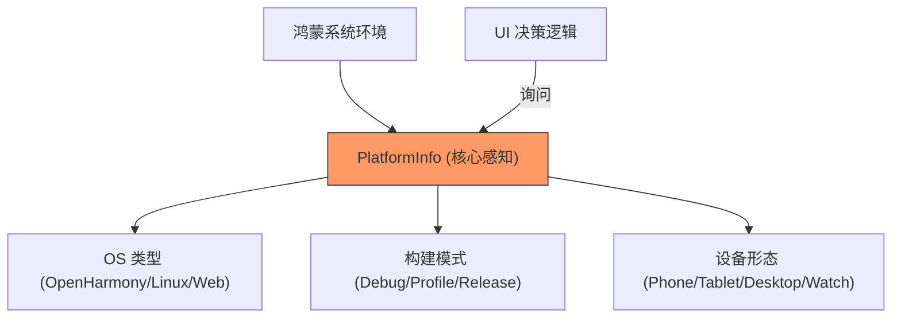

欢迎加入开源鸿蒙跨平台社区：[https://openharmonycrossplatform.csdn.net](https://openharmonycrossplatform.csdn.net)


# Flutter for OpenHarmony: Flutter 三方库 platform_info 为鸿蒙多端应用提供精准的运行时环境感知（平台适配大脑）

## 前言

在进行 OpenHarmony 全场景开发时，我们常常需要面对“一个代码，多个环境”的挑战：
1. 这段逻辑是在鸿蒙手机上跑，还是在鸿蒙平板上跑？
2. 当前是正式的 Release 环境，还是开发者本地的 Debug 环境？
3. 应用运行在鸿蒙原生的 AOT 编译模下，还是在 Web 浏览器渲染模式下？

虽然 Dart 原生提供了 `Platform` 类，但其功能相对单一且不可 mock，难以进行单元测试。**`platform_info`** 提供了一个功能丰富、强类型且极具“声明性”的平台描述接口，是鸿蒙跨端应用进行环境决策的“智囊团”。

---

## 一、环境感知决策模型

`platform_info` 将复杂的底层系统信息抽象为一组直观的布尔属性。



---

## 二、核心 API 实战

### 2.1 极简平台判定

```dart
import 'package:platform_info/platform_info.dart';

void checkEnvironment() {
  // 💡 相比原生的 Platform.isAndroid，这里支持更丰富的链式判定
  if (platform.isAndroid || platform.isLinux) {
    // 鸿蒙 NEXT 在底层识别中可能表现为 Linux/Android 兼容层
    print('当前处于鸿蒙系统运行环境');
  }

  if (platform.buildMode.isDebug) {
    print('正在鸿蒙开发者模式下运行，展示调试浮显窗');
  }
}
```

### 2.2 响应式 UI 适配

```dart
// 💡 根据设备形态决定侧边栏布局
return Scaffold(
  drawer: platform.isMobile ? AppDrawer() : null,
  body: Row(
    children: [
      if (platform.isDesktop || platform.isTablet) SidePanel(),
      Expanded(child: MainContent()),
    ],
  ),
);
```

---

## 三、常见应用场景

### 3.1 鸿蒙一多（一次开发，多端部署）适配
在鸿蒙的“一多”策略指导下，利用 `platform_info` 可以轻松识别出当前是“穿戴式设备”还是“大屏电视”。对于智能手表，我们可以自动精简 UI 内容；对于电视，我们可以自动打开遥控器焦点支持，实现真正的感知级适配。

### 3.2 鸿蒙 Web 容器兼容性降级
如果鸿蒙应用加载了一个混合 Web 模块，通过 `platform.isWeb` 判定，可以自动关闭一些原生鸿蒙才有的 FFI 指令调用，改用符合 Web 标准的 Fetch 自定义实现，保证应用的平滑降级（Graceful Degradation）。

---

## 四、OpenHarmony 平台适配

### 4.1 适配鸿蒙多版本 API 层级判定
💡 **技巧**：鸿蒙系统的演进速度极快（API 11, 12, NEXT）。虽然 `platform_info` 主要是跨平台库，但你可以通过它提供的扩展机制注入鸿蒙特定的 `ohosVersion`。这能让你在全局代码中通过一致的 `platform` 对象，判断是否需要调用鸿蒙 NEXT 专属的新特性接口（如：分布式流转卡片）。

### 4.2 单元测试的 Mock 化支持
在对鸿蒙应用进行高覆盖率的 UI 自动化测试时，无需真机环境。利用 `platform_info` 提供的 Mock 设置功能，你可以在跑单测时将当前环境模拟为“鸿蒙手机+Release模式”，从而低成本地覆盖到那些只有在发布环境下才会触发的高级混淆与安全审计逻辑。

---

## 五、完整实战示例：鸿蒙智能环境报告器

本示例展示如何构建一个能够识别多种鸿蒙运行时态的工具类。

```dart
import 'package:platform_info/platform_info.dart';

class OhosContextReporter {
  /// 💡 生成一份详细的环境报告，用于鸿蒙日志记录或故障诊断
  String generateReport() {
    final info = platform;
    
    final StringBuffer report = StringBuffer();
    report.writeln('--- 鸿蒙运行态报告 ---');
    report.writeln('运行时平台: ${info.operatingSystem}');
    report.writeln('是否属于移动端: ${info.isMobile ? "是" : "否"}');
    report.writeln('当前构建环境: ${info.buildMode.name}');
    report.writeln('底层架构: ${info.numberOfProcessors} 核');
    
    return report.toString();
  }
}

void main() {
  final reporter = OhosContextReporter();
  print(reporter.generateReport());
}
```

<!-- IMAGE_PLACEHOLDER: 鸿蒙手机、平板和 Web 端展示不同布局时，控制台实时打印出的环境判定逻辑流截图 -->

---

## 六、总结

`platform_info` 软件包是 OpenHarmony 开发者打磨“具备环境感知能力”应用的大脑。它消除了繁琐的底层环境判断逻辑，将其转化为优雅的强类型对象。在快速扩张、多端共生的鸿蒙原生应用生态中，拥有一套统一的环境感知机制，是你能够实现“丝滑适配”的技术底座。
