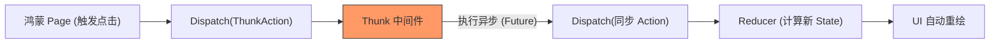

欢迎加入开源鸿蒙跨平台社区：[https://openharmonycrossplatform.csdn.net](https://openharmonycrossplatform.csdn.net)


# Flutter for OpenHarmony: Flutter 三方库 redux_thunk 解决鸿蒙应用状态管理中的复杂异步副作用（异步架构神器）

## 前言

在 OpenHarmony 应用架构设计中，状态管理（State Management）是业务的核心。如果你选择了经典的 **Redux** 模式，你会发现它天生是“同步”的：Action 发出，Reducer 改变 State。但在真实项目中，我们需要处理网络请求、数据库读写、文件 IO 等延时操作。如何在纯净的 Redux 链条中插入这些破坏性的“副作用”？

**`redux_thunk`** 提供了一个简单而精妙的方案。它通过扩展 Redux 的中间件机制，允许你 Dispatch（派发）一个 **函数** 而不仅仅是对象。这为鸿蒙应用处理复杂的业务流提供了极大灵活性。

---

## 一、异步 Action 流转模型

`redux_thunk` 在 Action 到达 Reducer 前建立了一个“缓冲处理区”。



---

## 二、核心 API 实战

### 2.1 初始化 Redux 中间件

在鸿蒙应用的根中枢进行配置。

```dart
import 'package:redux/redux.dart';
import 'package:redux_thunk/redux_thunk.dart';

void initStore() {
  final store = Store<AppState>(
    appReducer,
    initialState: AppState.initial(),
    // 💡 必须引入 thunkMiddleware
    middleware: [thunkMiddleware],
  );
}
```

### 2.2 定义异步 Thunk Action

```dart
ThunkAction<AppState> fetchUserAction(int userId) {
  return (Store<AppState> store) async {
    // 1. 发起请求前，可以派发一个 Loading 状态
    store.dispatch(UserLoadingAction());

    try {
      // 💡 执行真实的耗时网络操作
      final user = await api.getUser(userId);
      
      // 2. 成功后，派发带数据的同步 Action
      store.dispatch(UserLoadedAction(user));
    } catch (e) {
      store.dispatch(UserErrorAction(e.toString()));
    }
  };
}
```

---

## 三、常见应用场景

### 3.1 鸿蒙应用全链路鉴权登录
在点击“登录”按钮后，Thunk Action 可以依次串联：开启 Loading -> 调用接口鉴权 -> 写入鸿蒙沙箱持久化 -> 更新全局用户信息状态 -> 跳转至首页。这一系列复杂的流程被封装在一个函数内，UI 层只需调用一个 `dispatch` 即可。

### 3.2 鸿蒙分布式数据的批量同步
当鸿蒙设备需要将本地离线数据库批量上传至云端时，利用 Thunk 可以控制并发数，并在每一批数据成功后通知 UI 更新进度条，实现业务逻辑的高度原子化。

---

## 四、OpenHarmony 平台适配

### 4.1 适配鸿蒙多核异步调度
💡 **技巧**：鸿蒙系统的麒麟处理器对多线程管理非常高效。在 Thunk Action 中处理的任务，如果属于 CPU 密集型（如：解压大型资源包），可以配合鸿蒙的 `compute` 或 `Isolate` 函数。Thunk 中间件能完美等待这些底层并发任务结束，并确保最终的 UI 更新动作回到主事件循环，保障鸿蒙界面的丝滑渲染。

### 4.2 适配鸿蒙系统资源回收
在鸿蒙的“流转”或“分屏”切换时，应用状态可能发生剧烈波动。使用 `redux_thunk` 封装的业务逻辑相比散落在各处的 `setState` 更易于审计和调试。你可以通过 Redux DevTools 观测到每一个异步操作的起止点，这对于排查鸿蒙应用后台运行时的内存溢出或网络悬挂问题至关重要。

---

## 五、完整实战示例：鸿蒙工程级“数据同步”守卫

本示例展示如何利用 Thunk 管理具有复杂依赖关系的业务流。

```dart
import 'package:redux/redux.dart';
import 'package:redux_thunk/redux_thunk.dart';

// 💡 这是一个复杂的异步操作逻辑函数
ThunkAction<int> ohosSyncDataAction = (Store<int> store) async {
  print('📡 正在启动鸿蒙分布式同步中枢...');
  
  // 模拟耗时网络操作
  await Future.delayed(Duration(seconds: 2));
  
  // 💡 操作完成后派发最终的同步 Action
  store.dispatch(100); // 假设同步后积分为 100
  
  print('✅ 鸿蒙本地状态已通过 Thunk 同步至云端');
};

void main() async {
  final store = Store<int>(
    (state, action) => action is int ? action : state,
    initialState: 0,
    middleware: [thunkMiddleware],
  );

  // 触发异步过程
  store.dispatch(ohosSyncDataAction);
}
```

<!-- IMAGE_PLACEHOLDER: 鸿蒙 DevEco Studio 配合 Redux 指标监控界面显示异步 Action 从触发到完成的全生命周期时序图截图 -->

---

## 六、总结

`redux_thunk` 软件包是 OpenHarmony 开发者打磨“可维护应用架构”的关键补丁。它以最轻量的方式补齐了 Redux 对异步操作支持的短板。在一个业务逻辑纵横交错、多端数据同步频繁的鸿蒙原生应用生态中，引入这样一套经过时间考验的副作用处理方案，能让你的系统架构在保持“单向数据流”简洁性的同时，具备处理任何复杂现实问题的能力。
