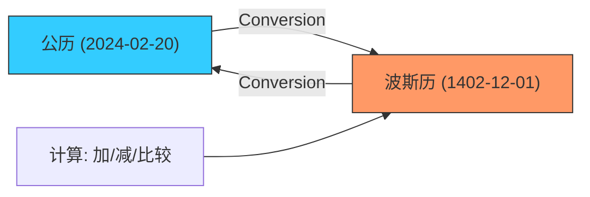

欢迎加入开源鸿蒙跨平台社区：[https://openharmonycrossplatform.csdn.net](https://openharmonycrossplatform.csdn.net)


# Flutter for OpenHarmony: Flutter 三方库 shamsi_date 助力鸿蒙应用精准适配波斯历法（中东出海必备）

## 前言

在进行 OpenHarmony 的全球化（Internationalization）应用开发时，进军中东市场（尤其是波斯语地区）是一项充满潜力的战略。但在这些地区，用户习惯使用的并非公历（Gregorian），而是 **波斯历（Shamsi/Jalali）**。
1. 如何将用户的生日从公历转换成波斯历？
2. 鸿蒙应用的时间轴、日历选择器如何呈现 Jalali 格式？
3. 业务系统中的合同到期日如何按波斯历进行逻辑计算？

**`shamsi_date`** 是 Dart 生态中处理波斯历法的权威库。它提供了极其简单的转换 API，是你开发鸿蒙出海应用、打入中东市场的关键技术补丁。

---

## 一、历法转换算法模型

`shamsi_date` 实现了公历与波斯历之间的双向精准映射。



---

## 二、核心 API 实战

### 2.1 当前时间转换

```dart
import 'package:shamsi_date/shamsi_date.dart';

void convertDate() {
  // 1. 获取当前公历时间
  Gregorian g = Gregorian.now();
  
  // 💡 2. 转换为波斯历 Jalali 对象
  Jalali j = g.toJalali();

  print('公历: ${g.year}/${g.month}/${g.day}');
  print('波斯历: ${j.year}/${j.month}/${j.day}'); // 示例：1402/12/01
}
```

### 2.2 定义特定的波斯日期

```dart
// 💡 手动创建一个波斯日期
Jalali someDate = Jalali(1402, 12, 10);
Gregorian backToG = someDate.toGregorian();

print('转换回公历: ${backToG.year}');
```

---

## 三、常见应用场景

### 3.1 鸿蒙端侧“中东版”日历日程
在鸿蒙手机的日历应用中，通过判断用户当前的时区和语言，自动切换日期显示。利用 `shamsi_date` 的格式化输出（如 `j.formatter.yyyy_mm_dd`），可以生成符合当地阅读习惯的月份和星期名称。

### 3.2 鸿蒙出海电商的订单有效期提示
在中东地区的秒杀活动中，倒计时或结束时间如果只显示公历，对当地用户不友好。通过该库将结束时间转为波斯历显示，能显著降低用户的认知负荷，提升鸿蒙应用在当地的留存率。

---

## 四、OpenHarmony 平台适配

### 4.1 适配鸿蒙的 RTL (从右向左) 布局
💡 **技巧**：使用波斯历的地区通常也使用 RTL 排版。在鸿蒙应用编写布局时，不仅要用 `shamsi_date` 处理日期逻辑，建议配合 Flutter 的 `Directionality` 组件。当日历显示波斯历数字（如 ۰, ۱, ۲...）时，布局也应自动从右侧开始排列，实现真正符合中东语境的完美适配。

### 4.2 处理闰年与高精度计算
波斯历的闰年规则比公历更为复杂。`shamsi_date` 内部封装了所有天文历法级别的精细逻辑。在鸿蒙设备进行长周期的合约计算（例如为中东企业开发的鸿蒙版 ERP 系统）时，直接调用 `j.addDays(365)` 等方法，它会自动感应波斯历的跨年与闰月，保障业务数据的财务级精准。

---

## 五、完整实战示例：鸿蒙“丝路”历法转换器

本示例展示如何构建一个具备双历显示能力的工具函数。

```dart
import 'package:shamsi_date/shamsi_date.dart';

class OhosDateExplorer {
  /// 💡 将当前系统时间转为波斯语格式的字符串
  String getLocalizedDate() {
    print('📅 正在启动鸿蒙全球化历法转换器...');
    
    final j = Jalali.now();
    final f = j.formatter;
    
    // 生成格式："1402/12/01"
    return '${f.yyyy}/${f.mm}/${f.dd}';
  }

  /// 💡 判断波斯历下是否为闰年
  bool isOhosLeapYear(int year) {
    return Jalali(year).isLeapYear();
  }
}

void main() {
  final explorer = OhosDateExplorer();
  print('中东地区专用日期: ${explorer.getLocalizedDate()}');
}
```

<!-- IMAGE_PLACEHOLDER: 鸿蒙设备展示带波斯艺术风格数字的日历面板，以及公历与波斯历实时左右对比切换的效果截图 -->

---

## 六、总结

`shamsi_date` 软件包是 OpenHarmony 开发者征服中东市场的“语言通行证”。它摒弃了复杂的数学手工转换，以标准化的 Dart 类封装了古老而严谨的历法智慧。在构建全场景覆盖、具备全球化包容能力的鸿蒙原生应用生态中，细心打磨每一个符合当地用户习惯的日期细节，是你赢得海外用户口碑的核心秘诀。
