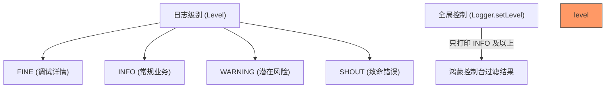

欢迎加入开源鸿蒙跨平台社区：[https://openharmonycrossplatform.csdn.net](https://openharmonycrossplatform.csdn.net)


# Flutter for OpenHarmony: Flutter 三方库 simple_logger 为鸿蒙系统开发打造最纯粹的日志调试体验（极简主义者的首选）

## 前言

在进行 OpenHarmony 应用调试时，虽然控制台有原始的 `print`，但在处理复杂的异步流、网络状态变更或多层级渲染时，简单的打印往往会导致信息洪流，难以寻找重点。如果你不需要像 `talker` 或 `logger` 那么繁重的全家桶方案，只想在控制台中看到一点色彩和清晰的层级，那么这个库就是为你准备的。

**`simple_logger`** 完美诠释了“大道至简”。它不依赖任何原生 C++ 接口，纯 Dart 实现，能在鸿蒙设备上以极低的资源占用提供带有级别过滤（Level Filtering）和漂亮格式的日志输出。

---

## 一、日志过滤层级模型

`simple_logger` 允许你根据开发阶段动态调整输出强度。



---

## 二、核心 API 实战

### 2.1 初始化与基础打印

```dart
import 'package:simple_logger/simple_logger.dart';

final logger = SimpleLogger();

void initLogs() {
  // 💡 设置全局级别：生产环境可以设为 WARNING
  logger.setLevel(Level.INFO, includeCallerInfo: true);

  logger.info('🚀 鸿蒙应用核心已启动');
  logger.warning('⚠️ 检测到低电量运行模式');
  logger.shout('❌ 数据库连接已断开！');
}
```

### 2.2 自定义输出格式

```dart
logger.formatter = (info, level, message) {
  // 💡 为鸿蒙控制台定制特定的前缀
  return '📦 [Ohos-Logger] [$level] $message';
};
```

---

## 三、常见应用场景

### 3.1 鸿蒙插件开发初期的埋点
当你正在开发一个鸿蒙原生的 FFI 插件时，利用 `simple_logger` 记录 Dart 侧的调用序列，配合鸿蒙系统的 `HiLog`（通过 `shout` 级别标记），可以非常清晰地对比双端通信的性能损耗。

### 3.2 鸿蒙 AOT 模式下的异常追踪
在鸿蒙正式包（AOT）运行环境下，很多调试信息会被剥离。利用 `simple_logger` 极其精简的特性，可以在不影响应用性能的前提下，保留核心业务逻辑的执行路径，方便在真机环境下通过 IDE 收集日志。

---

## 四、OpenHarmony 平台适配

### 4.1 控制台 ANSI 颜色兼容
💡 **技巧**：鸿蒙 DevEco Studio 的控制台完美支持 ANSI 彩色编码。在配置 `simple_logger` 时，可以开启颜色支持。彩色的日志不仅能快速区分错误、警告和普通信息，还能在密集的日志大潮中一眼锁住当前的焦点，极大缓解鸿蒙开发者的视觉疲劳。

### 4.2 适配鸿蒙的性能审计
在鸿蒙系统中，高频率的日志输出会占用系统 I/O 资源。`simple_logger` 由于内部逻辑及其简单（仅仅是字符串拼接和打印），在鸿蒙低端设备上也几乎没有性能开销。这对于需要进行长时间实时性能监测的鸿蒙运动健康类应用尤为适合。

---

## 五、完整实战示例：鸿蒙生命周期守护日志

本示例展示如何利用日志级别管理鸿蒙页面的初始化过程。

```dart
import 'package:simple_logger/simple_logger.dart';

class OhosPageTracker {
  static final logger = SimpleLogger();

  void onPageOpen(String pageName) {
    logger.setLevel(Level.INFO);
    
    // 💡 记录详细的进入时间
    logger.info('--- 进入鸿蒙页面: $pageName ---');
    
    try {
      _loadData();
    } catch (e) {
      // 💡 严重错误通过 SHOUT 级别提醒
      logger.shout('💥 无法加载页面数据：$e');
    }
  }

  void _loadData() {
    // 💡 调试级别（生产环境默认不打印）
    logger.fine('正在从内存加载缓存数据...');
  }
}

void main() {
  final tracker = OhosPageTracker();
  tracker.onPageOpen('鸿蒙主页');
}
```

<!-- IMAGE_PLACEHOLDER: 鸿蒙 DevEco Studio 底部控制台展示带级别颜色（红黄蓝）且格式整齐的日志输出截图 -->

---

## 六、总结

`simple_logger` 软件包是给每一位追求“轻量化”开发体验的鸿蒙开发者的礼物。它不追求花哨的功能，仅通过几个关键 API 为乱糟糟的 `print` 提供秩序。在构建结构化、可维护的鸿蒙原生应用时，引入这样一个小巧而精悍的日志管理工具，是你构建高质量调试闭环的最佳起点。
