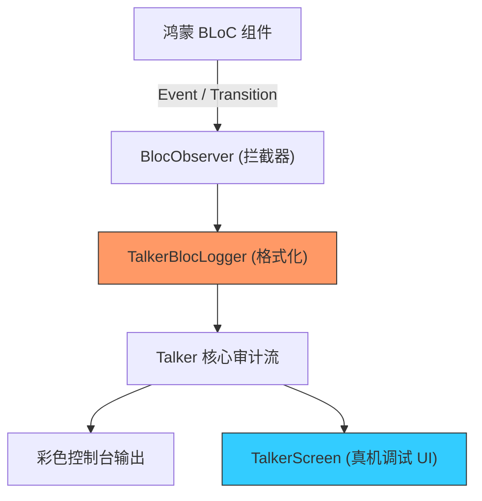

欢迎加入开源鸿蒙跨平台社区：[https://openharmonycrossplatform.csdn.net](https://openharmonycrossplatform.csdn.net)


# Flutter for OpenHarmony: Flutter 三方库 talker_bloc_logger 深度洞察鸿蒙应用中的每一条 BLoC 状态流转（状态审计神器）

## 前言

在进行基于 **BLoC (Business Logic Component)** 架构的 OpenHarmony 应用开发时，随着业务逻辑的膨胀，我们面临最头疼的问题就是：
1. 这个 Event 是什么时候发出的？
2. State 为什么突然跳变到了 Error？
3. 这个 Transition 转换过程中带了哪些参数？

**`talker_bloc_logger`** 是 Talker 日志生态中专门针对 BLoC 的超级补丁。它通过一行代码就能接管整个系统的 BLoC 观察器，将枯燥的控制台信息转化为漂亮的、结构化的全屏审计流。

---

## 一、BLoC 状态观测流模型

该库通过拦截 BLoC 的全局观察器接口，自动格式化并转发所有状态变更。



---

## 二、核心 API 实战

### 2.1 全局挂载审计器

在鸿蒙应用的 `main.dart` 中一键激活。

```dart
import 'package:bloc/bloc.dart';
import 'package:talker_bloc_logger/talker_bloc_logger.dart';
import 'package:talker/talker.dart';

void main() {
  final talker = Talker();
  
  // 💡 核心：指定 BLoC 的全局观察器为 TalkerBlocObserver
  Bloc.observer = TalkerBlocObserver(
    talker: talker,
    settings: TalkerBlocLoggerSettings(
      printEventFullData: true, // 打印事件的完整 JSON
      printStateFullData: true, // 打印状态的完整 JSON
    ),
  );

  runApp(MyApp(talker: talker));
}
```

---

## 三、常见应用场景

### 3.1 鸿蒙端侧“死循环”状态检测
当开发者在鸿蒙应用中意外写出了 `State A -> Event X -> State A` 的死循环逻辑时，`talker_bloc_logger` 能够实时在页面底部弹出的调试窗口中刷屏提醒，帮助你在几秒内定位逻辑死锁点。

### 3.2 鸿蒙离线日志的“慢查询”审计
利用该库记录所有的 `Transition` 耗时。如果在某些鸿蒙低端设备上发现某个复杂的 BLoC 计算导致了频繁的 UI 卡顿，日志中对应的耗时标记会变色提醒，成为鸿蒙性能优化的重要线索。

---

## 四、OpenHarmony 平台适配

### 4.1 适配鸿蒙的 DevEco Studio 彩色控制台
💡 **技巧**：`talker_bloc_logger` 生成的日志带有 ANSI 颜色。在鸿蒙 DevEco Studio 的控制台中，Event 通常显示为蓝色，Transition 显示为绿色，而 Error 则呈现醒目的红色。这种视觉上的“直通车”能让你瞬间在成千上万条日志中锁住当前的业务动线，极大降低视觉疲劳。

### 4.2 处理鸿蒙系统 AOT 下的类名混淆
在鸿蒙正式包（AOT 编译）中，类名可能会由于代码混淆变得不可读。Talker 提供了一套混淆兼容方案，通过给 BLoC 类添加自定义的 `toString()` 或特定标记，确保即便在鸿蒙线上运行环境生成的崩溃审计报告中，依然能清晰辨认出是哪个业务模块（如：LoginBloc）发生了状态异常。

---

## 五、完整实战示例：鸿蒙工程“黑匣子”审计配置

本示例展示如何过滤无关日志，只监控核心的账户模块状态。

```dart
import 'package:talker_bloc_logger/talker_bloc_logger.dart';

class OhosBlocAuditPolicy {
  /// 💡 创建一个具备自动过滤功能的审计策略
  static TalkerBlocObserver createSafeObserver() {
    print('🧐 正在启动鸿蒙业务流审计探针...');
    
    return TalkerBlocObserver(
      settings: const TalkerBlocLoggerSettings(
        // 💡 过滤掉频繁的搜索文字输入事件，保持日志清爽
        enabled: true,
        printEvents: true,
        printTransitions: true,
        printChanges: false, // 减少冗余
      ),
    );
  }
}

void main() {
  Bloc.observer = OhosBlocAuditPolicy.createSafeObserver();
}
```

<!-- IMAGE_PLACEHOLDER: 鸿蒙设备展示不同业务 Event 触发时，控制台自动生成的层次分明、带缩进和关键数据亮显的彩色 BLoC 运行轨迹截图 -->

---

## 六、总结

`talker_bloc_logger` 软件包是 OpenHarmony 开发者打磨“逻辑鲁棒性”的监视器。它让原本黑暗、不可见的 BLoC 内部管道变得像透明玻璃一样清晰。在构建追求极致逻辑严密性、追求极致线上可追溯能力的鸿蒙原生应用生态中，引入这套专业的 BLoC 审计方案，能让你的状态管理代码不仅跑得快，而且“看得见、查得清”。
