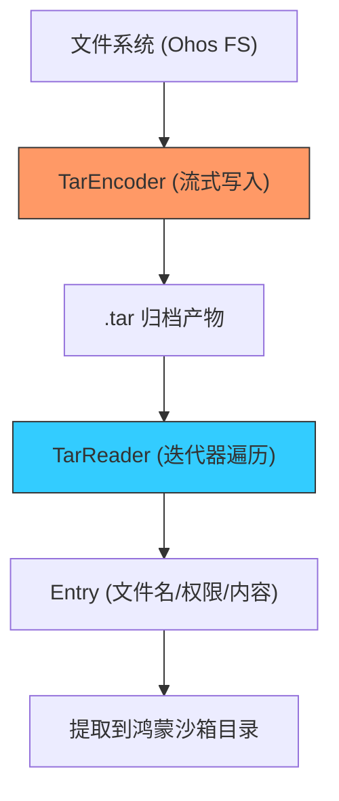

欢迎加入开源鸿蒙跨平台社区：[https://openharmonycrossplatform.csdn.net](https://openharmonycrossplatform.csdn.net)


# Flutter for OpenHarmony: Flutter 三方库 tar 在鸿蒙应用中实现高效文件存档与流式打包（资源分发利器）

## 前言

在 OpenHarmony 系统中，文件归档是一个核心需求。例如：
1. **备份数据**：将用户的聊天记录、配置和本地图片打包成一个文件导出。
2. **下载包解压**：鸿蒙应用的 HAP 包内可能包含 TAR 格式的离线资源包。
3. **日志收集**：将多份离线日志合并后上传。

虽然可以使用 Zip，但 TAR 由于其格式简单、解析效率高且广泛兼容各种 Unix-like 环境，仍然是许多系统级功能的首选。**`tar`** 软件包提供了一套极其现代、基于 Dart 流（Stream）的 TAR 编码与解析方案，是鸿蒙应用进行“轻量级打包”的最佳选择。

---

## 一、流式存取架构模型

`tar` 库的强大之处在于它支持对超大存档进行“只读/只写”的流式处理，无需加载整个文件到内存。



---

## 二、核心 API 实战

### 2.1 解压并遍历 TAR 存档

```dart
import 'dart:io';
import 'package:tar/tar.dart';

void extractTar(Stream<List<int>> input) async {
  final reader = TarReader(input);

  while (await reader.moveNext()) {
    final entry = reader.current;
    print('📦 发现鸿蒙资源项: ${entry.name}');
    
    // 💡 获取内容 (也是一个 Stream)
    final contents = await entry.contents.fold<List<int>>([], (p, e) => p..addAll(e));
    print('大小: ${contents.length} 字节');
  }
}
```

### 2.2 创建并生成 TAR 存档

```dart
void createArchive() async {
  final output = File('backup.tar').openWrite();
  
  // 💡 将多个输入源编码为 TAR 流
  final tarEncoder = tarWritingSink(output);

  tarEncoder.add(TarEntry.data(
    TarHeader(name: 'ohos_settings.json', mode: 420), // 420 = 0644 权限
    '{"theme": "dark"}'.codeUnits,
  ));

  await tarEncoder.close();
}
```

---

## 三、常见应用场景

### 3.1 鸿蒙离线换肤包
将全套的页面主题、各种分辨率的背景图和字体文件打包为一个 `.tar`。鸿蒙应用在启动时，流式读取该包并动态解压到私有沙箱目录，实现极速的热换肤功能。

### 3.2 鸿蒙项目本地数据导出的“黑盒”
当鸿蒙应用发生故障时，将近期的本地 SQLite 数据库、近期崩溃日志和系统截屏一键“打包归档”，方便用户导出给技术支持人员进行离线分析。

---

## 四、OpenHarmony 平台适配

### 4.1 适配鸿蒙的文件权限标准
💡 **技巧**：TAR 格式内置了对 Unix 权限（如 755, 644）的支持。在鸿蒙设备上进行文件打包时，记得通过 `TarHeader` 保留原始的权限信息。这样，如果该 TAR 包被导出到其他鸿蒙系统环境解压，能完整还原文件的可执行权限，避免因权限丢失导致的插件加载失败。

### 4.2 性能与管道式处理建议
鸿蒙系统对 CPU 密集型任务有精细的调度。通过 `tar` 库的流式接口，你可以直接将 `HttpClient` 下载流对接到 `TarReader`，实现“边下边解”，无需临时存储完整的 `.tar` 文件。这对于存储空间有限的鸿蒙平板或物联网终端来说，不仅提升了响应速度，还极大地保护了闪存寿命。

---

## 五、完整实战示例：鸿蒙工程资源批量归档器

本示例演示如何将一个目录下的所有配置文件打包成 TAR。

```dart
import 'dart:io';
import 'package:tar/tar.dart';

class OhosArchiver {
  /// 💡 将鸿蒙应用沙箱中的 Config 目录打包为归档
  Future<void> packConfigs(String sourceDir, String outputPath) async {
    print('🚀 启动鸿蒙归档引擎，正在扫描 $sourceDir...');
    
    final output = File(outputPath).openWrite();
    final sink = tarWritingSink(output);

    final dir = Directory(sourceDir);
    await for (final file in dir.list(recursive: true)) {
      if (file is File) {
        final relativePath = file.path.replaceFirst(sourceDir, '');
        print('➕ 添加资源路径: $relativePath');
        
        final data = await file.readAsBytes();
        sink.add(TarEntry.data(
          TarHeader(name: relativePath, mode: 384), // 384 = 0600 私有可见
          data,
        ));
      }
    }

    await sink.close();
    print('✅ 鸿蒙归档产物已生成: $outputPath');
  }
}

void main() async {
  final archiver = OhosArchiver();
  // 模拟调用
  // await archiver.packConfigs('/data/storage/el2/base/config', 'ohos_backup.tar');
}
```

<!-- IMAGE_PLACEHOLDER: 鸿蒙文件管理器中展示 TAR 归档文件被快速解压并完整保留层级结构的截图 -->

---

## 六、总结

`tar` 软件包是 OpenHarmony 开发者打理文件系统的“打包大师”。它摒弃了复杂的 C 库依赖，以纯 Dart 实现了一套工业级的存档方案。在构建需要频繁文件交换、资源封装或系统快照的鸿蒙原生应用时，这种轻量级、流式、符合标准的归档工具，是你系统架构底层的稳健基石。
