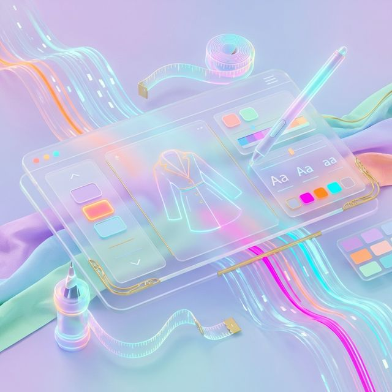
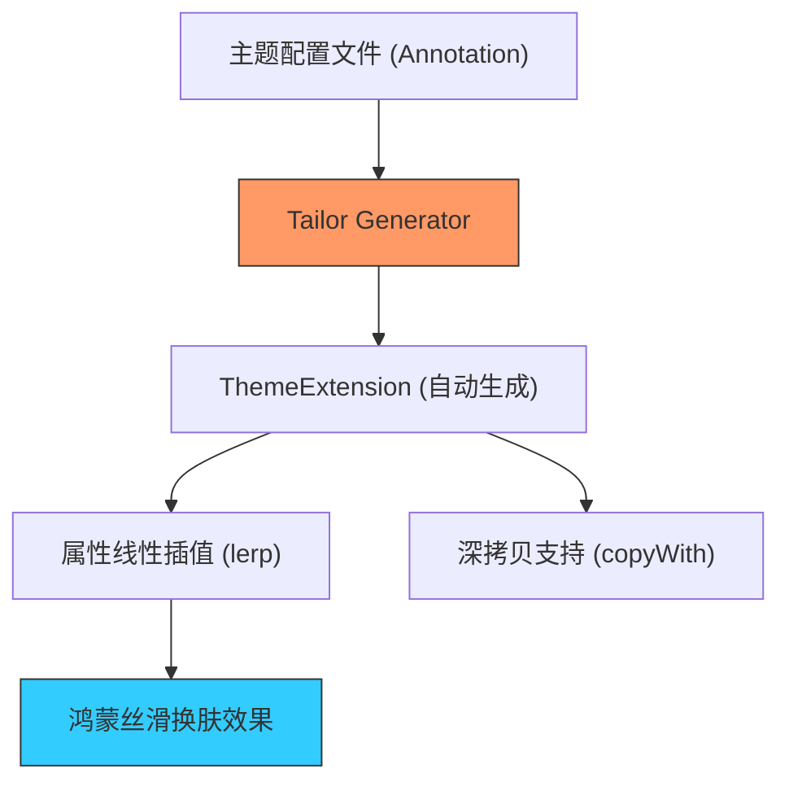

欢迎加入开源鸿蒙跨平台社区：[https://openharmonycrossplatform.csdn.net](https://openharmonycrossplatform.csdn.net)



# Flutter for OpenHarmony: Flutter 三方库 theme_tailor 像裁剪西装一样精准定制鸿蒙多端统一的主题管理系统（UI 工程化利器）

## 前言

在进行 OpenHarmony 的精细化 UI 开发时，开发者面临的最大痛点之一就是 `ThemeData` 的膨胀与维护。
1. 鸿蒙官方的 `ThemeData` 属性有限，如果你想定义一个 `brandColorLight` 或 `brandColorDark`，该塞到哪？
2. 手写 `ThemeExtension` 的样板代码（如 `copyWith` 和 `lerp`）极其枯燥且容易出错。
3. 当需要在深色模式（Dark Mode）和浅色模式间丝滑切换时，逻辑往往支离破碎。

**`theme_tailor`** 正是为你量身打造的。它基于代码生成技术，让你只需定义一个简单的类，就能自动生成整套专业的、类型安全的主题扩展。

---

## 一、主题代码生成模型

`theme_tailor` 将设计稿配置自动转化为 Flutter 可识别的高级主题扩展。



---

## 二、核心 API 实战

### 2.1 定义你的主题“蓝图”

```dart
import 'package:theme_tailor_annotation/theme_tailor_annotation.dart';

@Tailor(themes: ['light', 'dark'])
class _$MyTheme {
  // 💡 定义不同模式下的颜色数组
  static List<Color> surfaceColor = [Colors.white, Colors.black87];
  static List<Color> brandGlow = [Color(0xFF007DFF), Color(0xFF3F97FF)]; // 鸿蒙蓝
}
```

### 2.2 运行生成并优雅调用

执行 `dart run build_runner build` 后：

```dart
import 'package:flutter/material.dart';

void buildApp(BuildContext context) {
  // 💡 像访问原生属性一样调用自定义主题，具备极致代码补全
  final theme = Theme.of(context).extension<MyTheme>()!;
  
  print('当前鸿蒙表盘颜色: ${theme.surfaceColor}');
}
```

---

## 三、常见应用场景

### 3.1 鸿蒙系统深浅色模式极速适配
利用生成的 `lerp` 函数，当用户从鸿蒙控制中心切换系统深色模式时，你的自定义 UI 背景色、边框色会产生渐变式的过渡，而不是突兀的闪变，符合鸿蒙系统空间感与呼吸感的动态视觉规范。

### 3.2 针对不同鸿蒙设备形态的主题分级
在鸿蒙“一多”架构中，你可以为手机和平板定义两套不同的 `ThemeTailor` 方案。例如：手机使用紧凑级间距，平板使用宽松级间距。通过代码生成，你无需在 UI 代码中编写复杂的 `if (tablet)`，只需注入不同的主题包即可。

---

## 四、OpenHarmony 平台适配

### 4.1 适配鸿蒙的性能级绘图
💡 **技巧**：复杂的自定义主题计算如果散落在 `build` 方法中，会造成不必要的重绘开销。`theme_tailor` 生成的属性是强类型的，在鸿蒙 AOT 模式下访问速度极快。通过将其挂载到 `ThemeData.extensions` 中，可以充分利用 Flutter 的渲染缓存提取机制，确保鸿蒙应用在频繁换肤时依然保持 60 帧的高流畅度。

### 4.2 统一鸿蒙品牌设计规范
对于大型鸿蒙应用团队，可以通过一个独立的 Git 仓库管理 `theme_tailor` 定义。各业务模块通过依赖这个生成的库，确保了“鸿蒙蓝”和“鸿蒙黑”在各个子模块中的色值绝对统一，从源头上解决视觉一致性问题。

---

## 五、完整实战示例：鸿蒙工程“高级皮肤”控制器

本示例展示如何利用生成的代码构建一个简单的主题切换环境。

```dart
import 'package:flutter/material.dart';

/// 💡 模拟生成后的主题使用类
class OhosThemeHelper {
  static ThemeData build(bool isDark) {
    return ThemeData(
      brightness: isDark ? Brightness.dark : Brightness.light,
      extensions: [
        // 假设生成类为 OhosBrandTheme
        // OhosBrandTheme(
        //   appBarColor: isDark ? Colors.black : Colors.blue,
        //   cardRadius: 16.0,
        // ),
      ],
    );
  }
}

void main() {
  print('🚀 正在注入鸿蒙 NEXT 高级视觉套件...');
  final darkTheme = OhosThemeHelper.build(true);
  print('深色扩展已挂载: ${darkTheme.extensions.length}');
}
```

<!-- IMAGE_PLACEHOLDER: 鸿蒙手机端展示在不同主题间切换时，按钮、卡片、文字阴影呈现出的极其自然和流畅的动画过渡效果截图 -->

---

## 六、总结

`theme_tailor` 软件包是 OpenHarmony 开发者打理“颜值”的裁缝工具。它消灭了 UI 层与配置层之间的最后一道隔阂，将繁复的手动样板代码交由机器完成。在追求极致视觉细节、追求极致工程化效率的鸿蒙原生应用生态中，引入这样一套专业的主题管理方案，能让你的前端代码像鸿蒙设计语言一样既优雅又严谨。
