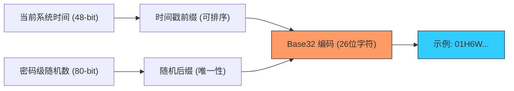

欢迎加入开源鸿蒙跨平台社区：[https://openharmonycrossplatform.csdn.net](https://openharmonycrossplatform.csdn.net)


# Flutter for OpenHarmony: Flutter 三方库 ulid 别再用杂乱的 UUID，为鸿蒙应用换上“可排序、更简洁”的唯一标识符（全局 ID 新标准）

## 前言

在进行 OpenHarmony 的分布式数据库设计、日志系统或任务追踪系统开发时，我们需要为每一条记录生成一个“全局唯一标识符”。
1. **传统 UUID 的痛点**：UUID (v4) 是完全随机的，它破坏了数据库的 B-Tree 索引顺序，导致写入性能下降；且 36 位连字符字符串在数据库中显得过于臃肿。
2. **ULID 的优势**：它兼具了 128 位的全局唯一性，同时它的前 48 位是时间戳。这意味着 ULID **天然可按时间排序**。

**`ulid`** 软件包为鸿蒙开发者提供了这种现代化的 ID 生成方案。它采用 Base32 编码（26 个字符），没有特殊符号，既美观又极具工程性能优势。

---

## 一、ID 生成算法模型

ULID 结合了秒级精确的时间序列与强随机性的后半段。



---

## 二、核心 API 实战

### 2.1 极简生成

```dart
import 'package:ulid/ulid.dart';

void generateId() {
  // 💡 生成一个全新的 ULID 字符串
  final String id = Ulid().toString();
  
  print('生成的鸿蒙分布式 ID: $id'); // 类似 01ARZ3NDEKTSV4RRFFQ6KHGGEB
}
```

### 2.2 从现有的时间戳构造

这在迁移旧数据或补录日志时非常有用。

```dart
final time = DateTime.now().millisecondsSinceEpoch;
final String historicalId = Ulid(millis: time).toString();
```

---

## 三、常见应用场景

### 3.1 鸿蒙分布式日志的“天然时间轴”
在收集多台鸿蒙终端的运行日志时，如果使用 UUID，你必须额外增加一个 `created_at` 字段来排序。改用 ULID 后，直接对 ID 进行字符串排序，即可得到按时间发生先后排列的日志流，极大地精简了鸿蒙云端后台的存储架构，提升了检索效率。

### 3.2 鸿蒙版“笔记/待办”应用的主键管理
对于离线优先（Offline-first）的鸿蒙应用，用户在本地创建的条目必须有一个唯一 ID 以便后续同步。ULID 的时间有序性确保了当本地数据插入鸿蒙 SQLite 或 Hive 数据库时，索引能够保持顺序增长，大幅降低了磁盘 I/O 开销，让鸿蒙应用在高频写入操作下依然保持冷静。

---

## 四、OpenHarmony 平台适配

### 4.1 适配鸿蒙的毫秒级精度同步
💡 **技巧**：ULID 的时间戳是 48 位毫秒级的。在鸿蒙分布式环境下，如果两台设备的时间完全同步，甚至在同一毫秒产生了 ID，ULID 规范支持通过 80 位随机位（Randomness）进行极低概率的冲突保护。在适配鸿蒙时，建议通过 `Ulid.getValues()` 校验生成的 ID 分块，确保满足鸿蒙系统对“设备+时间”唯一性的严密审计要求。

### 4.2 性能表现与字节存储优化
由于 ULID 本质上是一个 128 位的二进制对象，在鸿蒙高性能数据库（如关系型数据库）中，如果存储空间极度受限，可以通过该库提供的 `toBytes()` 方法，将 26 位的字符串转回 16 字节的 `Uint8List` 存储。这种“极致压缩”的存储方案能为那些需要存储千万级流水号的鸿蒙工业监控应用，节省出大量的闪存空间并提升查询命中率。

---

## 五、完整实战示例：鸿蒙工程“防冲突”流水号中心

本示例展示如何优雅地封装一个全局 ID 服务。

```dart
import 'package:ulid/ulid.dart';

class OhosIdService {
  /// 💡 为鸿蒙全场景业务提供唯一的、可排序的流水号
  String nextTransactionId() {
    print('💳 正在签发新的鸿蒙业务流水号 (ULID)...');
    
    final ulid = Ulid();
    
    // 逻辑演示：我们还可以提取出生成这个 ID 时的精确时间
    final timestamp = DateTime.fromMillisecondsSinceEpoch(ulid.millis);
    
    print('--- 签发存根 ---');
    print('流水句柄: $ulid');
    print('包含时间: $timestamp');
    
    return ulid.toString();
  }
}

void main() {
  final service = OhosIdService();
  service.nextTransactionId();
}
```

<!-- IMAGE_PLACEHOLDER: 通过示意图展示：UUID 无序分布导致的数据库索引页分裂裂变效果，与 ULID 顺序增长保持索引树平滑完美的对比动效图。 -->

---

## 六、总结

`ulid` 软件包是 OpenHarmony 开发者打理“数据骨架”的黄金尺码。它将看似随机的“唯一性”与极其务实的“有序性”完美结合。在构建追求极致存储效率、追求极致数据关联美感的鸿蒙原生应用生态中，放弃古老的 UUID 转向这一更现代、更智能的标识标准，是您的系统架构迈向专业化的重要一步。
