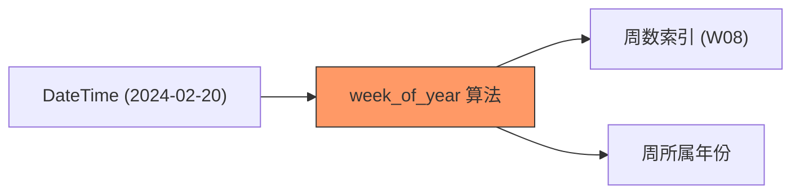

欢迎加入开源鸿蒙跨平台社区：[https://openharmonycrossplatform.csdn.net](https://openharmonycrossplatform.csdn.net)


# Flutter for OpenHarmony: Flutter 三方库 week_of_year 为鸿蒙应用提供精准的年度周数统计与业务分析支持（日历计算专家）

## 前言

在进行 OpenHarmony 的办公自动化（OA）、排班管理或财务统计应用开发时，我们经常需要处理“周”的概念。
1. **周报提交**：今天是今年的第几周？
2. **生产计划**：第 15 周需要完成哪些鸿蒙节点的部署？
3. **数据报表**：按周对鸿蒙设备的运行状态进行汇总。

虽然 Dart 的 `DateTime` 类非常强大，但它并没有原生支持“获取当前是第几周”。**`week_of_year`** 软件包通过对 `DateTime` 对象的精简扩展，让你能一行代码获取 ISO-8601 标准的周数。

---

## 一、周数计算逻辑模型

符合国际标准（ISO-8601）的周数计算，通常将包含一年中第一个周四的那一周定为第 1 周。



---

## 二、核心 API 实战

### 2.1 极简获取当前周

```dart
import 'package:week_of_year/week_of_year.dart';

void checkCurrentWeek() {
  final date = DateTime.now();

  // 💡 直接通过 extension 获取
  int week = date.weekOfYear;

  print('今天是鸿蒙历 2024 年的第 $week 周');
}
```

### 2.2 处理跨年边界周

```dart
void checkEdgeCase() {
  final yearEnd = DateTime(2023, 12, 31);
  // 💡 自动判断该日期属于去年的最后一周还是新年的第一周
  print('2023最后一天属于第: ${yearEnd.weekOfYear} 周');
}
```

---

## 三、常见应用场景

### 3.1 鸿蒙工程“双周迭代”版本控制
在团队的鸿蒙插件开发流程中，利用 `week_of_year` 自动生成当前的版本号后缀（如 `v1.2.W08`）。这种基于自然周的版本管理方式，能让所有鸿蒙架构师一眼看出代码的产出时间节点，极大方便了 Bug 的溯源。

### 3.2 鸿蒙校园 App 的教学周管理
高校的课表往往按周（如第 1 周、第 2 周）展示。通过该库获取当前系统日期对应的绝对周数，再减去开学周的偏移量，即可精确地在鸿蒙真机上为学生显示“当前是第 3 教学周”，提升用户的使用便利感。

---

## 四、OpenHarmony 平台适配

### 4.1 适配鸿蒙的本地化时间标准
💡 **技巧**：虽然该库基于 ISO-8601 标准，但部分地区的日历定义可能有所不同。在使用 `week_of_year` 进行鸿蒙出海应用开发时，建议在 UI 层增加一个“周起始日（周一或周日）”的偏好设置。该库在计算时默认遵循周一为起始的国际惯例，这符合大部分鸿蒙企业级应用的设计规范。

### 4.2 高效的异步统计报表
在鸿蒙设备上对数千张单据按周进行聚类分析时，建议在缓存层就通过 `week_of_year` 对每个 `DateTime` 字段预计算出一个整型的 `week_id`。这样在进行 SQLite 聚合查询（GROUP BY）时，可以直接对整数进行索引匹配，避免了在 SQL 查询中通过昂贵的日期函数进行计算，显著优化鸿蒙应用的报表加载性能。

---

## 五、完整实战示例：鸿蒙工程“开发节奏”统计器

本示例展示如何根据当前周期生成一个任务进度前缀。

```dart
import 'package:week_of_year/week_of_year.dart';

class OhosDevLifeCycle {
  /// 💡 生成基于周数的鸿蒙开发任务标签
  String generateTaskTag() {
    print('📅 正在审计鸿蒙系统时间中枢...');
    
    final now = DateTime.now();
    final weekNum = now.weekOfYear;
    final year = now.year;
    
    // 示例输出: OHOS-2024-W08
    return 'OHOS-$year-W${weekNum.toString().padLeft(2, '0')}';
  }
}

void main() {
  final cycle = OhosDevLifeCycle();
  print('当前开发周期: ${cycle.generateTaskTag()}');
}
```

<!-- IMAGE_PLACEHOLDER: 鸿蒙平板中展示带侧边周数索引的日程表，以及按周统计的业务走势图截图 -->

---

## 六、总结

`week_of_year` 软件包是 OpenHarmony 开发者打理“时间刻度”的得力助手。它剥离了复杂的历法算法，给开发者留下了最直观的接口。在构建追求极致标准化、追求极致任务闭环能力的鸿蒙原生应用生态中，引入这样一套专业的时间分箱机制，能让您的业务逻辑管理更加井然有序。
