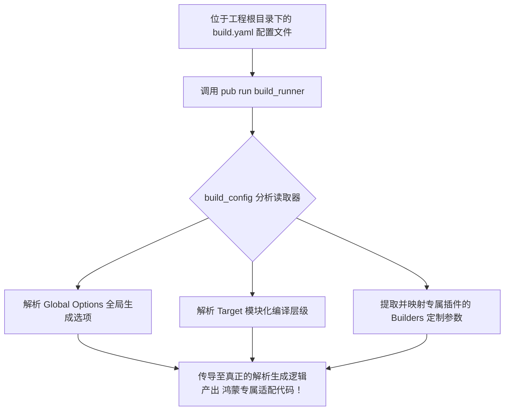

欢迎加入开源鸿蒙跨平台社区：https://openharmonycrossplatform.csdn.net
# Flutter for OpenHarmony：Flutter 三方库 build_config 解析代码生成指令基建（自定义构建蓝图配置者）
## 前言
如果您的鸿蒙（OpenHarmony）高级项目或者团队代码库使用到了极为依赖元编程宏和代码生成的工具（例如著名的 JSON 序列化器 `json_serializable`、数据库生成器 `drift` 等）。您可能需要对诸如 `build.yaml` 文件的参数进行严格管控和自定义传递。`build_config` 正是负责在宏展开期间理解和规范解析整个项目自动构筑逻辑和编译指令配置项的底座。它提供了一套模型让你程序化地接触 `build.yaml` 内容，并且可以在自动化 CI 大规模编译前实施规则拦截。
## 一、原理解析 / 概念介绍
### 1.1 基础概念
在 Flutter 生态系统中，代码生成工具底层都调用了 `build_runner` 核心库。而 `build_config` 是该工具链不可分割的重要零件。它本质上是将人类书写的 `build.yaml` 和在项目构建管道上飞驰的那一套复杂的声明式“文件扩展模式（Extensions mapping）”以及“Builder 参数”读取成为标准的 Dart 抽象语言对象。

### 1.2 进阶概念
- **目标的局部切割 (Targets)**：在巨型的多层包鸿蒙 APP 当中，常常只需为了某个模块生成特殊的代理类。你可以利用该库动态配置仅仅扫描 `lib/harmony_native/**.dart` 而非全局干预！
- **运行时环境识别**：配置中可涵盖针对移动端不同编译环境在 `release` 与 `debug` 版本中投入两套截然不同的静态宏配置参数。
## 二、核心 API / 组件详解
### 2.1 获取与读取默认配置映射实体
如果您正试图写一个您自己的基于 OpenHarmony 插件的自动生成骨架：
```dart
// 在自定义的生成构建函数配置中引入底层
import 'package:build_config/build_config.dart';
void introspectBuildYaml() async {
  // 假定通过 IO 库从当前工程路径强制载入文本
  final buildConfigContent = await fetchYamlContent();
  
  // 💡 技巧：转化为 BuildConfig 蓝图对象，一切属性唾手可得！
  final config = BuildConfig.parse('my_harmony_pkg', [], buildConfigContent);
  
  print('此项目的宏生成范围是：包含所有依赖还是单体隔离？');
  print('当前构建目标的默认集为: ${config.buildTargets.keys}');
}
```
### 2.2 构建配置定制类声明的生成
当你作为写包作者，如何确保普通鸿蒙用户引用的时传入的参数选项是正轨合法的？通过构建出 `BuilderOptions` 对象向外界获取。
```dart
import 'package:build/build.dart';
Builder myHarmonyStubBuilder(BuilderOptions options) {
   // 获取到所有用户在于其 build.yaml 中给你留下的自定义数据项
   final configData = options.config;
   
   final isEnableOhosOptimization = configData['ohos_optimization'] ?? false;
   if(isEnableOhosOptimization) {
      print('🚀 已捕捉到编译系统层要求开启该库的鸿蒙性能优化标志。');
   }
   // ...进入你的生成代码操作并返回一个 Builder 类实体
   return CustomBuilder();
}
```
## 三、场景示例
### 3.1 场景一：只针对特定子系统排除生成扫视范围
如果我们在写鸿蒙分布式设备网络联调网关代码生成时，许多普通的功能目录毫无扫描必要。我们可以强制规定 `build.yaml` 中的行为并在引擎端配合该库做出裁决：
```yaml
# 鸿蒙配置样例: build.yaml
targets:
  $default:
    builders:
      my_network_generator:
        generate_for:
          - lib/network_api/**.dart
        exclude:
          - lib/network_api/mock_test_files/**.dart # 排除那些仅在 Debug 时用的文件！
```
利用强绑定的解析规则器，`build_runner` 将利用解析出来的实体准确绕开这个路障！这能够在你部署至庞大的鸿蒙流水线环境的服务器上极大砍掉无用的硬盘分析步骤以加速 `2-4倍`。
<!-- IMAGE_PLACEHOLDER: 代码编辑器内正确高亮显示 build.yaml 配置排除过滤效果图 -->
<!-- 类型: 截图 -->
<!-- 设备: 开发者电脑上的 DevEco 或 VSCode 窗口 -->
<!-- 内容: 截出缩进精确格式标准的配置文档排版 -->
## 四、要点讲解 & OpenHarmony 平台适配挑战
### 4.1 宏编译环境下的类型断层与平台依赖
在针对 `build_config` 和周边设施搭建自己项目的 `构建脚本 (Build Script)` 时，由于这段代码其实是**在开发者的桌面环境电脑上由 Dart VM 执行，而不是在目标鸿蒙机器上**！因此千万不要在涉及该库周边的辅助文件中，引入只有包含系统组件的 `flutter` 的包甚至是包含带有 Native C 语言绑定的环境！
⚠️ **注意事项**：在编写 `build.dart` 工具代码时，引用域中应当是纯干爽的 Dart 逻辑基座。如果您误引入像 `package:flutter/material.dart` 甚至是想要做 UI 拦截的类，在开始编译大批量时马上会引起不可理喻的模型缺失层雪崩！
### 4.2 对于大型工程化团队的脚本整合策略
企业级规范：通常鸿蒙的项目可能会将网络接口定义统一抽象成独立仓库层。可以采用跨包参数覆盖（Global Options）来让底层代码知道自己处于哪一个产品版本。
```yaml
global_options:
  my_harmony_codegen:
    options:
      # 当不同外壳组装打包鸿蒙设备时注入不同参数源
      inject_target_system: "harmonyOS"
```
## 五、完整演示结构：为你的自定义解析留个门
本段是一个伪向模拟工具配置脚本的演示思路逻辑：展示如果你写了一款基于该工具的控制节点是什么样子。
```dart
import 'package:build/build.dart';
// 我们自定义编写在 tool/builder.dart 的用于编译鸿蒙中间代理产物的宏调用文件
class HarmonyDataProxyBuilder implements Builder {
  final Map<String, dynamic> advancedOptions;
  HarmonyDataProxyBuilder(BuilderOptions options)
      // 💡 通过框架将其安全转接配置项字典参数表！
      : advancedOptions = options.config; 
  @override
  Map<String, List<String>> get buildExtensions => {
        // 配置：扫描所有的原对象并且全部自动吐露一个带 `.harmony_proxy.dart` 后缀的文件！
        '.dart': ['.harmony_proxy.dart'],
      };
  @override
  Future<void> build(BuildStep buildStep) async {
    // 判定从 build.yaml 中传导过来的字段
    bool useStrict = advancedOptions['use_strict_null'] ?? true;
    
    // 正确拉取到我们要扫描的基础数据
    final inputId = buildStep.inputId;
    final contents = await buildStep.readAsString(inputId);
    
    print('📦 正在扫描文件: ${inputId.path} ..参数环境严厉模式：$useStrict');
    
    // ...通过拼接字符串的方式吐出新类
    final generatedResult = "// AUTOMATICALLY GENERATED FOR HARMONY OS \n" + 
                            "// SOURCE WAS: ${inputId.path}";
                            
    final outputId = inputId.changeExtension('.harmony_proxy.dart');
    await buildStep.writeAsString(outputId, generatedResult);
  }
}
```
<!-- IMAGE_PLACEHOLDER: 工具端使用脚本执行产出带有新后缀格式类的文件夹列表截图 -->
<!-- 类型: 截图 -->
<!-- 设备: 在左侧工程项目目录树中 -->
<!-- 内容: 展现出普通原文件旁边生成了新的代理类体系 -->
## 六、总结
虽然普通初级的 Flutter 界面应用开发者在大部分的日升日落中都不会触碰到 `build_config` 的真身。然而对于中大型团队维护鸿蒙（OpenHarmony）架构基座、抽象提取自动代理并提高系统工业化能力的基建工程师而言，此包便是犹如“编译器编译器（Compiler compiler）”一般的绝对根骨。读懂了其针对元工具的拦截手法，您离架构设计自由便更近了一步！
📦 如果你需要学习源码如何运转：[AtomGit 示例专栏](https://atomgit.com)
---
*本文基于基建探索编撰*
欢迎加入开源鸿蒙跨平台社区：[开源鸿蒙跨平台开发者社区](https://openharmonycrossplatform.csdn.net)
