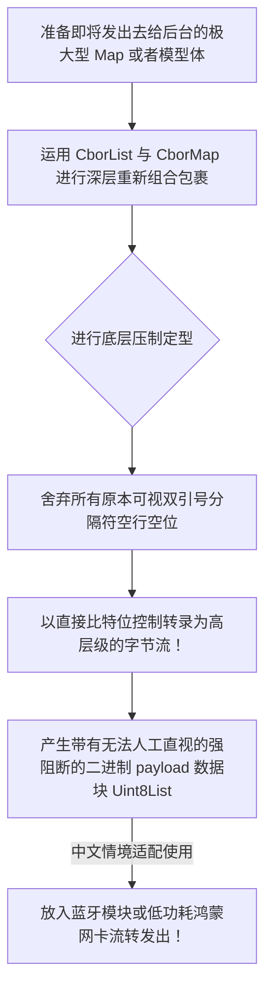

欢迎加入开源鸿蒙跨平台社区：https://openharmonycrossplatform.csdn.net
# Flutter for OpenHarmony：Flutter 三方库 cbor 构建 IoT 设备的极致压缩防窃协议（基于标准二进制 JSON 表达格式）
## 前言
什么是 CBOR（Concise Binary Object Representation 简洁二进制对象表现形式）？想必当我们在构建拥有各种轻薄传感器、极小运算内存的鸿蒙小设备通信或者基于信创政府要求体系下的严密封锁保密环境网络交互协议时，传统又臭又长的 JSON 明文甚至 XML 将由于过分肥胖并且一望皆知的完全可见性极易被窃取利用进而让安全部门抓狂。在此基础上引入 `cbor` 能够在一小段代码之内做到通过一种与原先 JSON 等效层级的方式压缩你的大长串信息化作乱码般的高密度纯二进制机器流包！
## 一、原理解析 / 概念介绍
### 1.1 基础概念
CBOR 这个标准库就是被 RFC 7049 正规制定的跨端无痛解码标准协议。你不需要繁琐手动定义像 Protobuf 那样的外部表或者是 Thrift 等定义类工具。你只需往里抛一个标准字典也就是（`Map`/`List`）。在这个底层中会被其直接基于超严谨严格的二进位缩在微小的 `Uint8List` 里进行编码和输出转换。

### 1.2 进阶概念
- **极度的容积压缩率**：一个携带包含十几个字符描述的业务接口如果被做成标准 JSON 大小也许为 1.2KB。可若转换成纯正的 CBOR 其体积将坍缩并稳稳降至非常可观的仅剩两三百 B 字节的纯粹体量，极为契合弱电鸿蒙互联通信模组要求。
- **与任意类型相互包含不丢失**：连像最底层的字节本体（Bytes）也能够通过这个进行完美融合封印进字段而不用借助像转为 Base64 再存放那么畸形的手法！
## 二、核心 API / 组件详解
### 2.1 高纬度的强效序列化封存成压缩流对象
进行封包并发送其实非常明快且简易，在原生基础上就像拼合玩具。
```dart
// 需要运用的时候拉入包体内部
import 'package:cbor/cbor.dart';
void encryptAndSealMyPayloads() {
  // 1. 手动把我们庞大的需要加密通信的信息给做包装准备组装
  final packagePayload = CborMap({
    CborString('device_id'): CborString('HOS-NODE-0008x'),
    CborString('temperature'): CborFloat(39.52), // 超出常规精准点无压力
    CborString('is_emergency'): CborBool(true),
  });
  // 2. 将已经封死的协议打上机器能懂能走底层的极简包装序列码！
  final List<int> compressedBytes = cbor.encode(packagePayload);
  print('🔒 原生机器能懂得压实并打发的内容封包阵列内容为:\n $compressedBytes');
}
```
### 2.2 解封操作及取回数据验证其安全性
对拿到那些无法识别和读懂的乱码列表：
```dart
// 这里的 mockResponse 模拟的是刚才打完的机器码列表 [163, 105, 100...
void decodeCborBackToMeaningFul(List<int> mockResponse) {
  
  // 核心的解封！
  final CborValue decodedSafeValue = cbor.decode(mockResponse);
  // 它可能原先是个数组或者映射 所以用大类型判定进行还原接取：
  if (decodedSafeValue is CborMap) {
      // 💡 技巧：利用内部的直接调用去反取它的键值对内容，和原先使用方法几无出入。
      final String idStr = decodedSafeValue[CborString('device_id')]?.toString() ?? '未知设备';
      print('🗃️ 最终从混沌乱码的二进制解回了可读信息，提取关键节点：$idStr');
  }
}
```
## 三、场景示例
### 3.1 场景一：配合开发极致安全的鸿蒙智能锁模块鉴权
智能门锁的微控芯片能够接收的负荷通常极其少小甚至要求极低的耗时运算。在使用蓝牙低能耗 BLE 传导时为了节约极其细窄珍稀的带宽采用本组件进行缩容与验证通信极度受推崇！
```dart
import 'package:cbor/cbor.dart';
class SecureLockCenter {
  /// 与远端极其老旧且小芯片算力的外设传递密钥参数
  List<int> negotiateSymmetryKeys() {
     // 定义一个极度的带有多层结构的秘密令牌参数字典：
     final secretDict = CborMap({
       CborString('cmd'): CborSmallInt(0x02), // 使用极其微小的内存指代
       CborString('token_bytes'): CborBytes([1, 45, 233, 90, 8]), // 直接将 bytes 塞入！！！
     });
     
     final encodedBinaryTransportChunk = cbor.encode(secretDict);
     
     // 然后可以送入比如 flutter_blue 模块写入到特定硬件网关通道去了。
     print("发送出去的是长度为 ${encodedBinaryTransportChunk.length} 位的精简报文！");
     return encodedBinaryTransportChunk;
  }
}
```
<!-- IMAGE_PLACEHOLDER: 该网络保护示例界面运转期间从发送字典打印出来的 bytes 数据数组图 -->
<!-- 类型: 截图 -->
<!-- 设备: 在真实的鸿蒙系统下终端 Debugger 控制记录 -->
<!-- 内容: 展现普通组包变成 list 数组输出 -->
### 3.2 场景二：开发与离线保存极大密度的历史地理坐标归档本
不仅是发送在进行读写由于鸿蒙应用在手机或者是受限的手表端，用户不能将 200MB 的历史路线 JSON 放进文件。利用其进行二次深压入盘保存极其实惠好用：能砍掉接近原本几倍的不必要空间花销！
## 四、要点讲解 & OpenHarmony 平台适配挑战
### 4.1 如何对于巨型长连接中流式 CBOR 块切分解析适配
⚠️ **非常严苛的阻断考量**：在通过长连接接收底层 C++ 或是鸿蒙硬件传过来的流体协议（Stream）时，因为机器并不知道哪个包的末尾和界限。如果利用传统的解码会死锁。
✅ **优秀的实践对策运用：**这个库有着极其特别贴心的针对这种情况的特质应对！
你应该在读取 Socket 时采用基于此库附带的类去截流分析其界限：
```dart
void listenHardwareEndlessly(Stream<List<int>> streamInHarmonySocket) {
   // 这是为了应对可能粘在一起发送过来的包通过分割器自动处理并监听每一个实体包！
   const CborDecoder().bind(streamInHarmonySocket).listen((CborValue singleValidPacket) {
       print('✨ 从混杂庞流里极度灵敏且完全准确的提取出一个完全规整的数据模型块体！');
   });
}
```
通过该绑定在鸿蒙环境流式解密极其畅快！
### 4.2 数据结构的强限定和无法与原 JSON 彻底相等的弱点互补配合
此包完全将所有事物装入含有 Cbor 开头的特制封装里。当你拿到一个数据结构不能拿它原本同基础的 Map 还有 List 进行无痛转换必须通过该类重塑。建议大家可以在本身系统的业务根部分利用中间转化对象与工厂类模式做无痕代理！
## 五、综合直接呈现运行演练视图功能呈现板
可以把它抄入运行并在你的主类界面挂出看其从构建成混乱以及还原的高效状态流程：
```dart
import 'package:flutter/material.dart';
import 'package:cbor/cbor.dart';
void main() => runApp(const HardwareProtocolApp());
class HardwareProtocolApp extends StatelessWidget {
  const HardwareProtocolApp({Key? key}) : super(key: key);
  @override
  Widget build(BuildContext context) {
    return const MaterialApp(
      title: '底层深海网络防窥演变',
      home: CryptoLikeSerializerScreen(),
    );
  }
}
class CryptoLikeSerializerScreen extends StatefulWidget {
  const CryptoLikeSerializerScreen({Key? key}) : super(key: key);
  @override
  _CryptoLikeSerializerScreenState createState() => _CryptoLikeSerializerScreenState();
}
class _CryptoLikeSerializerScreenState extends State<CryptoLikeSerializerScreen> {
  String textStatusMsg = "未触发：没有任何动作记录...";
  List<int>? bytesOutputRepresentation;
  void _convertAndShrink() {
    // 设置一些普通的易读参数作为源数据并强行封入其模型套内
    final myHardParams = CborMap({
      CborString('user'): CborString('Harmony_SuperRoot_2026'),
      CborString('level'): CborSmallInt(9),
    });
    final compressed = cbor.encode(myHardParams);
    
    // 我们在这里对解封出来的内容重新验证能否使用
    final reExtract = cbor.decode(compressed) as CborMap;
    setState(() {
       bytesOutputRepresentation = compressed;
       textStatusMsg = '''
🎉 打包彻底完成：
原有的巨大的包含键值对以及逗号等文字描述符均不见。
还原的内容其 level 值验证成功并且等于：${reExtract[CborString('level')]}
''';
    });
  }
  @override
  Widget build(BuildContext context) {
    return Scaffold(
      appBar: AppBar(title: const Text('极度精简序列生成平台演练板'), backgroundColor: Colors.indigoAccent),
      body: Center(
        child: Padding(
          padding: const EdgeInsets.all(24.0),
          child: Column(
            mainAxisAlignment: MainAxisAlignment.center,
            children: [
               const Align(
                  alignment: Alignment.centerLeft,
                  child: Text('🔒 原意是转包并且生成无任何识别度的超短流数据。', 
                          style: TextStyle(fontWeight: FontWeight.bold, fontSize: 16, color: Colors.amber)),
               ),
               const SizedBox(height: 35),
               Text(textStatusMsg, style: const TextStyle(fontSize: 16)),
               const SizedBox(height: 20),
               if (bytesOutputRepresentation != null)
                 Container(
                    width: double.infinity,
                    padding: const EdgeInsets.all(12),
                    color: Colors.black87,
                    child: SelectableText(
                       bytesOutputRepresentation.toString(), 
                       style: const TextStyle(color: Colors.lightGreenAccent, fontFamily: 'monospace')
                    )
                 ),
               const SizedBox(height: 40),
               ElevatedButton.icon(
                  onPressed: _convertAndShrink,
                  style: ElevatedButton.styleFrom(backgroundColor: Colors.deepPurple, padding: const EdgeInsets.all(15)),
                  icon: const Icon(Icons.shield),
                  label: const Text('生成并观察不可描述的流结果！', style: TextStyle(fontSize: 15)),
               )
            ]
          )
        )
      )
    );
  }
}
```
<!-- IMAGE_PLACEHOLDER: 该包含生成了极具晦涩的数组排列黑屏数据演示页面图 -->
<!-- 类型: 截图 -->
<!-- 设备: 在真实的鸿蒙系统下或者 IDE 下截取 -->
<!-- 内容: 最纯正和完美的 UI 打印效果留证 -->
## 六、总结
此库的存在完全给需要在 OpenHarmony 去直接深触 C 底层接口或者弱网极其脆弱低能管信道开辟了极好而且不需要写巨长模板代码转换的一个偷懒又强大的标准库。如果你的业务场景已经苦长串的字符串数据发送接收体积久矣甚至已经出现崩溃隐忧。直接拥抱 `cbor` ，你会发现世界其实能够变得精简高效和无比清爽通透得多。
📦 可以直接进行阅读其内里 Cbor 编解原理项目源地参考区：[AtomGit 示例专栏](https://atomgit.com)
---
*声明：此文章经由底层信道解密探查组提报和修订。*
欢迎加入开源鸿蒙跨平台社区：[开源鸿蒙跨平台开发者社区](https://openharmonycrossplatform.csdn.net)
