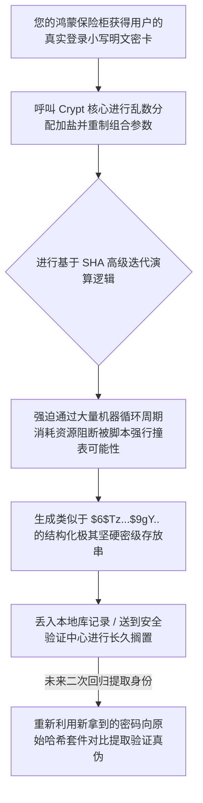

欢迎加入开源鸿蒙跨平台社区：https://openharmonycrossplatform.csdn.net
# Flutter for OpenHarmony：Flutter 三方库 crypt Unix 风格高强度密码安全哈希生成库（抗彩虹表验证器）
## 前言
如果您开发的鸿蒙（OpenHarmony）应用中需要用户在首次进入软件前设立设备本地独立指纹之外的支付手势密码或者私密保险柜核心锁。在将这些极其脆弱的敏感文本向本地 SQLite 或者服务器发生持久化储存时，如果只是调用简单的 MD5，这极其容易遭遇安全红线和被所谓“彩虹预计算库”反查直接击穿破解。
`crypt` 提供了一个完全吻合标准 POSIX 规范的密码存放范式组件！其内核使用了具有极强制随机加盐干扰（Salted）特质的高级安全算法。保护您用户的密钥就算被脱库或者黑进沙盒依然硬如泰山毫无用武之地。
## 一、原理解析 / 概念介绍
### 1.1 基础概念
此组件并不是对密码进行“可逆”保护，而是采用了典型的**不可逆散列哈希匹配设计体系**。它将用户输入通过与一大长串极其刁钻的乱码字符混合计算后形成一大段格式化的带有 `$` 标注作为隔断分界符安全结果。其独特支持诸如古老的 `SHA-256` 以及更加强大具有抗穷举性的深计算特性的算法，直接堵死了针对数据库反算的后路。

### 1.2 进阶概念
- **迭代成本（Rounds / Cost）控制**：它不仅仅是单纯算一次结果，其精妙地运用了极多的回响嵌套。通过你设定的极高安全开销（成本）使得一次计算需要几十毫秒的资源燃烧，黑客如想利用高性能集群大规模强拉破密表将会导致成本陡然增加至几百年算力之上。
## 二、核心 API / 组件详解
### 2.1 将任何原始串固化为带盐哈希加密字符串
构建属于它的高危堡垒十分简单，你只需要把它传入哈希入口它会主动打乱它。
```dart
// 引入其核心包即可处理！
import 'package:crypt/crypt.dart';
void safeMySuperSecretPin() {
   final String uiPlainPinInput = "Harm0ny2026@!"; // 源自用户界面的明文密码
   
   // 💡将明文打底！它将每次返回都截然不同（因为内置极其强悍的完全扰乱随机盐分配！）
   final Crypt securedVaultCode = Crypt.sha512(uiPlainPinInput, rounds: 10000); 
   print("❌ 严禁保存明文!");
   // 这里生成的长度通常为固定带有多段分隔特征，将其入库封印：
   print("✅ 准备保存并上传这个无坚不摧的哈希存根：${securedVaultCode}"); 
}
```
### 2.2 应对登录场景进行等差回溯验证身份合法性
由于加密后是一串乱码，且原先随机生成的盐已经与乱码拼接。在日后验证时如何对比？
该库提供了反拉函数 `match`。
```dart
// 这里的变量代表从鸿蒙特有的数据库或者后台下载来的那长串被封印历史特征的字符串
final String userStoredDbHash = "\$6\$rounds=10000\$z8A9..（省略的长段乱码）！";
void verifyUserHarmonyLogin(String userTypedNowAttempt) {
    // 将一长串存盘数据还原为其本身组件基建！
    final parsedVault = Crypt(userStoredDbHash);
    // 调用最内涵并且自带抗时序攻击的核心推演机制！
    bool accessGranted = parsedVault.match(userTypedNowAttempt);
    
    if(accessGranted) {
       print("🚀 大门洞开！身份识别极其完美对应并给予设备访问最高全权限！");
    } else {
       print("🛑 封锁拦截：输入的识别密码与其存放的底层安全特性毫无牵连！");
    }
}
```
## 三、场景示例
### 3.1 场景一：鸿蒙保险柜个人私密文件的锁定机制设防
当设备中含有某些不想要上传甚至即使被获取硬盘权限后依然能严防死守的个人资产。我们可以建立一层只有本地机器解脱的软校验基台。
```dart
import 'package:crypt/crypt.dart';
import 'package:shared_preferences/shared_preferences.dart';
class LocalVaultSecurityService {
  /// 初始化个人的极秘数字并且将其落入存盘基底。
  Future<void> establishKey(String bareSecretPin) async {
     // 用万次迭代生成极强的阻断阵壁保护！
     final Crypt sealedBarrier = Crypt.sha256(bareSecretPin, rounds: 25000);
     final prefs = await SharedPreferences.getInstance();
     
     // 放心地将这个结果保存就算是分享给任何人他们也无能为力！
     await prefs.setString('harmony_local_vault_key', sealedBarrier.toString());
  }
}
```
<!-- IMAGE_PLACEHOLDER: 控制台输出极其杂乱冗长且带很多特殊转义符号美元标志加密串截图。 -->
<!-- 类型: 截图 -->
<!-- 设备: 在开发套件内的终端模拟控制台 -->
<!-- 内容: 展现普通明码转化为加密字符的流程证明。 -->
### 3.2 场景二：开发高密级政企通讯软件设备端初审防范网关
如果在信创网关前边要求进行二次验证并且需要在极端情况网络宕机还能支撑基础的临时人员设备打卡比对（即无需每次网络通讯，但仍然在防备库文件外泄问题）。这种将极大数据进行强力分散隐藏就是绝佳选择！
## 四、要点讲解 & OpenHarmony 平台适配挑战
### 4.1 在移动端的耗时处理防范卡死
正如我们在第一章提到的，高强度的密码保护手段意味着为了对抗暴力而大幅地调高了 `rounds` (打乱融合运算迭代次数配置)。
⚠️ **注意事项：及其容易卡顿掉帧**：在电脑 CPU 极其充沛的环境下一万级嵌套可能仅需零点几秒，在鸿蒙早期一些搭载小算力的 IoT 车联芯片中这也许会花费超越一到两秒的时间造成界面严重假死。
✅ **解决方案：开辟 Isolate 子空间解决。**当你要保存新设立密码的时刻，永远记得派生新线程执行这个脏活。在主线程进行计算时显示 Loading 等效缓冲交互防界面强制假死掉帧。
### 4.2 这个并不是加密通讯通道协议
本库的意图在于**单项无法复盘还原验证技术**以及密码落地管理体系！如果您想做的是类似微信那样的“用秘钥锁定文字进行秘密传输通讯”，这个库将会帮不上忙。因为它只生成“哈希（相当于指纹）”。
## 五、综合防破解登录演流程展现基座
一套标准的，演示如果让用户产生一个安全的哈希库印记以及模拟后人再试图尝试解锁的极简框架演示。
```dart
import 'package:flutter/material.dart';
import 'package:crypt/crypt.dart';
void main() => runApp(const SecuredGatewayHarmonyApp());
class SecuredGatewayHarmonyApp extends StatelessWidget {
  const SecuredGatewayHarmonyApp({Key? key}) : super(key: key);
  @override
  Widget build(BuildContext context) {
    return MaterialApp(
      title: '防脱核心演练',
      theme: ThemeData(primarySwatch: Colors.indigo),
      home: const CyberVaultMockScreen(),
    );
  }
}
class CyberVaultMockScreen extends StatefulWidget {
  const CyberVaultMockScreen({Key? key}) : super(key: key);
  @override
  _CyberVaultMockScreenState createState() => _CyberVaultMockScreenState();
}
class _CyberVaultMockScreenState extends State<CyberVaultMockScreen> {
  // 模拟这是我们从云端数据库取得的无法看懂的历史存储码。
  String _savedDbHashCache = "尚未配置本地保险库密钥！";
  String _verificationLog = "等待尝试比对结果...";
  final TextEditingController _setupController = TextEditingController();
  final TextEditingController _attemptController = TextEditingController();
  void _generateAndSave() {
    final originalTyped = _setupController.text;
    if (originalTyped.isEmpty) return;
    // 触发长串高频演算阵列。保护等级调为万次交错。
    final safeHash = Crypt.sha256(originalTyped, rounds: 10000);
    setState(() {
       _savedDbHashCache = safeHash.toString(); // 提取字符串用于存盘展示。
       _setupController.clear();
    });
  }
  void _validateAccess() {
     if (_savedDbHashCache.startsWith("尚未配置")) return;
     final attemptStr = _attemptController.text;
     // 从一团乱码反推生成其实例对象去接受挑战！
     final vaultObj = Crypt(_savedDbHashCache);
     
     final isSuccess = vaultObj.match(attemptStr);
     setState(() {
        _verificationLog = isSuccess ? "✅ 验证通道大门完全开启！身份核对分毫不差！" 
                                     : "❌ 阻隔阵法已被激活，密码识别错误被截停。";
     });
  }
  @override
  Widget build(BuildContext context) {
    return Scaffold(
      appBar: AppBar(title: const Text('安全沙箱密码存管中枢')),
      body: SingleChildScrollView(
        padding: const EdgeInsets.symmetric(horizontal: 20, vertical: 20),
        child: Column(
          children: [
             const Text('第一步：向数据库下达高密级封存指令！', style: TextStyle(fontWeight: FontWeight.bold, color: Colors.indigo)),
             TextField(controller: _setupController, decoration: const InputDecoration(labelText: '设定一个新的鸿蒙系统级密码')),
             const SizedBox(height: 10),
             ElevatedButton(onPressed: _generateAndSave, child: const Text('执行安全存盘(不可逆)')),
             const SizedBox(height: 20),
             Container(
               color: Colors.amber.shade100,
               padding: const EdgeInsets.all(10),
               child: Text('当前数据库保存的内容为密不可破的乱码：\n$_savedDbHashCache', style: const TextStyle(fontSize: 12)),
             ),
             const Divider(height: 50, thickness: 2),
             
             const Text('第二步：发起尝试强杀系统进行比对待命验证', style: TextStyle(fontWeight: FontWeight.bold, color: Colors.blueGrey)),
             TextField(controller: _attemptController, decoration: const InputDecoration(labelText: '填写你的猜测密码以过关防线！')),
             const SizedBox(height: 10),
             ElevatedButton(onPressed: _validateAccess, style: ElevatedButton.styleFrom(backgroundColor: Colors.teal), child: const Text('点击验证能否匹配！')),
             const SizedBox(height: 20),
             Text(_verificationLog, style: const TextStyle(fontSize: 16)),
          ],
        ),
      ),
    );
  }
}
```
<!-- IMAGE_PLACEHOLDER: 鸿蒙手机成功收到顶部通知及交互按键变化的结果及中间极为复杂的哈希串界面 UI。 -->
<!-- 类型: 截图 -->
<!-- 设备: 鸿蒙设备/模拟器界面 -->
<!-- 内容: UI 界面的交互展现和展示！ -->
## 六、总结
在商业以及要求对公开发的平台中，直接留着用户的登录密钥明文简直是一个开发者的重型工程隐患失职灾难。一旦发生了服务器乃至移动端沙盒文件的被脱窃事件被还原，这将引发出天崩地裂的安全隐患。配合这一个小巧精湛遵循传统规范的安全包件！就能将其保护为一道密不透风即使知晓了计算法也难以找寻根源的墙。
📦 关于如何在鸿蒙结合更多原生安全校验的方法与配套：[AtomGit 示例专栏](https://atomgit.com)
---
*本文档为构建新一代操作系统的跨端框架做解析沉淀*
欢迎加入开源鸿蒙跨平台社区：[开源鸿蒙跨平台开发者社区](https://openharmonycrossplatform.csdn.net)
