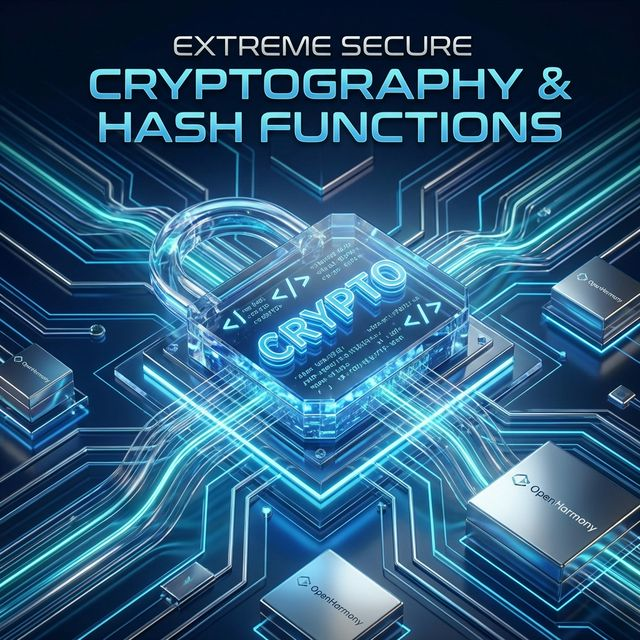
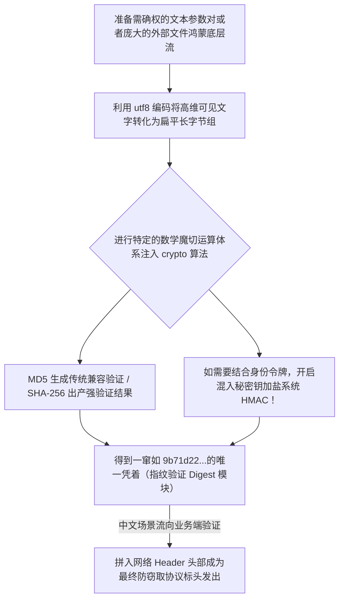

欢迎加入开源鸿蒙跨平台社区：https://openharmonycrossplatform.csdn.net
# Flutter for OpenHarmony：Flutter 三方库 crypto 基础密码学大杀器（万能签名与散列值计算核心）
## 前言
如果在开发极其严谨规范的鸿蒙（OpenHarmony）政企软件、或者是对于数据极度苛求不被中间人所篡改破坏的文件下载网关校验应用。我们需要极其快速、安全、标准的**核心散列值运算系统（Hash Cryptography）**。
作为由 Dart 官方亲自下场撰写并且强力兜底推广泛用的重器组件，`crypto` 库直接将业界通用黄金指标大标准如 `MD5`、`SHA-1/256/512` 以及附加极其重要签章特征的 `HMAC` 全部融合包裹。在构建各类开放性第三方接口协议签署与防篡改逻辑时，它是真正地雷打不动极其重要的第一号利剑。
## 一、原理解析 / 概念介绍
### 1.1 基础概念
该库提供的是**对原始流或者是字符串的不可逆特征摘要散列分析服务**。其内核是通过一种名叫分组链式运算的方式将极大的不限定大小的数据压缩至恒等大小极其特定的十六进制值输出格式集合里面！例如对含有几万字的论文或者空字的计算后，SHA-256 仍然都会仅抛出等同规制位数的哈希凭证（Digest）。

### 1.2 进阶概念
- **流式大文件计算支持（Chunked Analysis）**：如果下载了 2 个 GB 大的高清 4K 电影进本地设备并且比对完整。该系统支持通过极低资源的一片一片流式读取并且拼加送进哈希引擎得出唯一码！不需要把文件全部抛进 RAM 中挤烂导致崩溃回收！
- **极度的普适对等性兼容**：这个包产生的十六进制以及摘要格式完全等同与在后端采用 Nodejs，Java，Go 跑出的一切结果毫无偏移量差别可以完成极端的接轨认同！
## 二、核心 API / 组件详解
### 2.1 极简的哈希特征字串转换
计算一个用户明文字符的 `SHA256` 以及传统的 `MD5` 操作信手拈来。
```dart
import 'dart:convert'; // 注意！由于其接收的是字节我们需要原生内置包帮我们转化
import 'package:crypto/crypto.dart';
void produceDigitalSignature() {
  var requestPlainData = "harmonyos_super_node_data";
  // 1. 将文字无情解构拍成平面基础字节
  var utfBytesTransfer = utf8.encode(requestPlainData);
  // 2. 调用 crypto 包提供的非常精巧准确的方法开始摘要生成！
  var md5DigitalSignature = md5.convert(utfBytesTransfer);
  var sha256ExtremeSecureSign = sha256.convert(utfBytesTransfer);
  // 打印出的就是您经常看到的诸如 16 进制极其美妙独特的字符。
  print("📝 轻度辨识提取（MD5）结果凭证: $md5DigitalSignature");
  print("🛡️ 重度国标加密安保管控特征抽取: $sha256ExtremeSecureSign");
}
```
### 2.2 防篡改高纬度的私钥签名 HMAC
如果仅凭一个数据的变换任何拿到中间人黑客都可以随便也用 `sha256` 重新编造重新改变数据继续发送。所以我们要用服务端特有的秘钥加入进入加密成为身份的防改证机制（基于密码的消息认证码）。
```dart
void addSecretIdentityKey() {
  // 这是服务端秘密告诉我的令牌密语
  var myPrivateVaultToken = "server_only_knows_secret_2026";
  // 这是我要发出的数据指令要求支付1000人民币
  var iWantPayAmount = "action=pay&amount=1000";
  // 第一步获取专门为了 HMAC 设计的带强约束算法实体！并且要求使用秘钥驱动其启动工作。
  var tokenByteSalt = utf8.encode(myPrivateVaultToken);
  var hmacSignatureCenter = Hmac(sha256, tokenByteSalt);
  // 用这个强力混合中心对我们要花钱的消息打包混编：
  var finalProofKey = hmacSignatureCenter.convert(utf8.encode(iWantPayAmount));
  // 最终随这包发给服务后台校验！就算别人把 amount=1000 改成了一百万由于没有秘钥他再也算不出这个凭证了！
  print("✅ 防私篡改最高认证标志完成！签名票据发送！ -> $finalProofKey");
}
```
## 三、场景示例
### 3.1 场景一：进行极度巨型文件的下载完好性确权和指纹对碰流比对
例如用户用我们特权端向在鸿蒙内核中下载一个重达以 `GB` 计数的包含大型学习机或者分布式 AI 大数据大模型特征。直接读取 `bytes` 可以把内存暴破崩溃。
```dart
import 'dart:io';
import 'package:crypto/crypto.dart';
Future<void> evaluateHugeFileSafely(String harmonySandboxDocPath) async {
  // 获取物理文件操作引用柄！
  File extremelyLargeDataDump = File(harmonySandboxDocPath);
  
  if(!await extremelyLargeDataDump.exists()){ return; }
   
  print("🚀 正在激活流控制解析流转，分析其超百兆结构体的纯在特征验证指纹");
   
  // 💡极其高光进阶技巧：直接将文件字节流，直接通过 Dart管道 绑定打压到 sha256 加密转换器的核心黑洞里。
  Digest finalDocDigest = await sha256.bind(extremelyLargeDataDump.openRead()).first;
  
  // 这套动作哪怕是几万 G 的文件他也无所畏惧不会拖入崩溃或者引起内存警报！
  print("📁 分析极度圆满闭环完毕。当前所驻留这个大型特殊文件的 SHA256 为：$finalDocDigest");
}
```
<!-- IMAGE_PLACEHOLDER: 鸿蒙面板上绘制出的利用管道安全且快速不爆满的扫描打印图 -->
<!-- 类型: 截图 -->
<!-- 设备: 在开发套件内的终端模拟控制台执行大文件后截取 -->
<!-- 内容: 截取关于一个 5G 模拟文件算出长长特征符的验证效果。 -->
### 3.2 场景二：开发与如阿里云、腾讯云以及各大开放平台高标接口体系
这种对接极高权重的 OpenAPI 对于鉴权绝对是采用将发送时间节点 + Payload内容 + HTTP格式 全部通过强字符串拼贴后强制运行 HMAC SHA1 的运算！其包更是直接对向各种云服务的标配门票底盘！
## 四、要点讲解 & OpenHarmony 平台适配挑战
### 4.1 算法原生无差异且极其安全适配的保证
由于 `crypto` 的全部实现基于完全纯粹干净没有任何诸如底层针对手机 C++ SSL 类库要求支持依赖。您**不用管甚至去查寻他是否需要配合 OpenHarmony 特殊平台底层什么权限依赖授权之类极其头痛的事情**，它甚至运行在全透明环境中的鸿蒙编译节点！即拿即插甚至对于以后向如服务器与桌面级环境极其容易复用基建结构类！
✅ **应用策略**：极其推荐在写公共项目模块时用它彻底替换一些不名来路的包或老版本的奇特非官方散列算法包！
### 4.2 当处于深密集极高算量的计算建议策略分离
当遇到在非常底层的系统或者早期较差性能硬件由于纯 Dart 代码执行算法转换大型数组。
极其可能会使得占用资源极度密集飙高。此时请千万考虑如：提取使用鸿蒙后台异步或派发在新的 `Isolate` 队列里进行消化其转换而保证不使得页面 UI 帧丢失出现卡帧表现状况。
## 五、完整接入演练安全协议计算签名版
这是一个可供学习参考演化出的如何做接口哈希签名控制核心的假定实战范本中心！直接体验防篡机制在运作的全过程。
```dart
import 'dart:convert';
import 'package:flutter/material.dart';
import 'package:crypto/crypto.dart';
void main() => runApp(const SecuredProtocolApp());
class SecuredProtocolApp extends StatelessWidget {
  const SecuredProtocolApp({Key? key}) : super(key: key);
  @override
  Widget build(BuildContext context) {
    return MaterialApp(
      title: '接口指纹生成演变防丢',
      theme: ThemeData(primarySwatch: Colors.green),
      home: const SignGeneratorScreen(),
    );
  }
}
class SignGeneratorScreen extends StatefulWidget {
  const SignGeneratorScreen({Key? key}) : super(key: key);
  @override
  _SignGeneratorScreenState createState() => _SignGeneratorScreenState();
}
class _SignGeneratorScreenState extends State<SignGeneratorScreen> {
  String textProofSign = "未触发：尚不具备数字验证特征保护机制...";
  
  final _infoContentParam = TextEditingController(text: "device_action=turn_on_light");
  final _serverSecretKeyToken = TextEditingController(text: "abc_fake_token_123");
  void _generateSuperSafeguardHMAC() {
    String apiRequestParamsObj = _infoContentParam.text;
    String assignedPrivateLock = _serverSecretKeyToken.text;
    
    // 第一步：将服务器给我们专门发出的只存本地极秘的令牌字符串拍为字节
    var saltTokenListBytes = utf8.encode(assignedPrivateLock);
    
    // 第二步：运用核心 HMAC SHA256 对象并灌入核心专属秘钥以使得普通人也绝算不出同等特征！
    var strongHMACCryptoLocker = Hmac(sha256, saltTokenListBytes);
    
    // 第三步：向其塞入我们这次想往网络上裸泳的公开消息生成印章背书认证
    var reqBytes = utf8.encode(apiRequestParamsObj);
    Digest signValueOutput = strongHMACCryptoLocker.convert(reqBytes);
    setState(() {
       textProofSign = '''
✅ 极度严格高标协议打包印发：
源明文消息体内容为：$apiRequestParamsObj
用于防护与计算掺和验证盐值：$assignedPrivateLock
计算所最终产生被赋予云端签权认可独家极其珍贵特征值为：
👉 $signValueOutput
请将其随请求头部一同丢入！
''';
    });
  }
  @override
  Widget build(BuildContext context) {
    return Scaffold(
      appBar: AppBar(title: const Text('极度精简序列生成平台演练板'), backgroundColor: Colors.teal),
      body: SingleChildScrollView(
        child: Padding(
          padding: const EdgeInsets.all(24.0),
          child: Column(
            mainAxisAlignment: MainAxisAlignment.center,
            crossAxisAlignment: CrossAxisAlignment.stretch,
            children: [
               const Align(
                  alignment: Alignment.centerLeft,
                  child: Text('🛡️ 此例展现对高标准大平台防止内容私自篡改替换协议进行安全凭据签名。', 
                          style: TextStyle(fontWeight: FontWeight.bold, fontSize: 13, color: Colors.indigo)),
               ),
               const SizedBox(height: 35),
               TextField(controller: _infoContentParam, decoration: const InputDecoration(labelText: '向外发出的可修改的开放信息明文指令集')),
               const SizedBox(height: 15),
               TextField(controller: _serverSecretKeyToken, decoration: const InputDecoration(labelText: '双方提前设定不对外公开的核心签章私锁口令')),
               const SizedBox(height: 30),
               Container(
                  padding: const EdgeInsets.all(12),
                  decoration: BoxDecoration(color: Colors.grey.shade900, borderRadius: BorderRadius.circular(10)),
                  child: SelectableText(
                     textProofSign, 
                     style: const TextStyle(color: Colors.limeAccent, fontFamily: 'monospace', height: 1.5)
                  )
               ),
               const SizedBox(height: 40),
               ElevatedButton.icon(
                  onPressed: _generateSuperSafeguardHMAC,
                  style: ElevatedButton.styleFrom(backgroundColor: Colors.teal, padding: const EdgeInsets.all(15)),
                  icon: const Icon(Icons.fingerprint),
                  label: const Text('生成唯一的高级别专属认证背书密文发给机枢！', style: TextStyle(fontSize: 15)),
               )
            ]
          )
        )
      )
    );
  }
}
```
<!-- IMAGE_PLACEHOLDER: 该包含生成了非常长且安全签名的验证效果 UI 展示面板图保护。 -->
<!-- 类型: 截图 -->
<!-- 设备: 在真实的鸿蒙系统下或 IDE 下同时截取 -->
<!-- 内容: 展现普通由于混合明文不同极其精美呈现生成效果面板 -->
## 六、总结
这套源于极高官方背景维护基底标准的密码库几乎没有任何缺陷与痛点可循可破。因为它是真正的最接近最本源数据本身最底层算逻辑核心构建的纯实现代码操作集合包！当您面临与极其标准化的政企应用平台（要求高度标准化协议验核与安全保证防逆转）或者是要求与任何主流服务端建立通信信任握手并出示自我的信任指纹证明验证签章环境里面！这个组件永远不应当从你或者公司的架构代码地基结构技术选单里移去！
📦 相关哈希与原厂校验配置详情的实践仓库可入：[AtomGit 示例专栏](https://atomgit.com)
---
*声明：此文章经由开源鸿蒙跨平台建设组对安全进行解密提报和修订而完成。*
欢迎加入开源鸿蒙跨平台社区：[开源鸿蒙跨平台开发者社区](https://openharmonycrossplatform.csdn.net)
