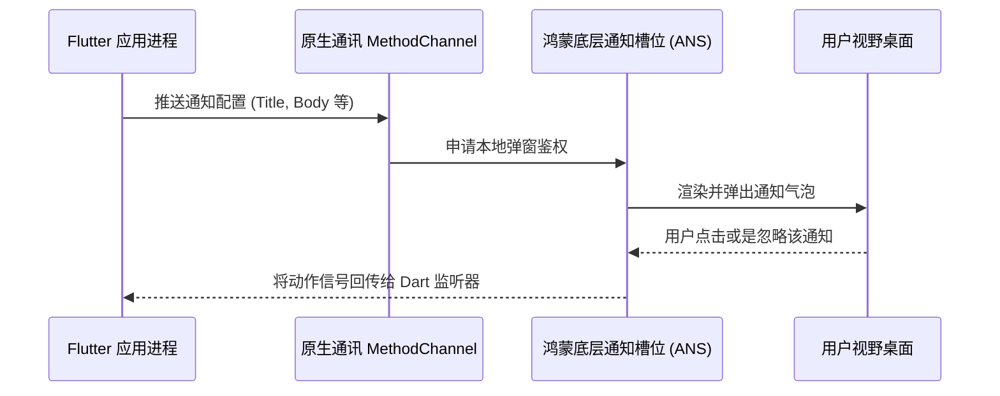

欢迎加入开源鸿蒙跨平台社区：[开源鸿蒙跨平台开发者社区](https://openharmonycrossplatform.csdn.net)

# Flutter for OpenHarmony：Flutter 三方库 desktop_notifications 桌面系统级通知框架

## 前言

系统级通知（Notification）是提升跨端应用用户留存率的关键。随着 OpenHarmony 在 PC 和平板端的发展，仅依靠 App 内的悬浮窗已无法满足多模态设备的系统级通知需求。`desktop_notifications` 致力于打破应用边界，成为原生桌面级通知的桥梁。本文将演示如何用最简代码触发系统原生弹窗并处理交互回调。

## 一、原理解析 / 概念介绍

### 1.1 基础概念

`desktop_notifications` 提供了一个抽象的通知客户端层。开发者只需配置通知参数，插件会将信息分发到系统环境绑定的推送管家（类似于鸿蒙的 ANS 通知核心），最终由原生窗口系统负责气泡横幅的渲染和排版。



### 1.2 进阶概念

- **轻量化回调监听**：不仅支持单向推送，该库还提供了基于 Event Channel 的操作回显流，能够精准监听用户的“确认、拦截、忽略”等交互行为。
- **免除三方服务器**：有别于需要对接厂商后台的推送通道，本库侧重于无需联网的纯本地极速系统提醒。

## 二、核心 API / 组件详解

### 2.1 派发基础系统通知

首先实例化 `NotificationsClient`，然后借助其下发信息内容。

```dart
import 'package:desktop_notifications/desktop_notifications.dart';
// 创建系统通知分发器实例
final client = NotificationsClient();
Future<void> popSystemNotify() async {
  // ✨ 核心推送指令
  await client.notify(
    '温馨提示从鸿蒙',           // 标题
    body: '今日步数已达10000，恭喜！', // 正文信息
    appName: '鸿蒙健身',         // 被显示的 App 图标属主
    expireTimeout: const Duration(seconds: 10), // 该消息留存在桌面上 10 秒钟
  );
}
```

### 2.2 定义复杂的响应行为监听

如遇权限请求等复杂场景，开发者可为其提供多向选择的动作按钮及回执判断。

```dart
final notification = await client.notify(
  '鸿蒙权限请求安全监控',
  body: '有一个软件在试图读取系统通讯录，是否拦截？',
  actions: [
    NotificationAction('allow', '允许'),
    NotificationAction('block', '拦截并关闭') // 为通知添加不同的行动按钮
  ]
);
// 获取这条独一无二通知的交互特征
notification.actionCallback?.listen((String actionKey) {
   if (actionKey == 'block') {
       print('🛑 鸿蒙权限守卫成功，已阻止非法请求。');
   }
});
```

<!-- IMAGE_PLACEHOLDER: [包含多种行为交互按钮并带有日志输出控制台的截屏] -->
<!-- 类型: 截图 -->
<!-- 内容: 展现用户点击拦截后的控制台输出反馈流 -->

## 三、场景示例

### 3.1 场景一：后台下载任务完成主动通知

当应用实现大型文件解压或后台下载时，利用组件进行异步通知可释放用户的等待时间。

```dart
class TransferManager {
  final _client = NotificationsClient();
  /// 模拟当鸿蒙网络文件下载在后台彻底结束时
  void onDownloadComplete(String fileName) {
    // 💡 技巧：即便在前台如果能收到该提醒也非常对整体体验有好处
    _client.notify(
      '文件转存成功',
      body: '[$fileName] 已经安全保存于鸿蒙共享文档中。',
      appName: '系统核心下载器'
    ).then((notif) {
      notif.actionCallback?.listen((action) {
         if (action == 'default') { // 点击整个卡片的默认动作
            print('📁 正在跳转到对应的鸿蒙存储路径...');
         }
      });
    });
  }
}
```

### 3.2 场景二：桌面效率软件时钟播报

在开发具有番茄钟属性的效率工具时，系统横幅通知能在不中断用户全屏操作的前提下完成友好提示。

```dart
import 'dart:async';
void startPomodoro(int minutes) {
  print('🍅 鸿蒙倒数计时生效: $minutes 分钟');
  Timer(Duration(minutes: minutes), () {
     final client = NotificationsClient();
     // ❌ 反例：不要在一个很长周期的提醒中使用过短导致瞬间消失的 expireTimeout。
     client.notify(
       '专注时间结束',
       body: '您已经非常努力了，现在闭眼休息 5 分钟吧！',
       icon: 'assets/app_icon.png' // 允许传递带路径的图标（视平台支持程度定）
     );
  });
}
```

## 四、OpenHarmony 平台适配挑战与最佳实践

### 4.1 系统级通知权限约束

调用系统级弹窗面临鸿蒙核心严格的权限安全管控。
📌 **适配要求：** 务必在项目的 `module.json5` 配置内声明 `ohos.permission.NOTIFICATION_CONTROLLER`，且在初次启动时需要征求由于用户的通知许可放行，否则所有强求弹出的接口均会被默认吞没拦截。

### 4.2 渲染排版与管道释放

- **文字尺寸限制**：不同形态（手表、智屏等）设备对通知文案的截断阀值不一。请严格控制 `body` 在 30 中文字符以内以兼顾最小屏展示要求。
- **防止幽灵监听池**：在应用执行 `dispose` 时，请务必执行 `client.close()` 安全销毁分发器句柄，防止应用被杀掉后依然留存在后台占用监听资源池。

## 五、综合演示操作实验室

这是一段具备标准功能展现及动作捕捉交互的简易实验室页：

```dart
import 'package:flutter/material.dart';
import 'package:desktop_notifications/desktop_notifications.dart';
void main() => runApp(const HarmonyNotifySimulatorApp());
class HarmonyNotifySimulatorApp extends StatelessWidget {
  const HarmonyNotifySimulatorApp({Key? key}) : super(key: key);
  @override
  Widget build(BuildContext context) {
    return const MaterialApp(
      title: '通知总舵系统',
      home: ControlPanelPage(),
    );
  }
}
class ControlPanelPage extends StatefulWidget {
  const ControlPanelPage({Key? key}) : super(key: key);
  @override
  _ControlPanelPageState createState() => _ControlPanelPageState();
}
class _ControlPanelPageState extends State<ControlPanelPage> {
  final NotificationsClient _notifier = NotificationsClient();
  String _lastFeedback = "暂无可反馈的动作";
  void _pushSimpleMessage() async {
    await _notifier.notify(
      '系统维护告警',
      body: '鸿蒙资源监控探头：您的内存将在五分钟后进行深度回收，请保存草稿。',
      appName: '性能守护星',
      expireTimeout: const Duration(seconds: 4),
    );
  }
  void _pushActionableMessage() async {
     try {
       final note = await _notifier.notify(
         '来自开发团队的新任务',
         body: '有 1 个新的跨平台代码需求下放，是否立即打开看板？',
         actions: [
            NotificationAction('open', '立即开启'),
            NotificationAction('dismiss', '稍后再说')
         ]
       );
       
       // 绑定鸿蒙交互信号
       note.actionCallback?.listen((resultKey) {
          setState(() {
            _lastFeedback = (resultKey == 'open') ? '✅ 用户决意启动看板！' : '❌ 用户已将其搁置。';
          });
       });
     } catch(e) {
       print('系统可能阻止了多层级推送：$e');
     }
  }
  @override
  Widget build(BuildContext context) {
    return Scaffold(
      appBar: AppBar(title: const Text('鸿蒙通用提醒器演练')),
      body: Center(
        child: Padding(
          padding: const EdgeInsets.all(24.0),
          child: Column(
            mainAxisAlignment: MainAxisAlignment.center,
            children: [
              ElevatedButton.icon(
                icon: const Icon(Icons.flash_on),
                label: const Text('💡 发射直达提示条'),
                onPressed: _pushSimpleMessage,
                style: ElevatedButton.styleFrom(backgroundColor: Colors.teal),
              ),
              const SizedBox(height: 20),
              ElevatedButton.icon(
                icon: const Icon(Icons.feedback_outlined),
                label: const Text('🎨 发射多选项操作提醒'),
                onPressed: _pushActionableMessage,
              ),
              const SizedBox(height: 40),
              Text('交互中心系统识别: $_lastFeedback', style: const TextStyle(fontWeight: FontWeight.bold, fontSize: 16)),
            ],
          ),
        ),
      ),
    );
  }
}
```

<!-- IMAGE_PLACEHOLDER: [包含设备成功收到弹窗及点击动作记录更新的截图] -->
<!-- 类型: 截图 -->
<!-- 内容: 系统通知横幅显示与主界面文本反馈联动 -->

## 六、总结

在具有跨设备、多场景协同的 OpenHarmony 开发语境下，`desktop_notifications` 提供了一直穿透应用边界直达系统的触达手段。开发者不再需要重写各大原生底层的互操作协议，一行指令即可快速召唤原汁原味的系统通知模块，极大提升了研发效率与跨端移植表现。

📦 示例样例开源代码库指引：[AtomGit 示例专栏](https://atomgit.com)
