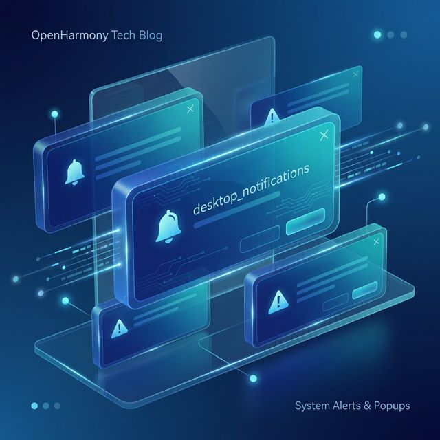
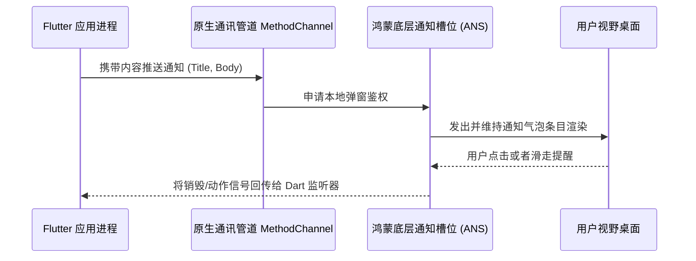

欢迎加入开源鸿蒙跨平台社区：https://openharmonycrossplatform.csdn.net
# Flutter for OpenHarmony：Flutter 三方库 desktop_notifications 桌面系统级通知框架（跨端原生提醒推送）
## 前言
系统级通知弹窗（Notification）是促进移动端及桌面端应用用户留存的关键抓手。随着 OpenHarmony 的普及以及 PC 平板端多模态环境对丰富特性的追求，如果只设计在 APP 内的悬浮窗已经远远无法满足跨设备的沉浸需求。`desktop_notifications` 致力于成为原生桌面级别环境的桥通者。通过本篇文章，你将学会如何以优雅的最简代码触发底层的系统弹框及交互回调。
## 一、原理解析 / 概念介绍
### 1.1 基础概念
`desktop_notifications` 提供了一个抽象客户端封装。您通过 API 扔出通知配置项后，核心插件负责将信息分发到 OS 当前绑定的推送及显示守护程序（类似于鸿蒙的高级通知系统能力 ANS），最终由系统的窗口管理器负责通知气泡的横幅出现、排版。

### 1.2 进阶概念
- **轻量化回调监听**：这并不是只能进行单项操作，该库提供了操作结果的事件回显流（Event Channel），能够精准判断出一条消息是自然超时消失、被拦截还是被点击确认识别。
- **免除三方服务器**：有别于需要对接厂商后台的推送通道服务，本库侧重于无需联网下的“本地”极速提醒调度。
## 二、核心 API / 组件详解
### 2.1 派发基础系统通知
首先我们需要生成 `NotificationsClient` 客户端，然后借助其发送内容。
```dart
import 'package:desktop_notifications/desktop_notifications.dart';
// 创建系统通知分发器实例
final client = NotificationsClient();
Future<void> popSystemNotify() async {
  // ✨ 核心推送指令
  await client.notify(
    '温馨提示从鸿蒙',           // 标题
    body: '今日步数已达10000，恭喜！', // 正文信息
    appName: '鸿蒙健身',         // 被显示的 App 图标属主
    expireTimeout: const Duration(seconds: 10), // 该消息留存在桌面上 10 秒钟
  );
}
```
### 2.2 定义复杂的响应行为监听
单方面发送是不够的，如果是一条确认授权提醒呢？需要提供后续判断逻辑。
```dart
final notification = await client.notify(
  '鸿蒙权限请求安全监控',
  body: '有一个软件在试图读取系统通讯录，是否拦截？',
  actions: [
    NotificationAction('allow', '允许'),
    NotificationAction('block', '拦截并关闭') // 为通知添加不同的行动按钮
  ]
);
// 获取这条独一无二通知的交互特征
notification.actionCallback?.listen((String actionKey) {
   if (actionKey == 'block') {
       print('🛑 鸿蒙权限守卫成功，已阻止非法请求。');
   }
});
```
<!-- IMAGE_PLACEHOLDER: 控制台输出带有不同按钮行为拦截结果的分析日志 -->
<!-- 类型: 截图 -->
<!-- 设备: 分屏鸿蒙设备或开发套件 -->
<!-- 内容: 控制台成功输出事件回传 -->
## 三、场景示例
### 3.1 场景一：鸿蒙多任务后台完成提醒
如果我们在实现一款压缩包管理器或者音乐应用下载大件工具。通过此组件提醒，让用户无需时刻开启软件等待结果。
```dart
class TransferManager {
  final _client = NotificationsClient();
  /// 模拟当鸿蒙网络文件下载在后台彻底结束时
  void onDownloadComplete(String fileName) {
    // 💡 技巧：即便在前台如果能收到该提醒也非常对整体体验有好处
    _client.notify(
      '文件转存成功',
      body: '[$fileName] 已经安全保存于鸿蒙共享文档中。',
      appName: '系统核心下载器'
    ).then((notif) {
      notif.actionCallback?.listen((action) {
         if (action == 'default') { // 点击整个卡片的默认动作
            print('📁 正在跳转到对应的鸿蒙存储路径...');
         }
      });
    });
  }
}
```
### 3.2 场景二：桌面日程软件的时钟唤醒播报
鸿蒙原生平板的效率软件大多附带番茄钟。在特定时刻提供不打断全屏的安静系统消息是很雅致的做法。
```dart
import 'dart:async';
void startPomodoro(int minutes) {
  print('🍅 鸿蒙倒数计时生效: $minutes 分钟');
  Timer(Duration(minutes: minutes), () {
     final client = NotificationsClient();
     // ❌ 反例：不要在一个很长周期的提醒中使用过短导致瞬间消失的 expireTimeout。
     client.notify(
       '专注时间结束',
       body: '您已经非常努力了，现在闭眼休息 5 分钟吧！',
       icon: 'assets/app_icon.png' // 允许传递带路径的图标（视平台支持程度定）
     );
  });
}
```
## 四、OpenHarmony 平台适配与最佳实践
### 4.1 权限获取与限制前提
在 OpenHarmony 进行移植的规范下，发出系统级的提醒不仅有接口，更有系统级的**权限管控**：
如果您直接盲目调用，在大部分生产鸿蒙系统设备上可能会被强硬拒绝，所以第一法则：
📌 **前提：仔细检阅工程文件权限申请**：
确保您的应用 `module.json5` 和安全证书中配置了 `ohos.permission.NOTIFICATION_CONTROLLER` 或者应用主动通过对话框征得了用户接受发送通知。
### 4.2 UI 多模态渲染适配策略
#### （1）跨端屏幕显示尺寸考量
通知的显示气泡可能是在鸿蒙手表的窄屏、也可能在 4K 宽带智屏的右下角。请尽量维持 `body` 在 30 个中文字符以内，超过可能引发平台默认机制采取的长串截断。
#### （2）生命周边循环与销毁
由于系统资源在鸿蒙中的极端珍稀限制。在程序遇到 `dispose` 生命周期要退出系统常驻时，请利用：
✅ 推荐做法：通过 `client.close()` 安全关停掉这个分发器的关联通道，杜绝发生幽灵句柄（Ghost Handlers）。
## 五、完整运行示例程序
这是一段用于演练发送常规和带有互动选项操作的标准页面范例：
```dart
import 'package:flutter/material.dart';
import 'package:desktop_notifications/desktop_notifications.dart';
void main() => runApp(const HarmonyNotifySimulatorApp());
class HarmonyNotifySimulatorApp extends StatelessWidget {
  const HarmonyNotifySimulatorApp({Key? key}) : super(key: key);
  @override
  Widget build(BuildContext context) {
    return const MaterialApp(
      title: '通知总舵系统',
      home: ControlPanelPage(),
    );
  }
}
class ControlPanelPage extends StatefulWidget {
  const ControlPanelPage({Key? key}) : super(key: key);
  @override
  _ControlPanelPageState createState() => _ControlPanelPageState();
}
class _ControlPanelPageState extends State<ControlPanelPage> {
  final NotificationsClient _notifier = NotificationsClient();
  String _lastFeedback = "暂无可反馈的动作";
  void _pushSimpleMessage() async {
    await _notifier.notify(
      '系统维护告警',
      body: '鸿蒙资源监控探头：您的内存将在五分钟后进行深度回收，请保存草稿。',
      appName: '性能守护星',
      expireTimeout: const Duration(seconds: 4),
    );
  }
  void _pushActionableMessage() async {
     try {
       final note = await _notifier.notify(
         '来自开发团队的新任务',
         body: '有 1 个新的跨平台代码需求下放，是否立即打开看板？',
         actions: [
            NotificationAction('open', '立即开启'),
            NotificationAction('dismiss', '稍后再说')
         ]
       );
       
       // 绑定鸿蒙交互信号
       note.actionCallback?.listen((resultKey) {
          setState(() {
            _lastFeedback = (resultKey == 'open') ? '✅ 用户决意启动看板！' : '❌ 用户已将其搁置。';
          });
       });
     } catch(e) {
       print('系统可能阻止了多层级推送：$e');
     }
  }
  @override
  Widget build(BuildContext context) {
    return Scaffold(
      appBar: AppBar(title: const Text('鸿蒙通用提醒器演练')),
      body: Center(
        child: Padding(
          padding: const EdgeInsets.all(24.0),
          child: Column(
            mainAxisAlignment: MainAxisAlignment.center,
            children: [
              ElevatedButton.icon(
                icon: const Icon(Icons.flash_on),
                label: const Text('💡 发射直达提示条'),
                onPressed: _pushSimpleMessage,
                style: ElevatedButton.styleFrom(backgroundColor: Colors.teal),
              ),
              const SizedBox(height: 20),
              ElevatedButton.icon(
                icon: const Icon(Icons.feedback_outlined),
                label: const Text('🎨 发射多选项操作提醒'),
                onPressed: _pushActionableMessage,
              ),
              const SizedBox(height: 40),
              Text('交互中心系统识别: $_lastFeedback', style: const TextStyle(fontWeight: FontWeight.bold, fontSize: 16)),
            ],
          ),
        ),
      ),
    );
  }
}
```
<!-- IMAGE_PLACEHOLDER: 鸿蒙手机成功收到顶部通知及交互按键变化的结果 -->
<!-- 类型: 截图 -->
<!-- 设备: 鸿蒙设备/模拟器界面 -->
<!-- 内容: 控制面板及弹出的操作系统通知横幅 -->
## 六、总结
技术永无止境！利用 `desktop_notifications` 可以在保留了平台特有风格的同时跨越多重操作系统鸿沟，不仅是在鸿蒙，乃至主流操作系统都有用武之地。
它巧妙地解决了应用切入后台休眠后依然想轻声提示用户的功能渴求。开发者可以在后续通过结合如 WebSocket 甚至是本地闹铃通道结合此 API 做一套纯离线的定时大系统。
📦 查阅读者开源代码库：[AtomGit 示例专栏](https://atomgit.com)
---
*版权提供：开源鸿蒙全栖发展小组*
欢迎加入开源鸿蒙跨平台社区：[开源鸿蒙跨平台开发者社区](https://openharmonycrossplatform.csdn.net)
