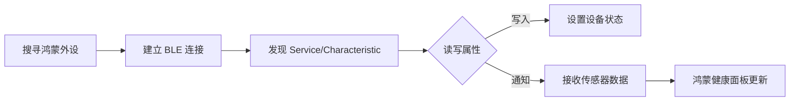

# Flutter for OpenHarmony：flutter_web_bluetooth
鸿蒙（OpenHarmony）生态拥有海量的智能外设（手环、血压计等）。`flutter_web_bluetooth` 本意是为 Web 环境设计的，但在鸿蒙的 Flutter 适配层中，也可以用来快速构建基于低功耗蓝牙 (BLE) 的跨设备通讯逻辑。
## 1. 蓝牙外设交互流

## 2. 要点讲解
- **标准遵循**：遵循 W3C Web Bluetooth 标准，接口语义清晰。
- **异步流支持**：通过 Stream 实时感知蓝牙设备的状态变更。
- **兼容性广**：对于已适配 Web 标准的鸿蒙 Flutter 分支，可以直接复用逻辑。
## 3. 场景示例：连接鸿蒙智能体脂秤
```dart
import 'package:flutter_web_bluetooth/flutter_web_bluetooth.dart';
void connectToHarmonyScale() async {
  // 1. 检查当前鸿蒙系统蓝牙是否可用
  final availability = await FlutterWebBluetooth.instance.isAvailable;
  if (!availability) return;
  // 2. 扫描并请求特定服务（例如心率计）
  final device = await FlutterWebBluetooth.instance.requestDevice(
    RequestOptionsBuilder.withFilters([
      BluetoothScanFilter(services: ['0000180d-0000-1000-8000-00805f9b34fb'])
    ]),
  );
  // 3. 建立连接并读取数据
  await device.connect();
  print('已连接到鸿蒙健康外设: ${device.name}');
}
```
## 4. 实战示例：分布式指令同步
```dart
class HarmonyBleCommander {
  void sendSyncSignal(BluetoothDevice device, List<int> data) async {
    final service = await device.getPrimaryService('...') ;
    final char = await service.getCharacteristic('...');
    
    // 写入控制命令，如开启分布式模式
    await char.writeValueWithResponse(data);
  }
}
```
## 5. 鸿蒙适配建议
- **权限申请**：在鸿蒙的 `module.json5` 中不仅要声明蓝牙权限，还要声明 `ohos.permission.APPROXIMATELY_LOCATION`（模糊定位权限），否则无法扫描到周边设备。
- **连接管理**：鸿蒙系统对连接数有底层限制。应用切回后台时务必主动释放不必要的蓝牙占用，维持系统整体稳定性。
