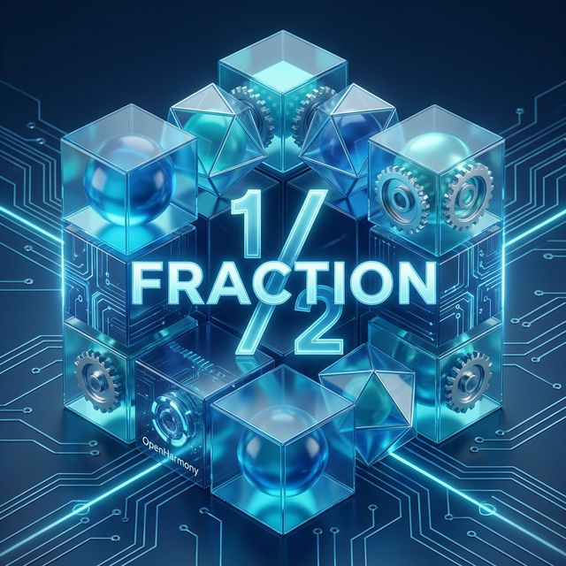
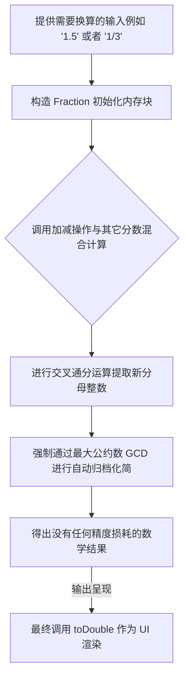

欢迎加入开源鸿蒙跨平台社区：https://openharmonycrossplatform.csdn.net
# Flutter for OpenHarmony：Flutter 三方库 fraction 解决浮点数精度丢失的利器（严谨的数学分数计算器）
## 前言
如果在利用 Flutter 写金融财务软件或者是极为高精度的智能测绘软件（特别是在鸿蒙这类追求全场景一栈式的环境下），你一定碰到过 `0.1 + 0.2` 不等于 `0.3` 这一由于双精度浮点标准而带来的经典坑点。
`fraction` 库由此应运而生。它并不试图创造一个新的浮点实现机制，而是以原生的视角——既然小数会有误差，那就用**严谨的分数：分子与分母（Numerator & Denominator）** 记录与计算，彻底规避伪转换误差，保护计算的完美一致。本文将指引你在鸿蒙开发上如何玩转这一神兵。
## 一、原理解析 / 概念介绍
### 1.1 基础概念
该应用的核心在于引入一个 `Fraction` 对象。此对象通过拦截你平常写的原始算数指令（加减乘除）。在进行运算时直接通过交叉乘法和加法处理它的长整数，并内置最大公约数 (Greatest Common Divisor, GCD) 的处理算法，自动归结为真分数。

### 1.2 进阶概念
- **MixedFraction(带分数支持)**：对于像 “5又3/4” 这种独特的混合表示方式，库也独创了带分数包装，并能够自适应化简计算。
- **与原生 API 互动极佳**：为了适配原生平台，通过 `Extenstions` 可以做到对基本数据直接调用 `3.5.toFraction()` 获取。
## 二、核心 API / 组件详解
### 2.1 极简的分数构建与四则运算
创建一个分数不需要极端的模板，一切犹如常规工具函数。
```dart
// 记得去 yaml 文件先获取您的包 
import 'package:fraction/fraction.dart';
// 创建两个绝对基础的表示:
final fracA = Fraction(1, 4); // 即代表 1/4
final fracB = Fraction.fromString("0.2"); // 可以从字符串转化即 1/5
// 运用加减乘除，和普通业务没有代码形态鸿沟
final result = fracA * fracB;
print("运算毫无精度损毁后的结果直接是: $result"); 
// ✅ 推荐：直接使用它的核心将返回 "1/20"
```
### 2.2 扩展属性便捷唤醒特性
你可以将原本业务中非常长的逻辑转化回纯净的原型体来进行安全加工：
```dart
// 直接激活 Extension 用法！
double mathItem = 1.34;
Fraction f = mathItem.toFraction();
// 解析判断当前这个分数的性质：是否可以完美换算？是否假分数等。
if (f.isProper) {
    print('当前确实是个合规真分数');
}
print('提取分子数据: ${f.numerator}，伴随分母 ${f.denominator}');
```
## 三、场景示例
### 3.1 场景一：鸿蒙级企业计算器精准对账
如果您在处理购物商城的费率、退款比率（例如在三款商品里分摊打折 10 块钱，就是每件 10/3 块钱），绝不要先出小数导致除不开变 `3.333333`！
```dart
import 'package:fraction/fraction.dart';
class PaymentDistributor {
  /// 对复杂的鸿蒙对账单分摊金额，并能保证末尾相加依然整十！
  void calculateDiscountDist() {
    // 假设退款金额分配给三个人
    final discount = Fraction(10, 1);
    final shares = Fraction(1, 3);
    
    // 这样能完美的保持 10/3，无脑保证金额完整闭环！
    final perPerson = discount * shares; 
    
    print('每个人名下的退款份额比例实际为 $perPerson 毫不残损');
    // 当所有一切算完最后进入收银系统，统一释放成为最终处理浮点显示
    print('最终输出：¥${perPerson.toDouble().toStringAsFixed(2)}');
  }
}
```
<!-- IMAGE_PLACEHOLDER: 控制台验证数学分摊毫无精度损毁输出的结果列表 -->
<!-- 类型: 截图 -->
<!-- 设备: 在终端内体现 Dart 计算情况 -->
<!-- 内容: 分布计算精度未丢失输出 -->
### 3.2 场景二：开发面向下一代的鸿蒙智教算术 APP
做一些早教辅助题目可以借助内部强化的混合形式自动转化和显示机制直接充当老师。
```dart
void constructMathQuiz() {
  // 定义两极带分数， 比如出题 “ 2 又 1/4 减去 1 又 1/2 等于多少？ ”
  MixedFraction q1 = MixedFraction(whole: 2, numerator: 1, denominator: 4);
  MixedFraction q2 = MixedFraction(whole: 1, numerator: 1, denominator: 2);
  
  // 引擎会完美减法并找好对应的余数归为真。
  MixedFraction answer = q1 - q2;
  print("🔥 提问：2又1/4 减去 1又1/2 是什么？");
  print("智能纠正及回答: $answer"); // 自转变成了单纯的分数形式的 3/4
}
```
## 四、要点讲解 & OpenHarmony 平台适配挑战
### 4.1 UI 中文字符与分数的协同排版
由于中国人的阅读习惯，在渲染鸿蒙智能手表或者是车载超清屏幕数字字体时，难以将 "1/2" 直观叠合。
🎨 **UI/动画建议**：推荐获取到分子 `numerator` 和分母 `denominator` 后自己手动封装带有水平分割线的特殊 Widget。
### 4.2 对于大型运算密集期的安全处置
因为分子和分母在处理时为了维持不产生小数会无限通分变大——遇到超大非共同约数累加时极其耗费算力。虽然鸿蒙 Dart 支持无限大数运算，但切忌使用异常庞大的质数做复杂嵌套除法演算避免拖慢 UI 线程。
## 五、完整运行体验示例
这里提供一个可以直接在 `main.dart` 中替换的鸿蒙小应用视图组件框架，提供了一套防止崩溃交互演示！
```dart
import 'package:flutter/material.dart';
import 'package:fraction/fraction.dart';
void main() => runApp(const FractionSafeguardApp());
class FractionSafeguardApp extends StatelessWidget {
  const FractionSafeguardApp({Key? key}) : super(key: key);
  @override
  Widget build(BuildContext context) {
    return MaterialApp(
      title: '高精对账体系演示',
      theme: ThemeData(primarySwatch: Colors.deepPurple),
      home: const SecureCalcScreen(),
    );
  }
}
class SecureCalcScreen extends StatefulWidget {
  const SecureCalcScreen({Key? key}) : super(key: key);
  @override
  _SecureCalcScreenState createState() => _SecureCalcScreenState();
}
class _SecureCalcScreenState extends State<SecureCalcScreen> {
  String classicResult = "";
  String fractionResult = "";
  void _triggerCrashComparision() {
    // 经典的 Double 浮点崩盘例子
    double d1 = 0.1;
    double d2 = 0.2;
    
    // 使用库安全包裹执行转化
    final f1 = Fraction.fromString("0.1");
    final f2 = Fraction.fromString("0.2");
    setState(() {
      classicResult = (d1 + d2).toString(); // 不预期！
      fractionResult = (f1 + f2).toDouble().toString(); // 安全。
    });
  }
  @override
  Widget build(BuildContext context) {
    return Scaffold(
      appBar: AppBar(title: const Text('鸿蒙数字安全演算基盘')),
      body: Center(
        child: Column(
          mainAxisAlignment: MainAxisAlignment.center,
          children: [
            const Text('请比对经典 "0.1 + 0.2" 计算漏洞：', 
                    style: TextStyle(fontSize: 18, fontWeight: FontWeight.bold)),
            const SizedBox(height: 30),
            Text('❌ 危险双精度结果: $classicResult', 
                 style: const TextStyle(color: Colors.redAccent, fontSize: 16)),
            const SizedBox(height: 10),
            Text('✅ Fraction 推演解回结果: $fractionResult', 
                 style: const TextStyle(color: Colors.green, fontSize: 16)),
            const SizedBox(height: 40),
            ElevatedButton(
              onPressed: _triggerCrashComparision,
              child: const Text('验证对比差异'),
            )
          ],
        ),
      ),
    );
  }
}
```
<!-- IMAGE_PLACEHOLDER: 鸿蒙手机呈现的红绿对比的差异文字界面 -->
<!-- 类型: 截图 -->
<!-- 设备: 应用界面或者 IDE Simulator -->
<!-- 内容: 对比反差内容截图 -->
## 六、总结
在构建极需要严格保障精度隔离的技术业务时候立于不败之地。当你必须构建工程核算、数字金融的内核时，这个小包将为你的鸿蒙应用提供最为精准的后备算力保障！
📦 如果你需要代码的演练请莅临开源仓库：[AtomGit 示例专栏](https://atomgit.com)
---
*声明：版权归属于开源鸿蒙跨平台建设小组所有，转载请遵循社区准则*
欢迎加入开源鸿蒙跨平台社区：[开源鸿蒙跨平台开发者社区](https://openharmonycrossplatform.csdn.net)
