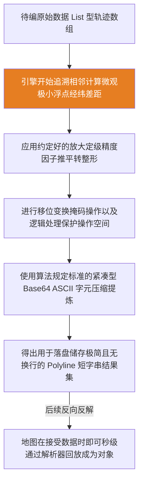

欢迎加入开源鸿蒙跨平台社区：[开源鸿蒙跨平台开发者社区](https://openharmonycrossplatform.csdn.net)

# Flutter for OpenHarmony：Flutter 三方库 google_polyline_algorithm 高效地图轨迹压缩算法

## 前言

在开发鸿蒙（OpenHarmony）系统的智能出行、运力调度等需要强依赖路线轨迹的应用时，实时地图路径复原可谓是基石能力。如果平台对每条线路成百上千包含绝对经度与纬度的明文数值浮点矩阵做直接网络上下传吞吐，极易撑爆传输带宽上限，也会使得渲染框架由于读取大型 JSON 拖慢解析加载速度。

`google_polyline_algorithm` 算法包带来了一整套业界高标准的轨迹降维压缩解决方案。它经过编码可将庞杂坐标系转化为高密度文本字符串，达到减负解耦并具备全平台语言相互识别能力。本文旨在探析其操作法及在终端应用的实用优化策略。

## 一、原理解析 / 概念介绍

### 1.1 基础概念

Google Polyline 的压缩核心理念为一种牺牲极小确定度精度的二进制差值算法策略。算法通过解析不注重每一个单独点的地理坐标详情，而是捕捉**相邻点之间的差值增量**。接着将这毫厘级别的浮动计算变为庞大左移负翻转整数态，并实施非常纯密集的 Base64 类编码最终落地形成简短有力的 ASCII 通讯字符串。



### 1.2 进阶概念

- **精确度等级变种策略**：默认情况下编解采用主流且误差在平地大概于一米的 5 位定标精度算法；若是处理具有长极点航线高密需求，该包亦能支持提调并注入更高的精度乘数等级，提升识别力度。
- **降费零负荷**：采用其提炼得到的压缩值能毫无门槛无负担随同在如 GET / API 请求体携带中穿梭传递。

## 二、核心 API / 组件详解

### 2.1 实行列表到文本的聚合转换编码 (encodePolyline)

无需建立繁复环境配置对象，直接装填普通经纬二维纯列表即可：

```dart
// 引入算法解码和编码包
import 'package:google_polyline_algorithm/google_polyline_algorithm.dart';
// 准备坐标池
List<List<num>> coordinates = [
  [39.9042, 116.4074], // 📍 北京天安门广场
  [39.9152, 116.4034], // 📍 北京故宫神武门
  [39.9122, 116.3982], // 📍 北京北海公园
];
// 执行核心编码
String encodedString = encodePolyline(coordinates);
print('压缩后的 Polyline 字符串: $encodedString');
```

✅ 业务开发实践：假如业务平台数据源是自身业务定制的对象集合，需先用 `map` 进行转化为要求的基础 `List<num>` 参数要求进行调用压平转换操作处理。

### 2.2 服务端到端侧的密文展开解析 (decodePolyline)

接手云下发加密格式文件后逆行反向化并剥离取整复盘使用方法同样顺畅：

```dart
String polylineStr = "{_xqF~v|}M?~@";
// 瞬间解码，返回经纬度的二维原生数组
List<List<num>> decodedCoords = decodePolyline(polylineStr);
for (var coord in decodedCoords) {
  print('🎈 还原的经纬度: 纬度 ${coord[0]}, 经度 ${coord[1]}');
}
```

## 三、场景示例

### 3.1 场景一：利用打包降频进行高密度骑手端行迹数据汇送

外派设备的定位雷达可能会在 1 分钟之内搜罗近百个路迹数据。打包聚合传替后会极大压制蜂窝信道浪费率以及由于单个过长产生的丢包重抛错误率。

```dart
import 'package:google_polyline_algorithm/google_polyline_algorithm.dart';
class RiderTracker {
  final List<List<num>> _pathBuffer = [];
  void onLocationUpdated(double lat, double lng) {
    _pathBuffer.add([lat, lng]);
  }
  /// 批量上传骑手的安全路线点至企业服务端
  Future<void> uploadTrajectory() async {
    if (_pathBuffer.isEmpty) return;
    
    // 💡 技巧：利用本库提供的高效编码一次性压平庞大的浮点运算
    String compressedData = encodePolyline(_pathBuffer);
    
    // 假设通过 HttpClient 发送
    print('📦 准备上传。明文数: ${_pathBuffer.length}个。压缩体：$compressedData');
    _pathBuffer.clear(); // 清空旧数据
  }
}
```

### 3.2 场景二：接受云中心传达大型省际规划图册及解析落地展现

大尺度应用大屏幕跨线旅游绘制图册，由于路线含有大量控制点节点，直接反组后生成适合百度等组件要求展示使用的业务原生点阵列包。

```dart
void renderTourRoute(String harmonyRouteData) {
  // 1. 无缝解压服务中心发来的特殊路线密码
  List<List<num>> geoPoints = decodePolyline(harmonyRouteData);
  
  // 2. 将普通的数字映射为您地图 SDK (如高德/百度) 指定的 LatLng 对象
  List<LatLng> mapPoints = geoPoints.map((point) {
    return LatLng(point[0].toDouble(), point[1].toDouble());
  }).toList();
  
  // 3. 将结果派发给地图控制器进行路径覆盖物绘制
  print("🎨 动画增强：准备渲染具有流动光影的路线，折点数量: ${mapPoints.length}");
}
```

## 四、OpenHarmony 平台适配挑战 & 要点分析指引

### 4.1 运行时引擎性能评估前瞻

此模块极客本质是因为它内部全部调用**底端内存整形及强移位等位算符操作**。当 Flutter 被打包于端侧特定 aarch64 底座指令集结构中之后，它的转换和处理都是底层芯片级的原语操作展现！这就预示着在放弃慢重灾区正则表达式的字符串拼接截断后，即便解析繁多特征值也能呈现秒回。

### 4.2 长路径与渲染防坠落避坑防灾

对于需要铺排横穿全国具备上万个坐标节点组成漫长大型解构文本的时候，尽管有底层效率极好的支援优势也会牵扯消耗 CPU 分发时毫秒级阻塞效应从而带来可见卡顿影响。
✅ 核心策略要求：一旦目标文本超量，务必备制将它隔离于工作线程（利用极其纯熟的 `Isolate.run()` 手段），并在获得反馈大集后再让主框架重叠承载UI更替与挂载！

## 五、综合防坠机压缩全流展现操作组件面

这是一组囊括对明文列表与转制成短缩编码成果直连的反馈实验室交互视图，可以直接载入框架运行查阅比对。

```dart
import 'package:flutter/material.dart';
import 'package:google_polyline_algorithm/google_polyline_algorithm.dart';
void main() => runApp(const MapTrackApp());
class MapTrackApp extends StatelessWidget {
  const MapTrackApp({Key? key}) : super(key: key);
  @override
  Widget build(BuildContext context) {
    return MaterialApp(
      title: '鸿蒙路径映射工具',
      theme: ThemeData(primarySwatch: Colors.green),
      home: const PolylineToolPage(),
    );
  }
}
class PolylineToolPage extends StatefulWidget {
  const PolylineToolPage({Key? key}) : super(key: key);
  @override
  State<PolylineToolPage> createState() => _PolylineToolPage();
}
class _PolylineToolPage extends State<PolylineToolPage> {
  String _encodedPath = "待编码...";
  
  // 代表我们在鸿蒙地图采集到的一段坐标
  final List<List<num>> _mockRoute = [
    [39.9042, 116.4074],
    [39.9045, 116.4078],
    [39.9049, 116.4085],
  ];
  void _triggerCompression() {
    setState(() {
      _encodedPath = encodePolyline(_mockRoute);
    });
  }
  @override
  Widget build(BuildContext context) {
    return Scaffold(
      appBar: AppBar(title: const Text('地图路径流压平引擎')),
      body: Padding(
        padding: const EdgeInsets.symmetric(horizontal: 20, vertical: 40),
        child: Column(
          crossAxisAlignment: CrossAxisAlignment.start,
          children: [
            const Text('📌 测试坐标集：包含天安门周围三个模拟坐标', 
                style: TextStyle(fontSize: 18, color: Colors.blueAccent)),
            const SizedBox(height: 30),
            ElevatedButton.icon(
              icon: const Icon(Icons.compress),
              label: const Text('执行鸿蒙极速压缩'),
              onPressed: _triggerCompression,
            ),
            const SizedBox(height: 30),
            Container(
              padding: const EdgeInsets.all(12),
              decoration: BoxDecoration(
                color: Colors.grey.shade200,
                borderRadius: BorderRadius.circular(8), // 🎨 UI建议：鸿蒙卡片圆角风格
              ),
              child: SelectableText(
                '压缩成功，生成密码文本：\n\n$_encodedPath', 
                style: const TextStyle(fontSize: 16, height: 1.5, color: Colors.indigo),
              ),
            ),
          ],
        ),
      ),
    );
  }
}
```

<!-- IMAGE_PLACEHOLDER: [前端控制台打印并完整转换成密码序列并进行交互展示展现出界面交互] -->
<!-- 类型: 截图 -->
<!-- 内容: 系统显示具有加密字符输出极度压平后产生的 UI 截面展示数据反馈记录。 -->

## 六、总结

针对构建泛物流出差、健身体育等极其注重记录路径完整度且有着极强通讯高消耗挑战的项目平台，利用好这极其锐利的微雕工具可大幅削减多余数据的负电开销，从而达到给整体系统的运行卸除沉重枷锁优化应用生态质量的核心要义。这绝对是大规模 GIS 计算开发体系必须掌握和装配部署的一套黄金编码降本底座！

📦 同步支持测试解析仓库项目可见于：[AtomGit 示例专栏](https://atomgit.com)
