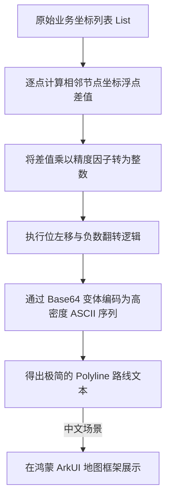

欢迎加入开源鸿蒙跨平台社区：https://openharmonycrossplatform.csdn.net
# Flutter for OpenHarmony：Flutter 三方库 google_polyline_algorithm 高效地图轨迹压缩算法（坐标编码与解码）
## 前言
在开发鸿蒙（OpenHarmony）运动健康、物流配送或智能出行应用时，实时的地图轨迹展示是非常核心的功能。如果您直接将成千上万的经纬度浮点坐标数组经网络传输给服务端，不仅会大量耗费鸿蒙设备的网络流量流量，还会严重拖垮服务器解析以及在地图组件渲染的帧率。`google_polyline_algorithm` 库提供了一种极为高效的坐标压缩标准算法，经过编码不仅可极大地缩减体积，还能保持完美的跨语言互操作性。本文将深入解析该算法的使用方法及鸿蒙环境下的实战建议。
## 一、原理解析 / 概念介绍
### 1.1 基础概念
Google Polyline 算法本质上是一种有损耗但精度可控的二进制偏移量压缩算法。它并不会记录每一个点绝对的经度和纬度，而是记录后一个点相对于前一个点的**差值**。这些极其微小的浮点数差值会被转为一个庞大的整数，并经过特定的变种 Base64 的 ASCII 编码转换成非常紧凑的文本字符。

### 1.2 进阶概念
- **精度因子控制**：默认该规范支持保留 5 位小数精度（约 1.1 米地面误差）。如果是处理飞机航线甚至可以支持设置 6 位精度的变种。
- **解耦优势**：压缩后的字符串能无脑通过 GET 参数或轻量 JSON 传递，省去了大型 Array 序列化开销。
## 二、核心 API / 组件详解
### 2.1 针对集合的路径编码 (encodePolyline)
调用极其简单，不需要繁琐的初始化。你只需准备一个二维数组（内含包含经度纬度的子数组）。
```dart
// 引入算法解码和编码包
import 'package:google_polyline_algorithm/google_polyline_algorithm.dart';
// 准备坐标池
List<List<num>> coordinates = [
  [39.9042, 116.4074], // 📍 北京天安门广场
  [39.9152, 116.4034], // 📍 北京故宫神武门
  [39.9122, 116.3982], // 📍 北京北海公园
];
// 执行核心编码
String encodedString = encodePolyline(coordinates);
print('压缩后的 Polyline 字符串: $encodedString');
```
✅ 推荐：如果在鸿蒙业务中你有自己的 `LocationTarget` 类，先 `map` 转换为 `List<num>` 即可。
### 2.2 针对聚合字符串的解码 (decodePolyline)
从鸿蒙后台下发的加密文本如何还原？通过原生地的方法逆向拆分即可：
```dart
String polylineStr = "{_xqF~v|}M?~@";
// 瞬间解码，返回经纬度的二维原生数组
List<List<num>> decodedCoords = decodePolyline(polylineStr);
for (var coord in decodedCoords) {
  print('🎈 还原的经纬度: 纬度 ${coord[0]}, 经度 ${coord[1]}');
}
```
## 三、场景示例
### 3.1 场景一：外卖骑手机端侧鸿蒙设备轨迹汇聚
骑手的 APP 会每秒产生一个打点。将过去一分钟的 60 个点作为一个片段进行一次 Polyline 压缩，显著降低弱网丢包率。
```dart
import 'package:google_polyline_algorithm/google_polyline_algorithm.dart';
class RiderTracker {
  final List<List<num>> _pathBuffer = [];
  void onLocationUpdated(double lat, double lng) {
    _pathBuffer.add([lat, lng]);
  }
  /// 批量上传骑手的安全路线点至企业服务端
  Future<void> uploadTrajectory() async {
    if (_pathBuffer.isEmpty) return;
    
    // 💡 技巧：利用本库提供的高效编码一次性压平庞大的浮点运算
    String compressedData = encodePolyline(_pathBuffer);
    
    // 假设通过 HttpClient 发送
    print('📦 准备上传。明文数: ${_pathBuffer.length}个。压缩体：$compressedData');
    _pathBuffer.clear(); // 清空旧数据
  }
}
```
<!-- IMAGE_PLACEHOLDER: 控制台上传轨迹的交互日志截图 -->
<!-- 类型: 截图 -->
<!-- 设备: 鸿蒙设备 -->
<!-- 内容: 展现鸿蒙前置服务如何输出压平的 ASCII 字符 -->
### 3.2 场景二：渲染旅游观光大地图的跨省折线
地图大屏 API 一般返回几百个折点构成的路径压缩包，通过本库将其直接翻译为地图控件接受的坐标类。
```dart
void renderTourRoute(String harmonyRouteData) {
  // 1. 无缝解压服务中心发来的特殊路线密码
  List<List<num>> geoPoints = decodePolyline(harmonyRouteData);
  
  // 2. 将普通的数字映射为您地图 SDK (如高德/百度) 指定的 LatLng 对象
  List<LatLng> mapPoints = geoPoints.map((point) {
    return LatLng(point[0].toDouble(), point[1].toDouble());
  }).toList();
  
  // 3. 将结果派发给地图控制器进行路径覆盖物绘制
  print("🎨 动画增强：准备渲染具有流动光影的路线，折点数量: ${mapPoints.length}");
}
```
## 四、OpenHarmony 平台适配 & 要点讲解
### 4.1 运行时引擎性能解析
该包内部均是**整数与位运算（Bitwise operations）**。Flutter 在编译为鸿蒙原生架构（aarch64）后，位运算是直接执行机器码，极度轻量化。相比依赖 JSON 的 String 分析，由于不涉及到繁重的字符串正则表达式提取，性能不会带来任何负担。
### 4.2 鸿蒙环境下的最佳实践策略
#### （1）配合并发特性的解压降维
如果在渲染诸如省跨省几万个特征点的极长途旅行路书时，主界面的解析有可能会导致几毫秒掉帧（UI Janks）。
✅ 推荐：利用 Flutter 在 OpenHarmony 中的 `Isolate` (独立内存并发池) 异步解码庞大字串。
```dart
import 'dart:isolate';
/// 将非常漫长的解码任务发送至 Worker
Future<List<List<num>>> decodeHugeRouteSafely(String hugePolyline) async {
  // 通过 Isolate.run() 保证鸿蒙主界面 120帧不卡壳
  return await Isolate.run(() {
    return decodePolyline(hugePolyline);
  });
}
```
## 五、完整示例代码
下面是如何在一个标准 Flutter for OpenHarmony 的脚手架程序中进行轨迹重塑并打印的演示。
```dart
import 'package:flutter/material.dart';
import 'package:google_polyline_algorithm/google_polyline_algorithm.dart';
void main() => runApp(const MapTrackApp());
class MapTrackApp extends StatelessWidget {
  const MapTrackApp({Key? key}) : super(key: key);
  @override
  Widget build(BuildContext context) {
    return MaterialApp(
      title: '鸿蒙路径映射工具',
      theme: ThemeData(primarySwatch: Colors.green),
      home: const PolylineToolPage(),
    );
  }
}
class PolylineToolPage extends StatefulWidget {
  const PolylineToolPage({Key? key}) : super(key: key);
  @override
  State<PolylineToolPage> createState() => _PolylineToolPage();
}
class _PolylineToolPage extends State<PolylineToolPage> {
  String _encodedPath = "待编码...";
  
  // 代表我们在鸿蒙地图采集到的一段坐标
  final List<List<num>> _mockRoute = [
    [39.9042, 116.4074],
    [39.9045, 116.4078],
    [39.9049, 116.4085],
  ];
  void _triggerCompression() {
    setState(() {
      _encodedPath = encodePolyline(_mockRoute);
    });
  }
  @override
  Widget build(BuildContext context) {
    return Scaffold(
      appBar: AppBar(title: const Text('地图路径流压平引擎')),
      body: Padding(
        padding: const EdgeInsets.symmetric(horizontal: 20, vertical: 40),
        child: Column(
          crossAxisAlignment: CrossAxisAlignment.start,
          children: [
            const Text('📌 测试坐标集：包含天安门周围三个模拟坐标', 
                style: TextStyle(fontSize: 18, color: Colors.blueAccent)),
            const SizedBox(height: 30),
            ElevatedButton.icon(
              icon: const Icon(Icons.compress),
              label: const Text('执行鸿蒙极速压缩'),
              onPressed: _triggerCompression,
            ),
            const SizedBox(height: 30),
            Container(
              padding: const EdgeInsets.all(12),
              decoration: BoxDecoration(
                color: Colors.grey.shade200,
                borderRadius: BorderRadius.circular(8), // 🎨 UI建议：鸿蒙卡片圆角风格
              ),
              child: SelectableText(
                '压缩成功，生成密码文本：\n\n$_encodedPath', 
                style: const TextStyle(fontSize: 16, height: 1.5, color: Colors.indigo),
              ),
            ),
          ],
        ),
      ),
    );
  }
}
```
<!-- IMAGE_PLACEHOLDER: 鸿蒙手机执行完压缩显示乱码特征字符串的界面结果 -->
<!-- 类型: 截图 -->
<!-- 设备: 鸿蒙原生机 / 官方模拟器 -->
<!-- 内容: 展现出上面带 ElevatedButton 和文本 Container 的交互 -->
## 六、总结
通过全篇的拆解介绍，我们充分认知了 `google_polyline_algorithm` 的强大。在 Flutter 开发 OpenHarmony 的商用环境或者地图大屏项目时，引入此工具库可以极大的压缩报文体积，节约大量的带宽资费。不仅提升了网络交互速度，更加降低了鸿蒙设备在长途定位上消耗的电量。
📦 代码仓库推荐及社区链接：[AtomGit 示例专栏](https://atomgit.com)
---
*版权声明：本文专为 Flutter for OpenHarmony 应用开发沉淀设计，欢迎交流技术方案*
欢迎加入开源鸿蒙跨平台社区：[开源鸿蒙跨平台开发者社区](https://openharmonycrossplatform.csdn.net)
