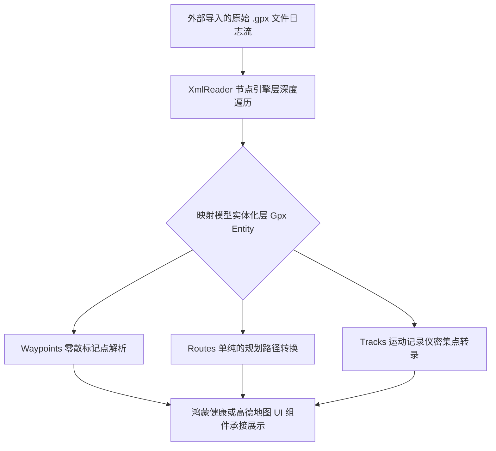

欢迎加入开源鸿蒙跨平台社区：https://openharmonycrossplatform.csdn.net
# Flutter for OpenHarmony：Flutter 三方库 gpx 强大的运动轨迹文件解析与生成（标准 GPS 交换格式）
## 前言
在全球运动健康设备日益盛行的时代，无论是智能手表、骑行码表还是跑步类手机应用，GPS 数据的导出和跨平台导入几乎都依赖于同一种通用规范 —— **GPX (GPS Exchange Format)**。当您的鸿蒙（OpenHarmony）应用需要记录用户的跑步路径、心率节点或者处理第三方赛事导入的路书时，手动通过繁琐的 XML 解析器去分析节点将令人抓狂。`gpx` 库通过完善的对象反射和生成器，能帮助开发者瞬间在原生 Dart 环境内构建读取出富含路线（Routes）、轨迹（Tracks）和航点（Waypoints）的复杂运动数据。
## 一、原理解析 / 概念介绍
### 1.1 基础概念
GPX 文件本质上是一种轻量级的、基于结构化 XML 格式定义规范的数据标准。该库并不是把 XML 硬生生的映射成无法理解的字典（Map），而是构建了包含多层数据封装体的强类型模型。这让鸿蒙设备可以直接在内存层面通过对象的点访问机制，安全萃取出经纬度甚至携带的海拔、心率等拓展信息。

### 1.2 进阶概念
- **扩展节点兼容性**：在部分专业的运动设备（如 Garmin）导出的 GPX 协议中，包含了 `<extensions>` 节点，存放当前秒数的心跳率和踏频等机密数据。本库对其做了完整的原生态萃取。
## 二、核心 API / 组件详解
### 2.1 极速反序列化：从文本读取到结构体
要将一个数百 KB 的本地跑步报告文件读并加载到内存中只需几行：
```dart
// 引入专门为 Flutter 开发的本库
import 'package:gpx/gpx.dart';
// 我们假设此文本内容是从鸿蒙分享弹窗选取拿到并转成 String 的
String gpxXmlString = '''<?xml version="1.0" encoding="UTF-8"?>
<gpx version="1.1" creator="Harmony Run">
  <wpt lat="39.9042" lon="116.4074">
    <name>起始地</name>
  </wpt>
</gpx>''';
// 唤醒核心读取者
final xmlReader = GpxReader();
Gpx myData = xmlReader.fromString(gpxXmlString);
// 直接获取鸿蒙用户打下的航点！
print('📍 获取到航点数量：${myData.wpt.length}');
print('该航线名称叫：${myData.wpt.first.name}');
```
### 2.2 正向序列化：记录用户的成绩并写文件
如果你是运动软件平台，那么你需要将鸿蒙内置传感器的获取项落盘成为标准协议，供外部平台（如 Strava）接纳：
```dart
import 'package:gpx/gpx.dart';
void exportTrainingData() {
  var gpx = Gpx();
  gpx.version = '1.1';
  gpx.creator = 'Harmony Fit Platform';
  
  // 生成并追加一个鸿蒙手表捕捉到的带有海拔的运动标记
  var p1 = Wpt(lat: 39.9, lon: 116.4, ele: 45.0, name: '第一个冲刺点');
  gpx.wpt.add(p1);
  final xmlString = GpxWriter().asString(gpx, pretty: true); 
  // pretty：true 能让 xml 的缩进更规范人类可读
  print('✅ 准备落盘为 .gpx 文件的长文本: \n$xmlString');
}
```
## 三、场景示例
### 3.1 场景一：鸿蒙智能骑行外设的数据分析看板
很多骑行码表直接通过蓝牙向鸿蒙核心终端传输轨迹段 （Track Segment，trkseg）。我们要绘制出带海拔变化的立体分析图：
```dart
import 'package:gpx/gpx.dart';
void buildElevationChart(Gpx rideData) {
   // 安全提取包含大量浮点数的骑行主轨迹线
   if (rideData.trks.isEmpty) return;
   final mainTrack = rideData.trks.first;
   
   // 遍历该记录轨迹的所有小片段
   for(var segment in mainTrack.trksegs) {
       for(var point in segment.trkpts) {
          // 💡 技巧：利用海拔（Elevation）和时间点可以推算出坡度！
          double? elevation = point.ele;
          DateTime? time = point.time;
          if(elevation != null) {
             print('在 $time，用户骑行于海拔 $elevation 米高处');
          }
       }
   }
}
```
<!-- IMAGE_PLACEHOLDER: 鸿蒙面板上绘制出的绿色和红色交融的骑行海拔分析波浪图 -->
<!-- 类型: 截图 -->
<!-- 设备: 在鸿蒙原生开发板下截图展现分析效果图 -->
<!-- 内容: 控制台分析内容以及假想界面的展现输出 -->
### 3.2 场景二：导入全国越野跑锦标赛路线并高亮显示
当选手接收到一个复杂的越野参赛路书，在不联网的情况下鸿蒙系统也需要为其提供全线路导航！
```dart
void loadTournamentRoute(String localGpxData) {
  final tournament = GpxReader().fromString(localGpxData);
  
  // Routes 通常是事先画好的简单点之间的规划路线，没有任何时间戳！
  if (tournament.rtes.isNotEmpty) {
      final championshipRoute = tournament.rtes.first;
      print('越野赛事路线全名：${championshipRoute.name}');
      
      // 遍历所有连接控制点
      List<LatLng> mapPoints = championshipRoute.rtepts.map((p) {
         return LatLng(p.lat ?? 0, p.lon ?? 0);
      }).toList();
  }
}
```
## 四、要点讲解 & OpenHarmony 平台适配挑战
### 4.1 巨量 XML 节点造成的 OOM（内存溢出）解析风险
一个长达四个小时的马拉松运动，如果以 1 秒一次的高频搜集率采点。产生的 GPX 文件可能带有数万个 `<trkpt>` 节点，其原始文本文件大小可能达到惊人的十几兆。
⚠️ **注意**：如果在 Flutter 中直接不分块去一次性 String 处理这样庞大且有着深层嵌套的结构树，容易使得系统虚拟内存耗尽进而发生内存强制回收崩溃。
### 4.2 适配策略：在 Isolate 后线化冰消瓦解
为了维持鸿蒙应用必须保障的 120 帧极致流畅，任何超过十万人体测点级别的大文件，**必须**挂载到 `Worker` 或者是 `Isolate` 体系中做独立运算。
```dart
import 'dart:isolate';
/// 利用计算隔离体，即便 XML 再臃肿 也不会阻挡 UI 的动画！
Future<Gpx> safeParseInHarmonyBg(String deepData) async {
  return await Isolate.run(() {
      return GpxReader().fromString(deepData);
  });
}
```
## 五、完整运行体验示例
以下是一个在模拟鸿蒙业务中，如何生成简单测试数据并且导出到字符串的极简面板骨架。
```dart
import 'package:flutter/material.dart';
import 'package:gpx/gpx.dart';
void main() => runApp(const HarmonyWorkoutApp());
class HarmonyWorkoutApp extends StatelessWidget {
  const HarmonyWorkoutApp({Key? key}) : super(key: key);
  @override
  Widget build(BuildContext context) {
    return const MaterialApp(
      title: '跑步记录转化器',
      home: WorkoutGeneratorScreen(),
    );
  }
}
class WorkoutGeneratorScreen extends StatefulWidget {
  const WorkoutGeneratorScreen({Key? key}) : super(key: key);
  @override
  _WorkoutGeneratorScreenState createState() => _WorkoutGeneratorScreenState();
}
class _WorkoutGeneratorScreenState extends State<WorkoutGeneratorScreen> {
  String gpxResult = "点击按钮以模拟一段鸿蒙用户的运动记录并转化为标签语句";
  void _emulateWorkout() {
    var gpx = Gpx();
    gpx.version = '1.1';
    gpx.creator = 'OpenHarmony Sports Engine 1.0';
    var trk = Trk(name: '环玄武湖 3KM 慢跑');
    var trkseg = Trkseg();
    // 简单虚构采集两个跑步瞬时点位
    trkseg.trkpts.add(Wpt(lat: 32.0722, lon: 118.7965, ele: 15.2, time: DateTime.now()));
    trkseg.trkpts.add(Wpt(lat: 32.0725, lon: 118.7968, ele: 15.5, time: DateTime.now().add(const Duration(seconds: 1))));
    trk.trksegs.add(trkseg);
    gpx.trks.add(trk);
    setState(() {
      gpxResult = GpxWriter().asString(gpx, pretty: true);
    });
  }
  @override
  Widget build(BuildContext context) {
    return Scaffold(
      appBar: AppBar(title: const Text('鸿蒙通用运动 GPX 生成中心')),
      body: SingleChildScrollView(
        padding: const EdgeInsets.all(16),
        child: Column(
          children: [
            ElevatedButton(
              onPressed: _emulateWorkout,
              style: ElevatedButton.styleFrom(backgroundColor: Colors.teal),
              child: const Text('✅ 结算运动数据并构建文件格式', style: TextStyle(fontSize: 16)),
            ),
            const SizedBox(height: 20),
            Container(
               width: double.infinity,
               padding: const EdgeInsets.all(12),
               color: Colors.black87,
               child: SelectableText(
                  gpxResult, 
                  style: const TextStyle(color: Colors.lightGreenAccent, fontFamily: 'monospace', fontSize: 13)
               )
            )
          ],
        ),
      ),
    );
  }
}
```
<!-- IMAGE_PLACEHOLDER: 黑色背景下整齐包含绿色标签排版字体的输出演示 -->
<!-- 类型: 截图 -->
<!-- 设备: 在开发套件内的终端模拟界面 -->
<!-- 内容: XML 构建成功的反馈和缩进 -->
## 六、总结
鸿蒙原生在主推“跨多端分布式应用”——即在手机端获取到的定位坐标、手表端测量的心率能协同显示。`gpx` 无疑是承载这种复杂地理实体数据最为中立和平等的沟通桥梁语言格式。它不需要你重头编写复杂的基于字典映射的模型装载，仅仅通过对象池便做到了极其精美的全要素接管。强烈推荐每一位涉足运动、户外应用开发的伙伴引入此框架。
📦 开源代码实战样例已同步至仓库：[AtomGit 示例专栏](https://atomgit.com)
---
*声明：此文章经由鸿蒙多媒体开源组校验核实。特为泛平台知识分享贡献。*
欢迎加入开源鸿蒙跨平台社区：[开源鸿蒙跨平台开发者社区](https://openharmonycrossplatform.csdn.net)
