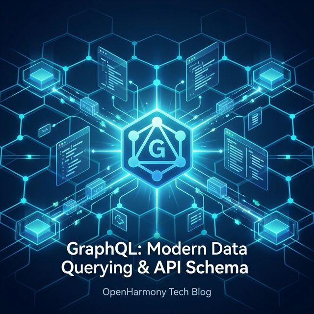
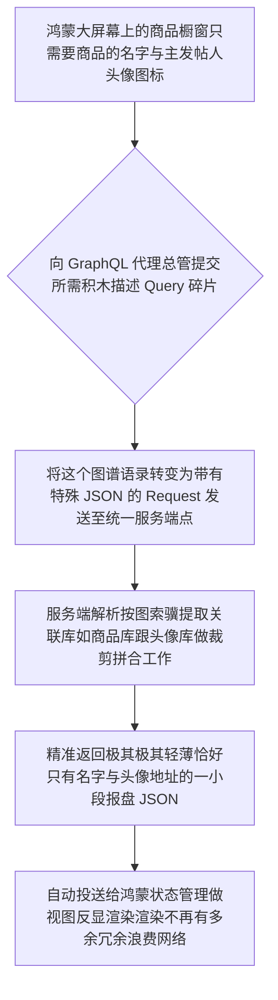

欢迎加入开源鸿蒙跨平台社区：https://openharmonycrossplatform.csdn.net
# Flutter for OpenHarmony：Flutter 三方库 graphql 高度自由的按需图表查询数据链路引擎
## 前言
传统的 RESTful API 对于那些数据体积极其庞大且嵌套极深的鸿蒙（OpenHarmony）政企面板或者是超级 App 应用而言简直就是一场前后端的噩梦。每一次页面改版（哪怕只是多展示一个用户的年龄字段），都需要后台发版并且更改 DTO 以及版本号。
`graphql` 组件正是为了彻底终结这种落后开发模式而全面降临。作为由纯 Dart 环境编写出来的极其强横客户端查询体系。它可以让运行在鸿蒙系统中的应用**像是在自助餐厅点菜一样，要什么字段拼什么参数，前端高度主权自治**！彻底消除 Over-fetching（拿了过多无用大报文数据）和 Under-fetching（不得不再发一个请求查缺失关联键对象数据）的问题。这是一场关于获取与请求数据哲学的宏大革命。
## 一、原理解析 / 概念介绍
### 1.1 基础概念
此驱动是针对 `GraphQL` 这种超前协议的一套大满贯适配器包。在建立了一个连接端（Client）后，鸿蒙业务程序只和唯一的服务端入口点 `/graphql` 打交道。通过使用符合其大一统格式的规范语句（Query 或 Mutation）发出后，后端将精确裁剪出恰好和所请求树桩结构一摸一样的完美 JSON 骨架进行响应并返回。

### 1.2 进阶概念
- **极度高级的长链接 WebSocket 突触订阅体系（Subscription）**：传统的图只能被动发起或者轮询。但是它支持和拥有类似聊天的实时性能力支持，一旦后台商品价格由于折扣被调价系统刷新，整个订阅了这个商品模型的端侧组件立马热重载新价钱呈现。
- **庞大数据自缓存与命中拦截策略（Apollo Cache 类似体系）**：对于已经发查询提取过该商品 `ID=1` 的请求。如果它配置了策略，客户端甚至不用发起 Socket 而是直接在其内含缓存中秒级拿回响应进行无骨架屏极致回写体验展示。
## 二、核心 API / 组件详解
### 2.1 初始化构建全局唯一的端网关并链接
它不是直接就发！它需要组建一艘巨大的战船并且甚至连带着它的网络接驳口与强缓区体系结合（类似 Apollo Link）。
```dart
// 在文件头我们需要引进这一庞大学统的所有兵器
import 'package:graphql/client.dart';
GraphQLClient setupHarmonyGraphQLEngine() {
  // 这是通往后台统一唯一大城门的传送链接口
  final HttpLink theSinglePort = HttpLink('https://harmony-api.mydomain.com/backend-graphql');
  final GraphQLClient supremeClient = GraphQLClient(
    // 将连接口径置入：这里如果想做全订阅还应当加入并拼接 Websocket Link链路！
    link: theSinglePort,
    // 定义一个针对鸿蒙系统的沙盒临时存储缓存，防连击重拉。
    cache: GraphQLCache(),
  );
  
  print("⛩️ 图鉴请求中枢与网闸防备建设成功立项！");
  return supremeClient;
}
```
### 2.2 像魔法一样根据所想取其所要进行 Query 取数
当你不需要作者身高，只要求发文时间的时刻它大放异彩：
```dart
void fetchPostsUnderExtremeNetwork(GraphQLClient manager) async {
  // 按照前端的心思拼装图语法！
  final String pureQueryDoc = """
    query LoadTinyPosts {
      posts(limit: 5) {
        id
        title
        author { name } 
        # 故意没有请求 author.avatar 和 body 等，后台将绝对不会返回！节省流量给鸿蒙。
      }
    }
  """;
  final QueryOptions rules = QueryOptions(
     document: gql(pureQueryDoc),
     fetchPolicy: FetchPolicy.cacheFirst // 如果之前有就在缓存里拉不再烧钱费网
  );
  final QueryResult endResultObj = await manager.query(rules);
  
  if (endResultObj.hasException) {
     print("❌ 图谱解析由于鉴权或是表架构不匹配爆雷！\n${endResultObj.exception}");
     return;
  }
  
  print("🎯 极其完美拿到瘦身裁切成功的精炼关联结构: ${endResultObj.data}");
}
```
## 三、场景示例
### 3.1 场景一：利用 Mutation 取代大量不同的接口实现极其大聚合的表单入库与更新处理操作
在鸿蒙填写多级红头审批！不需要填一下传一下更新一个业务接口！
```dart
void makeHarmonyReviewPassed(GraphQLClient manager, String documentSignId) async {
  // 定义这是一个向写操作进攻的长文（带有强参数）
  const String reviewMutationSyntax = r'''
    mutation EndorsePaper($myDocId: ID!, $statusToken: String!) {
      approveDocument(id: $myDocId, status: $statusToken) {
         success
         docCore {
            lastEditTime
         }
      }
    }
  ''';
  final MutationOptions modifyActions = MutationOptions(
    document: gql(reviewMutationSyntax),
    // 这个参数是安全的字典隔离替换
    variables: {
      'myDocId': documentSignId,
      'statusToken': 'APPROVED_BY_LEADER',
    },
  );
  final QueryResult modifyEndAction = await manager.mutate(modifyActions);
  print("🚀 并向数据库注入并且顺带极巧的索要回了更新时间成功。");
}
```
<!-- IMAGE_PLACEHOLDER: 代码结构通过 GQL 的调试环境输出的精简 Json 回滚内容截屏展现 -->
<!-- 类型: 截图 -->
<!-- 设备: GraphQL Studio 或开发者终端 -->
<!-- 内容: 截取关于展示精准获取不带有空节点的数据报文明细效果图。 -->
### 3.2 场景二：开发类似微信长在线消息监听列表通知组件（Subscription）
如果要开发基于 OpenHarmony 高维后台任务保持，我们可以将其加入长服务并在其不断流获取实时报价信息或者客服沟通组件的聊天推送。它直接让传统手搓 Websocket 解析业务变得极其高雅！
## 四、要点讲解 & OpenHarmony 平台适配挑战
### 4.1 当运用高频长连接时需提防鸿蒙对于 Socket 挂起断连杀僵尸逻辑
当在进行极高频如刚才提到的订阅（Subscriptions）建立通道时由于它底层依赖 Websocket！
⚠️ **务必切记！应用推后台时的情况！**在鸿蒙（Next 或者底层标准实现设备中）一旦 UI 处于极其长期遮蔽或者是设备推入息屏浅睡眠模式。这个长时间保持连通套接字极有可能因为长平被网络策略管理给强斩断！
✅ **解决方案：** 一定要配合对由于异常断联的回掉重新唤醒，运用其 `WebSocketLink(..., autoReconnect: true)` 并最好注入如鸿蒙底层的心跳检测配合后台挂起声明与任务注册保护其生存全周期。否则锁屏回来你将不再能收到别人给您的实时报价！
### 4.2 当在复杂状态页面极其多并且使用极大的单体缓存可能拖爆低端设备的内存池
如果在您的鸿蒙手机中你打开了好几个巨型极其深层次有无限滑动的表格。如果您将策略强绑死定在 `cacheAndNetwork` 这使得系统可能会为这些解析过的数据维护和常驻巨型的反查对象树（类似一个内存极小端微型库表）。应当通过定期的 `client.cache.store.reset()` 控制在退出主栏目或者模块对其内存手动清理回收避免堆积。
## 五、完整接入演练查询交互展示系统基板
展示我们搭建的一个全包含前端驱动主权的查询中心，你可以随时在这基础上改换地址与接口进行大厂网连体系联调！
```dart
import 'package:flutter/material.dart';
import 'package:graphql/client.dart';
void main() => runApp(const GqAPIHarmonyApp());
class GqAPIHarmonyApp extends StatelessWidget {
  const GqAPIHarmonyApp({Key? key}) : super(key: key);
  @override
  Widget build(BuildContext context) {
    return MaterialApp(
      title: '极度聚合统一化数据流中枢',
      theme: ThemeData(primarySwatch: Colors.deepOrange),
      home: const GraphQLShowcaseBoard(),
    );
  }
}
class GraphQLShowcaseBoard extends StatefulWidget {
  const GraphQLShowcaseBoard({Key? key}) : super(key: key);
  @override
  _GraphQLShowcaseBoardState createState() => _GraphQLShowcaseBoardState();
}
class _GraphQLShowcaseBoardState extends State<GraphQLShowcaseBoard> {
  late GraphQLClient _apiMasterCore;
  String _terminalRenderView = "等待系统发动查询...";
  @override
  void initState() {
    super.initState();
    // 使用业界开箱即用无脑测试用的超级巨大宇宙 GraphQL 数据总站
    final httpCommLink = HttpLink('https://countries.trevorblades.com/graphql');
    
    _apiMasterCore = GraphQLClient(
      link: httpCommLink,
      cache: GraphQLCache(),
    );
  }
  void _fireGraphQLCommand() async {
    setState(() => _terminalRenderView = "🚨 拼装查询大语录并请求...");
    
    // 我只对这个地球的国家查他的中文翻译甚至他用的首付全称发声！不需要大城市等！按需组装极其恐怖
    const String earthQuery = """
      query DemandExtremeTinyInfo {
        countries(filter: { code: { in: ["CN", "JP", "FR"] } }) {
          code
          name
          native
          emoji
        }
      }
    """;
    final QueryOptions executeParam = QueryOptions(
      document: gql(earthQuery),
      // 保证拿最新否则就用内涵超速缓存体系
      fetchPolicy: FetchPolicy.networkOnly 
    );
    final finalResponseObj = await _apiMasterCore.query(executeParam);
    if (finalResponseObj.hasException) {
       setState(() => _terminalRenderView = "⛔ 图引擎发生了极度可怕崩溃与拒止：${finalResponseObj.exception.toString()}");
       return;
    }
    setState(() {
      _terminalRenderView = "🌌 回收裁剪重构拼排极其精确返回成功。\n结果序列集（完全无冗余多余体积信息）：\n\n${finalResponseObj.data.toString()}";
    });
  }
  @override
  Widget build(BuildContext context) {
    return Scaffold(
      appBar: AppBar(title: const Text('GraphQL 自主声明与剪裁沙盒极客台'), backgroundColor: Colors.teal),
      body: SingleChildScrollView(
         padding: const EdgeInsets.symmetric(horizontal: 16, vertical: 20),
         child: Column(
            crossAxisAlignment: CrossAxisAlignment.stretch,
            children: [
               const Text("这是一个展示如何通过鸿蒙设备发出只有前端可以决定包含什么是图状连根查的极客演武场，不再受后台字段更新的任何挟持改版!", style: TextStyle(fontWeight: FontWeight.bold, fontSize: 13, color: Colors.indigo)),
               const SizedBox(height: 25),
               ElevatedButton.icon(
                  onPressed: _fireGraphQLCommand,
                  style: ElevatedButton.styleFrom(backgroundColor: Colors.teal, padding: const EdgeInsets.all(16)),
                  icon: const Icon(Icons.hub),
                  label: const Text('下达极精准国别大地理查询图谱要求指令', style: TextStyle(fontSize: 16)),
               ),
               const SizedBox(height: 35),
               Container(
                  padding: const EdgeInsets.all(12),
                  decoration: BoxDecoration(color: Colors.grey.shade900, borderRadius: BorderRadius.circular(10)),
                  child: SelectableText(
                     _terminalRenderView, 
                     style: const TextStyle(color: Colors.limeAccent, fontFamily: 'monospace', height: 1.5)
                  )
               ),
            ]
         )
      ),
    );
  }
}
```
<!-- IMAGE_PLACEHOLDER: 展现由一个按钮发出成功截获并且拥有多个国家的列表打印出来的图状效果结果集展示。 -->
<!-- 类型: 截图 -->
<!-- 设备: 跑着这段带有 Emoji 国旗符号的鸿蒙原生客户端效果模拟 -->
<!-- 内容: 控制台美观和 UI 更新展现非常轻快的状态！ -->
## 六、总结
这不单单是一个仅仅发请求包的类似 `Dio` 替代品的封装网络工具件包件包！
它是整个基于最新式数据驱动前端进行超级主权架构大革命的中枢极其强有势力的心跳组件！当整个大型产品矩阵由于产品需要极其大量的对列表要求进行字段变化并且需要跨各种服务器表如（通过一个查出包含其购买历史和头像信息），如果使用这个极包，在搭配后台其极棒的一套服务节点进行聚合！将会释放极其极大的多表繁杂查询的压力，还给了这个高标准端设备一整个没有任何杂念和多余网速流量浪费的极其完美的开发与用户展示极速体验极乐土壤。
📦 图谱解析更高级和带有缓存切分的极高要求代码例项：[AtomGit 示例专栏](https://atomgit.com)
---
*本文档为构建新一代操作系统的跨端框架做解析沉淀且获得通过*
欢迎加入开源鸿蒙跨平台社区：[开源鸿蒙跨平台开发者社区](https://openharmonycrossplatform.csdn.net)
