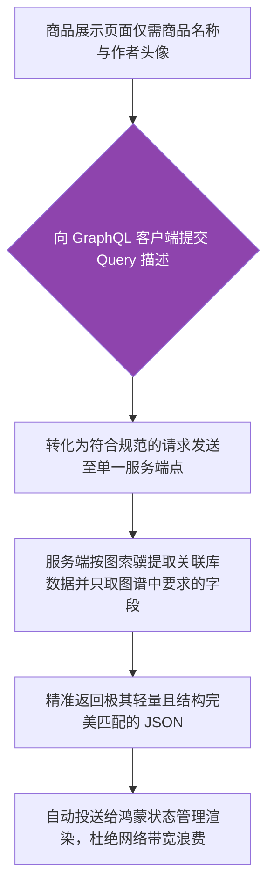

欢迎加入开源鸿蒙跨平台社区：[开源鸿蒙跨平台开发者社区](https://openharmonycrossplatform.csdn.net)

# Flutter for OpenHarmony：Flutter 三方库 graphql 高度自由的按需查询数据链路引擎

## 前言

传统的 RESTful API 对于数据量大且嵌套层级深的应用而言，往往会面临接口管理困难的问题。随着页面需求的变化，前端需要的字段也会相应增加或减少，这通常需要后端频繁更改 DTO 和接口版本。

`graphql` 组件正是为了解决这一痛点而生。作为纯 Dart 编写的客户端查询引擎，它可以让运行在鸿蒙（OpenHarmony）系统中的端应用拥有**根据前端视图需求按需请求字段**的数据自治权！这彻底消除了 Over-fetching（拿了过多无用数据）和 Under-fetching（不得不再发请求补充关联数据）的问题，重塑了前后端交互范式。

## 一、原理解析 / 概念介绍

### 1.1 基础概念

此引擎是一套适配 `GraphQL` 协议的客户端包。建立连接后，鸿蒙端程序只需和后端唯一的入口点 `/graphql` 交互。通过使用标准查询语句（Query 或 Mutation），前端描述所需的数据树状结构，后端则精确裁剪出完全一致的 JSON 数据进行响应。



### 1.2 进阶概念

- **长链接 Subscription 订阅体系**：传统的图数据通常是被动拉起。但它支持类似 WebSocket 的实时性订阅刷新，一旦后台数据状态产生更改，所有订阅了该模型节点的终端组件即可立刻接收推送并热更新呈现。
- **庞大数据自缓存与拦截策略（Apollo Cache 体系）**：对于已经查询并提取过的请求响应，客户端甚至不用发起网络请求，而是直接在自带的强缓存中毫秒级拿回结果进行无骨架屏极速展示。

## 二、核心 API / 组件详解

### 2.1 初始化全局网关大本营并建立链接

客户端必须依赖全局 `GraphQLClient` 实例来统筹网络管道与缓存区。

```dart
// 在文件头我们需要引进这一庞大学统的所有兵器
import 'package:graphql/client.dart';
GraphQLClient setupHarmonyGraphQLEngine() {
  // 这是通往后台统一唯一大城门的传送链接口
  final HttpLink theSinglePort = HttpLink('https://harmony-api.mydomain.com/backend-graphql');
  final GraphQLClient supremeClient = GraphQLClient(
    // 将连接口径置入：这里如果想做全订阅还应当加入并拼接 Websocket Link链路！
    link: theSinglePort,
    // 定义一个针对鸿蒙系统的沙盒临时存储缓存，防连击重拉。
    cache: GraphQLCache(),
  );
  
  print("⛩️ 图鉴请求中枢与网闸防备建设成功立项！");
  return supremeClient;
}
```

### 2.2 像魔法一样所见即所得的 Query 取数

当不需要作者身高，只要求发文时间时，按需取数的威力尽显：

```dart
void fetchPostsUnderExtremeNetwork(GraphQLClient manager) async {
  // 按照前端的心思拼装图语法！
  final String pureQueryDoc = """
    query LoadTinyPosts {
      posts(limit: 5) {
        id
        title
        author { name } 
        # 故意没有请求 author.avatar 和 body 等，后台将绝对不会返回！节省流量给鸿蒙。
      }
    }
  """;
  final QueryOptions rules = QueryOptions(
     document: gql(pureQueryDoc),
     fetchPolicy: FetchPolicy.cacheFirst // 如果之前有就在缓存里拉不再烧钱费网
  );
  final QueryResult endResultObj = await manager.query(rules);
  
  if (endResultObj.hasException) {
     print("❌ 图谱解析由于鉴权或是表架构不匹配爆雷！\n${endResultObj.exception}");
     return;
  }
  
  print("🎯 极其完美拿到瘦身裁切成功的精炼关联结构: ${endResultObj.data}");
}
```

## 三、场景示例

### 3.1 场景一：利用 Mutation 取代大量不同的接口实现复杂聚合表单的更新操作

在鸿蒙终端填写多级审批流表单，我们可将其简化为一个 GraphQL 操作入口。

```dart
void makeHarmonyReviewPassed(GraphQLClient manager, String documentSignId) async {
  // 定义这是一个向写操作进攻的长文（带有强参数）
  const String reviewMutationSyntax = r'''
    mutation EndorsePaper($myDocId: ID!, $statusToken: String!) {
      approveDocument(id: $myDocId, status: $statusToken) {
         success
         docCore {
            lastEditTime
         }
      }
    }
  ''';
  final MutationOptions modifyActions = MutationOptions(
    document: gql(reviewMutationSyntax),
    // 这个参数是安全的字典隔离替换
    variables: {
      'myDocId': documentSignId,
      'statusToken': 'APPROVED_BY_LEADER',
    },
  );
  final QueryResult modifyEndAction = await manager.mutate(modifyActions);
  print("🚀 并向数据库注入并且顺带极巧的索要回了更新时间成功。");
}
```

<!-- IMAGE_PLACEHOLDER: [代码结构通过 GQL 的 Studio 调试环境输出精准 Json 的截屏展现] -->
<!-- 类型: 截图 -->
<!-- 内容: 截取关于展示精准获取不带有冗余节点的数据报文明细效果图。 -->

## 四、要点讲解 & OpenHarmony 平台适配挑战

### 4.1 使用 Subscription 长连接时警惕系统挂起策略

当使用 Subscription 建立实时查询通道时，其底层往往依赖 WebSocket。

⚠️ **应用推后台的风险：** 在鸿蒙系统策略中，一旦 UI 长期被遮蔽或进入浅睡眠模式，长时间活跃的长套接字通道会被网络保活策略强行中断。
✅ **解决方案：** 务必配合断线回调启动重连机制（即注入 `WebSocketLink(..., autoReconnect: true)`），同时使用系统级的心跳保活及后台任务声明（如 Background Tasks），确保即便切屏后也不遗漏实时通知！

### 4.2 当单体缓存池积累过大时内存熔断挑战

对于嵌套深层且包含无极滑动的巨型商品列表结构，如果你的获取策略锁定为 `cacheAndNetwork`，包体默认会在运行时内存建立极庞大的图反查对象树。在内存受限设备上极易诱发 OOM（Out Of Memory）。务必养成在模块销毁（Dispose）时通过 `client.cache.store.reset()` 手动释放对象图池堆积的常驻内存的良好习惯。

## 五、综合接入演练查询交互展示系统基板

以下为通过鸿蒙前端向开源查询中心发起复杂国别过滤的实战沙盒代码案例：

```dart
import 'package:flutter/material.dart';
import 'package:graphql/client.dart';
void main() => runApp(const GqAPIHarmonyApp());
class GqAPIHarmonyApp extends StatelessWidget {
  const GqAPIHarmonyApp({Key? key}) : super(key: key);
  @override
  Widget build(BuildContext context) {
    return MaterialApp(
      title: '极度聚合统一化数据流中枢',
      theme: ThemeData(primarySwatch: Colors.deepOrange),
      home: const GraphQLShowcaseBoard(),
    );
  }
}
class GraphQLShowcaseBoard extends StatefulWidget {
  const GraphQLShowcaseBoard({Key? key}) : super(key: key);
  @override
  _GraphQLShowcaseBoardState createState() => _GraphQLShowcaseBoardState();
}
class _GraphQLShowcaseBoardState extends State<GraphQLShowcaseBoard> {
  late GraphQLClient _apiMasterCore;
  String _terminalRenderView = "等待系统发动查询...";
  @override
  void initState() {
    super.initState();
    // 使用业界开箱即用无脑测试用的超级巨大宇宙 GraphQL 数据总站
    final httpCommLink = HttpLink('https://countries.trevorblades.com/graphql');
    
    _apiMasterCore = GraphQLClient(
      link: httpCommLink,
      cache: GraphQLCache(),
    );
  }
  void _fireGraphQLCommand() async {
    setState(() => _terminalRenderView = "🚨 拼装查询大语录并请求...");
    
    // 我只对这个地球的国家查他的中文翻译甚至他用的首付全称发声！不需要大城市等！按需组装极其恐怖
    const String earthQuery = """
      query DemandExtremeTinyInfo {
        countries(filter: { code: { in: ["CN", "JP", "FR"] } }) {
          code
          name
          native
          emoji
        }
      }
    """;
    final QueryOptions executeParam = QueryOptions(
      document: gql(earthQuery),
      // 保证拿最新否则就用内涵超速缓存体系
      fetchPolicy: FetchPolicy.networkOnly 
    );
    final finalResponseObj = await _apiMasterCore.query(executeParam);
    if (finalResponseObj.hasException) {
       setState(() => _terminalRenderView = "⛔ 图引擎发生了极度可怕崩溃与拒止：${finalResponseObj.exception.toString()}");
       return;
    }
    setState(() {
      _terminalRenderView = "🌌 回收裁剪重构拼排极其精确返回成功。\n结果序列集（完全无冗余多余体积信息）：\n\n${finalResponseObj.data.toString()}";
    });
  }
  @override
  Widget build(BuildContext context) {
    return Scaffold(
      appBar: AppBar(title: const Text('GraphQL 自主声明与剪裁沙盒极客台'), backgroundColor: Colors.teal),
      body: SingleChildScrollView(
         padding: const EdgeInsets.symmetric(horizontal: 16, vertical: 20),
         child: Column(
            crossAxisAlignment: CrossAxisAlignment.stretch,
            children: [
               const Text("这是一个展示如何通过鸿蒙设备发出只有前端可以决定包含什么是图状连根查的极客演武场，不再受后台字段更新的任何挟持改版!", style: TextStyle(fontWeight: FontWeight.bold, fontSize: 13, color: Colors.indigo)),
               const SizedBox(height: 25),
               ElevatedButton.icon(
                  onPressed: _fireGraphQLCommand,
                  style: ElevatedButton.styleFrom(backgroundColor: Colors.teal, padding: const EdgeInsets.all(16)),
                  icon: const Icon(Icons.hub),
                  label: const Text('下达极精准国别大地理查询图谱要求指令', style: TextStyle(fontSize: 16)),
               ),
               const SizedBox(height: 35),
               Container(
                  padding: const EdgeInsets.all(12),
                  decoration: BoxDecoration(color: Colors.grey.shade900, borderRadius: BorderRadius.circular(10)),
                  child: SelectableText(
                     _terminalRenderView, 
                     style: const TextStyle(color: Colors.limeAccent, fontFamily: 'monospace', height: 1.5)
                  )
               ),
            ]
         )
      ),
    );
  }
}
```

<!-- IMAGE_PLACEHOLDER: [包含发起请求按钮及终端美观输出过滤后 Json 的大前端 UI 界面展示] -->
<!-- 类型: 截图 -->
<!-- 内容: 控制台极其紧凑、丝滑回执的无多余空白响应报文展示。 -->

## 六、总结

`graphql` 绝不仅是一个发送请求的 `Dio` 替代品。它是将跨表数据关联、字段取舍、状态缓存聚合为一体的高维网络中枢体系！
当遇到业务形态繁杂，要求一次查询跨越多张业务关联长表（例如同时获取“用户资料、历史账单及推荐偏好”）时，配合强大的图谱查询基建节点，它能彻底剥除多接口高频拉扯造成的响应黑洞以及流量浪费，为端设备用户提供极为紧凑与极速的内容呈现体验。

📦 相关查询优化与多端缓存策略的示范指引方案见：[AtomGit 示例专栏](https://atomgit.com)
