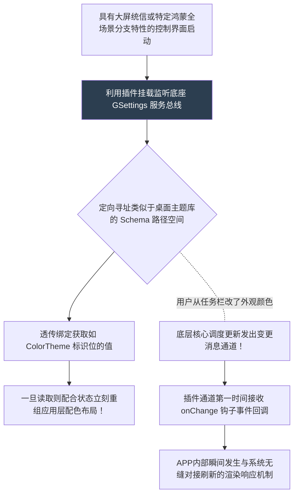

欢迎加入开源鸿蒙跨平台社区：[开源鸿蒙跨平台开发者社区](https://openharmonycrossplatform.csdn.net)

# Flutter for OpenHarmony：Flutter 三方库 gsettings 操作底层兼容桌面配置基座的核心桥梁

## 前言

随着鸿蒙（OpenHarmony）生态圈的扩张，开发场景已不再局限于移动手机端，它早已被广泛部署于大屏智慧中枢以及各类带有 PC 端桌面级交互的设备系统中。如果你试图开发一个能深深扎根系统并能自由读取系统全局偏好设定（诸如：**系统深色模式开关、全局护眼色温、底座壁纸参数**）的应用，在过去往往需要复杂的 C++ 互操作能力。

`gsettings` 打破了这些屏障！它是一款极其精良的让 Flutter 跨越应用层与系统级配置总线（如类 Linxu 独有的 DBus/GSettings 特质管理器）进行双向沟通的包。它让您的前台业务不仅具备内部配置能力，更可以全天候侦测并随系统底层的环境设定变化而完美联动。

## 一、原理解析 / 概念介绍

### 1.1 基础概念

通常系统的深层全局配置类似于庞大的注册网络（注册表或配置大字典）。该包不会在应用端创建冗余存储，而是直接将接口指向由系统总线管理的 Schema 字典树。它使应用既能主动抓取数据，还能以事件驱动的方式瞬间感知系统的突变异动。



### 1.2 进阶概念

- **基于 Schema 的受控空间读写策略**：底层的安全机制使得应用不能漫无目的地全库扫描。您必须精准知道自己所需的设置归属于哪个特定的配置层级组名（Schema ID）。因此对于不同操作平台的大一统内置组件系统名称规则要有预先的了解与知悉。

## 二、核心 API / 组件详解

### 2.1 获取并深层次监视大底座环境偏爱项

只要预先找到相应的受管范围锁孔，使用它就如同存取普通本地变量一样舒适顺手：

```dart
// 引用它开始我们的全权限底层探秘控制
import 'package:gsettings/gsettings.dart';
void listenToGlobalThemeSwitch() {
  // 定义且锁定在很多桌面端被统一认定的外观主题系统命名控件表！
  const String styleSchemaId = 'org.gnome.desktop.interface';
  const String theThemeKey = 'color-scheme'; // 我们要拿的深浅颜色标识
  
  // 这其实相当于一次极度冒险跨界的寻参器对象握手获得权。
  final GSettings themeConfigHole = GSettings(styleSchemaId);
  
  // 第一步立马拿出现状的值给框架上底色
  final currentSetColorStr = themeConfigHole.getString(theThemeKey);
  print("🎨 系统在这一毫秒的主配色基调为： $currentSetColorStr");
  
  // 最值钱的高光点！你甚至不需要死循环，它帮你在底层挂载了变动通知钩子。
  themeConfigHole.keysChanged.listen((String updatedKeyName) {
     if(updatedKeyName == theThemeKey) {
        // 让应用层无感跟随环境联动
        print("🚨 底层配置发送地震级信号！因为用户切换了： ${themeConfigHole.getString(theThemeKey)}");
     }
  });
}
```

## 三、场景示例

### 3.1 场景一：深度开发制作有越权接管大底统配功能的壁纸美化系统

当您需要开发能够掌控系统的专属壁纸或屏保替换软件，可以直接越过没有提供通用 API 的困境，利用指令通道将自己的资源强制写覆盖回系统背景 `picture-uri` 键位之上！

```dart
import 'package:gsettings/gsettings.dart';
void enforceNewHarmonyDesktopWallpaper(String yourNicePicPathSandbox) {
   final GSettings bgSettingsPointer = GSettings('org.gnome.desktop.background');
   
   print("🔥 强授权通道写盘指令开启，将强制干预系统桌面表现！");
   
   // 由于路径通常有强制规范协议，需拼合标准头部并且通过桥跨度插入
   bgSettingsPointer.setString('picture-uri', 'file://$yourNicePicPathSandbox');
   bgSettingsPointer.setString('picture-uri-dark', 'file://$yourNicePicPathSandbox');
   
   print("✅ 底层改写任务透传完成！主终端背景已响应变化。");
}
```

<!-- IMAGE_PLACEHOLDER: [包含原生桌面壁纸经过该功能被强行越权接管而变成其他系统渲染壁纸图画的 UI 场景比对图] -->
<!-- 类型: 截图 -->
<!-- 内容: 展现出非原厂 APP 也具备深度打入改写系统的底层联动特效成果！ -->

## 四、要点讲解 & OpenHarmony 平台适配挑战

### 4.1 在纯粹的移动端微内核中警惕崩溃异常的熔断机制

⚠️ **必须严厉正视的执行环境制约因素！**

这款威力强大的工具并不具备绝对泛用的环境容纳度。如果鸿蒙的发行分支是专注于小内存移动设备（未能提供完备的类似 GSettings 大管理器）的话，贸然去初始化此包会抛发诸如 `Binding or Library Not Found`（缺失底层互访库）级别的灾难性异常。

✅ **安全适配机制**：绝对不应在程序主干盲目执行相关初始化！需结合 `Platform.isLinux` 等多维环境探针配合强校验的 `try...catch` 捕捉来判定。对于轻量设备需果断妥协降级，退避至运用常规的 MediaQuery 自带环境色去监听设备表现！

### 4.2 对于跨渠道厂商分版本配置 Schema 魔改造成的不对齐处理

有些分发终端会对原版 Schema 重命名（例如变更为 `com.vendor.desktop.theme`）。您需提前在该端实体物理机底层键入命令行查阅 `gsettings list-schemas` 来找准厂商独一特定的总线库，才能确保不会发生地址抛空的越界崩溃。

## 五、综合演示：底层系统偏好接管探视演武场

这是一套具备实效感知的小应用，专门用于测试并在有合规权限和类库的环境下监控底特全局变量！

```dart
import 'package:flutter/material.dart';
import 'package:gsettings/gsettings.dart';
void main() => runApp(const HardwareSettingsProbeHarmonyApp());
class HardwareSettingsProbeHarmonyApp extends StatelessWidget {
  const HardwareSettingsProbeHarmonyApp({Key? key}) : super(key: key);
  @override
  Widget build(BuildContext context) {
    return MaterialApp(
      title: '底层极其关键枢纽参数探查窗',
      theme: ThemeData(primarySwatch: Colors.deepPurple, brightness: Brightness.dark),
      home: const ConfigurationScannerScreen(),
    );
  }
}
class ConfigurationScannerScreen extends StatefulWidget {
  const ConfigurationScannerScreen({Key? key}) : super(key: key);
  @override
  _ConfigurationScannerScreenState createState() => _ConfigurationScannerScreenState();
}
class _ConfigurationScannerScreenState extends State<ConfigurationScannerScreen> {
  String _radarLogDisplay = "完全寂静：这还未使用其强制加载获取底层空间...";
  GSettings? _fontSettingsObject;
  double _currentScale = 1.0;
  @override
  void initState() {
    super.initState();
    _activateCoreBusListener();
  }
  void _activateCoreBusListener() {
      try {
         // 试图绑定并极其霸道地占用字体管理大屏配置枢纽
         _fontSettingsObject = GSettings('org.gnome.desktop.interface');
         
         double theExtractedValue = _fontSettingsObject!.getDouble('text-scaling-factor');
         setState(() {
            _currentScale = theExtractedValue;
            _radarLogDisplay = "🔗 底层完全匹配接入且捕获绑定！当前终端对全局字号极其特立的极客缩放度为: $_currentScale";
         });
         
         // 挂上极其灵敏并对底层做出感知事件抛出的通知触发线：
         _fontSettingsObject!.keysChanged.listen((chgKey) {
             if(chgKey == 'text-scaling-factor') {
                setState(() => _radarLogDisplay = "🚨 侦测到强外部底层越级控制！参数异变刷新为：${_fontSettingsObject!.getDouble(chgKey)}");
             }
         });
         
      } catch (errMsg) {
         setState(() => _radarLogDisplay = "🔴 彻底阵亡阻断！当前底层基座架构不支持带有此类特设空间架构管理器！错误：$errMsg");
      }
  }
  void _dispatchOverrideSizeCommand(double extremelyNewValue) {
       if (_fontSettingsObject == null) return;
       print("⚠️ 此操作具有极大风险极易污染并且改变大屏端展示环境基座呈现！");
       // 这是极其特权的直接对底下字典反写覆盖动作请求
       _fontSettingsObject!.setDouble('text-scaling-factor', extremelyNewValue);
       setState(() {
          _radarLogDisplay = "✅ 由前端发下强权死命令极速将底层强行抹写设置倍率替换为极为独特的 $extremelyNewValue。请去别处窗口查验效果验证！";
       });
  }
  @override
  Widget build(BuildContext context) {
    return Scaffold(
      appBar: AppBar(title: const Text('系统层极基偏好劫持通信系统实验舱'), backgroundColor: Colors.teal),
      body: SingleChildScrollView(
        padding: const EdgeInsets.symmetric(horizontal: 16, vertical: 24),
        child: Column(
          children: [
             Container(
               width: double.infinity,
               padding: const EdgeInsets.all(12),
               decoration: BoxDecoration(color: Colors.black, borderRadius: BorderRadius.circular(12)),
               child: SelectableText(
                  _radarLogDisplay, 
                  style: const TextStyle(color: Colors.limeAccent, fontSize: 13, fontFamily: 'monospace', height: 1.5)
               )
             ),
             const SizedBox(height: 30),
             if (_fontSettingsObject != null) ...[
                 const Text("极其高危的覆盖演示操作测试区", style: TextStyle(fontWeight: FontWeight.bold, fontSize: 14, color: Colors.amber)),
                 const SizedBox(height: 20),
                 Row(
                   mainAxisAlignment: MainAxisAlignment.spaceEvenly,
                   children: [
                      ElevatedButton(onPressed: () => _dispatchOverrideSizeCommand(1.0), style: ElevatedButton.styleFrom(backgroundColor: Colors.blueGrey), child: const Text("还原基线")),
                      ElevatedButton(onPressed: () => _dispatchOverrideSizeCommand(1.25), style: ElevatedButton.styleFrom(backgroundColor: Colors.redAccent), child: const Text("强行越权加粗")),
                   ],
                 )
             ]
          ],
        ),
      ),
    );
  }
}
```

<!-- IMAGE_PLACEHOLDER: [演示终端上字体由原大小通过前端越界干预致使全系统粗化的反馈截图] -->
<!-- 类型: 截图 -->
<!-- 内容: 提供从应用向全局设置写入而牵线改变底座全局环境尺寸的高权动作示范。 -->

## 六、总结

基于开源技术栈衍生的生态本身就包含各异庞杂的环境结构管理。对于针对带有独立配置总线管理器架构的大型发行版设备开发的团队而言，受制于移动端纯粹 API 对于底层环境感知的权限缺失，想要做出极具平台深层原生态融合互动的业务应用无疑充满卡壳与痛点。在这特殊舞台上，借由 `gsettings` 所能突破的这层穿越桥体存在！开发者具备了打穿界限直击底座中心进行全局控制拦截的手段！是做深应用生态体验的一把极其硬核配置屠龙刀！

📦 有关复杂环境下的深度系统集成开发等高级指导见代码库：[AtomGit 示例专栏](https://atomgit.com)
