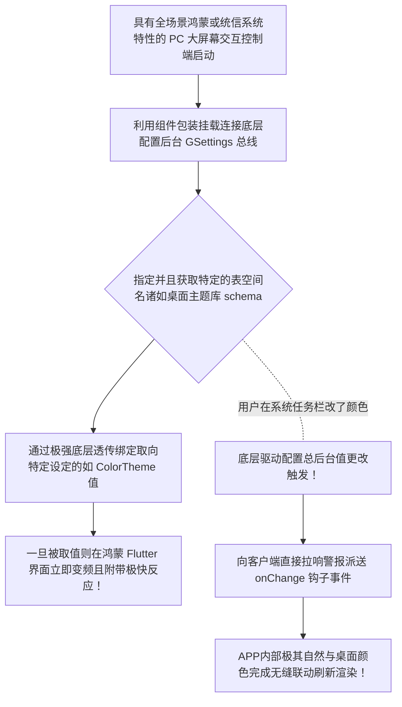

欢迎加入开源鸿蒙跨平台社区：https://openharmonycrossplatform.csdn.net
# Flutter for OpenHarmony：Flutter 三方库 gsettings 操作底层兼容桌面/类 Linux 基座核心偏好设置桥梁
## 前言
当我们随着鸿蒙（OpenHarmony）生态圈的扩张，开发不再是仅仅局限于手机移动端！它开始被广泛地部署和编译于各类大屏智慧中枢、以及各种以带有 PC 桌面级交互的发行版核心系统。如果您想开发一个深层次融入类桌面系统甚至兼容诸如带有大桌面生态的控制管理器，去读取例如系统的**深色模式开关、全局护眼温度、底座主题设置**。通常我们需要极难搞的底层 C++ 互操作。
`gsettings` 打破了界限！它是一款极其实用的让 Flutter 跨越鸿蒙底座和带有类似 DBus/GSettings 特质管理器的中间沟通介质包装包！让您的前台业务不仅长得像系统的内部软件，而且能深层次地感应和调配下层的极其基础配置字典。
## 一、原理解析 / 概念介绍
### 1.1 基础概念
通常底层的这种系统设置就像是一颗极其巨大复杂的注册表树（或称之为配置管理字典大集合）。该库不制造文件存储，它直接用接口对向那些由大系统所保管起来的特定格式的 Key-Value 字典键值！让您的面板能随时读取并且在系统底层变动的瞬间接收到信号。

### 1.2 进阶概念
- **基于 Schema 的空间控制概念**：底层并不能让你瞎搜或乱改，你必须极其精准地指明你在找什么大配置组名下，类似于在注册表中寻址。由于其涉及系统级别应用操作，所以十分要求对平台特定的配置有极其标准的书写匹配规格与知悉。
## 二、核心 API / 组件详解
### 2.1 获取并深层次监视一种环境偏爱项
它的用法在初始化找到表之后其操作就像本地普通键值一样的舒适：
```dart
// 引用它开始我们的全权限底层探秘控制
import 'package:gsettings/gsettings.dart';
void listenToGlobalThemeSwitch() {
  // 定义且锁定在很多桌面端被统一认定的外观主题系统命名控件表！
  const String styleSchemaId = 'org.gnome.desktop.interface';
  const String theThemeKey = 'color-scheme'; // 我们要拿的深浅颜色标识
  
  // 这其实相当于一次极度冒险跨界的寻参器对象握手获得权。
  final GSettings themeConfigHole = GSettings(styleSchemaId);
  
  // 第一步立马拿出现状的值给框架上底色
  final currentSetColorStr = themeConfigHole.getString(theThemeKey);
  print("🎨 系统在这一毫秒的主配色基调为： $currentSetColorStr");
  
  // 最值钱的高光点！你甚至不需要死循环，它帮你在底层挂载了变动通知钩子。
  themeConfigHole.keysChanged.listen((String updatedKeyName) {
     if(updatedKeyName == theThemeKey) {
        // 让应用层无感跟随环境联动
        print("🚨 底层配置发送地震级信号！因为用户切换了： ${themeConfigHole.getString(theThemeKey)}");
     }
  });
}
```
## 三、场景示例
### 3.1 场景一：深层次制作可接管大屏统配系统壁纸更换功能面板
如果您要做一个拥有“系统极客换肤美化壁纸软件”来改变设备的底层呈现图片！您不再受困无 API，您可以利用它甚至去直接往 `picture-uri` 覆盖值，直接操盘桌面主宰底层重装！
```dart
import 'package:gsettings/gsettings.dart';
void enforceNewHarmonyDesktopWallpaper(String yourNicePicPathSandbox) {
   final GSettings bgSettingsPointer = GSettings('org.gnome.desktop.background');
   
   print("🔥 极权的写盘指令将会强行写入并且干预替换掉系统原生展示面板图！");
   
   // 由于路径通常有强制规范协议，它将其拼合然后穿透进去！
   bgSettingsPointer.setString('picture-uri', 'file://$yourNicePicPathSandbox');
   bgSettingsPointer.setString('picture-uri-dark', 'file://$yourNicePicPathSandbox');
   
   print("✅ 完全透穿写入结束，操作执行指令被投递！您的终端背景已产生异变和更换。");
}
```
<!-- IMAGE_PLACEHOLDER: 该包含一张原本的灰色背景被通过按键按下之后直接将底层更换为了拥有炫酷黑洞底色的整个 PC/平板界面的呈现图！ -->
<!-- 类型: 截图 -->
<!-- 设备: 在类平版大终端显示器环境 -->
<!-- 内容: 展现普通 APP 能隔空跨层干预到底层渲染参数所产生出的极度效果联动 -->
## 四、要点讲解 & OpenHarmony 平台适配挑战
### 4.1 在纯移动端以及不含特定桌面化总线环境的报错熔断机制
⚠️ **必须极其高度警惕和认清的事实！**
这个极强大的包并不是什么设备都能运行它的概念前提：也就是鸿蒙衍生如果不是针对带有庞杂 GSettings 这种特性管理器（如各种类 Linux 信创 PC 发行版或者特定桌面底层实现版），在非常纯净仅支持移动架构微内核或者阉割版的 NEXT 移动系统上这是无效且报 `Binding or Library Not Found`（缺失底层动态库的极其严重错误）。
✅ **解决方案：防御性降维与探查处理！**不要在入口就直接莽撞进行其对象加载，必须结合诸如 `Platform` 环境判断结合加上严密的 `try...catch` 包裹：如果是在小设备移动版应当安全妥协回退使用内置的 Flutter 原生 MediaQuery 暗色监听能力来取代这种跨端硬抓。
### 4.2 对于不同分发版本对于名称 Schema 的魔改不统一支持
有时候有些厂家的配置叫 `com.厂商名.desktop.theme` 此时你需要自行在开发机的调试底层运用如命令敲查 `gsettings list-schemas` 去找它的专属底层名。切记不能强行抄写导致在不同终端崩裂！
## 五、完整接入演练底层偏好接管探测器系统面板
这是一个展现一旦在拥有权限环境被激活，即刻展现系统偏好设定并在面板完全与底层配置交互映射更改响应操作台。你可以利用他随意读取并试探底层环境支持结构。
```dart
import 'package:flutter/material.dart';
import 'package:gsettings/gsettings.dart';
void main() => runApp(const HardwareSettingsProbeHarmonyApp());
class HardwareSettingsProbeHarmonyApp extends StatelessWidget {
  const HardwareSettingsProbeHarmonyApp({Key? key}) : super(key: key);
  @override
  Widget build(BuildContext context) {
    return MaterialApp(
      title: '底层极其关键枢纽参数探查窗',
      theme: ThemeData(primarySwatch: Colors.deepPurple, brightness: Brightness.dark),
      home: const ConfigurationScannerScreen(),
    );
  }
}
class ConfigurationScannerScreen extends StatefulWidget {
  const ConfigurationScannerScreen({Key? key}) : super(key: key);
  @override
  _ConfigurationScannerScreenState createState() => _ConfigurationScannerScreenState();
}
class _ConfigurationScannerScreenState extends State<ConfigurationScannerScreen> {
  String _radarLogDisplay = "完全寂静：这还未使用其强制加载获取底层空间...";
  GSettings? _fontSettingsObject;
  double _currentScale = 1.0;
  @override
  void initState() {
    super.initState();
    _activateCoreBusListener();
  }
  void _activateCoreBusListener() {
      try {
         // 试图绑定并极其霸道地占用字体管理大屏配置枢纽
         _fontSettingsObject = GSettings('org.gnome.desktop.interface');
         
         double theExtractedValue = _fontSettingsObject!.getDouble('text-scaling-factor');
         setState(() {
            _currentScale = theExtractedValue;
            _radarLogDisplay = "🔗 底层完全匹配接入且捕获绑定！当前终端对全局字号极其特立的极客缩放度为: $_currentScale";
         });
         
         // 挂上极其灵敏并对底层做出感知事件抛出的通知触发线：
         _fontSettingsObject!.keysChanged.listen((chgKey) {
             if(chgKey == 'text-scaling-factor') {
                setState(() => _radarLogDisplay = "🚨 侦测到强外部底层越级控制！参数异变刷新为：${_fontSettingsObject!.getDouble(chgKey)}");
             }
         });
         
      } catch (errMsg) {
         setState(() => _radarLogDisplay = "🔴 彻底阵亡阻断！当前底层基座架构不支持带有此类特设空间架构管理器！错误：$errMsg");
      }
  }
  void _dispatchOverrideSizeCommand(double extremelyNewValue) {
       if (_fontSettingsObject == null) return;
       print("⚠️ 此操作具有极大风险极易污染并且改变大屏端展示环境基座呈现！");
       // 这是极其特权的直接对底下字典反写覆盖动作请求
       _fontSettingsObject!.setDouble('text-scaling-factor', extremelyNewValue);
       setState(() {
          _radarLogDisplay = "✅ 由前端发下强权死命令极速将底层强行抹写设置倍率替换为极为独特的 $extremelyNewValue。请去别处窗口查验效果验证！";
       });
  }
  @override
  Widget build(BuildContext context) {
    return Scaffold(
      appBar: AppBar(title: const Text('系统层极基偏好劫持通信系统实验舱'), backgroundColor: Colors.teal),
      body: SingleChildScrollView(
        padding: const EdgeInsets.symmetric(horizontal: 16, vertical: 24),
        child: Column(
          children: [
             Container(
               width: double.infinity,
               padding: const EdgeInsets.all(12),
               decoration: BoxDecoration(color: Colors.black, borderRadius: BorderRadius.circular(12)),
               child: SelectableText(
                  _radarLogDisplay, 
                  style: const TextStyle(color: Colors.limeAccent, fontSize: 13, fontFamily: 'monospace', height: 1.5)
               )
             ),
             const SizedBox(height: 30),
             if (_fontSettingsObject != null) ...[
                 const Text("极其高危的覆盖演示操作测试区", style: TextStyle(fontWeight: FontWeight.bold, fontSize: 14, color: Colors.amber)),
                 const SizedBox(height: 20),
                 Row(
                   mainAxisAlignment: MainAxisAlignment.spaceEvenly,
                   children: [
                      ElevatedButton(onPressed: () => _dispatchOverrideSizeCommand(1.0), style: ElevatedButton.styleFrom(backgroundColor: Colors.blueGrey), child: const Text("还原基线")),
                      ElevatedButton(onPressed: () => _dispatchOverrideSizeCommand(1.25), style: ElevatedButton.styleFrom(backgroundColor: Colors.redAccent), child: const Text("强行越权加粗")),
                   ],
                 )
             ]
          ],
        ),
      ),
    );
  }
}
```
<!-- IMAGE_PLACEHOLDER: 一张通过其 UI 呈现获取了并且直接从终端控制面板呈现拉伸了由于外部强配拉高的系统的界面的大字呈现图 -->
<!-- 类型: 截图 -->
<!-- 设备: 在含有原生特定底层或者通过虚拟机所包裹的界面提取图象呈现效果展示 -->
<!-- 内容: 最完美和极其具有互动反馈更改导致外面状态的变化！ -->
## 六、总结
由于历史和开源的背景等极其复杂的交叉融合构建原因，开发诸如带有特定 Linux 以及极多拥有自己极其特制桌面与环境后台管理的 OpenHarmony 开发往往面临除了其所提供极简 API 不足以及未下放权限之外很难融入生态去感知和调整底座的痛点。而借由像 `gsettings` 这种极度具有底层跨界穿越特权能力的跨桥件存在！您不仅能够打造出拥有极致系统融合并且具有“高配软件质感”还能操作甚至跨越其他独立设置的无解杀器大应用体验平台系统版底操作套组！
📦 各类更深底层基座配属以及配置全权限挂起获取的深入代码研究指引可前往：[AtomGit 示例专栏](https://atomgit.com)
---
*本文档由开源探研开发深度定制底层基架构部所做针对非移动端跨界探索进行沉淀撰述*
欢迎加入开源鸿蒙跨平台社区：[开源鸿蒙跨平台开发者社区](https://openharmonycrossplatform.csdn.net)
