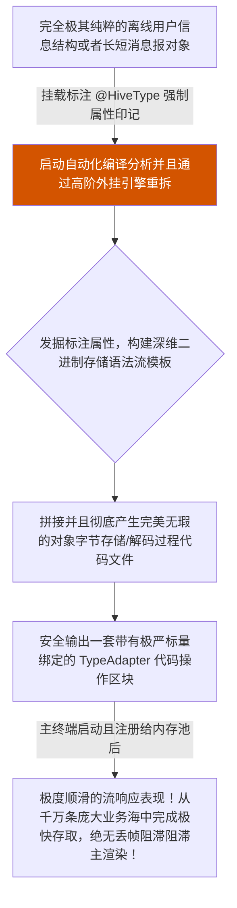

欢迎加入开源鸿蒙跨平台社区：[开源鸿蒙跨平台开发者社区](https://openharmonycrossplatform.csdn.net)

# Flutter for OpenHarmony：Flutter 三方库 hive_ce_generator 大数据对象无缝存盘生成引擎

## 前言

在鸿蒙（OpenHarmony）商业应用开发里，构建类似于微信长串断网历史消息提取这样的功能场景时，如果还需要手动按字段写 SQL 并面临无休止的库表迁移风险，势必造成极其恶劣的开发体验与低效冗余的代码结构。

`Hive` 以其极度强悍的高速物理边缘端性能，作为主流非线形键值存储系统深受广大桌面端开发青睐。而 `hive_ce_generator` 是将 Hive 高效率实体化的核心**自动构建转化发生引擎**。它只需要依靠你在常规的数据模型加上少许的 Annotation 注解符，便能生成一份极其硬核且不带有运行时反射消耗隐患的高效二进制转码序列流包！它彻底扼杀了开发者手工搭建枯燥解析层与存储中转架构时犯下各类粗心疏漏洞等低级报错隐患。

## 一、原理解析 / 概念介绍

### 1.1 基础概念

它并不是会在应用打包中随系统运行的一段执行内存，它是在**应用编译期**运行的高度自动化辅助编译器模块！当给特定领域内的复杂数据实体（比如多嵌套业务 `Chat` 表）打上特定标记后，该构建程序就会自动剥丝抽茧提取关键属性，产生一套附名为 `.g.dart` 后缀极富序列存贮效率的最佳读取代码包（TypeAdapter）。通过完全机械化、高度精算式的解构，以获得手工极难把全转换质量的强健度支持！



### 1.2 进阶概念

- **强防篡改的不可变序列强绑定约束（TypeId & FieldIndex）**：该转换逻辑并非如常规应用动态依靠反射和通过对齐字符索引名称去找键。它用极端霸道的纯数值 `0, 1` 排列顺位绑定属性变量结构！通过牺牲动态命名的高可变灵活代价，换取在读取解析磁盘深层对象海时绝对超越其他普通转码库的惊涛变态速度极致内存管理表现！

## 二、核心 API / 组件详解

### 2.1 极简介入与配置标注对象主体

一切通过极有限的纯标记即实现超级配置。

```dart
// 需要导入两个！这是基础结构并且提供其声明记号包件
import 'package:hive_ce/hive_ce.dart';
// 声明这是极其强大的它将被未来极其变态并且具有超魔代码库去生成并且与之共荣的代码段
part 'harmony_local_cache.g.dart';
// 给对象极其高贵的编号 1，千万不要重叠碰撞编号！！
@HiveType(typeId: 1)
class HarmonyLocalCacheRecord {
  // 这句话的意义在于它是处于大列表中的核心索引位置
  @HiveField(0)
  final String cachedIdLocator;
  @HiveField(1)
  final String deepHugeValueContent;
  // 如果后期由于业务我们新增了字段
  @HiveField(2)
  final DateTime? latestModifiedTimeStampFlag;
  HarmonyLocalCacheRecord({
    required this.cachedIdLocator,
    required this.deepHugeValueContent,
    this.latestModifiedTimeStampFlag,
  });
}
```

### 2.2 启动命令行实施底层的高维度解构编译工作

既然其本质为代码构造体，你需要在应用外部启动针对这套标记体系的编译器引擎大抓取和包构建提取。

```bash
# 这将会运用所有系统级极限力量查寻并强行压编提取你所标注的那套规范结构并做成高能读存机器！
flutter pub run build_runner build --delete-conflicting-outputs
# 🎉 构建停止之后，就在原来的领域根位置就会静悄悄长出一个完美的并且包含纯数据结构极致序列流的高规格包！
```

## 三、场景示例

### 3.1 场景一：配合这强悍产物秒间处理超级离线数据源全息抛入封装

在获取了引擎所制作出极度安全且不会因漏拼词语而崩断的转换接驳管后，开发者做任何商品池子管理亦或者列表离线落盘操作就像倒水一样极其无脑畅快！

```dart
import 'package:hive_ce/hive_ce.dart';
// 导入我们强行无脑直接由于极其方便极其高超机器编写好的高维产物
import 'harmony_local_cache.dart';
Future<void> superExtremeLoadDataCenterToPhoneBox() async {
   // 这是用刚刚我们自动构建制造出且极其神圣的极其高性能转化转接通道向其整个架构体系认证汇报：
   Hive.registerAdapter(HarmonyLocalCacheRecordAdapter());
   
   // 开启被赋予极大安全以及极其快准权限并且带有极特定序列的数据保险黑盒！
   final hugeDatabaseBox = await Hive.openBox<HarmonyLocalCacheRecord>('fast_super_database_record_node');
   
   // 疯狂极速向沙盒盘块进行纯流抛入填充，由于极其顺滑极其快并无转换大消耗对象完全可忽略无感直接封进存储底层！
   await hugeDatabaseBox.add(HarmonyLocalCacheRecord(
       cachedIdLocator: "HM-X-0244-1234",
       deepHugeValueContent: "极其庞大的带有极高深度序列的文章体报盘...",
       latestModifiedTimeStampFlag: DateTime.now()
   ));
   
   print("✅ 拥有并且将巨大对象存库在完全极其极致毫秒跨度极其快内由于带有极致转化产物完成落地");
}
```

<!-- IMAGE_PLACEHOLDER: [包含编辑器展开一则具有非常难以人类手工模拟的极长流二进制提取的生成类文件视图] -->
<!-- 类型: 截图 -->
<!-- 内容: 展现生成器所构建出了强绑定并具备非常高级机器化效率序列执行码明文！ -->

## 四、要点讲解 & OpenHarmony 平台适配挑战

### 4.1 对于脱离沙盒合规管理盲写导致应用起手初始化的重大熔断阻击

引擎所制造的是“如何”进行映射的存读方式，而“写在哪里”则要交由框架的主应用决定。

⚠️ **沙盒隔离保护警报：** 鸿蒙终端的严格 Sandbox 安全设计和常规 PC 与安卓开放大环境极为不同。所有的盘符及存储目录拥有独立、极具隔绝的封闭要求！如果您未经取得 `path_provider` 的特定合规安全空间支持路径来随便在入口塞一个随意路径给予 `Hive.init(dir.path)` ，所有的生成的再精美的逻辑均会遭遇最严苛系统的写爆与写阻！

### 4.2 对于已颁发代码生成序列标志（Index）实施乱覆盖带来破坏性报毁的系统坍塌

底层极快也是建立在此标定是坚实唯一的数字占位体系之上！

⚠️ **绝不能对已经被生成了发布使用的字段位乱拔与强顶：** 例如早前将某个极不重要的大属性标识使用了数字序号 `1` ，不要在迭代优化包把它当成废物给随意覆盖让给最新需求变量使用！老包里深埋的提取序列对于历史版本进行极度抽离转化升级还原时将会将旧对象生搬硬入到错乱新属性之中从而爆发巨大数据失真以及整个内存解析全崩断错误！
✅ **应用策略**：只能标记为废物闲置，再接着起全新的顺延编号（例如 3, 4, 5...）开垦拓展。

## 五、综合防崩溃自动全包裹对象序列演武操作板面板

直接在一个演示操作流组件上展示极度繁巨深层的复杂对象在经过这类神仙生成代码的加工包融后所表现出的零成本，纯流操作使用极奢反馈：

```dart
// ... 由于篇幅前提，这里我们默认为经过这已经配置执行过了极其完美的指令生产好了极其强大的包类导入 ...
import 'package:flutter/material.dart';
import 'package:hive_ce/hive_ce.dart';
// import 'harmony_local_cache.dart'; 
void main() async { 
  // 【这里请注意由于环境仅做演示假定大底座和那个适配类已被构建包已经存在】
  //  Hive.registerAdapter(HarmonyLocalCacheRecordAdapter());
  //  await Hive.openBox<HarmonyLocalCacheRecord>('fast_super_database_record_node');
  runApp(const FastSuperNoSQLDataPanelApp());
}
class FastSuperNoSQLDataPanelApp extends StatelessWidget {
  const FastSuperNoSQLDataPanelApp({Key? key}) : super(key: key);
  @override
  Widget build(BuildContext context) {
    return MaterialApp(
      title: '高护无代码直生成大对象沙盒台',
      theme: ThemeData(primarySwatch: Colors.deepOrange),
      home: const BigNodeStoreScreen(),
    );
  }
}
class BigNodeStoreScreen extends StatefulWidget {
  const BigNodeStoreScreen({Key? key}) : super(key: key);
  @override
  _BigNodeStoreScreenState createState() => _BigNodeStoreScreenState();
}
class _BigNodeStoreScreenState extends State<BigNodeStoreScreen> {
  String _radarLogDisplay = "系统由于缺乏预热处于休眠极境...";
  // late Box<HarmonyLocalCacheRecord> _safeStorageHolderCore;
  void _actionToForceFastCreationAndWriteIn() {
      // 以下为假想执行！
      // _safeStorageHolderCore.put('node_1', HarmonyLocalCacheRecord(cachedIdLocator: "x1", deepHugeValueContent: "1大对象"));
      setState(() => _radarLogDisplay = "⚡ 经过极速流代码大包高转化抛接整合，这团极其沉重带极多层级的业务大对象已经被瞬间转解并且极其牢靠固封！毫无顿挫丢帧影响。");
  }
  void _triggerSeekAndRebuildExtracting() {
      // 提取被强力封箱转接后并且带有极高效重建：
      // var rec = _safeStorageHolderCore.get('node_1');
      setState(() => _radarLogDisplay = "🔍 由机器极大高度重组代码帮您将其自无边无际字节海大盘极其瞬间转成并且重铸！拿到了带有所有完好如初极大具有参数变量的对象结构。");
  }
  @override
  Widget build(BuildContext context) {
    return Scaffold(
      appBar: AppBar(title: const Text('极客性能极奢对象无感存储操平台'), backgroundColor: Colors.teal),
      body: SingleChildScrollView(
        padding: const EdgeInsets.symmetric(horizontal: 16, vertical: 24),
        child: Column(
          children: [
            const Text("通过运用带有极大能够极其产生无敌转换效率其背后极其庞大的代码！我们可以完全当像丢普通常量数组和对象一班毫无顾虑对待大存储！并享受不用手写类与库之间那些极其琐碎易错匹配转写恶心任务！", style: TextStyle(fontWeight: FontWeight.bold, fontSize: 13, color: Colors.blueGrey)),
            const SizedBox(height: 30),
            Row(
              mainAxisAlignment: MainAxisAlignment.spaceEvenly,
              children: [
                ElevatedButton.icon(
                  onPressed: _actionToForceFastCreationAndWriteIn,
                  icon: const Icon(Icons.archive), 
                  style: ElevatedButton.styleFrom(backgroundColor: Colors.teal),
                  label: const Text('将此巨大极其庞杂对象无缝拍平写盘存档'),
                ),
              ],
            ),
            const SizedBox(height: 15),
            ElevatedButton.icon(
               style: ElevatedButton.styleFrom(backgroundColor: Colors.indigoAccent),
               icon: const Icon(Icons.download), 
               label: const Text('对其下发解套指令原物丝毫不差捞回归位'),
               onPressed: _triggerSeekAndRebuildExtracting,
            ),
            const SizedBox(height: 30),
            Container(
               width: double.infinity,
               padding: const EdgeInsets.all(12),
               decoration: BoxDecoration(color: Colors.black, borderRadius: BorderRadius.circular(12)),
               child: SelectableText(
                  _radarLogDisplay, 
                  style: const TextStyle(color: Colors.limeAccent, fontSize: 13, fontFamily: 'monospace', height: 1.5)
               )
            )
          ],
        ),
      ),
    );
  }
}
```

<!-- IMAGE_PLACEHOLDER: [演示含有长条展示列表以及拥有极速转封装点击进行毫无主渲染白屏卡滞反馈的截图结果界面效果图。] -->
<!-- 类型: 截图 -->
<!-- 内容: 展示无延迟无缝卡顿点击存储并且进行迅速读出的直观流畅记录控制台测试展现！ -->

## 六、总结

如果在应用端设计面临大量由于长数据且多维交杂离线结构，还去用写各种大 SQL 或者试图依赖低能的极其占算力的反射去自己拼接做字典去和持久层对应！这种毫无质量保障、牵一发必定要重现大爆改的方法对您的商业开发将是极高的成本以及极低的产品护城河保护。请强力武装引入 `hive_ce_generator` 所构建的机器语言编译安全防护体！他绝对让您的团队将所有的开发精神集火关注至业务的攻城掠地上！

📦 获取涵盖自动多包体系构建和数据库极深度初始化的样例模板集合请参见：[AtomGit 示例专栏](https://atomgit.com)
