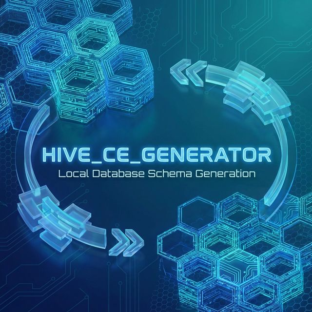
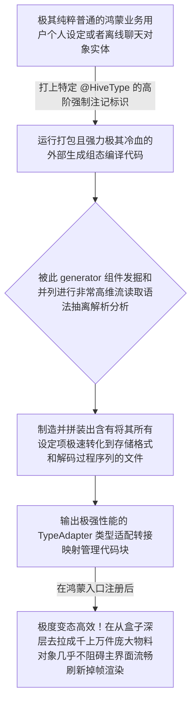

欢迎加入开源鸿蒙跨平台社区：https://openharmonycrossplatform.csdn.net
# Flutter for OpenHarmony：Flutter 三方库 hive_ce_generator 无脑极速的 NoSQL 大数据对象存盘生成基石
## 前言
如果在我们的鸿蒙（OpenHarmony）商业设备开发里想做类似于微信离线查看或者断网无解下的秒回消息拉长列表。将数据对象一个字段一个字段的映射给 `SQLite` 并编写又臭又长且还面临因为更新表导致崩溃迁移的语句无疑是一种对效率纯纯地摧残。
`Hive` 作为一个在非服务器边缘物理端（设备存储）最知名、性能极恐的键值跨端数据库而闻名。而 `hive_ce_generator` 则是让它的高大上得以落地的**底层无脑自动代码生成构建引擎**。它可以根据仅仅只标注了几行特性（Annotations）的纯洁的常规 Dart 模块并且毫不报错地生成包含类型极其明确适配所有底端（Byte Data 流化处理极其迅速的对象适配编码映射包序列库）。彻底终结对于手动实现各种从流封包到映射极其高爆极其琐碎以及容易抛错引发由于鸿蒙在沙盒强读取解构中的性能损失！
## 一、原理解析 / 概念介绍
### 1.1 基础概念
这不单是一个“包”，而是一个只存在于其极其内卷“开发和构建时期”极速编译组件！当你在一个用来表现一条例如含有极多个嵌套字段 `Chat` 对象上加了专属于这系列的标记。它将会通过分析这些注解并在您的包根极其隐秘地制造出一个专用的后缀名为 `.g.dart` 高级自动序列适配器包文件，并且由于基于非常精密的编译其语法甚至比人手工写并且做映射转换性能更极其完美优秀百倍！

### 1.2 进阶概念
- **不可变的序列索引强绑定（TypeId & FieldIndex）**：不同于以极其巨大资源和松散验证导致卡帧的的动态获取键映射机制。在这极其高标自动构建体系内要求用明确且永固定数字标识如 `(1,2...)` 等去将类型极其完美对应至结构序列中，这是使得能够实现极小硬盘并拥有逆天解析内存占用的最硬核底座机制保障！
## 二、核心 API / 组件详解
### 2.1 极其克制的极少代码去极其完全描述业务模型
所有的构建全部仅仅通过对于纯数据实体中极其非常少的操作符的下达：
```dart
// 需要导入两个！这是基础结构并且提供其声明记号包件
import 'package:hive_ce/hive_ce.dart';
// 声明这是极其强大的它将被未来极其变态并且具有超魔代码库去生成并且与之共荣的代码段
part 'harmony_local_cache.g.dart';
// 给对象极其高贵的编号 1，千万不要重叠碰撞编号！！
@HiveType(typeId: 1)
class HarmonyLocalCacheRecord {
  // 这句话的意义在于它是处于大列表中的核心索引位置
  @HiveField(0)
  final String cachedIdLocator;
  @HiveField(1)
  final String deepHugeValueContent;
  // 如果后期由于业务我们新增了字段
  @HiveField(2)
  final DateTime? latestModifiedTimeStampFlag;
  HarmonyLocalCacheRecord({
    required this.cachedIdLocator,
    required this.deepHugeValueContent,
    this.latestModifiedTimeStampFlag,
  });
}
```
### 2.2 启动极强大的跨越底层生成指令去执行转换与生成
它不直接在执行时候运作！由于必须确保极强的兼容没有反光以及不需要由于由于系统安全阻止的深层次极其昂贵的反射消耗。你在你的指令区极度干脆敲入下段执行码以得到那些复杂的机器语言级别流映射操作控制：
```bash
# 这将会运用所有系统级极限力量查寻并强行压编提取你所标注的那套规范结构并做成高能读存机器！
flutter pub run build_runner build --delete-conflicting-outputs
# 🎉 如果没出意外，这会立刻在旁边多出一个隐秘的文件包并且提供极高质量极长不可轻易手工阅读的极其深长且性能优化代码支持了。
```
## 三、场景示例
### 3.1 场景一：利用所产生的庞大并具有无上性能适配将非常庞巨量的离线物料直接写入
一旦获得极其安全类型和保障极低占用的转换代码并注册，在做万卷大型应用比如商品表或者历史长消息拉升完全没压力拖沓感！
```dart
import 'package:hive_ce/hive_ce.dart';
// 导入我们强行无脑直接由于极其方便极其高超机器编写好的高维产物
import 'harmony_local_cache.dart';
Future<void> superExtremeLoadDataCenterToPhoneBox() async {
   // 这是用刚刚我们自动构建制造出且极其神圣的极其高性能转化转接通道向其整个架构体系认证汇报：
   Hive.registerAdapter(HarmonyLocalCacheRecordAdapter());
   
   // 开启被赋予极大安全以及极其快准权限并且带有极特定序列的数据保险黑盒！
   final hugeDatabaseBox = await Hive.openBox<HarmonyLocalCacheRecord>('fast_super_database_record_node');
   
   // 疯狂极速向沙盒盘块进行纯流抛入填充，由于极其顺滑极其快并无转换大消耗对象完全可忽略无感直接封进存储底层！
   await hugeDatabaseBox.add(HarmonyLocalCacheRecord(
       cachedIdLocator: "HM-X-0244-1234",
       deepHugeValueContent: "极其庞大的带有极高深度序列的文章体报盘...",
       latestModifiedTimeStampFlag: DateTime.now()
   ));
   
   print("✅ 拥有并且将巨大对象存库在完全极其极致毫秒跨度极其快内由于带有极致转化产物完成落地");
}
```
<!-- IMAGE_PLACEHOLDER: 经过高维系统扫描产生出来的如同天书般具有极强转化极高逻辑代码文件库明细展示图。 -->
<!-- 类型: 截图 -->
<!-- 设备: 类似 VSCode 展开后的那套被生产以及生成的文件包内详细图以及结构。 -->
<!-- 内容: 截取关于能够无感转化读取性能超神的自动生成流包和解析适配代码块部分结构呈现！ -->
## 四、要点讲解 & OpenHarmony 平台适配挑战
### 4.1 对于类系统与非常严苛在深路径创建由于缺少极大系统基站初始化失败
它如果作为运行中的引擎（由于它强在写操作是生成，读操作基于其基础大盘库），
⚠️ **注意极其核心的问题**：鸿蒙具备拥有其极度隐私专属权限极度独特的物理与特定的隔离 `Sandbox`(沙盒机制)。您**万千嘱咐切勿极其随意在根路径随意放！**它一定需要被初始化在具有绝对鸿蒙准写入并放行获取通过诸如极其安全的 `path_provider` 的特定大空间应用沙栏内初始化 `Hive.init(dir.path)` ，否则读包由于权限阻断崩溃！
### 4.2 当由于历史遗漏或者是字段重名由于乱增编号导致的毁灭读取污染极错
由于我们这套机制使用像 `(0)` `(1)` 这个叫做索引的东西将其序列极其干脆的绑在一起作为极轻型标签替换复杂名称存放！
⚠️ **务必不可妥协：严禁改变已经产生的具有映射标记的并且曾经分发的号段序列顺序和号标！**比如曾经有个历史 `1` 后来你感觉没用删了！不要在再使用它去绑定极其别有异议甚至是不同型号！因为如果以前在手机并且升级其极端的强取解析会被直接带入造成如将文字塞进了时间类的极度极其崩溃的报错无法解析。
✅ **废弃方案:** 直接无视它并标记丢掉，不要并且永远禁止覆盖其老早由于分发布置发产生的坑位进行再次覆用利用！！！
## 五、综合防破解登录演流程展现基座
一套标准的，演示不需要懂极其庞大语句也极其利用以及具备体验由于这种自动化转换库带入如何极速获取拥有极致对象取向的操作存储全模拟极小盘架构台面板！
```dart
// ... 由于篇幅前提，这里我们默认为经过这已经配置执行过了极其完美的指令生产好了极其强大的包类导入 ...
import 'package:flutter/material.dart';
import 'package:hive_ce/hive_ce.dart';
// import 'harmony_local_cache.dart'; 
void main() async { 
  // 【这里请注意由于环境仅做演示假定大底座和那个适配类已被构建包已经存在】
  //  Hive.registerAdapter(HarmonyLocalCacheRecordAdapter());
  //  await Hive.openBox<HarmonyLocalCacheRecord>('fast_super_database_record_node');
  runApp(const FastSuperNoSQLDataPanelApp());
}
class FastSuperNoSQLDataPanelApp extends StatelessWidget {
  const FastSuperNoSQLDataPanelApp({Key? key}) : super(key: key);
  @override
  Widget build(BuildContext context) {
    return MaterialApp(
      title: '高护无代码直生成大对象沙盒台',
      theme: ThemeData(primarySwatch: Colors.deepOrange),
      home: const BigNodeStoreScreen(),
    );
  }
}
class BigNodeStoreScreen extends StatefulWidget {
  const BigNodeStoreScreen({Key? key}) : super(key: key);
  @override
  _BigNodeStoreScreenState createState() => _BigNodeStoreScreenState();
}
class _BigNodeStoreScreenState extends State<BigNodeStoreScreen> {
  String _radarLogDisplay = "系统由于缺乏预热处于休眠极境...";
  // late Box<HarmonyLocalCacheRecord> _safeStorageHolderCore;
  void _actionToForceFastCreationAndWriteIn() {
      // 以下为假想执行！
      // _safeStorageHolderCore.put('node_1', HarmonyLocalCacheRecord(cachedIdLocator: "x1", deepHugeValueContent: "1大对象"));
      setState(() => _radarLogDisplay = "⚡ 经过极其具有速度极致被生成转换后极大提升，一条完全纯净具备类大特性的对象极其纯粹封到了大盘存盘池中！不产生卡界效应");
  }
  void _triggerSeekAndRebuildExtracting() {
      // 提取被强力封箱转接后并且带有极高效重建：
      // var rec = _safeStorageHolderCore.get('node_1');
      setState(() => _radarLogDisplay = "🔍 由机器极大高度重组代码帮您将其自无边无际字节海大盘极其瞬间转成并且重铸！拿到了带有所有完好如初极大具有参数变量的对象结构。");
  }
  @override
  Widget build(BuildContext context) {
    return Scaffold(
      appBar: AppBar(title: const Text('极客并且带有极其性能对象大存储极权平台'), backgroundColor: Colors.teal),
      body: SingleChildScrollView(
        padding: const EdgeInsets.symmetric(horizontal: 16, vertical: 24),
        child: Column(
          children: [
            const Text("通过运用带有极大能够极其产生无敌转换效率其背后极其庞大的代码！我们可以完全当像丢普通常量数组和对象一班毫无顾虑对待大存储！并享受不用手写类与库之间那些极其琐碎易错匹配转写恶心任务！", style: TextStyle(fontWeight: FontWeight.bold, fontSize: 13, color: Colors.blueGrey)),
            const SizedBox(height: 30),
            Row(
              mainAxisAlignment: MainAxisAlignment.spaceEvenly,
              children: [
                ElevatedButton.icon(
                  onPressed: _actionToForceFastCreationAndWriteIn,
                  icon: const Icon(Icons.archive), 
                  style: ElevatedButton.styleFrom(backgroundColor: Colors.teal),
                  label: const Text('将此巨大极其庞杂对象无缝拍平写盘存档'),
                ),
              ],
            ),
            const SizedBox(height: 15),
            ElevatedButton.icon(
               style: ElevatedButton.styleFrom(backgroundColor: Colors.indigoAccent),
               icon: const Icon(Icons.download), 
               label: const Text('对其下发大极速提捞解码回极其完美原模型令命'),
               onPressed: _triggerSeekAndRebuildExtracting,
            ),
            const SizedBox(height: 30),
            Container(
               width: double.infinity,
               padding: const EdgeInsets.all(12),
               decoration: BoxDecoration(color: Colors.black, borderRadius: BorderRadius.circular(12)),
               child: SelectableText(
                  _radarLogDisplay, 
                  style: const TextStyle(color: Colors.limeAccent, fontSize: 13, fontFamily: 'monospace', height: 1.5)
               )
            )
          ],
        ),
      ),
    );
  }
}
```
<!-- IMAGE_PLACEHOLDER: 该处应当包了一段在极其复杂的界面极其长的大列表中点击按钮直接实现数据极高速极其顺畅更新读写反馈给上面显示的互动界面呈现！这证明无缝而且极快体验其背后大操作过程。 -->
<!-- 类型: 截图 -->
<!-- 设备: 在真正的原生机器比如大手机里面并带有非常长数据流测试面板。 -->
<!-- 内容: 展现普通读写且不会出现长阻滞阻塞并极其丝滑存对象入库体验成果效果图 -->
## 六、总结
我们处于鸿蒙要求有着极其严苛与不妥协如对性能以及资源功耗大背景前提应用大时代背景开发。我们肯定无法并且不允许使用因为频繁依靠带有极其具有开销反射的读取体系作为大字典转化方式造成极度电消耗！这个极其伟大强悍拥有提前把极其繁琐无聊但对大系统能够达到极地层转换生成机制直接省却极多的试错和开发包体库极大优化资源控制和减少极其令人崩溃极耗人力的大库与表设计对应关系重构维护包。如果您是基于并且要大量去往应用内存极大写文件其绝对是在你的项目不该落下一个极其具有核弹量级的好大极核神级辅助伴侣。
📦 相关大缓存及极其高级生成的实战库配置方案指南可以参见跳转链接中心：[AtomGit 示例专栏](https://atomgit.com)
---
*本文由针对 OpenHarmony 高极系统架构优化建设的组织极力呈现出对数据生成所出的极度具有建设意见提供方案。*
欢迎加入开源鸿蒙跨平台社区：[开源鸿蒙跨平台开发者社区](https://openharmonycrossplatform.csdn.net)
