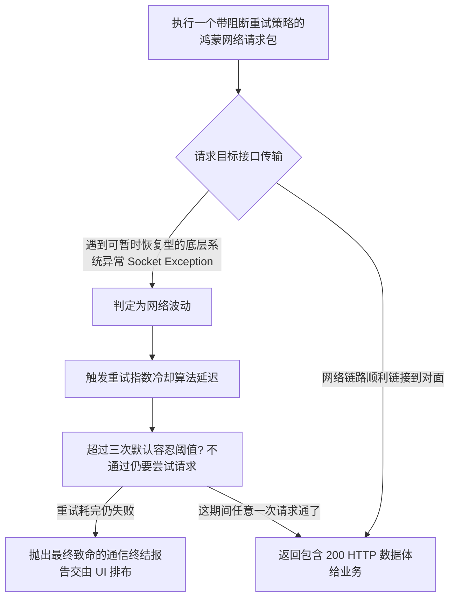

欢迎加入开源鸿蒙跨平台社区：https://openharmonycrossplatform.csdn.net
# Flutter for OpenHarmony：Flutter 三方库 http_client_helper 强大的带补偿机制的底层网络帮手（可重试客户端）
## 前言
如果在网络环境优越的实验室里测代码，您的鸿蒙（OpenHarmony）应用可能跑得畅通无阻。但若放置于复杂的野外蜂窝网络、跨区服务交接或者在用户出电梯、过隧道的恶劣场景下，极端的丢包率让普通的网络请求形同虚设。为了防止动不动就弹出丑陋的红字错误要求终端用户不停去点击“重试”，`http_client_helper` 横空出世。它并不替代标准 Http 获取机制，而是在这通信底座之上包裹了**智能超时管控与指数退避重试（Exponential Backoff Retry）的防御装甲**，完美贴合鸿蒙对于终端体验鲁棒性极高的商业准则。
## 一、原理解析 / 概念介绍
### 1.1 基础概念
该库通过实现 `dart:http` 的隐式拦截，接管了您发送数据的任务。一旦目标接口响应异常或是由于网络层级发生超时间断（Timeout），该插件能够精准识别出这些暂时的网络失联而不是服务器 404 拒绝。然后按照策略将这个废掉的请求投入恢复列车进行延迟重发。

### 1.2 进阶概念
- **重试取消机制 (Cancellation)**：即使是死循环机制也会拖延进程，当鸿蒙用户已经觉得界面不耐烦主动切回后台时，此库可提供一个令牌机制（CancellationToken），一键熔断背后孜孜不倦尝试着的僵尸请求池。
- **透明包装封装设计**：您之前使用的普通 `http.get` 和使用帮手的 `HttpClientHelper.get` 操作入参完全类似，重构成本极低！
## 二、核心 API / 组件详解
### 2.1 极简加入多重断点尝试特性的 Get 
要替代日常脆弱的一次性查询服务：
```dart
// 核心帮助引用
import 'package:http_client_helper/http_client_helper.dart';
Future<void> launchSafeHarmonyRequest() async {
  print("准备向鸿蒙天气中心服务器寻求数据...");
  
  // 核心用法：直接呼叫扩展静态帮助方法，并且制定出策略超时指标
  final response = await HttpClientHelper.get(
    Uri.parse('https://weather.harmonyos-sync.com/v1/forecast'),
    timeRetry: const Duration(milliseconds: 100), // 初次重试延迟等待
    retries: 3, // 最多容忍它 3 次崩溃！
    timeLimit: const Duration(seconds: 5), // 单次网络包握手极限必须要在 5s内否则也当作作废！
  );
  print('📡 历经阻碍，安全的拉取信息完整报文体: ${response?.body}');
}
```
### 2.2 防护机制：主动取消控制流 (CancellationToken) 
为了保障资源节约和减少应用后台无用轮播电量拉拽，我们经常在组件剥离（`dispose`）时强制掐断流：
```dart
import 'package:http_client_helper/http_client_helper.dart';
class HarmonyDataFetcher {
   /// 安全熔断开关
   final CancellationToken _token = CancellationToken();
   void fetchData() async {
     try {
         final res = await HttpClientHelper.post(
             Uri.parse('https://...'),
             cancelToken: _token,
             retries: 5
         );
         // 处理逻辑
     } on CanceledException {
         // 💡技巧：被截杀时会有极度精准捕捉报错
         print('❌ 鸿蒙拦截器提示：此网络长尝试已被手动中断终结！');
     }
   }
   
   /// 由按钮交互或者退出界面等外部操作触发此开关销毁进程。
   void cancelAllOps() {
      _token.cancel(); 
   }
}
```
## 三、场景示例
### 3.1 场景一：智能穿戴表心跳包补传协议
一块运行极鸿蒙 LiteOs 的运动表中偶尔会遇到蜂窝信号闪断。在同步体征数据至患者中央仪表盘时不能抛弃，需要不断尝试直至确认发完！
```dart
Future<bool> sendHealthHeartBeatLog(String jsonPacket) async {
   try {
     final result = await HttpClientHelper.post(
       Uri.parse('https://gateway.healthcare.com/telemetry'),
       body: jsonPacket,
       // 配置这颗请求的无尽可能！例如要求 10次强迫复推。
       retries: 10,
       timeRetry: const Duration(milliseconds: 500), 
       // 下一回合会是 1000ms 等等... 指数变频
     );
     return result?.statusCode == 200;
   } catch (e) {
     print("在尝试了漫长的岁月后通讯系统投降！需要保存为离线待传文件。");
     return false;
   }
}
```
<!-- IMAGE_PLACEHOLDER: 终端循环因为网络不佳正在输出各种请求尝试重发记录。 -->
<!-- 类型: 截图 -->
<!-- 设备: 在 Debug 终端 -->
<!-- 内容: "Request Timeout... Retrying (2/10)" 的输出效果反馈 -->
### 3.2 场景二：与第三方极不稳定微服务商的对接 
有时，外部服务器自身可能需要由于冷启动唤醒返回 502/503。这种不是用户网络断网引起的错乱也能在插件层面兜底处理。
```dart
// 注意拦截器内建会识别连接层以及常见的不可达报错并介入其行为。
// 对于那些本身 HTTP 发回来就是业务逻辑拦截时（如 403 没会员）它并不会瞎重试。
final statusReport = await HttpClientHelper.get(
    Uri.parse('https://flacky-partner-services.org/check'),
    retries: 3
);
// 巧妙将不成熟的服务硬生生扭转呈现到终端依然不卡断的情况。
```
## 四、要点讲解 & OpenHarmony 平台适配挑战
### 4.1 对于深层电池策略的博弈考量
鸿蒙（OpenHarmony）有着极为激进和优秀的后台“睡眠驻扎”电池管家策略。
⚠️ **注意事项**：如果您的应用开启了一个要求重试高达 **50 次**的死磕服务（可能是几分钟的长期占用网络通道）并且随后退到系统后台边缘，系统的休眠看门狗可能会将其视作异样进程将网络接口硬性切离。在进行鸿蒙原生化调教时，对于长连接应当配合 WorkManager 机制去运作，严禁在 UI 强耦合中无节制堆叠此方法的反复操作导致白屏卡住！
### 4.2 拦截体系替换指南
该模块由于包装相对扁平轻量，如果您整个超级应用已经基于 `Dio` 等拥有完善树形的成熟 Http 底座建立，这个工具会显得具有边界冲突。推荐在简单的边缘业务、低侵入性的工具模块里直接运用此工具直接进行。
## 五、完整运行体验示例
将您的 `main.dart` 植入这段用以直接观测这种保护效果演示的功能，您可以尝试在开启网络和断网状态下随意切断来模拟现实环境！
```dart
import 'package:flutter/material.dart';
import 'package:http_client_helper/http_client_helper.dart';
void main() => runApp(const StableNetworkApp());
class StableNetworkApp extends StatelessWidget {
  const StableNetworkApp({Key? key}) : super(key: key);
  @override
  Widget build(BuildContext context) {
    return const MaterialApp(
      title: '高护甲防断网测算',
      home: RetryingHttpTesterScreen(),
    );
  }
}
class RetryingHttpTesterScreen extends StatefulWidget {
  const RetryingHttpTesterScreen({Key? key}) : super(key: key);
  @override
  _RetryingHttpTesterScreenState createState() => _RetryingHttpTesterScreenState();
}
class _RetryingHttpTesterScreenState extends State<RetryingHttpTesterScreen> {
  String _networkResultLine = "网络传输管道尚未运作";
  bool _isLoading = false;
  final CancellationToken _cancellationToken = CancellationToken();
  Future<void> _fireFlakyRequest() async {
    setState(() {
      _isLoading = true;
      _networkResultLine = "🔥 开始冲击服务器（系统将在中途进行 3 次长延时补偿）...";
    });
    try {
      // 访问一个常常发生波动的假象模拟接口或者超时节点
      final response = await HttpClientHelper.get(
        // 这里为了模拟效果，请求一个会人为卡顿引发强制抛出错误的地方或者超强限制时间
        Uri.parse('https://httpstat.us/200?sleep=3000'), 
        timeLimit: const Duration(seconds: 1), // 刻意设置不到它的睡醒时间引发失败重提！
        retries: 3, 
        cancelToken: _cancellationToken
      );
      
      setState(() => _networkResultLine = "✅ 惊险成功！获取头：HTTP ${response?.statusCode}");
    } on CanceledException {
      setState(() => _networkResultLine = "🛑 此高压重试操作已被鸿蒙主程序果断放弃拦下！");
    } catch (e) {
      setState(() => _networkResultLine = "❌ 彻底阵亡，所有拯救补偿用尽。错误详情:\n$e");
    } finally {
      setState(() => _isLoading = false);
    }
  }
  void _manualPanicHalt() {
    _cancellationToken.cancel();
  }
  @override
  Widget build(BuildContext context) {
    return Scaffold(
      appBar: AppBar(title: const Text('健壮级 HTTP 断网重发枢纽展示'), backgroundColor: Colors.teal),
      body: Center(
        child: Padding(
          padding: const EdgeInsets.all(24.0),
          child: Column(
            mainAxisAlignment: MainAxisAlignment.center,
            children: [
               Text(_networkResultLine, 
                   textAlign: TextAlign.center,
                   style: const TextStyle(fontWeight: FontWeight.bold, fontSize: 16)),
               const SizedBox(height: 40),
               if (_isLoading) ...[
                 const CircularProgressIndicator(),
                 const SizedBox(height: 20),
                 ElevatedButton.icon(
                    style: ElevatedButton.styleFrom(backgroundColor: Colors.redAccent),
                    onPressed: _manualPanicHalt,
                    icon: const Icon(Icons.stop),
                    label: const Text('强制掐断所有重试连通包'),
                 )
               ] else 
                 ElevatedButton.icon(
                    onPressed: _fireFlakyRequest,
                    icon: const Icon(Icons.rocket_launch),
                    label: const Text('发起含有重重劫难请求任务'),
                 )
            ]
          )
        )
      )
    );
  }
}
```
<!-- IMAGE_PLACEHOLDER: 该网络保护示例界面运转期间的反馈动态截图 -->
<!-- 类型: 截图 -->
<!-- 设备: 在真实的鸿蒙系统下查看的预览效果图 -->
<!-- 内容: 点击掐断以及正在请求的高亮效果 -->
## 六、总结
由于网络情况本身就是个无解の黑盒游戏，如果每一个 `get` 或 `post` 您都需要手写一个巨大的带计数状态标志的 `while` 或者 `Timer` 块不但极不优雅、无法统一销毁、更容易搞懵代码维护者。`http_client_helper` 利用极小的空间占用代价为开发者呈现出了一整套防卫极佳的长距离补偿协议包裹，在一些低端鸿蒙节点硬件与不稳定的广域网接入时这可谓一大利器。
📦 相关深入配置实践推荐跳转核心维护专栏：[AtomGit 示例专栏](https://atomgit.com)
---
*本文档为构建新一代操作系统的跨端框架做解析沉淀*
欢迎加入开源鸿蒙跨平台社区：[开源鸿蒙跨平台开发者社区](https://openharmonycrossplatform.csdn.net)
