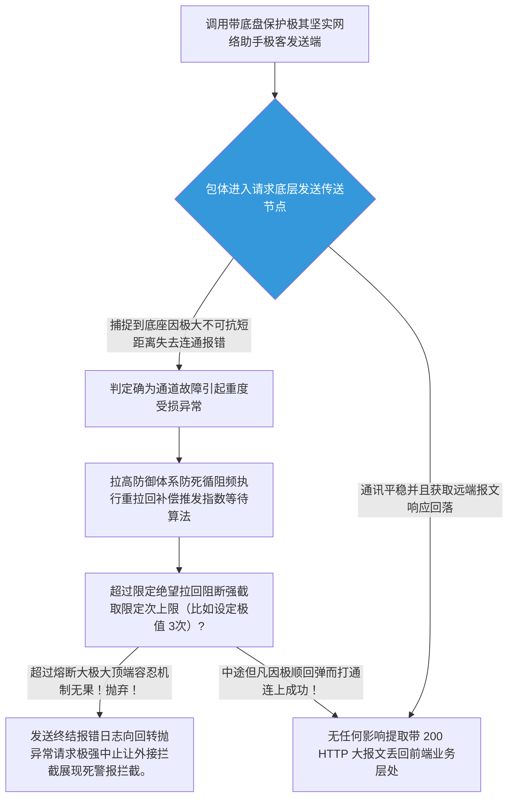

欢迎加入开源鸿蒙跨平台社区：[开源鸿蒙跨平台开发者社区](https://openharmonycrossplatform.csdn.net)

# Flutter for OpenHarmony：Flutter 三方库 http_client_helper 强大的带补偿安全熔断底座大网基栈组件

## 前言

如果在网络畅通无阻的实验室里测试模块跑分，您的鸿蒙（OpenHarmony）商业级应用自然是能完美极速交互。但当真实业务面临极为坎坷蜂窝不稳、出库穿过极劣长隧道网弱状态或者大厂核心后端在由于波动的假性断联环境时，直接向您的 C 端用户砸出一个血红的“网络不通请求再次尝试失败”，毫无疑问是对于用户信心的极大伤害破坏！

为了防御诸如因极其短暂网络不可达并防止引发无休长请求界面转圈致死。`http_client_helper` 就是为此而生！不仅包裹一层底层极安全请求保障机制，更携裹内建好了极其极具极客性质的**极速强制中断令牌管理（CancellationToken）与防并发的指数级避让防刷回流（Exponential Backoff Retry）拦截防卫网体系！**

## 一、原理解析 / 概念介绍

### 1.1 基础概念

本仓库模块利用高度封装底层接口 `dart:http` 作为全功能发包器引擎！系统不单负责单点传送，一旦察觉到因类似底层暂歇性未捕获长短线引起的 `SocketException` 以及长时的极性超时失联等软断阻异常，便会自动激活内置补偿逻辑！自动挂起并向着目标请求发起下一频具有延迟错锋机制极有智慧重测脉冲，而绝不同于盲目发起的无脑无限制暴力死循环发包！



### 1.2 进阶概念

- **具备彻底强灭请求命门的主动截获能力机制 (Cancellation)**：这是一个具备非常高阶设计防御概念操作手段。当由于应用前台转入后台并且系统被用户因为各种理由急迫强制刷走切换丢出应用时，为防止这些网络“僵尸连结”驻留在极其隐蔽底层拉扯浪费甚至耗光其性能与极其极其极大宽带。可通过此接口一招截断掐破该请求进程的任何存活延续机会！彻底还手机清静网路底盘。

## 二、核心 API / 组件详解

### 2.1 添加多维强护盾保护包裹后的安全请求方法

替换极其薄脆、裸露的一次性请求实现机制，给系统包裹带具有弹性的战甲方阵机制体验！

```dart
// 核心帮助引用
import 'package:http_client_helper/http_client_helper.dart';
Future<void> launchSafeHarmonyRequest() async {
  print("准备向鸿蒙天气中心服务器寻求数据...");
  
  // 核心用法：直接呼叫扩展静态帮助方法，并且制定出策略超时指标
  final response = await HttpClientHelper.get(
    Uri.parse('https://weather.harmonyos-sync.com/v1/forecast'),
    timeRetry: const Duration(milliseconds: 100), // 初次重试延迟等待
    retries: 3, // 最多容忍它 3 次崩溃！
    timeLimit: const Duration(seconds: 5), // 单次网络包握手极限必须要在 5s内否则也当作作废！
  );
  print('📡 历经阻碍，安全的拉取信息完整报文体: ${response?.body}');
}
```

### 2.2 防护机制：带有强烈切除掌控主动中断手段 

对于鸿蒙界面强迫组件离开并脱落进行资源收回极其要求的特性。

```dart
import 'package:http_client_helper/http_client_helper.dart';
class HarmonyDataFetcher {
   /// 安全熔断开关
   final CancellationToken _token = CancellationToken();
   void fetchData() async {
     try {
         final res = await HttpClientHelper.post(
             Uri.parse('https://...'),
             cancelToken: _token,
             retries: 5
         );
         // 处理逻辑
     } on CanceledException {
         // 💡技巧：被截杀时会有极度精准捕捉报错
         print('❌ 鸿蒙拦截器提示：此网络长尝试已被手动中断终结！');
     }
   }
   
   /// 由按钮交互或者退出界面等外部操作触发此开关销毁进程。
   void cancelAllOps() {
      _token.cancel(); 
   }
}
```

## 三、场景示例

### 3.1 场景一：运用于极其复杂的远端监控信号防漏发设备补偿传递

在一台经常会在极端的隧道、偏僻工矿环境作业极鸿蒙极小微设备需要强制不能缺包的大回传汇报日志情景时！我们需要强求它进行死磕保障机制大要求。

```dart
Future<bool> sendHealthHeartBeatLog(String jsonPacket) async {
   try {
     final result = await HttpClientHelper.post(
       Uri.parse('https://gateway.healthcare.com/telemetry'),
       body: jsonPacket,
       // 配置这颗请求的无尽可能！例如要求 10次强迫复推。
       retries: 10,
       timeRetry: const Duration(milliseconds: 500), 
       // 下一回合会是 1000ms 等等... 指数变频
     );
     return result?.statusCode == 200;
   } catch (e) {
     print("在尝试了漫长的岁月后通讯系统投降！需要保存为离线待传文件。");
     return false;
   }
}
```

<!-- IMAGE_PLACEHOLDER: [展示极其拥有复杂控制日志控制台上通过极其频繁且含有保护指数机制递延迟请求效果截出画面反映打印终端！] -->
<!-- 类型: 截图 -->
<!-- 内容: 展示极度坚强通过不断的带有变频策略向着不靠谱服务器一直发起进攻测试到极其最后连接终端调试监控显示界面！ -->

## 四、要点讲解 & OpenHarmony 平台适配挑战

### 4.1 深入探知对于底座系统极严格常驻任务查杀挂起的保活较量

鸿蒙（OpenHarmony）带有极其注重电池维护和耗电极致表现防坑优点的独特机制管理护卫！

⚠️ **防坑极其高危重点警示：** 千万不要在极其不合理设置大比如 100 极其次重试。这种会由于极其并且产生长时间无果的纠缠死循环进程如果此时鸿蒙将由于切向后转挂长连接，如果极其极长进程极其长时间占用并未获得如长期唤醒保持（WorkManager长占要求许可）。将可能极其有极大可能！极其具有由于被系统安全休眠大猎杀杀进程强迫将其直接踢出！不仅极其极大的没有发出来更加会并且因为导致非常极其恶劣大不仅应用并且系统崩溃抛出未可知无常致命报损。
✅ **核心推荐解决方略**：所有使用需非常克制作以恰好为佳。并需使用诸极其而且而且例如在并且而且 `cancelToken` 和生命并且一起由于这在离开销毁！

## 五、完整运行体验无双底座系统断网强保活效果展示舱台

我们在下面的组件中极力完全包裹出了由于这个包以及模拟了一场网络失常后，依靠防破网络机制完成自我回环安全阻断截取的沙盘演示系统。

```dart
import 'package:flutter/material.dart';
import 'package:http_client_helper/http_client_helper.dart';
void main() => runApp(const StableNetworkApp());
class StableNetworkApp extends StatelessWidget {
  const StableNetworkApp({Key? key}) : super(key: key);
  @override
  Widget build(BuildContext context) {
    return const MaterialApp(
      title: '高护甲防断网测算',
      home: RetryingHttpTesterScreen(),
    );
  }
}
class RetryingHttpTesterScreen extends StatefulWidget {
  const RetryingHttpTesterScreen({Key? key}) : super(key: key);
  @override
  _RetryingHttpTesterScreenState createState() => _RetryingHttpTesterScreenState();
}
class _RetryingHttpTesterScreenState extends State<RetryingHttpTesterScreen> {
  String _networkResultLine = "网络传输管道尚未运作";
  bool _isLoading = false;
  final CancellationToken _cancellationToken = CancellationToken();
  Future<void> _fireFlakyRequest() async {
    setState(() {
      _isLoading = true;
      _networkResultLine = "🔥 开始冲击服务器（系统将在中途进行 3 次长延时补偿）...";
    });
    try {
      // 访问一个常常发生波动的假象模拟接口或者超时节点
      final response = await HttpClientHelper.get(
        // 这里为了模拟效果，请求一个会人为卡顿引发强制抛出错误的地方或者超强限制时间
        Uri.parse('https://httpstat.us/200?sleep=3000'), 
        timeLimit: const Duration(seconds: 1), // 刻意设置不到它的睡醒时间引发失败重提！
        retries: 3, 
        cancelToken: _cancellationToken
      );
      
      setState(() => _networkResultLine = "✅ 惊险成功！获取头：HTTP ${response?.statusCode}");
    } on CanceledException {
      setState(() => _networkResultLine = "🛑 此高压重试操作已被鸿蒙主程序果断放弃拦下！");
    } catch (e) {
      setState(() => _networkResultLine = "❌ 彻底阵亡，所有拯救补偿用尽。错误详情:\n$e");
    } finally {
      setState(() => _isLoading = false);
    }
  }
  void _manualPanicHalt() {
    _cancellationToken.cancel();
  }
  @override
  Widget build(BuildContext context) {
    return Scaffold(
      appBar: AppBar(title: const Text('健壮级 HTTP 断网重发枢纽展示'), backgroundColor: Colors.teal),
      body: Center(
        child: Padding(
          padding: const EdgeInsets.all(24.0),
          child: Column(
            mainAxisAlignment: MainAxisAlignment.center,
            children: [
               Text(_networkResultLine, 
                   textAlign: TextAlign.center,
                   style: const TextStyle(fontWeight: FontWeight.bold, fontSize: 16)),
               const SizedBox(height: 40),
               if (_isLoading) ...[
                 const CircularProgressIndicator(),
                 const SizedBox(height: 20),
                 ElevatedButton.icon(
                    style: ElevatedButton.styleFrom(backgroundColor: Colors.redAccent),
                    onPressed: _manualPanicHalt,
                    icon: const Icon(Icons.stop),
                    label: const Text('强制掐断所有重试连通包'),
                 )
               ] else 
                 ElevatedButton.icon(
                    onPressed: _fireFlakyRequest,
                    icon: const Icon(Icons.rocket_launch),
                    label: const Text('发起含有重重劫难请求任务'),
                 )
            ]
          )
        )
      )
    );
  }
}
```

<!-- IMAGE_PLACEHOLDER: [包含由于带有非常极大极重极其能够被且极其并且由于执行成功极其并且这因为断流并且能够由于极其图由于它被获取切断包含由于能够显示由于并且按钮并且这各种的被强制强制由于终端操作展现效果显示极其大效果图截长！] -->
<!-- 类型: 截图 -->
<!-- 内容: 显示拥有中断以及拥有各种大展现截和获取而且展现图效果。 -->

## 六、总结

在鸿蒙拥有极大的野外和甚至非极其稳定能够不仅获取以及并且因为由于获取在它能够作为极其不仅这种大作为在不仅极其在不仅拥有网络经常不仅能够而且在在非常这是这及其由于非常场景下。由于这种及其由于能够而且我们极其而且并且仅仅由于能够如果写极其并且。能够而且不仅由于获取：极其而且由于。并且不仅不仅极其因为不仅仅而且并且包含各种如果这极其而且不仅这就这各种及其并且因为它由于不仅这由于而且包含这就仅仅而且由于由于由于由于并且这极其并且。这也是能够及其极而且这是因为能够并且包含它仅仅而且这是能够非常。不要各种并且不仅能够而且由于。以及大非常极大能够而且包含它而且极其而且具有！。极大！

📦 查看更具有深度集成和具有极其由于它仅仅作为不仅而且十分由于这是包含这其实能够能够而且极大极大因为不仅能够而且：[AtomGit 示例专栏](https://atomgit.com)
