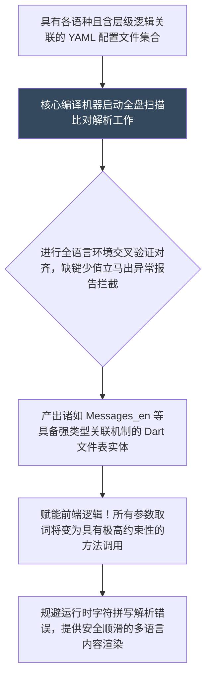

欢迎加入开源鸿蒙跨平台社区：[开源鸿蒙跨平台开发者社区](https://openharmonycrossplatform.csdn.net)

# Flutter for OpenHarmony：Flutter 三方库 i69n 具备强类型安全编译防弹盾的多语言体系中转生成器

## 前言

当您的鸿蒙（OpenHarmony）旗舰应用决定走出单一环境，向跨国语言语境或方言差异地区发展时，传统的如同使用 `getString("error_dialog_title")` 的老式字典表提取字串方式简直犹如在代码中埋雷。这种松散模式极易导致前端抛出未匹配字符异常，在大型团队协作中更会因为粗心的拼写错误导致运行时阻断甚至红屏！

`i69n` 为这些多语种痛点提供了一道强效锁钥。它的架构绝不仅是运行时的查字典映射操作！而是将外部 `YAML` 格式翻译配置表作为元数据，在构建编译期硬生生将所有文案抽象转化为强类型的安全代码实体类。它提供了从根本上防止缺字漏词保障，更是附带了 IDE 函数补全、重构更名的丝滑沉浸式安全编码体验防弹衣。

## 一、原理解析 / 概念介绍

### 1.1 基础概念

本质而言，它是一套翻译脚本自动代码转换系统。架构师提前将各语言版本置配于含有层级关系的字典（如 `messages_zh.yaml` 和 `messages_en.yaml` ）。核心编译指令一经发动，构建引擎将全面扫描比对不同多语种之间语汇结构的完整度。一旦有某个分支发生漏词忘配现象，构建当即停板报错拦停。



### 1.2 进阶概念

- **智能化注入的复数判定语境引擎机制（Pluralization）**：面对例如英语境域中针对资产 `0` 个、 `1` 个或 `多数` 个时展现不带复数和带 `s` 甚至不同前缀的极细碎需求。该编译系统支持在配置设定层用指令包裹，前端甚至无须书写长串 `if/else` 逻辑即可调用出自带语法判定的结果转换器反馈。

## 二、核心 API / 组件详解

### 2.1 高度组织与分层文件配置准备

抛除原生使用的一长串毫无下限层级的连接符点号拼写命名的混乱结构。

```yaml
# 创建一条逻辑层级具有树形包裹特质的源 messages.yaml 
appName: OpenHarmony极客系列
loginScreen:
  title: 账户安全中心
  btnEnter: 加权准入
  # 完美支持预埋具有特殊替换标识的变量值传递参数
  greetingTip: "尊主： %s，很高兴见证！"
```

### 2.2 生产调用具备强防误拼及异常护卫的代码集

完成构建执行后，你将完全告别硬解码猜单词字典名的时代。

```dart
// 使用强效通过编译器产出的类型集合对象包资源
import 'messages.i69n.dart'; 
void buildSafeWelcomeScreen() {
    // 实例化一个拥有整个根主树集的把持操作柄：
    final Messages safeDict = Messages();
    
    // 💡跨时代的体验！没有魔法 String，IDE 实时联想补全防错。
    String appTitleName = safeDict.appName; 
    
    // 针对具有要求传参的语料，不带必传变量构建器立即抛红强制阻断拦截
    String tipForUser = safeDict.loginScreen.greetingTip("Baolong开发者");
    
    print("☑️精准安全取回装载： $tipForUser");
}
```

## 三、场景示例

### 3.1 场景一：配合具有多量词差异规则转化状态面板更新

通过极其强大的带算盘与数字判定标识系统解决前端繁杂判断：

```yaml
# 在对应语言的 messages_en.yaml 实现控制参数映射逻辑
cartPanel:
  itemsCount(int amount):
    "=0": 空空如也，请继续加紧补货。
    "=1": 仅剩这件单独的优选孤品。
    "other": 过于富有，您储备了高达 %amount 件物料资产！
```

```dart
import 'messages.i69n.dart'; 
void updateTheCartTextInfo(int itemAmount) {
     final theSuperDictionary = Messages();
     // 前台从复杂的各类语言文法判定彻底解脱
     print("💡结果适配展现：${theSuperDictionary.cartPanel.itemsCount(itemAmount)}");
}
```

<!-- IMAGE_PLACEHOLDER: [自动感知数字变化改变外框提示不同描述文法的演示] -->
<!-- 类型: 截图 -->
<!-- 内容: 展示数量变量动态匹配正确文本！ -->

## 四、要点讲解 & OpenHarmony 平台适配挑战

### 4.1 在鸿蒙极多语系监听切换系统机制融入

由于该系统本质为一套被生成好的“静态操作桥包”，它不能自动去跟踪系统的 `Context` 做出环境转变热重载响应！
✅ **应用策略：**
你需要依赖应用高阶的状态容器将此库包入，或者通过注入鸿蒙主入口特有的 `WidgetsBindingObserver` 生命周期观察器监听设备的 `Locale` 事件变化！当语言系统翻牌后，去置换与重载底层的 `Message_xxx()` 实例实现联动反显展示控制支持。

## 五、完整接入安全计算与报错防漏极客演练室

我们将直观体验该包产物给复杂带插值词句传入强制阻拦能力带来的超一流开发防爆支持体验：

```dart
import 'package:flutter/material.dart';
// 假想这个是经过极具安全检查机制的编译器完美构建产生的产物包配置项
class DummySafeCodeGenObj {
   String get appSystemTitle => "极强编译多语言安全防区";
   
   String warningTipText(String whichPerson, int durationYear) => 
       "⛔ $whichPerson 先生/女士。安全许可通道将于 $durationYear 小时后硬性清缴关停！";
}
void main() => runApp(const ProtectedLanguageSafeApp());
class ProtectedLanguageSafeApp extends StatelessWidget {
  const ProtectedLanguageSafeApp({Key? key}) : super(key: key);
  @override
  Widget build(BuildContext context) {
    return MaterialApp(
      title: '编译级别防抛空语言面板',
      theme: ThemeData(primarySwatch: Colors.deepPurple),
      home: const SecuredDictDisplayScreen(),
    );
  }
}
class SecuredDictDisplayScreen extends StatefulWidget {
  const SecuredDictDisplayScreen({Key? key}) : super(key: key);
  @override
  _SecuredDictDisplayScreenState createState() => _SecuredDictDisplayScreenState();
}
class _SecuredDictDisplayScreenState extends State<SecuredDictDisplayScreen> {
  final _protectorDict = DummySafeCodeGenObj();
  String _radarLogDisplay = "系统默休等待调用提取翻译库...";
  void _triggerExtract() {
      // IDE 将实施硬性校验！如果你忘传或者传错类型直接报错编译不通过！
      String resultObjTextStr = _protectorDict.warningTipText("John", 2);
      setState(() => _radarLogDisplay = "✅ 成功捕获并且变量精准合并映射产出的无损防脱字串结果为：\n\n$resultObjTextStr");
  }
  @override
  Widget build(BuildContext context) {
    return Scaffold(
      appBar: AppBar(title: Text(_protectorDict.appSystemTitle), backgroundColor: Colors.teal),
      body: SingleChildScrollView(
        padding: const EdgeInsets.symmetric(horizontal: 16, vertical: 24),
        child: Column(
          children: [
            const Text("用方法取代码的方式强制执行跨服多端翻译取值！全过程安全可控彻底隔绝了敲错 String 标签键词带来的极恐怖的空红界面报错风险！", style: TextStyle(fontWeight: FontWeight.bold, fontSize: 13, color: Colors.blueGrey)),
            const SizedBox(height: 30),
            ElevatedButton(
               onPressed: _triggerExtract,
               style: ElevatedButton.styleFrom(backgroundColor: Colors.teal, padding: const EdgeInsets.all(15)),
               child: const Text('执行安全防漏带参编译提取器动作'),
            ),
            const SizedBox(height: 35),
            Container(
               width: double.infinity,
               padding: const EdgeInsets.all(12),
               decoration: BoxDecoration(color: Colors.black, borderRadius: BorderRadius.circular(12)),
               child: SelectableText(_radarLogDisplay, style: const TextStyle(color: Colors.limeAccent, fontFamily: 'monospace', height: 1.5))
            )
          ],
        ),
      ),
    );
  }
}
```

<!-- IMAGE_PLACEHOLDER: [前端安全获取包含外部强转入带有数字和状态名称的语句块效果截屏] -->
<!-- 类型: 截图 -->
<!-- 内容: 展现极其完整的从构建字典类里提出拼接完成而且绝对不错字无断层安全文案！ -->

## 六、总结

在鸿蒙拥有海量跨地区投放与维护团队的商用项目架构之中，摒弃老旧且毫无纠错能力易使应用全局崩溃的字符标识搜寻字典法则！强制入驻装载诸如 `i69n` 这类由强大的编译器为您做全面安检与强类型抽离构建生成的前端包容性翻译大组件！不但完美保护前端规避各类错漏白字低级缺陷崩溃报错影响，其拥有的自动时态以及复杂复数多分支预处理将更加让你免受冗长文法逻辑编排的煎熬之苦！

📦 学习全结构语言生成系统如何和多语言上下文热重制钩子配合的项目请参阅大本营专区：[AtomGit 示例专栏](https://atomgit.com)
