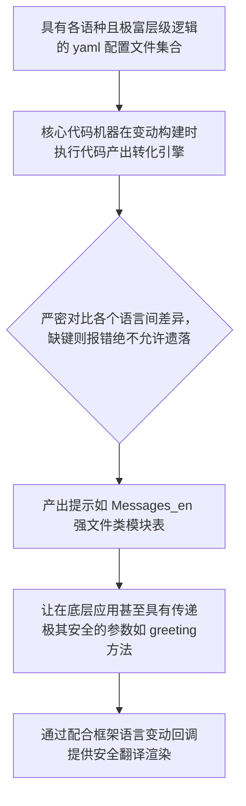

欢迎加入开源鸿蒙跨平台社区：https://openharmonycrossplatform.csdn.net
# Flutter for OpenHarmony：Flutter 三方库 i69n 极简且具有极强编译期查缺阻断机制的国际化组件
## 前言
如果有一天您所在商业鸿蒙（OpenHarmony）团队的软件产品将不仅仅投放在本土市场！比如发放在海外、或者针对不同语言文化地区发布带有定制文案与时态体系变种版本。如果您一直靠在 JSON 里采用类似于 `getString("main_title_error")` 纯字符强制拿取。那么极其容易因为拼写小错误导致界面抛空红屏！
`i69n` (也是一种 `i18n` 增强变体！)直接帮您从简明层级的 `YAML` 文件之中由代码机器抽出一切，而且全是通过生成代码让其获得像规范对象属性那样的强类型保障！它不容许漏词，并自带 IDE 属性感知提示与查错。
## 一、原理解析 / 概念介绍
### 1.1 基础概念
这不单单是个运行期的查字典组件。它核心是一套变造翻译脚本器生成系统。它要求把所有的翻译配置在各个语言如 `messages_zh.yaml` 及 `messages_en.yaml` 里极其清晰带锁关联。然后通过打包编译器将其强行抽出变成实打实的一套类代码体系。

### 1.2 进阶概念
- **智能时态与复数动态注入能力（Pluralization）**：不同的国度甚至对一个商品数量如是 `0` `1` 所代表的后缀带有千差万别。这框架能在底层提供修饰如在配置文件写逻辑转换并自动带有代码接口！
## 二、核心 API / 组件详解
### 2.1 高度组织与分层文件准备
它采用写一层极强的层级目录，告别一串没有意义的下横线拼写的点极其长名字。
```yaml
# 创建一条类似于极其层级和干净的 messages.yaml 
appName: OpenHarmony极客系列
loginScreen:
  title: 账户安全中心
  btnEnter: 加权准入
  # 完美支持直接传参强变量
  greetingTip: "尊主： %s，很高兴见证！"
```
### 2.2 产生带有报错检查生成物及极其安全运用
执行构建之后，你的代码世界不再猜字典，直接点操作。
```dart
// 使用强效产出的字典集合对象
import 'messages.i69n.dart'; 
void buildSafeWelcomeScreen() {
    // 实例化一个拥有整个主树集的把持柄：
    final Messages safeDict = Messages();
    
    // 💡跨时代的体验！你不用去手拼字符串。
    // IDE 会直接强效自动展开提示。
    String appTitleName = safeDict.appName; 
    
    // 如果需要传参，不传编译必定报错阻断
    String tipForUser = safeDict.loginScreen.greetingTip("Baolong开发者");
    
    print("☑️精准取回： $tipForUser");
}
```
## 三、场景示例
### 3.1 场景一：配合带有购物车的语言数量差异动态转换
比如你在购物车极重要求不同外语产生复数区分后缀。
```yaml
# messages_en.yaml 
cartPanel:
  itemsCount(int amount):
    "=0": 没有资产。
    "=1": 仅剩单独组件。
    "other": 富有，拥有高达 %amount 个组件包！
```
```dart
import 'messages.i69n.dart'; 
void updateTheCartTextInfo(int itemAmount) {
     final theSuperDictionary = Messages();
     // 自动大分流输出最佳特性的判断器！
     print("💡结果适配展现：${theSuperDictionary.cartPanel.itemsCount(itemAmount)}");
}
```
<!-- IMAGE_PLACEHOLDER: 展现极带有自动感知并顺改变配合极复数逻辑效果。 -->
<!-- 类型: 截图 -->
<!-- 内容: 随数字具备特定翻译自动替换改变文法！ -->
## 四、要点讲解 & OpenHarmony 平台适配挑战
### 4.1 在鸿蒙极多语系监听切换系统机制融入
由于它是个强词转类生成的引擎它并非包含应用级语言环境的热重载改变机制！
✅ **必须自己配制极好强心中介：**
您需要结合如 `WidgetsBindingObserver`里的变动区域钩子通知等结合起来侦听 `Locale` 并进行替换和热响应更换 `Message_xxx()` 实例，实现在设备发生语言操作转换的极大顺滑回变结果展现！
## 五、完整接入演练安全协议计算演示台
让我们感受极强类型安全查防机制防抛空的安全结构。
```dart
import 'package:flutter/material.dart';
// 假想这个是经过极其强大的代码器产生的包产物...
class DummySafeCodeGenObj {
   String get appSystemTitle => "极强编译多语言安全防区";
   
   String warningTipText(String whichPerson, int durationYear) => 
       "⛔ $whichPerson 先生/女士。许可需在 $durationYear 时限关停迁移！";
}
void main() => runApp(const ProtectedLanguageSafeApp());
class ProtectedLanguageSafeApp extends StatelessWidget {
  const ProtectedLanguageSafeApp({Key? key}) : super(key: key);
  @override
  Widget build(BuildContext context) {
    return MaterialApp(
      title: '极绝不错字语言护盘台',
      theme: ThemeData(primarySwatch: Colors.deepPurple),
      home: const SecuredDictDisplayScreen(),
    );
  }
}
class SecuredDictDisplayScreen extends StatefulWidget {
  const SecuredDictDisplayScreen({Key? key}) : super(key: key);
  @override
  _SecuredDictDisplayScreenState createState() => _SecuredDictDisplayScreenState();
}
class _SecuredDictDisplayScreenState extends State<SecuredDictDisplayScreen> {
  final _protectorDict = DummySafeCodeGenObj();
  String _radarLogDisplay = "系统默休...";
  void _triggerExtract() {
      // 必须带参，否则IDE立马抛红警示
      String resultObjTextStr = _protectorDict.warningTipText("John", 2);
      setState(() => _radarLogDisplay = "✅ 极其带有传槽极变量取得翻译：\n\n$resultObjTextStr");
  }
  @override
  Widget build(BuildContext context) {
    return Scaffold(
      appBar: AppBar(title: Text(_protectorDict.appSystemTitle)),
      body: SingleChildScrollView(
        padding: const EdgeInsets.symmetric(horizontal: 16, vertical: 24),
        child: Column(
          children: [
            const Text("采用直接写在其强变量方法进行传传！极大保护小失误代码崩溃！"),
            const SizedBox(height: 30),
            ElevatedButton(
               onPressed: _triggerExtract,
               child: const Text('执行安全大解析测试'),
            ),
            const SizedBox(height: 35),
            Container(
               padding: const EdgeInsets.all(12),
               decoration: BoxDecoration(color: Colors.black),
               child: SelectableText(_radarLogDisplay, style: const TextStyle(color: Colors.limeAccent))
            )
          ],
        ),
      ),
    );
  }
}
```
<!-- IMAGE_PLACEHOLDER: 通过参数直代显示其不会丢失并且拥有强关联显示的呈现包结果UI。 -->
<!-- 类型: 截图 -->
<!-- 内容: 展现普通展现并且极其翻译无缺的结果呈现。 -->
## 六、总结
在进行由于体量庞大且要团队极力维护的多文案国际环境！摒弃那一旦手抖多敲个名字必定导致抛空错误的字符串映射提取吧！`i69n` 直接运用查错能力在大代码和强结构层面杜绝小儿科文案拼错丢失引发灾难。大大强化您那鸿蒙大型航母产品的跨端底座体验！
📦 自动生成并自动匹配刷新的实物仓库可见：[AtomGit 示例专栏](https://atomgit.com)
---
*本文由极其深究极开源方向做极其提报及分享技术沉出成果。*
欢迎加入开源鸿蒙跨平台社区：[开源鸿蒙跨平台开发者社区](https://openharmonycrossplatform.csdn.net)
