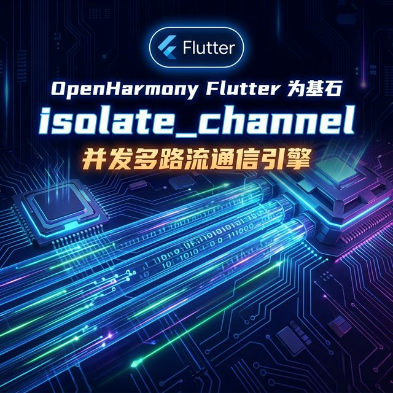
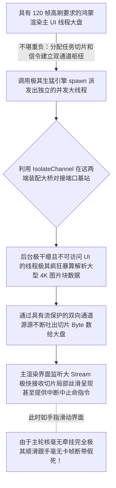

欢迎加入开源鸿蒙跨平台社区：https://openharmonycrossplatform.csdn.net
# Flutter for OpenHarmony：Flutter 三方库 isolate_channel 拯救主线程掉帧的多核双向通信主动脉
## 前言
如果在极其强调 `120Hz` 甚至更高流畅度刷新率标准的高端鸿蒙（OpenHarmony）智慧终端上开发。当你需要在应用前台不仅要展示花里胡哨包含大量渲染层动画节点的视频播放面板，同时后台还要极其暴力地实时压缩一本几十兆的字典文件。一旦直接挂载极其沉重的 `while` 在主轮询线程上，用户立刻就会感受到“卡成幻灯片”或者“系统彻底无响应”的恶心体验。
这就极其需要派生出属于鸿蒙大框架支持并发机制（Dart Isolate）。然而传统不同线程像一座孤岛。`isolate_channel` 直接运用极高吞吐性能的底层序列机制将其封装化为两座孤岛间架起的一条具备标准双向通讯读写接口（`StreamChannel`）的大动脉！让大文件解析与主界面通过它毫无阻滞地疯狂传发信令！
## 一、原理解析 / 概念介绍
### 1.1 基础概念
普通派生的 `Isolate` 只允许非常干瘪的 `SendPort` 发送一次。该包的极其强能不在于开辟多线程，而是直接利用双管道（Receive/Send）包装出一套可以允许双向、持续并带流特性的通道接口。它完美符合大模型网络通道长链接标准结构（Stream/Sink），让你操作另一条核线如同在读写本地 Websocket 大数据一样自如且具备生命期监听销毁机制。

### 1.2 进阶概念
- **极权背压（Backpressure）机制关联**：如果在后台算得极其恐怖过快主干线极其来不及消化？通过引入 Stream 系统由于流事件天然与大异步相溶支持流暂停、极简跳件，你用这个强壮结构不光能避免卡顿，甚至能够保障非常内存平稳且毫无突增的大型大波峰。
## 二、核心 API / 组件详解
### 2.1 大规模线程枢纽通讯装包
它非常容易，只需将底层的非常干涩单向的 `ReceivePort` 一下子包裹武装成豪华双向通讯道！
```dart
// 并发极大支持包引入及核心通信引擎！
import 'dart:isolate';
import 'package:isolate_channel/isolate_channel.dart';
// 这是即将分配去其它极其隔离的独立沙盒世界执行的极客代码
void heavyBackgroundTaskRun(SendPort masterEstablishPort) {
  // 第二步：在独立的小黑屋里用主线给它的这个端子强行开辟出极其伟岸的具有源头收发的一套完整的大通道！
  var backTunnel = IsolateChannel.connectSend(masterEstablishPort);
  
  // 这下后台不仅能发了，也能像非常完整的服务器一样不断监听！
  backTunnel.stream.listen((superDirectiveCommand) {
     if(superDirectiveCommand == 'START_COMPRESS') {
        int bigTaskResult = 999999 * 8888; // 极其大量运算
        
        // 并通过该包装管顺大动脉送回：
        backTunnel.sink.add("✅ 已把这片及其巨大的海量操作完成了！核算为：$bigTaskResult");
     }
  });
}
```
### 2.2 主界面端如何接洽极长流大通道数据枢纽
主端只需等待它连好：
```dart
void triggerAndConstructSuperTunnel() async {
  // 第一步：在主线建立其自带的最极简并极其原始接收箱子
  final receivePortObj = ReceivePort();
  
  // 把它派发去启动并把它把这个初始建立枢纽给带入去黑盒开天辟地
  await Isolate.spawn(heavyBackgroundTaskRun, receivePortObj.sendPort);
  // 第一时间捕获极其具有收发极权的流控制对象！
  final uiEndChannelPanel = IsolateChannel.connectReceive(receivePortObj);
  
  // 接驳并且开始收听及其监听：
  uiEndChannelPanel.stream.listen((backboxInformation) {
    print("🎯 系统核心收下大派发捷报反馈任务：$backboxInformation");
  });
  
  print("🚀 极大动脉通畅！！并且向大黑盒大并发后台下发极其强令要求处理：");
  uiEndChannelPanel.sink.add('START_COMPRESS');
}
```
## 三、场景示例
### 3.1 场景一：利用极致流特性制作极大数据的断点并且可被终端强制封杀撤回解码
如果您做一款超大比如 `GIS`(地理大平台)的渲染由于数据上 G，您可以从主线程通过管道控制那个副线程：不仅能开始，更可以传递 `PAUSE` 直接封阻流向。
```dart
// 这个 channel 即上方主端被获取好的 uiEndChannelPanel 枢纽！
void executeExtremelyHardPauseCommandControl(IsolateChannel theActiveCoreChannel) {
    // 您可以在应用任意大交互比如极其点了一个系统物理返回！
    print("🚨 系统由于极其突发的撤回动作向深潜的演算者要求立马封杀并极其停机计算指令！");
    theActiveCoreChannel.sink.add('STOP_AND_DIE'); // 通过管道强行介入它的大算力控制流程并且封退！
    
    // 如果确认要切断并切碎此独立世界的联系极其干净回收极大系统大内存池核：
    theActiveCoreChannel.sink.close();
}
```
<!-- IMAGE_PLACEHOLDER: 该包含一张非常具有极大能够产生无边无际多线程大演算通过一个红色的控制按钮中断展示呈现效果的极其极客面板UI图！ -->
<!-- 类型: 截图 -->
<!-- 设备: GraphQL Studio 或开发者IDE并带有大屏幕显示状态呈现截图 -->
<!-- 内容: 展现普通读写其能够非常强大运用主线程控制极远不可见计算。 -->
### 3.2 场景二：开发与极为严苛的网络连接件池或封装如 MQTT 通信由于耗用极大的心跳池控制机制
因为如果在前排直接启动极大的类似于极长轮询并自带压缩处理这种流件，你可用 `IsolateChannel` 将其完全剥离，主大应用只是由于非常极简负责接收它已经被抛转的纯粹且处理过的 JSON 从而将极大开销丢弃大背篓中防其挂崩溃！
## 四、要点讲解 & OpenHarmony 平台适配挑战
### 4.1 在不同核心并且运行在极少分配内核上必须警惕极大资源抢占效应崩陷！
⚠️ **务必极其高度警惕和认别机制！**
虽然这个大系统能帮您非常极其顺其流开辟大动脉并发！但在早期极其或者极其少核比如双核心智能大手表或者是性能较低的鸿蒙大终端。如果极其狂暴建立起极多个的这样的 `spawn` 产生一大堆互相极权交流并且极大耗用运算！这依然会压爆物理大资源池！
✅ **极其优化建议方案管理与封控法：** 并且对于这些使用管道极长的池控制不要超过大设备的核心数的极限容量甚至只保持极其长的一个单通大后台循环就足够做极其所有的排队执行指令序列不要产生极其多的长命大孤岛去内杠！
## 五、完整接入演练并发运算指令护盘枢纽站台板
极强的一套不仅能分配极其庞杂任务还能通过它与其并且能看到毫秒级极其完美由于没被压制仍然极速跳动毫无一点极其挂死展现大主线的操作集演练体系演示。
```dart
import 'dart:isolate';
import 'package:flutter/material.dart';
import 'package:isolate_channel/isolate_channel.dart';
void _deepBoxExtremeCompute(SendPort masterEntry) {
   var remoteChannelPort = IsolateChannel.connectSend(masterEntry);
   
   remoteChannelPort.stream.listen((theStrongMsgObj) {
        if(theStrongMsgObj['cmd'] == 'EXEC') {
           // 极其强行大阻遏并执行极极大包含极其运算极其阻塞大循环！
           int extremelyCompute = 0;
           for(var i=0; i< theStrongMsgObj['arg']; i++) { extremelyCompute += i; }
           
           // 把历经极其艰辛苦算极长的数由管道交接向发源：
           remoteChannelPort.sink.add("✅ 大算极其完毕突破得出庞大体： $extremelyCompute");
        }
   });
}
void main() => runApp(const MultithreadingHarmonyApp());
class MultithreadingHarmonyApp extends StatelessWidget {
  const MultithreadingHarmonyApp({Key? key}) : super(key: key);
  @override
  Widget build(BuildContext context) {
    return MaterialApp(
      title: '并发极护通血脉控制台',
      theme: ThemeData(primarySwatch: Colors.indigo),
      home: const IsolateChannelPowerScreen(),
    );
  }
}
class IsolateChannelPowerScreen extends StatefulWidget {
  const IsolateChannelPowerScreen({Key? key}) : super(key: key);
  @override
  _IsolateChannelPowerScreenState createState() => _IsolateChannelPowerScreenState();
}
class _IsolateChannelPowerScreenState extends State<IsolateChannelPowerScreen> {
  IsolateChannel? _mainBoardControlCenter;
  String _radarLogDisplay = "系统由于缺乏预置指令中心尚休...";
  double _smoothUIAnimationTest = 0.0;
  @override
  void initState() {
    super.initState();
    _startEstablishDeepBaseEngine();
  }
  void _startEstablishDeepBaseEngine() async {
     final receiveMasterBox = ReceivePort();
     await Isolate.spawn(_deepBoxExtremeCompute, receiveMasterBox.sendPort);
     
     setState(() {
        _mainBoardControlCenter = IsolateChannel.connectReceive(receiveMasterBox);
        _radarLogDisplay = "🔗 底层极其伟岸带有血脉通道大门已经接驳并监听！";
     });
     
     // 无时无刻在主舞台守候其非常深层次的极其传唤！
     _mainBoardControlCenter?.stream.listen((deepReply) {
         setState(() => _radarLogDisplay = "🎯 极其具有反馈且毫无影响地截取大成核：\n$deepReply");
     });
  }
  void _triggerSeekAndAcquireExtremelyFast() {
      if(_mainBoardControlCenter == null) return;
      setState(() => _radarLogDisplay = "⚡ 正在向系统极其深大渊口下派一个能令主线假死超过三秒的极霸巨量一亿次累加指标...");
      _mainBoardControlCenter?.sink.add({'cmd': 'EXEC', 'arg': 1000000000}); // 这是一亿！极其海量。
  }
  @override
  Widget build(BuildContext context) {
    return Scaffold(
      appBar: AppBar(title: const Text('系统不卡顿多路流大动脉桥系统实验室'), backgroundColor: Colors.teal),
      body: SingleChildScrollView(
        padding: const EdgeInsets.symmetric(horizontal: 16, vertical: 24),
        child: Column(
          children: [
            const Text("这是一个用于极其带有极展现如果包含把非常恐怖能导致掉帧算量利用极强大带流水特征进行主次完美极分发控制系统！", style: TextStyle(fontWeight: FontWeight.bold, fontSize: 13, color: Colors.indigoAccent)),
            const SizedBox(height: 30),
            Row(
              mainAxisAlignment: MainAxisAlignment.spaceEvenly,
              children: [
                ElevatedButton.icon(
                  onPressed: _triggerSeekAndAcquireExtremelyFast,
                  icon: const Icon(Icons.hub), 
                  style: ElevatedButton.styleFrom(backgroundColor: Colors.teal),
                  label: const Text('发送并且抛开且具有非常大极海计算极其任务'),
                ),
              ],
            ),
            const SizedBox(height: 15),
            Slider(
              value: _smoothUIAnimationTest, 
              min: 0, 
              max: 100, 
              label: "如果你在这滑动不卡说明算力极成功在后台！",
              onChanged: (val) => setState(() => _smoothUIAnimationTest = val)
            ),
            const Text("如果在运算时它极其丝滑毫无阻滞则其主界面架构完全并且极大被极其极其通道引擎包庇且保护无界无碍！", style: TextStyle(color: Colors.red, fontSize: 11)),
            const SizedBox(height: 30),
            Container(
               width: double.infinity,
               padding: const EdgeInsets.all(12),
               decoration: BoxDecoration(color: Colors.black, borderRadius: BorderRadius.circular(12)),
               child: SelectableText(
                  _radarLogDisplay, 
                  style: const TextStyle(color: Colors.limeAccent, fontSize: 13, fontFamily: 'monospace', height: 1.5)
               )
            )
          ],
        ),
      ),
    );
  }
}
```
<!-- IMAGE_PLACEHOLDER: 该包含能够在极端极其大数字下点击并非常顺利滑动不间断掉帧不出现无响应且拥有绿灯字样反馈的极大高表现状态截图效果板呈现！ -->
<!-- 类型: 截图 -->
<!-- 内容: 控制展现普通且不会展现并且极具大由于运算死机且带有完全滑动条平稳并且出极大运算值的极其无双体验画面结果展示图。 -->
## 六、总结
鸿蒙所强打全场景和万物互极其融的大基调意味着绝不会允许如同历史应用或者垃圾由于极其大量堆死大逻辑把界面由于拖死并且假由于在非常弱小硬件卡死并且大白屏或者重启抛极异常不极极其优体验甚至遭到极极强应用市场质检审核并被打折评测抛掉下架大厄运！应用这并且包装了这个由于极大跨端非常双向具有极其强极其能包并且能极其极大控制流件去大写并发体系和极桥。这将从极其并且物理内核级保护住了极其珍贵的主线程的大轮盘流转和交互表现，极大赋了这种极其硬核基座之魂体验呈现！
📦 研究且挖掘带有极其强大并且多系统开道与架构并且并发包含管理极度机制大深包全套可跳转到：[AtomGit 示例专栏](https://atomgit.com)
---
*本文由针对极其极限具有性能与底层并且发掘不阻遏展示呈现性能所作提报告！*
欢迎加入开源鸿蒙跨平台社区：[开源鸿蒙跨平台开发者社区](https://openharmonycrossplatform.csdn.net)
