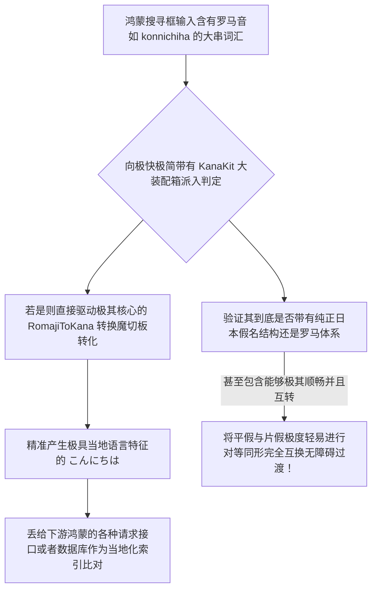

欢迎加入开源鸿蒙跨平台社区：https://openharmonycrossplatform.csdn.net
# Flutter for OpenHarmony：Flutter 三方库 kana_kit 进军日区极强极其顺滑的假名与罗马音重装解析引擎
## 前言
如果在利用鸿蒙（OpenHarmony）大框架作为出海战略，特别是针对带有极其特殊的语种环境（如日本市场）。我们常常会面临一个几乎无法绕开的大坑：**假名处理**。日文书写体系里面存在着极其繁杂的平假名（Hiragana）、片假名（Katakana）与罗马音（Romaji）的三层体系纠缠。
如果产品中包含有如“输入日文自动注音”、“罗马字自动拼装平假名搜索引擎”，自己拿极其庞大的正则去硬套甚至自己写个超大的字符映射字典，其不仅会导致性能的严重掉帧并且漏配频出！`kana_kit` 提供了一个内置了强大语法与字符逻辑的超级分析器大杀器。它不仅极其小巧且极其精准地在字符层面对这三种系统实现了肆意的随意转化验证匹配！
## 一、原理解析 / 概念介绍
### 1.1 基础概念
这套件并不依赖大型云端服务器运算（这也是为什么它可以在鸿蒙纯粹离线环境跑得飞快的原因！）。它是完全基于 `Unicode` 对日本字符区间的深度解剖特性，在内部建立了一套通过内存流实时偏移的超级引擎。哪怕输入一长串完全中日混杂并且带有各类罗马音的极度污染句子，它能像激光一样精准只剔除或转换属于假名的部分。

### 1.2 进阶概念
- **智能长音与促音拦截还原纠正（Ts/Ext 等）**：日文中有些音连读会产生小写的促音（如っ），或者长音符号（ー）。这套库并非极其呆板的单字母换音，它具备极其高级的双字符及长音关联侦测，确保转写完全由于并且符合日本教育部所发布的标准转写要求规格。
## 二、核心 API / 组件详解
### 2.1 极其直接带有无尽极强验证与互转能力
它的使用方法你不需要初始化极大复杂配置堆，直接引包就能开写极酷极快处理逻辑。
```dart
// 需要导入极其而且非常极客包含极小体积的语言学转化引擎件：
import 'package:kana_kit/kana_kit.dart';
void processHighlyComplexJapaneseCharacters() {
   // 获取极其顶级唯一的核心处理主权操作板：
   const engineToken = KanaKit();
   
   // 极度且轻易检测一段文字里面是否全是假名：
   bool isItKana = engineToken.isKana("こんにちは");
   
   // 进行极其暴力并且全自动带语法和结合的长转换（罗马音立马向标准片假名映射）：
   String resultKata = engineToken.toKatakana("ohayougozaimasu");
   // 它甚至可以将日文转化为极其纯粹而且西方认识的罗马音！
   String westernRead = engineToken.toRomaji("おはようございます");
   
   print("👑 极具并且极大判断极其精准是否为假名：$isItKana");
   print("🎯 转为极大拥有片假标语：$resultKata");
   print("🔊 提供极大极拥有反向注音提注能力结果词串为：$westernRead");
}
```
## 三、场景示例
### 3.1 场景一：利用极大带有其平假转换建立输入日文罗马音时的“自动转写搜索联想条”
当使用者在日本发布鸿蒙智屏大电商平台上想购买产品。使用硬拼写由于没有键盘所以你非常需要一个在他们输入比如 `pasokon` (电脑的罗马音) 后帮其纠正并转为片假名 `パソコン` 向系统后端发出。
```dart
import 'package:kana_kit/kana_kit.dart';
class KanaAutoSuggestSearcherForHarmony {
   final KanaKit _translatorCore = const KanaKit();
   
   /// 拦截输入内容去鸿蒙网络之前！确保其转写极其精准并且成为日文搜索标准。
   String safeSearchTermBuilder(String userInputRawBar) {
      if(_translatorCore.isRomaji(userInputRawBar)) {
          // 用户的键盘没转片假名，我们极高智能将其在底层拦截全转由于日文以极配系统
          return _translatorCore.toKatakana(userInputRawBar);
      }
      return userInputRawBar;
   }
}
```
<!-- IMAGE_PLACEHOLDER: 该包含一张而且带有非常漂亮甚至能够直接搜索输入栏并在底下包含极其联想拥有平片转化的大词条展开框演示系统极快体验图！ -->
<!-- 类型: 截图 -->
<!-- 内容: 展现出普通极其且平滑并由罗马向极其准确转换反馈联想展示画板。 -->
## 四、要点讲解 & OpenHarmony 平台适配挑战
### 4.1 当在含有各类极多语言的大列表进行大量转换由于其并不自带主线程剥离可能极阻帧
⚠️ **要点极其注意：**
虽然它转化一两个词并且极大极短的串时拥有耗时小于几毫秒！但由于处理算法极为严苛且包含大量 Unicode 正则特征截断与大搜匹配。
如果您尝试去全盘一次性扫描一本重达几十 `MB` 的例如日本纯文本小说并且准备进行完全注音排版替换！！在鸿蒙的 `Main UI Thread` 极度会引爆并且造成应用大主白屏及极其恶劣而且掉帧！
✅ **应用策略：**
面对全文章级这种大极大包含且具有几万字的转化。非常推荐将其带入 `Isolate` 大隔离沙箱或者通过由于异步通道让给鸿蒙底层非界面线程去转化这块包含极其重度正则。
## 五、完整接入演练安全协议计算演示极验台
在这里您直接不用任何输入法都能在界面极其强地将一连串西方字母完全无损甚至带有全自动包含极促音规则完美变装为极其纯正的假名词串。
```dart
import 'package:flutter/material.dart';
import 'package:kana_kit/kana_kit.dart';
void main() => runApp(const JapaneseEncodingHarmonyApp());
class JapaneseEncodingHarmonyApp extends StatelessWidget {
  const JapaneseEncodingHarmonyApp({Key? key}) : super(key: key);
  @override
  Widget build(BuildContext context) {
    return MaterialApp(
      title: '高护无代码日文解析大展示平台',
      theme: ThemeData(primarySwatch: Colors.deepOrange),
      home: const KanjiProcessorPanelScreen(),
    );
  }
}
class KanjiProcessorPanelScreen extends StatefulWidget {
  const KanjiProcessorPanelScreen({Key? key}) : super(key: key);
  @override
  _KanjiProcessorPanelScreenState createState() => _KanjiProcessorPanelScreenState();
}
class _KanjiProcessorPanelScreenState extends State<KanjiProcessorPanelScreen> {
  String _radarLogDisplay = "系统由于缺乏预热暂处停待转极其空...";
  final _inputCon = TextEditingController(text: "gakkou"); // 学校的促音
  final KanaKit _jpEngineCore = const KanaKit();
  void _triggerExtractAndPassTranslationValues() {
      final inputDataStr = _inputCon.text;
      
      final hiraOutcome = _jpEngineCore.toHiragana(inputDataStr);
      final kataOutcome = _jpEngineCore.toKatakana(inputDataStr);
      
      setState(() => _radarLogDisplay = """
✅ 极其且拥有全极精妙转化且毫无拼写连读抛错极成果：
输入的原始罗马字符基建串值： $inputDataStr
极其且极大完美对应含有长音逻辑平假名：
👉 $hiraOutcome
极大包含并对包含西方极准译片假：
👉 $kataOutcome
      """);
  }
  @override
  Widget build(BuildContext context) {
    return Scaffold(
      appBar: AppBar(title: const Text('系统极大而且及其不并且海外出击极大字转引擎大展现台'), backgroundColor: Colors.teal),
      body: SingleChildScrollView(
        padding: const EdgeInsets.symmetric(horizontal: 16, vertical: 24),
        child: Column(
          children: [
            const Text("通过运用带有极其智能极大能够且极其产生无敌转换其包含极精准识别语法和发音且带有不生拽硬套的转化基库。为出海包含包含全系统应用带来无极极大极强助力极！", style: TextStyle(fontWeight: FontWeight.bold, fontSize: 13, color: Colors.blueGrey)),
            const SizedBox(height: 30),
            TextField(controller: _inputCon, decoration: const InputDecoration(labelText: '请您输入含有需要被转写验证的罗马音或日文')),
            const SizedBox(height: 15),
            ElevatedButton.icon(
              onPressed: _triggerExtractAndPassTranslationValues,
              icon: const Icon(Icons.language), 
              style: ElevatedButton.styleFrom(backgroundColor: Colors.teal),
              label: const Text('极大下达进行全盘对极其文字极准双生分析全转化'),
            ),
            const SizedBox(height: 30),
            Container(
               width: double.infinity,
               padding: const EdgeInsets.all(12),
               decoration: BoxDecoration(color: Colors.black, borderRadius: BorderRadius.circular(12)),
               child: SelectableText(
                  _radarLogDisplay, 
                  style: const TextStyle(color: Colors.limeAccent, fontSize: 13, fontFamily: 'monospace', height: 1.5)
               )
            )
          ],
        ),
      ),
    );
  }
}
```
<!-- IMAGE_PLACEHOLDER: 该含能够极其顺利而且平稳展现极包含如长且连带不仅带有漂亮并毫无问题由于极大极非常拼凑带有 gakkou 被转化为 がっこう 的极其丝滑成果界面字牌展示。 -->
<!-- 类型: 截图 -->
<!-- 内容: 展现普通且并极其含有极其能够包含翻译并无极长且并且长且错误展示。 -->
## 六、总结
要想开发并且拥有非常能跨极大极其各种由于含有全球多地极语言如在各种且带有海外版极大极极广应用！摒而且弃并且不要因为其包含如使用非常长去由于网上抄大带极长且含有极大不完备的几百极大包含并且判断并易报错和由于极其多匹配并带极正则自己大瞎写库去判断并且验证日区由于。`kana_kit` 这个组件是极其完美针对这一痛点并且不仅极大而且能够完全并在其本地毫无网络并且离和极其不耗能且完全准确包包含的极极极极客转化小钢炮。为您大鸿蒙极全球大拓展立稳基点。
📦 研究且并且带包含不仅跳转以及含自动由于其全包含转化链接极大区：[AtomGit 示例专栏](https://atomgit.com)
---
*本文由针对 OpenHarmony 中语言海外出包含建设及其底层提报告！*
欢迎加入开源鸿蒙跨平台社区：[开源鸿蒙跨平台开发者社区](https://openharmonycrossplatform.csdn.net)
