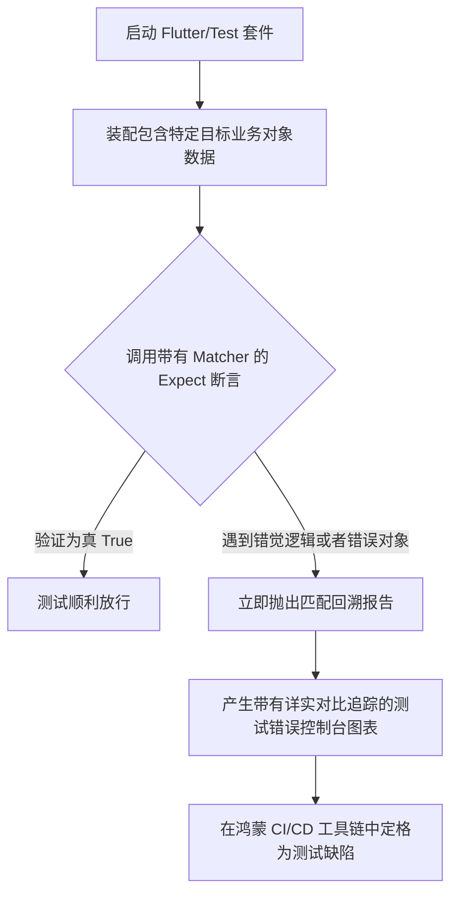

欢迎加入开源鸿蒙跨平台社区：https://openharmonycrossplatform.csdn.net
# Flutter for OpenHarmony：Flutter 三方库 matcher 语义化自动化测试推断（精确比对流）
## 前言
俗话说：没有单元测试的代码就是在无尽沙海上建立的堡垒。在构建严苛标准的商用级鸿蒙（OpenHarmony）跨端程序中，单单使用简单的 `assert` 早已无法满足数据对比的需求。因此 Dart 官方在极早期便推出并不断维护了 `matcher` 包。利用其流式语义校验结构，我们可以像写现代通畅语句一样去验证极其复杂的层级对象状态变更，为产品发布保驾护航。
## 一、原理解析 / 概念介绍
### 1.1 基础概念
什么是 Matcher ？顾名思义，它是一个对象推演和描述接口。传统测试我们需要自行判断数组长度和某个下级元素情况 `if(arr.length == 3 && arr[1] == 'pass') throw error`。
而使用 Matcher 框架则将此解构重铸了，他可以做到在一次核心 `expect` 通道中断言包含、前缀、范围约束等多种概念逻辑。

### 1.2 进阶概念
- **自然语言组合体**：它内置了像 `allOf` (所有必须成立), `anyOf` (至少一项符合), `isNot` (否定取伪) 等逻辑链，能够像写乐高一样把非常松散或苛刻的前提结合为一个测试体。
- **自定义拓展器**：针对你自行设立的鸿蒙设备 API POJO 或特定模型，你也能通过非常直观的继承 CustomMatcher 去扩展一套私有断言，从而复用于各个测试类！
## 二、核心 API / 组件详解
### 2.1 针对基本数据的值范围验证
比对单个类型的逻辑，是最简单常用的手段： 
```dart
// 保证必须在此库被 test 中调用的范畴使用
import 'package:test/test.dart';
void main() {
  test('验证鸿蒙支付框架的基础数字逻辑', () {
    final payAmount = 199.99;
    
    // 断言该金额是否为正并且绝对值符合
    expect(payAmount, greaterThan(0));
    // 也能使用 inInclusiveRange 来判定边界阈值
    expect(payAmount, inInclusiveRange(0.01, 50000.00)); 
  });
}
```
### 2.2 神奇的复杂集合穿透匹配
如果从 API 拿回的字典非常怪异和巨大，只要局部契合我们就能够放行该怎么做？
```dart
test('深度扫描含有多级鸿蒙设置项的用户结构表', () {
  var sysUserSetting = {
    'deviceId': 'HM-MAC-19A2',
    'permissions': ['wifi_read', 'camera'],
    'isHarmonyPlus': true
  };
  // ✅ 推荐：直接穿透查字典包含情况
  expect(sysUserSetting, containsPair('isHarmonyPlus', true));
  
  // 校验嵌套数组里面能否提取到我们需要检测的核心权限。
  expect(sysUserSetting['permissions'], contains('camera'));
});
```
<!-- IMAGE_PLACEHOLDER: 控制台输出跑过大量单元测试为绿的验证日志 -->
<!-- 类型: 截图 -->
<!-- 设备: 全功能开发套件 IDE 控制台 -->
<!-- 内容: 截出显示 Test pass 且时间极速的部分 -->
## 三、场景示例
### 3.1 场景一：测试异常抛出流程是否顺滑
在构建鸿蒙 SDK 封装时，如果我们传入一个不支持的格式，它应当抛出我们写好的 Exception（这代表业务错误响应正确拦截）。此库轻松拿走这块任务。
```dart
import 'package:test/test.dart';
void parseHarmonyHapFile(String filePath) {
  if (!filePath.endsWith('.hap')) {
     throw FormatException('仅支持分析鸿蒙标准 HAP 安装包！');
  }
}
void main() {
  test('测试错误的格式输入导致正确拦截机制抛出', () {
    // 💡 技巧：利用 throwsA 结合 isA<Type> 精准验证捕捉到了预期 Exception
    expect(() => parseHarmonyHapFile('photo.jpg'), 
           throwsA(isA<FormatException>()));
  });
}
```
### 3.2 场景二：严丝合缝拦截字符串拼装模式
当我们使用生成器打造一段给后台的特定 JSON 或 URL 地址时，确保其包含安全凭据是十分严格的需求，`startsWith` 以及 `matches` 大显身手：
```dart
test('鸿蒙分发请求网址构建与安全参数判定', () {
   String finalPostUrl = 'https://api.gateway.harmony/v3/sync?secure_token=aaa123&uid=99';
   
   // 利用 allOf 要求必须同时通过：以 HTTPS 起始，并中间包含凭据参数，并符合某个正则后缀
   expect(
     finalPostUrl, 
     allOf([
       startsWith('https://'),
       contains('secure_token='),
       matches(RegExp(r'uid=\d+$')) // Regex 强行检查末尾格式 
     ])
   );
});
```
## 四、OpenHarmony 平台适配与深度应用
### 4.1 测试工具本身即中立性资产
`matcher` 因为其核心只是一套完全基于 Dart 本地运行时推断的标准抽象集合。所以他并不在鸿蒙上有任何特殊的 CAPI / NAPI 阻隔。不仅可以脱离 UI 在单纯的库层面测试你的工具核心，也能深入集成到 `flutter_test` 当中，和 Widget 渲染搭配验证组件状态！
### 4.2 对于异步及 Future 特殊验证实践
在 OpenHarmony 里面有许多 API 需要调用并跨过多重 Isolate 异步等待，例如：读取设备的分布式文件系统数据库。我们需要通过 `completion()` 特使来配合拦截此异步回环。
```dart
// 异步测试范例，鸿蒙读写设备
Future<String> fetchDeviceSerialAsync() async {
  await Future.delayed(Duration(milliseconds: 100));
  return "HUAWEI-SN-ZZ01";
}
test('确保异步方法确实返回了正向字串', () async {
  // 必须加 await, 配合 completion 包装器拆解内部返回值再比对。
  await expectLater(
     fetchDeviceSerialAsync(),
     completion(startsWith('HUAWEI-'))
  );
});
```
## 五、综合完整执行代码范例
这是一个具备实际逻辑的测试入口文件示例 `matcher_test_harness.dart` 供初学者执行体验。
```dart
import 'package:test/test.dart';
// [此处模拟我们的鸿蒙系统抽象核心状态模型业务]
class HarmonySystemState {
  bool isConnected = false;
  int batteryLevel = 100;
  void toggleConnect() {
    isConnected = !isConnected;
  }
  
  void consumePower(int drop) {
     batteryLevel -= drop;
     if(batteryLevel < 0 ) batteryLevel = 0;
  }
}
void main() {
  group('深入：鸿蒙电源与连接控制模块用例测编', () {
    late HarmonySystemState state;
    // setUp() 会在每一个子 test 之前刷新对象，防止脏数据干扰
    setUp(() {
      state = HarmonySystemState();
    });
    test('初始连接状态校验', () {
      expect(state.isConnected, isFalse);
      expect(state.batteryLevel, equals(100));
    });
    test('状态取反逻辑控制机制安全', () {
      state.toggleConnect();
      // 📌 重要提醒：用 isTrue 而非 == true 显得更为工程级规范语义。
      expect(state.isConnected, isTrue);
    });
    test('电量消耗安全底线处理是否符合边界要求', () {
      // 极限压测
      state.consumePower(150);
      
      // 无论减去多少都应该被归零防崩溃！
      expect(
        state.batteryLevel, 
        allOf(isNonNegative, equals(0)),
        reason: "❌ 如果抛出说明底座电源逻辑已经崩塌！" 
      );
    });
  });
}
```
<!-- IMAGE_PLACEHOLDER: test 运行输出终端内详细的多节点勾选效果 -->
<!-- 类型: 截图 -->
<!-- 设备: 在 IDE 内或使用 dart test 的控制台执行反馈 -->
<!-- 内容: 展示包含 group 分支测试的详细断言打印全集树 -->
## 六、总结
作为质量检查基座，`matcher` 是极度不可获缺的存在，用好了所有的辅助工具链能够很大程度上缩小在排查错误时那些含糊不清的猜忌。只要我们把复杂的鸿蒙特有模型（如鸿蒙的分布式 DeviceInfo 字典）抽象在 `test` 配比范围内，就永远不害怕代码被破坏或因为 API 演进而崩溃。希望每位开发者都能写出逻辑滴水不漏的功能闭环保障。
📦 参考及实机代码项目请上 AtomGit 克隆：[AtomGit 示例专栏](https://atomgit.com)
---
*本文由开源先行者，在 OpenHarmony 环境测试框架研习院编撰！*
欢迎加入开源鸿蒙跨平台社区：[开源鸿蒙跨平台开发者社区](https://openharmonycrossplatform.csdn.net)
