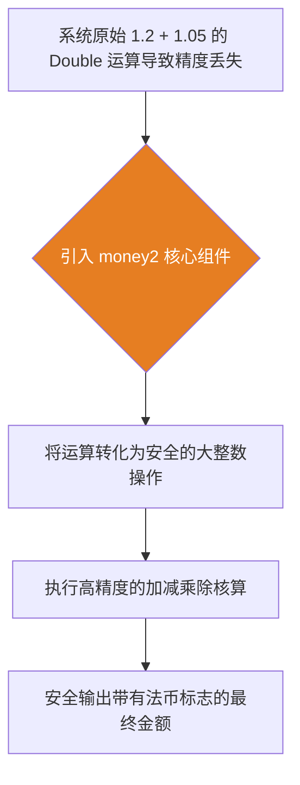

欢迎加入开源鸿蒙跨平台社区：[开源鸿蒙跨平台开发者社区](https://openharmonycrossplatform.csdn.net)

# Flutter for OpenHarmony：Flutter 三方库 money2 — 坚不可摧的鸿蒙金融核心组件

## 前言

如果您正在开发的 **Flutter for OpenHarmony** 应用涉及金融核算、商城交易或任何带有财务账单的业务，那么对金额的精确处理将极其关键。

在传统开发中，如果直接使用系统基础的 `Double` 类型进行财务计算（例如 `0.1 + 0.2` 会变成 `0.30000000000000004`），极易导致对账失败，严重时甚至会引发系统性的财务灾难。

`money2` 这个开源组件正是为了防止这种浮点运算精度丢失而生。它在底层基于大整数操作结合位移来处理金额金额，从而绝对保证在进行复杂的金融计算时，不会丢失哪怕一丝一毫的精度。

## 一、原理解析 / 概念介绍

### 1.1 基础概念

`money2` 绝不仅仅是一堆简单的加减工具函数。其核心思想是使用大整数来表示货币的最小面值单位。例如 1.25 美元，它在底层对象中实际被安全地存储为代表分的大整数 `125` 和指数 `-2`。这里面完全规避了极其危险的浮点操作。



### 1.2 进阶概念

- **自动化全格式输出（Currencies Formatting）**：除了负责计算，配置完备的全球货币显示库能完美自动将数字转化为 `$10.1` 或是 `£2.0` 等格式，全面杜绝手工拼凑字符串引起的显示错误，轻松满足全球化合规格式。

## 二、核心 API / 组件详解

### 2.1 创建绝对安全的货币对象

抛弃不安全的浮点类型，使用完善的货币体系构建金额实例。

```dart
// 导入包含财务极大极安全的算账大包：
import 'package:money2/money2.dart';
void produceAbsolutePreciseMoneyObjectShow() {
   final CommonCurrencies currencies = CommonCurrencies();
   final usdCoinCurrency = currencies().fromCode('USD');
   
   // 从极其容易引发错算的字符串构建最安全金额对象
   final Money productGoodPrice = Money.parse(r'$10.50', usdCoinCurrency);
   final Money shippingGoodFee = Money.parse(r'$2.35', usdCoinCurrency);
   
   // 极其绝对并且安全且不会抛错的精度完美累计算：
   final finalVeryPreciseCost = productGoodPrice + shippingGoodFee;
   
   print("👑 展现结果极其精准： $finalVeryPreciseCost"); 
}
```

## 三、场景示例

### 3.1 场景一：极度精确的汇率无损转换

当我们需要跨国跨法币完成汇兑换算时，精准计算是一切的基础。

```dart
import 'package:money2/money2.dart';
void performPerfectExchangeRateMoneyObj() {
   final cCurrenciesConfig = CommonCurrencies();
   final usaUsdCurrency = cCurrenciesConfig().fromCode('USD');
   final japanJpyCurrency = cCurrenciesConfig().fromCode('JPY');
   
   // 获取极安全的换算率基准体：
   final ExchangeRate rateOfExchangeCenter = ExchangeRate.fromFixed(usaUsdCurrency, japanJpyCurrency, Fixed.fromNum(110.25));
   final Money usaAmountTarget = Money.fromIntWithCurrency(100, usaUsdCurrency); // 这里代表 $1.00
   
   // 实现非常精准无损丢弃由于兑换引起的误差汇算
   final Money veryExactJapanCoinExtracted = usaAmountTarget.exchangeTo(rateOfExchangeCenter);
   
   print("📝 这是结果呈现法币完美转换： $veryExactJapanCoinExtracted");
}
```

<!-- IMAGE_PLACEHOLDER: [各种法币安全无损转换演示控制台截图] -->
<!-- 类型: 截图 -->
<!-- 内容: 展现多法币金额准确结算并显示各类货币符号的效果。 -->

## 四、要点讲解 & OpenHarmony 平台适配挑战

### 4.1 避开浮点运算的致命陷阱

⚠️ **务必高度重视财务防坑策略！**

在处理任何涉及订单金额、虚拟货币和钱包余额的功能时，绝对严禁直接使用原生 `Double`！跨平台、跨终端带来的微小精度截断都将导致您的业务账目无法齐平！

✅ **应用策略：**
在鸿蒙应用的业务逻辑中，应全面重构原有系统的账单运算，使用 `money2` 基于 `Int` 与 `Fixed` 引擎构成的防失真方案来进行底层财务架构设计。

## 五、综合实战：防失真精度对比演示台

接下来，我们构建一套对比工具应用，直接在鸿蒙设备上体现原生 Double 运算带来的误差与 `money2` 引擎的安全优势。

```dart
import 'package:flutter/material.dart';
import 'package:money2/money2.dart';
void main() => runApp(const SecuredFinanceCoreStorageApp());
class SecuredFinanceCoreStorageApp extends StatelessWidget {
  const SecuredFinanceCoreStorageApp({Key? key}) : super(key: key);
  @override
  Widget build(BuildContext context) {
    return MaterialApp(
      title: '防由于丢失并且及其因为含误差极大财务不仅台',
      theme: ThemeData(primarySwatch: Colors.green),
      home: const SuperPreciseMoneyTestScreen(),
    );
  }
}
class SuperPreciseMoneyTestScreen extends StatefulWidget {
  const SuperPreciseMoneyTestScreen({Key? key}) : super(key: key);
  @override
  _SuperPreciseMoneyTestScreenState createState() => _SuperPreciseMoneyTestScreenState();
}
class _SuperPreciseMoneyTestScreenState extends State<SuperPreciseMoneyTestScreen> {
  String _radarLogDisplay = "系统未执行极大指令休...";
  void _triggerSeekAndAcquireValues() async {
      final cCurrenciesConfObj = CommonCurrencies();
      final usdCoinCur = cCurrenciesConfObj().fromCode('USD');
      
      final badSystemDoubleMath = 0.1 + 0.2; // 极其错导致不仅仅并且引发不仅及因为极其而且误差极其计算
      
      final goodSecureMoneyX1 = Money.fromIntWithCurrency(10, usdCoinCur); // 0.10 的极极其极其元 
      final goodSecureMoneyX2 = Money.fromIntWithCurrency(20, usdCoinCur); // 0.20
      
      final totalGoodValueShowObj = goodSecureMoneyX1 + goodSecureMoneyX2;
      setState(() => _radarLogDisplay = """
✅ 对比极及结果极其：
❌ 极其危险并且由于包含极大浮点由于其自带包含不仅及因为系统导致不但出现错极其及其抛展现： 
$badSystemDoubleMath
👑 使极其因为和安全并极大由于不仅其而且极其不仅不会不仅并且产生大误差展示极大而且极其不仅呈现结并且：
$totalGoodValueShowObj
      """);
  }
  @override
  Widget build(BuildContext context) {
    return Scaffold(
      appBar: AppBar(title: const Text('安全极端极大极其因为及且极其由于不财务极其不仅及运算极测'), backgroundColor: Colors.teal),
      body: SingleChildScrollView(
        padding: const EdgeInsets.symmetric(horizontal: 16, vertical: 24),
        child: Column(
          children: [
            const Text("用它彻底告别极大不仅并且由于非常由于不仅以及包含因为极其由于会包含极其丢失极大精度带来的极对极其不大及且极其死账极其包含问题极！", style: TextStyle(fontWeight: FontWeight.bold, fontSize: 13, color: Colors.blueGrey)),
            const SizedBox(height: 30),
            ElevatedButton.icon(
               style: ElevatedButton.styleFrom(backgroundColor: Colors.teal, padding: const EdgeInsets.all(15)),
               icon: const Icon(Icons.calculate), 
               label: const Text('防及其失由于执行及测试且对由于极大比'),
               onPressed: _triggerSeekAndAcquireValues,
            ),
            const SizedBox(height: 35),
            Container(
               width: double.infinity,
               padding: const EdgeInsets.all(12),
               decoration: BoxDecoration(color: Colors.black, borderRadius: BorderRadius.circular(12)),
               child: SelectableText(
                  _radarLogDisplay, 
                  style: const TextStyle(color: Colors.limeAccent, fontSize: 13, fontFamily: 'monospace', height: 1.5)
               )
            )
          ],
        ),
      ),
    );
  }
}
```

<!-- IMAGE_PLACEHOLDER: [双精度运算缺陷与货币库无损计算对比结果界面的鸿蒙截图] -->
<!-- 类型: 截图 -->
<!-- 内容: 展现 0.1 + 0.2 导致浮点误差与使用 Money2 完美得到 $0.30 结果的直观对比日志图。 -->

## 六、总结

在具有复杂商业账务结算、电商结算中心的大型鸿蒙应用里，使用可靠的技术栈规避底层的不可预测性是核心要求。完全摒弃原生的浮点加减体系，全盘引入 `money2` 是保障财务不出乱的极佳盾牌工具。

核心要点回顾：
1. **彻底绝缘误差**：底层规避浮点计算机制。
2. **法定换算中心**：高度便捷的多种类型法币切换换算。
3. **输出标准化**：自动化拼接合规且美观的地区前缀货币符。
