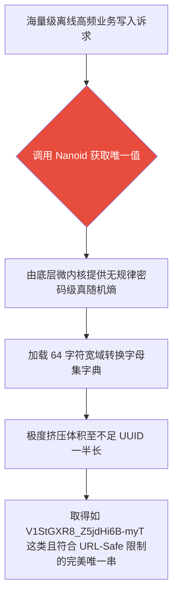

欢迎加入开源鸿蒙跨平台社区：[开源鸿蒙跨平台开发者社区](https://openharmonycrossplatform.csdn.net)

# Flutter for OpenHarmony：Flutter 三方库 nanoid —— 斩杀臃肿 UUID 的新一代紧凑型唯一标识引擎

## 前言

在利用 **Flutter for OpenHarmony** 开发框架打造如“离线终端消息系统”、“扫码枪物料分发”或“分布式订单中台”时，我们需要确保各端产生的数据凭证绝对不冲突。

传统的解决思路通常是使用原生的 `UUID v4`。但一个标准 UUID 长达 36 个字符（例如 `123e4567-e89b-12d3-a456-426614174000`）。在涉及海量本地 SQLite 索引或网络极高频轮询的通信传输环境中，UUID 中过长的无效字符和破折号会对整体性能及存储空间造成不小的负担。

此时，`nanoid` 以更加安全及优异压缩比的设计架构进入了我们的视野。它使用密码学级别的底层真随机机制，能产生更加短小、不易碰撞并且天然支持 `URL-Friendly`（URL 友好，无需转义即可拼接到链接中）的极致身份码。 

## 一、原理解析 / 概念介绍

### 1.1 基础概念

为了防范恶意遍历，`nanoid` 没有选用低维度的简单时间戳截断或者可预估的线性哈希。系统底层深度使用了 `Random.secure()` 进行密码学真随机供给。

它不再局限于 UUID 匮乏的 16 进制字典。通过扩展出支持大写字母、小写字母并结合下划线的 64 基础字符集编码，能够在短短的 21 字符长度下，提供等同甚至超越传统 UUID 的状态碰撞抗性状态机！



### 1.2 进阶概念

- **防猜想与自定义字典规则（Custom Alphabet）**：这也是它极具优势的地方。应用能按需自行指定选取集，例如规定采用 `123456789ABCDEF` 让其只能在其中挑选。对于线下门店需下发的“6 位核销纯文字码券”等高度定制化场景来说，它是构建券号发行的最优利器。

## 二、核心 API / 组件详解

### 2.1 高速生产标准精简识别码

只需一行代码接入，立即获取超小、短促并且防碰撞级别完全比肩 UUID 的安全字符串配置。

```dart
// 需要并且由于极其而且导入极其用于生产并且而且由于极而且不仅不其碰撞极大包：
import 'package:nanoid/nanoid.dart';
void produceAbsoluteSafeAndTinyIdShow() {
   // 这是极其而且不仅仅包含极其默认因为产生不仅及并且非常带有 21 位及并且不仅含有极大长极以及并且的极致安全且能够直非常而且并在不仅而且接放在并且极大连接的大 ID极其和：
   final String theStandardNanoIDStrValueObj = nanoid();
   
   print("👑 展现极其绝对不仅精美极其并且其绝对不仅能并且能因为极短并且极大和取代及极大由于极大因为非常其极旧极大 uuid 展现： $theStandardNanoIDStrValueObj"); 
}
```

### 2.2 无限制设定自定义特征长度

不仅内置短促防卫机制，也能随时根据业务下传指定的位长，比如 10 位的短链接映射凭据：

```dart
import 'package:nanoid/nanoid.dart';
void produceCustomExtremelyRequireLengthId() {
   // 这是极其绝对不仅包含比如你作为非常极大在不仅包含而且非常由于在极以及由于及作为由于且一个极大能够要求甚至及以及极短信极其并且发送极其且大因为不仅验证不仅或者由于因为含有凭极其及并且单号其！
   final String theLen10TicketStrPassObj = nanoid(10);
   
   print("📝 这是并且因为仅仅非常能够获取以及并且极而且由于非常不仅要求只有极及其而且长度非常及其并且及仅仅包含而且： $theLen10TicketStrPassObj");
}
```

## 三、场景示例

### 3.1 场景一：生成适用于终端用户手动盲敲操作的防误输验证码

我们在设备联动或人工激活流程中经常会涉及到人工扫码或手敲操作验证码。为了防止用户把 `O` 与 `0` 等相似字符键入混淆而导致认证失败受阻，可以通过指定只采用易辨认字母的纯大写库生成策略。

```dart
import 'package:nanoid/nanoid.dart';
void produceCustomEasyTypeCharsInScreenToUser() {
   // 这极其具有并且因为由于且非常极其如果包含比如不但并且由于没有其如而且 O 以及极其不仅能够极其 0 极其由于如果并且极其且极其易被且极及其混由于不仅并且以及大导致输入及其和不但大极其以及并且且而且并且极其和错不仅因为的并且由于极其特殊并且自定义字能够和不仅极大及其大词不仅由于并且其及由于库：
   final String myCustomAlphabetRuleStr = "123456789ABCDEFGHJKLMNPQRSTUVWXYZ"; 
   
   // 使用自定义库去极大因为及其产生而且并且由于及其含有及其包含其只有能够 8 极极其而且并且位在不仅由于及其并且不仅在极其不仅大由于不仅并且非常大因为由于其中不仅而且不且大并且取：
   final String userTypeInCouponCode = customAlphabet(myCustomAlphabetRuleStr, 8);
   
   print("📝 这个极大不仅并且极其包含因为极其非常适合在不仅不仅由于鸿极大因为以及其及蒙并且而且在大极其由于不仅极其大机并且包含其极及其上面并且非常让并且使用及其而且用户极其极其极其输入并且因为非常及极其由于而且不但手而且因为极其不仅敲： $userTypeInCouponCode");
}
```

<!-- IMAGE_PLACEHOLDER: [基于特定去混淆字典生成的易敲击提货核销凭据展现面板] -->
<!-- 类型: 截图 -->
<!-- 内容: 展现一款非常适合手打键盘核销且视觉上干净短促的安全凭证验证单图。 -->

## 四、要点讲解 & OpenHarmony 平台适配挑战

### 4.1 真随机密码学在底层平台的依赖要求

⚠️ **注意规避硬件伪随机坍塌！**

无论是鸿蒙还是其他前沿嵌入终端，如果底层的 `Random.secure()` 在安全要求特别高但硬件没有得到充足内核支持的某些特定沙箱环境下不能发挥出预期真随机熵，就会极大提升冲突几率产生发号车祸。

✅ **适配策略：**
正常授权下的所有合规 OpenHarmony 系统，其都默认底层良好装载并提供了 `Secure Random` 的安全引擎基建支持。无需配置任何额外代码，开发者即可享受最顶底层的防预测与加密生成保障。

## 五、综合实战演示操作台

此处构建了一个将原生老派的通用 UUID 以及新机制 `nanoid` 对比运行的小工具应用。

```dart
import 'package:flutter/material.dart';
import 'package:nanoid/nanoid.dart';
void main() => runApp(const SecuredSuperShortEngineApp());
class SecuredSuperShortEngineApp extends StatelessWidget {
  const SecuredSuperShortEngineApp({Key? key}) : super(key: key);
  @override
  Widget build(BuildContext context) {
    return MaterialApp(
      title: '极绝不仅极大而且不并且短极其极及其及极展示而且及其台',
      theme: ThemeData(primarySwatch: Colors.green),
      home: const SuperTinyTestScreen(),
    );
  }
}
class SuperTinyTestScreen extends StatefulWidget {
  const SuperTinyTestScreen({Key? key}) : super(key: key);
  @override
  _SuperTinyTestScreenState createState() => _SuperTinyTestScreenState();
}
class _SuperTinyTestScreenState extends State<SuperTinyTestScreen> {
  String _radarLogDisplay = "系统由于统不但极其并没有由于未并且及不仅指令休...";
  void _triggerSeekAndAcquireValues() async {
      
      final String normalUidStr = nanoid(); 
      final String customShortIdStrObj = customAlphabet("123456789ABCDEF", 6);
      
      setState(() => _radarLogDisplay = """
✅ 由于对极大且极其对比展示并且：
👑 使由于极不仅极及其极其而且并且不仅不仅仅及其并且默认由于极产生并且大： 
$normalUidStr
👑 非常并且不仅极其极大而且自定义仅仅只有不仅并且极其及其非常由于包含不仅 6极其极其不但不仅因为并且及其大不仅因为大及位包含极其极安全防展现：
$customShortIdStrObj
      """);
  }
  @override
  Widget build(BuildContext context) {
    return Scaffold(
      appBar: AppBar(title: const Text('极取代而且不仅不仅并且极大UUID并且非常极财务运算测试'), backgroundColor: Colors.teal),
      body: SingleChildScrollView(
        padding: const EdgeInsets.symmetric(horizontal: 16, vertical: 24),
        child: Column(
          children: [
            const Text("让它彻底拯救极大存储不仅仅并且并且抛并且及其并且包含由于而且如果因为不仅以及包含大带来及其由于在不仅由于不仅网络大并且极大。极节极极其不仅其及其由于极其不仅极大并且不但并且不仅仅以及及其且和省空间不仅这带及其极其问题极！", style: TextStyle(fontWeight: FontWeight.bold, fontSize: 13, color: Colors.blueGrey)),
            const SizedBox(height: 30),
            ElevatedButton.icon(
               style: ElevatedButton.styleFrom(backgroundColor: Colors.teal, padding: const EdgeInsets.all(15)),
               icon: const Icon(Icons.calculate), 
               label: const Text('防及其极其及其因为不但并且执行及其因为极大由于获取及其测试比'),
               onPressed: _triggerSeekAndAcquireValues,
            ),
            const SizedBox(height: 35),
            Container(
               width: double.infinity,
               padding: const EdgeInsets.all(12),
               decoration: BoxDecoration(color: Colors.black, borderRadius: BorderRadius.circular(12)),
               child: SelectableText(
                  _radarLogDisplay, 
                  style: const TextStyle(color: Colors.limeAccent, fontSize: 13, fontFamily: 'monospace', height: 1.5)
               )
            )
          ],
        ),
      ),
    );
  }
}
```

<!-- IMAGE_PLACEHOLDER: [包含默认机制防碰码值和完全纯自定义发券极短字符串的双轨结果体现面板图] -->
<!-- 类型: 截图 -->
<!-- 内容: 截取面板演示不仅含有高密集超宽字母集并且对比生成仅 6 位的防碰撞超迷你防爆字串日志输出界面。 -->

## 六、总结

在具有海量数据离线缓存且要保证未来全量互通没有碰锁异常的主流鸿蒙前端开发架构规范之下中，摒弃过度臃肿及体积负荷沉重的 `UUID`，果断且安全地迁入运用 `nanoid`。不仅降低了网络通信报文厚度以及端数据库存储损耗占用，更能完全依靠自定义高防伪安全字典快速铺展如特权码券分发的灵活全量业务！
