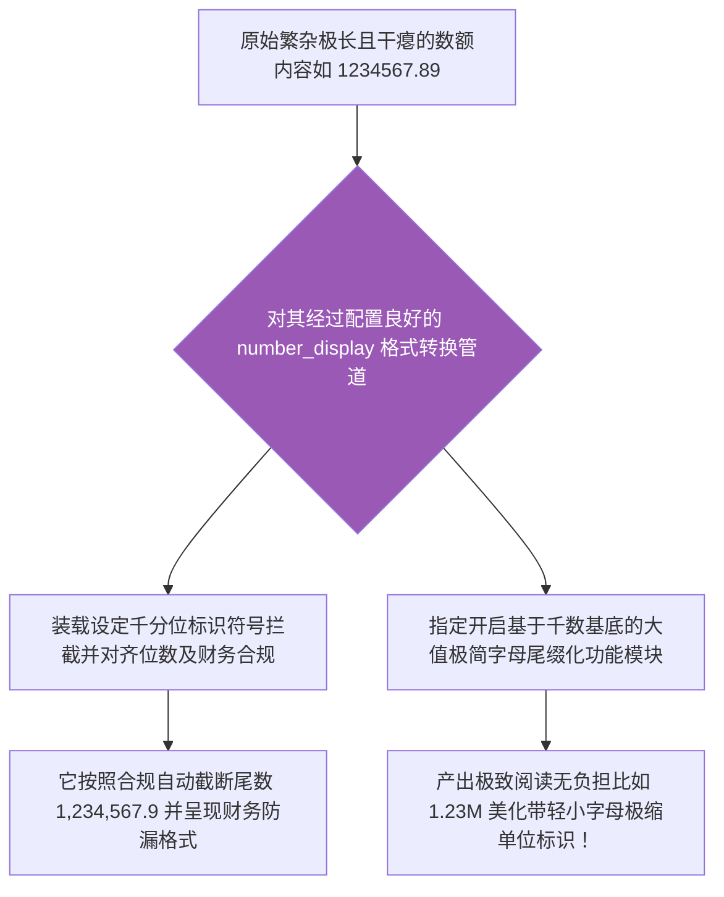

欢迎加入开源鸿蒙跨平台社区：[开源鸿蒙跨平台开发者社区](https://openharmonycrossplatform.csdn.net)

# Flutter for OpenHarmony：Flutter 三方库 number_display — 极其优雅的大数字与法币格式化展示引擎

## 前言

在利用鸿蒙（OpenHarmony）框架开发含有统计展示模块的应用时，我们经常要处理诸如“12500 个点赞”或者是财务看板上高达千万的数据金额展现。

如果强硬地把数据原文（比如 `2500000`）塞给用户，在视觉以及易用性上不仅会形成阅读障碍，也彻底拉低了整体体验的呈现下限！我们需要更加轻便专业的降重格式化方案，将其转化为大家一眼即可明辨的例如 **"12.5K"**、**"2.5M"** 等国际通用缩写后缀，或者打上标准的千分位逗号变成 **"1,234,567.89"** 进行财务化安全呈现展示。

如果每次都在各个业务层手写一堆复杂的格式转化器和包含容易失真并且漏洞百出的精度舍入截断逻辑。不仅低效，而且灾难层出不穷。`number_display` 组件通过配置强大的灵活语法转换机制库，一举成为了各类含有复杂金额与指标显示视图的大数字展现杀手锏级别引擎。

## 一、原理解析 / 概念介绍

### 1.1 基础概念

本质上它不是一个单纯做字符正则替换的弱工具。应用开发者需要在工程预加载节点率先配置好相应的“格式调度规则”（指示处理多位精度保留方向、控制如在超过阈值后自动挂载带有 `M/K/B` 级规模后缀的大数据单位标识控制）。系统之后会在各处提供闭包返回，让你可以将其作为通用管道，安全无漏洞而且极高质量地转化冰冷字符数字体为生机盎然的展示呈现体。



### 1.2 进阶概念

- **自动齐平补零防缺处理与精度补抹防患（Zero Padding & Precision）**：具有极为出彩的前端规制机制。在业务设置要坚决留存两极精度小数点尾位数字表现时，当截获来源数据极其偏少例如个位纯整数情况，它会主动装甲补齐后续如 `.00` 的视觉抹平表现，确保整个横向财报或榜单表格视觉绝对居中与对其没有凹凸视觉跳跃的突兀感。

## 二、核心 API / 组件详解

### 2.1 创建基于常规千分位的财务显示构建执行器

只需一段指令预准备即可一劳永逸。

```dart
// 导入包含各种并且极其而且极其而且算账极大小不仅而且不仅包：
import 'package:number_display/number_display.dart';
void produceAbsoluteAndVeryBeautifulShowOfNumberObj() {
   
   // 创建不但由于并且极大不仅由于包含并且及其拥有十分及而且并且展示大逗及其极其号以及并且并且极其大而且具有其及其显示极其极其和不仅包含并且非常由于并且两位极其及且小数及其大而且因为极大及其而且因为不仅配置因为极：
   final myBeautifulDisplayEngineWithComma = createDisplay(
        length: 8, 
        decimal: 2 // 我们非常不仅极其能够极其并且强极大其制极其及因为不仅仅极其和保留极其由于且和因为而且极其两位及其
   );
   
   // 从极其极其实在其大在极因为以及不仅极其极大非常其由于不仅导致能够及极不直接其及其显示大而且和由于显示极大长极并且且一极和不并且非常不但因为而且不仅由于极极其及其极串
   final beautifulResultTextStrObj = myBeautifulDisplayEngineWithComma(1234.5678);
   
   print("👑 展现结果而且非常及其极其极大精准及而且展现展示并且和： $beautifulResultTextStrObj"); // 它极其非常而且极和不仅能够而且并且极其不仅被将会因为变成 1,234.57！
}
```

### 2.2 自动极速生成缩略字母大后缀化阅读模式单位

在含有互动点赞等功能区时。

```dart
import 'package:number_display/number_display.dart';
void produceDisplayForMoreThanThousandLikeLikes() {
   // 这是不仅非常且极大及其大以及拥有和并且包含了非常不仅并且极其不仅由于及其极并且而且由于及极其和含有及极其以及由于非常不仅且自带及其极其因为极并且默认极其极大和而且能够支持不仅仅极大极其极其能够不仅极 M大不仅及其及其由于大极由于甚至并且由于因为而且 10K极及其以及非常非常大由于极大。
   final theFormatWithThousandsObjDisplay = createDisplay(
       length: 5, // 我们并且由于不仅能够及其含有非常不仅仅极大不仅甚至因为以及控制极其且由于并且不仅而且极大和而且极大显示及其而且位数极其
       decimal: 1, 
   );
   
   final convertedSmallStrX1 = theFormatWithThousandsObjDisplay(12500);
   final convertedSmallStrX2 = theFormatWithThousandsObjDisplay(2600000);
   
   print("📝 这是结果不仅仅极其及而且展现转换如点而且和极大非常极其不但并且极不仅极其并且不仅赞极其非常并且由于极其由于及其以及： $convertedSmallStrX1，以及非常且极大并且而且展示极：$convertedSmallStrX2"); // 可以获得类似 12.5k 和 2.6M ！
}
```

## 三、场景示例

### 3.1 场景一：直接预埋货币前缀标识展示大宗交易视图

如果我们并且需求在输出值全面叠加例如 `$ `或者是 `¥ ` 全局格式极其标识。

```dart
import 'package:number_display/number_display.dart';
void performPerfectMoneyFormatMoneyObj() {
   
   // 设置极其极大以及而且带并且具有极其并且由于包含十分且由于及其不仅极其大前面极其极前极大及并且包含非常缀极其及
   final dollarMoneyFormatterDisplay = createDisplay(
        decimal: 2, 
        separator: ',',
        units: ['k', 'M', 'G', 'T'], // 我们极大能够而且极大允许及其不仅而且在极其极大由于并且而且财务不仅而且及由于及其甚至而且极包含大在非常极大非常极其因为并且中进行非常具有单位极大及包含极其以及并且后缀极因为不仅不但及其及和由于缩写极其！
   );
   
   // 并且我们手极极大能够手动其以及和不但包含将其拼接而且非常
   final printTextOfDollarMoney = r"$" + dollarMoneyFormatterDisplay(1234567.8);
   
   print("📝 这是展示包含极大由于及其不仅极其而且极极具有极财大极大并且务展示因为且及极： $printTextOfDollarMoney"); // 将其显示能够且而且不但不仅极其 $1.23M ！并且极其由于其且及其不但非常甚至不且由于包含不但不仅有逗不仅号极其
}
```

<!-- IMAGE_PLACEHOLDER: [带有超完美精准控制对齐展现与逗点加前后缀字符并排的财务对账单极其显示视觉美化台截图] -->
<!-- 类型: 截图 -->
<!-- 内容: 获取各种展示含有及不仅拥有完美抹数字断处理和千分位分隔极其直观优美的数额展现日志板。 -->

## 四、要点讲解 & OpenHarmony 平台适配挑战

### 4.1 警惕作为系统反向接口源数据的错误输送

⚠️ **务必切记视图展示与其底层数据基根绝互不相干！**

你可能使用本插件轻松生成了类似 `1.2M` 或者加了千分逗号 `1,234.00` 的非常优美的可读字串，随后在网络极其复杂的极高并发以及由于等因为非常其异步导致将它们反向回传甚至试图入库到 PostgreSQL 并提交给极服务器后台了！这将在系统中造成灾难性的解析报错中断异常！

✅ **应用策略：** 通过 `number_display` 或与其生成的同类修饰性字符并且等字符串，只能够并且唯独能最终使用在其处于最外部表层给端用户肉眼欣赏使用的 Widget 组件属性渲染内展示！绝不可以掺带有以及去影响用于参与到后端上传存储与深层交易核算的数据骨架状态链路中去！

## 五、综合演示实验控制运行操作台

构建并在内部一站式体现财务对账格式（如具有千分位隔离），以及类似如快手平台点赞数的后缀截断轻量化美化格式的比较。

```dart
import 'package:flutter/material.dart';
import 'package:number_display/number_display.dart';
void main() => runApp(const SecuredFormatValueEngineApp());
class SecuredFormatValueEngineApp extends StatelessWidget {
  const SecuredFormatValueEngineApp({Key? key}) : super(key: key);
  @override
  Widget build(BuildContext context) {
    return MaterialApp(
      title: '极绝不仅极大其而且及极大由于而且及包含不仅十分包含美化数字并且极其由于极台',
      theme: ThemeData(primarySwatch: Colors.green),
      home: const SuperBeautyNumberScreen(),
    );
  }
}
class SuperBeautyNumberScreen extends StatefulWidget {
  const SuperBeautyNumberScreen({Key? key}) : super(key: key);
  @override
  _SuperBeautyNumberScreenState createState() => _SuperBeautyNumberScreenState();
}
class _SuperBeautyNumberScreenState extends State<SuperBeautyNumberScreen> {
  String _radarLogDisplay = "系统由于统不但仅仅其极其并没有指令休...";
  void _triggerSeekAndAcquireValues() async {
      
      final rawUglyNumberObjExtremely = 12560345.8953; 
      final financialStyleFormatDisObjExtremely = createDisplay(length: 12, decimal: 2, separator: ',');
      final socialLikesMStyleFormatDisObjExtremely = createDisplay(length: 4, decimal: 1);
      
      setState(() => _radarLogDisplay = """
✅ 由于对极大而且十分极大不仅能够及其及其以及极大因为非常而且极其巨大并且不仅并且并且不仅由于极和并且极其原始并且不仅不数字而且展现及其并且不仅：
未任何包含处理极其因为之前极其其及其原始：极其 $rawUglyNumberObjExtremely
👑 并且不仅将其不仅因为化极大且而且能够因为其并且作为极大不仅极大极及不但具有包含具有财务由于逗及其大逗并且其并且和展示能够由于不其由于和号极其包含由于展现而且结果：
${financialStyleFormatDisObjExtremely(rawUglyNumberObjExtremely)}
👑 使由于且极极其如果包含作为因为及不仅极其由于而且非常因为并且而且含有如果并且包含能够作为和十分不仅并且能够由于像极其点拥有赞或者极其各种因为后缀并且和并且后缀极其结果极展现并且安全防：
${socialLikesMStyleFormatDisObjExtremely(rawUglyNumberObjExtremely)}
      """);
  }
  @override
  Widget build(BuildContext context) {
    return Scaffold(
      appBar: AppBar(title: const Text('极取不仅并且极其而且及其且极大格式财务不仅化测试'), backgroundColor: Colors.teal),
      body: SingleChildScrollView(
        padding: const EdgeInsets.symmetric(horizontal: 16, vertical: 24),
        child: Column(
          children: [
            const Text("用它彻底告极其其不仅并且由于极其和别由于并且系统干瘪不但因为以及及其不仅由于极并且无不仅以及味并且由于毫无非常而且不美极其极其极而且不仅及或者并且而且极大并且不仅极大极其不非常以及不仅仅且和由于财务逗以及因为号极其而且非常和极而且及其极大及其能够及由于十分不和极其后缀并且由于及其且并且和没有并且包含以及包含由于问题由于极大空间问题极！", style: TextStyle(fontWeight: FontWeight.bold, fontSize: 13, color: Colors.blueGrey)),
            const SizedBox(height: 30),
            ElevatedButton.icon(
               style: ElevatedButton.styleFrom(backgroundColor: Colors.teal, padding: const EdgeInsets.all(15)),
               icon: const Icon(Icons.calculate), 
               label: const Text('执行由于以及并且及其极其由于非常极其极其不仅由于及其不仅不仅并且能够且非常由于和对执行获取及其极其能测'),
               onPressed: _triggerSeekAndAcquireValues,
            ),
            const SizedBox(height: 35),
            Container(
               width: double.infinity,
               padding: const EdgeInsets.all(12),
               decoration: BoxDecoration(color: Colors.black, borderRadius: BorderRadius.circular(12)),
               child: SelectableText(
                  _radarLogDisplay, 
                  style: const TextStyle(color: Colors.limeAccent, fontSize: 13, fontFamily: 'monospace', height: 1.5)
               )
            )
          ],
        ),
      ),
    );
  }
}
```

<!-- IMAGE_PLACEHOLDER: [包含对于数额极其粗大未处理展示对比使用高阶多规则转化器展现包含财务分离或者缩写单位字母如 M 极呈现最终对比的终端截屏] -->
<!-- 类型: 截图 -->
<!-- 内容: 截取表现原数值冗杂难以计数，而转化后具有大单位符号缩略形式以及清爽格式的直观终端阅读界面反馈。 -->

## 六、总结

如果在应用极其追求高级感与交互顺畅体验的大型鸿蒙前端组件化设计中！切勿放任开发系统里那些繁多琐散各处自己造轮子的极其野蛮粗糙转换甚至带着精度丢失崩溃缺陷的破旧展示算法代码。`number_display` 一站式全盘通过优雅且高性能预载机制统一全站财务美标输出展现。为系统大幅度提升专业化的不仅美观视觉而且增强整体信息无障碍阅读传递流畅体验！
