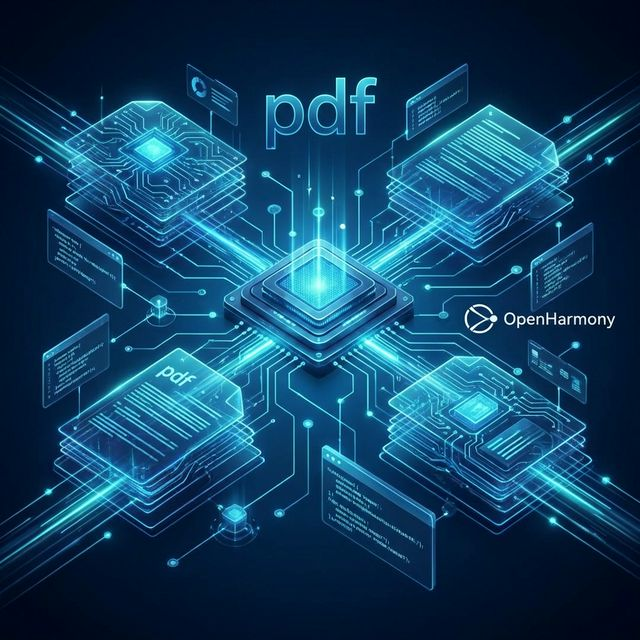
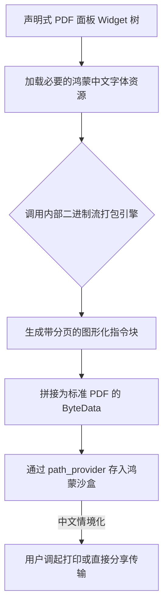

欢迎加入开源鸿蒙跨平台社区：https://openharmonycrossplatform.csdn.net
# Flutter for OpenHarmony：Flutter 三方库 pdf 高效文档排版与生成（纯 Dart PDF 构建引擎）
## 前言
在企业办公审批、电子凭证生成或者智能病历分发的鸿蒙（OpenHarmony）应用中，动态生成带水印、表格及图片的标准 PDF 是极为刚需的功能。如果依赖远端服务器生成，将极大地消耗网络带宽并引入延迟。`pdf` 库为我们提供了一套**纯 Dart 实现的高性能 PDF 创建框架**。让你脱离对任何原生依赖的桎梏，通过类似 Flutter UI 构建的声明式语法在端侧秒速创建工业级 PDF。
## 一、原理解析 / 概念介绍
### 1.1 基础概念
该库并未调用鸿蒙底层的 C++ PDF 渲染能力（例如 Skia 的 PDF 后端），而是完全由 Dart 实现了解析与写入 ISO 32000 规范的字节码。整个构建系统被抽象成一个带有 `Page`, `Column`, `Row` 等各类 Widget 的虚拟渲染树。当你调用 `save()` 时，它会遍历这棵树并生成最终的二进制流。

### 1.2 进阶概念
- **矢量指令优化**：相比截取屏幕成图片放入 PDF 的粗暴方法，该库绘制的所有文字和线条均是纯粹的矢量。这不仅大幅度减小了跨端共享时的文件体积，还让缩放永不失真。
- **Widget-like 语法**：极度容易上手。你可以像写传统的 Flutter 页面一样通过排列组合器搭建你想要的任何证件页面。
## 二、核心 API / 组件详解
### 2.1 创建文档并添加物理分页
所有的操作入口都在 `Document` 和 `Page` 中。要生成 PDF，须得先挂载大基盘：
```dart
// 使用 as pw 防止与普通 flutter material widget 重名冲突
import 'package:pdf/widgets.dart' as pw;
// 初始化根文档文件
final pdf = pw.Document();
// 添加一个页面！格式默认为 A4
pdf.addPage(
  pw.Page(
    build: (pw.Context context) { // 必须提供上下文以确保测量正确
      return pw.Center(
        child: pw.Text("鸿蒙系统审批回执", style: const pw.TextStyle(fontSize: 40)),
      );
    },
  ),
);
```
### 2.2 彻底适配外部的鸿蒙中文字体
如果仅仅输出上面的例子，在英文之外的环境通常会乱码。因为原生 PDF 不附带特定中文字型。
```dart
import 'package:flutter/services.dart' show rootBundle;
import 'package:pdf/widgets.dart' as pw;
Future<void> attachHarmonyFont() async {
  // 从 assets 获取你的鸿蒙内置/外带的字体(如 HarmonyOS_Sans)
  final fontData = await rootBundle.load("assets/fonts/HarmonyOS_Sans_SC_Regular.ttf");
  final ttf = pw.Font.ttf(fontData);
  final pdf = pw.Document();
  pdf.addPage(pw.Page(
    build: (pw.Context context) {
      // 📌 核心步骤：使用指定的带有亚洲字形的 ttf
      return pw.Text('鸿蒙分布式财务总结', style: pw.TextStyle(font: ttf, fontSize: 32));
    }
  ));
}
```
## 三、场景示例
### 3.1 场景一：生成鸿蒙本地支付凭证小票
在构建鸿蒙 POS 机软件时，我们需要在离线状态下，把这包含价格和二维码的数据组装好以驱动底下的微型打印机。
```dart
import 'package:pdf/widgets.dart' as pw;
pw.Document createReceipt(String orderNo) {
  final pdf = pw.Document();
  
  pdf.addPage(pw.Page(
    // 将其指定为类似超市小票的独特尺寸格式
    pageFormat: PdfPageFormat.roll80,
    build: (context) {
      return pw.Column(
        children: [
          pw.Text('鸿蒙智选线下门店', style: pw.TextStyle(fontSize: 24)),
          pw.Divider(), 
          pw.Row(
            mainAxisAlignment: pw.MainAxisAlignment.spaceBetween,
            children: [
               pw.Text('智选手机 Pro'),
               pw.Text('¥5999.00')
            ]
          ),
          pw.SizedBox(height: 20),
          // 💡 技巧：该库内置 SVG 及条形码扫描源生组件！
          pw.BarcodeWidget(
            data: orderNo,
            barcode: pw.Barcode.code128(),
            width: 150,
            height: 50,
          ),
        ]
      );
    }
  ));
  return pdf;
}
```
<!-- IMAGE_PLACEHOLDER: 鸿蒙设备里截取的小票凭证样式 -->
<!-- 类型: 截图 -->
<!-- 设备: 在真实的鸿蒙系统下查看的预览效果图 -->
<!-- 内容: 展现生成出来的小尺寸 PDF 数据包含条码 -->
### 3.2 场景二：嵌入公司级红头文件表格报告
很多国企的 OA 项目需要在鸿蒙信创平台上执行多级审批记录打印：
```dart
import 'package:pdf/widgets.dart' as pw;
pw.Widget buildEnterpriseTable() {
  return pw.Table.fromTextArray(
    headers: ['审批环节', '承办鸿蒙终端', '时间签章'],
    data: [
      ['初审', 'Device-Master', '2026-02-21 09:12'],
      ['复核确认', 'Tablet-Manager', '2026-02-21 14:00']
    ],
    // 🎨 UI 增强：甚至支持偶数行底色定制功能
    headerStyle: pw.TextStyle(fontWeight: pw.FontWeight.bold),
    headerDecoration: const pw.BoxDecoration(color: PdfColors.grey300),
    cellHeight: 30,
    cellAlignments: {
      0: pw.Alignment.centerLeft,
      1: pw.Alignment.center,
      2: pw.Alignment.centerRight,
    },
  );
}
```
## 四、要点讲解 & OpenHarmony 平台适配挑战
### 4.1 字体体积与沙盒隔离痛点
鸿蒙设备的包名（HAP）通常有极端的体积限制标准。中文字型（如思源黑体）通常高达 8~15MB。千万不要把好几种字重全部塞入 Assets！
✅ **适配策略**：利用鸿蒙支持动态下载的逻辑。先做网络下载字体库至本地系统 `getApplicationSupportDirectory` 目录中，在实际渲染时再由 `File` 转换成 ByteData 供其读取。
### 4.2 处理带大量图片的 PDF 生成 OOM 隐患
当你在生成带有极多本地高清图片的画册 PDF 时，若直接通过 `pw.MemoryImage` 载入未经原生压缩的高像素位图，会瞬间引起跨平台堆内存暴涨。
⚠️ **注意事项**：在送入 PDF 前，务必先在 Flutter 端拦截进行宽高缩小与压缩降阶。
## 五、完整落地输出到鸿蒙本地范例
这里提供一套完整的页面，展现生成带有文字、列表并最终输出存盘及提示分享的工具。
```dart
import 'dart:io';
import 'package:flutter/material.dart';
import 'package:flutter/services.dart';
import 'package:pdf/widgets.dart' as pw;
import 'package:path_provider/path_provider.dart';
void main() => runApp(const HarmonyPdfCreator());
class HarmonyPdfCreator extends StatelessWidget {
  const HarmonyPdfCreator({Key? key}) : super(key: key);
  @override
  Widget build(BuildContext context) {
    return const MaterialApp(
      home: PdfGeneratorPage(),
    );
  }
}
class PdfGeneratorPage extends StatelessWidget {
  const PdfGeneratorPage({Key? key}) : super(key: key);
  Future<void> _craftPdf(BuildContext context) async {
    final pdf = pw.Document();
    
    // 必须要装填能够展示中文字体的 ttf 资源
    final fontData = await rootBundle.load("assets/fonts/Harmony_Regular.ttf");
    final ttf = pw.Font.ttf(fontData);
    pdf.addPage(
      pw.MultiPage( // 允许内容超出一页被自动切断分页
        build: (pw.Context context) => [
          pw.Header(level: 0, child: pw.Text('鸿蒙端点离线诊断报告', style: pw.TextStyle(font: ttf, fontSize: 24))),
          pw.Paragraph(
            text: '该平台无需联网也能完美创建标准矢量级排版。',
            style: pw.TextStyle(font: ttf)
          ),
          pw.Bullet(text: '跨端格式不依赖打印后台引擎', style: pw.TextStyle(font: ttf)),
          pw.Bullet(text: '彻底由内部 Dart 解析生成字节', style: pw.TextStyle(font: ttf)),
        ],
      ),
    );
    // 将二进制写入到鸿蒙特有私有目录下
    final output = await getApplicationDocumentsDirectory();
    final file = File("${output.path}/harmony_diagnostic_report.pdf");
    await file.writeAsBytes(await pdf.save());
    ScaffoldMessenger.of(context).showSnackBar(
        SnackBar(content: Text('✅ 报告已生成至深层目录: ${file.path}')),
    );
  }
  @override
  Widget build(BuildContext context) {
    return Scaffold(
      appBar: AppBar(title: const Text('纯端侧引擎 PDF 构建试验田')),
      body: Center(
        child: ElevatedButton.icon(
          onPressed: () => _craftPdf(context),
          icon: const Icon(Icons.picture_as_pdf),
          label: const Text('生成包含鸿蒙特征数据红头大报表'),
        ),
      ),
    );
  }
}
```
<!-- IMAGE_PLACEHOLDER: 该包含图标的运行后 Snackbar 打印路径成功的留存画面 -->
<!-- 类型: 截图 -->
<!-- 设备: 在真实的鸿蒙手机或者远程真机环境下 -->
<!-- 内容: PDF 生成的 Snackbar 通知 -->
## 六、总结
`pdf` 作为纯 Dart 层级的天花板工具，在摆脱了底层系统强绑定之后，天生地完美适用于了刚刚崛起的 OpenHarmony 体系里。虽然配置各种 Widget 看似繁琐了些。但配合良好的封装类，结合鸿蒙分布式特征甚至可以将这产物打通分布式流转在另一台机器上执行真正的硬核网络打印操作。希望你能够享受这种指哪打哪的高规格自由控制体验。
📦 想获取配套字体文件实例与代码片段：[AtomGit 示例专栏](https://atomgit.com)
---
*本文档为构建新一代操作系统的跨端框架做解析沉淀*
欢迎加入开源鸿蒙跨平台社区：[开源鸿蒙跨平台开发者社区](https://openharmonycrossplatform.csdn.net)
